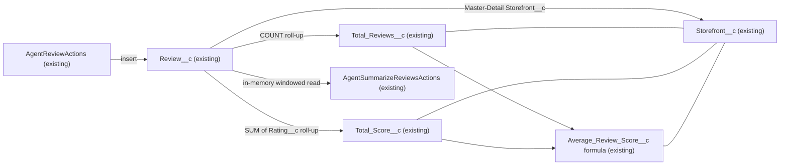

# Implementation spec — Review aggregation on Storefront

> Aggregate `Review__c` ratings onto the parent `Storefront__c` record; the org already does this with declarative fields, so no trigger is built.

_Based on the requirement, the evidence reported by AskCoworker, and read-only org queries where noted. Assumptions and missing evidence are identified below. Specification only — nothing is implemented or deployed._

---

## 1. The requirement

Keep review count, rating total, and average rating on each `Storefront__c` record current as `Review__c` records change. The original request was an Apex trigger; the user decided on a zero-change specification because existing fields already meet the requirement.

| # | Responsibility | Trigger | Where it lives |
| --- | --- | --- | --- |
| 1 | Count reviews per storefront | Insert, delete, or undelete of `Review__c` | `Storefront__c.Total_Reviews__c` (roll-up summary, existing) |
| 2 | Sum ratings per storefront | Insert, update of `Rating__c`, delete, or undelete of `Review__c` | `Storefront__c.Total_Score__c` (roll-up summary, existing) |
| 3 | Average rating per storefront | Calculated when the record is read | `Storefront__c.Average_Review_Score__c` (formula, existing) |

## 2. Grounding — reuse before building

Target org: `TestWriteSpecDE` (Developer Edition, org ID `00Dak00001COqNeEAL`). API version: `67.0` (`sfdx-project.json`). The local `force-app` directory contains no metadata source.

- **`Review__c.Storefront__c`** (Master-Detail on `Review__c`) — links each review to its storefront. Required, cascade delete, `reparentableMasterDetail = false`, child relationship name `Reviews`. _Verified by org query._
- **`Review__c.Rating__c`** (Number(1,0)) — the rating to aggregate. `required = false`, no default. All 92 existing reviews have a value. _Verified by org query._
- **`Storefront__c.Total_Reviews__c`** (Roll-Up Summary) — `COUNT` of `Review__c`, no filter. _Verified by org query._
- **`Storefront__c.Total_Score__c`** (Roll-Up Summary) — `SUM` of `Review__c.Rating__c`, no filter. _Verified by org query._ AskCoworker did not find this field in discovery.
- **`Storefront__c.Average_Review_Score__c`** (Formula, Number, scale 1) — `Total_Score__c / Total_Reviews__c`, `formulaTreatBlanksAs = BlankAsZero`, no divide-by-zero guard. _Verified by org query._
- **`AgentReviewActions`** (Apex class, `with sharing`) — inserts `Review__c` with `Status__c = 'Submitted'`. Its inserts update the roll-ups. _Reported by AskCoworker._
- **`AgentSummarizeReviewsActions`** (Apex class, `with sharing`) — calculates its own windowed average from `Review__c` in memory. It does not read the `Storefront__c` aggregate fields. _Reported by AskCoworker._
- **Triggers** — no `ApexTrigger` exists on `Review__c` or `Storefront__c`. _Verified by org query._

Evidence sources:

- Org queries: `sf sobject describe` for `Storefront__c` and `Review__c`; Tooling API `CustomField.Metadata` for `Total_Reviews__c`, `Total_Score__c`, `Average_Review_Score__c`, `Review__c.Storefront__c`, and `Review__c.Rating__c`; Tooling API `ApexTrigger`; aggregate SOQL on `Review__c` and `Storefront__c`; SOQL on `FieldPermissions`.
- AskCoworker returned no `citedReferences`. Its statements are recorded as "reported by AskCoworker".

## 3. Architecture

Why the pieces are drawn this way:

1. All nodes are existing components. The specification adds no components.
2. The roll-up edges start at `Review__c` because the platform recalculates roll-up summaries when child records are inserted, updated, deleted, or undeleted (reported by AskCoworker; standard platform behavior).
3. The formula depends on the two roll-ups. Formula fields are calculated when the record is read; they are not stored. AskCoworker described the formula as stored; this document does not use that claim.
4. No reparenting path is drawn. `reparentableMasterDetail = false` prevents a review from moving to another storefront (verified by org query).
5. `AgentSummarizeReviewsActions` reads `Review__c` directly and has no edge to the `Storefront__c` aggregates (reported by AskCoworker).

## 4. Metadata changes

No metadata changes are required. AskCoworker stated this explicitly, the org queries in Section 2 support it, and the user accepted a zero-change specification.

## 5. Data 360 (Data Cloud) data involved

Not applicable — this change does not use Data 360. AskCoworker reports that no Data 360 objects, data streams, or calculated insights use `Review__c` or `Storefront__c`. The permission set `sfdc_a360_sfcrm_data_extract` has Read access to the aggregate fields; whether a Data 360 data stream extracts `Storefront__c` is not verified (Section 8).

## 6. Security considerations

- **Field access (verified by org query, permission sets only; profiles not checked):**
  - Read, no Edit, on `Total_Reviews__c`, `Total_Score__c`, and `Average_Review_Score__c`: `Agentforce_Reference_App`, `sfdc_accelerate_dms`, `sfdc_slack`, `sfdc_a360_sfcrm_data_extract`, `Pronto_Deep_Dive_Workshop`.
  - Read and Edit on `Review__c.Rating__c`: `Agentforce_Reference_App`, `sfdc_accelerate_dms`. Read only: `sfdc_slack`, `sfdc_a360_sfcrm_data_extract`, `Pronto_Deep_Dive_Workshop`.
- **Execution identity:** the platform recalculates roll-up summaries in system context, independent of the running user's sharing (reported by AskCoworker).
- **Data exposure:** a user who can read the aggregate fields sees the count and total of all reviews on the storefront, including reviews the user cannot see. With a Master-Detail relationship, review visibility is controlled by the parent record, which limits this exposure. This is standard roll-up behavior, not a new risk.
- **Apex sharing:** `AgentReviewActions` and `AgentSummarizeReviewsActions` declare `with sharing` (reported by AskCoworker).
- No permission changes are proposed.

## 7. Testing strategy

No test classes are needed because no metadata changes. Recommended verification of the existing behavior (not run as part of this specification):

1. **Roll-up accuracy.** Compare `Total_Reviews__c` and `Total_Score__c` on each `Storefront__c` with `SELECT Storefront__c, COUNT(Id), SUM(Rating__c) FROM Review__c GROUP BY Storefront__c`.
2. **Zero-review storefronts.** Two storefronts have `Total_Reviews__c = 0`. The API returns `Average_Review_Score__c` as null for them (verified by org query). Check what the record page displays.
3. **Insert, update, delete, undelete.** In a sandbox, change a review's `Rating__c`, delete it, and undelete it. Confirm the parent values after each step.
4. **Agent insert path.** Create a review through `AgentReviewActions` in a sandbox and confirm the parent aggregates change.
5. **Field access.** Confirm that a user with one of the listed permission sets can read, and cannot edit, the aggregate fields.
6. **Bulk and lock contention.** Insert many reviews for one storefront in one transaction and in parallel. Roll-up recalculation locks the parent record; contention at high volume is not measured (reported by AskCoworker as unknown).

## 8. Open decisions

All items are follow-ups outside this specification. None blocks it.

1. **Average for storefronts with no reviews (non-blocking).** The formula has no divide-by-zero guard. The API returns null for the two zero-review storefronts (verified by org query). AskCoworker reported that the value is 0; the org query contradicts this. What the UI displays was not verified. Recommended default from AskCoworker: `IF(Total_Reviews__c = 0, NULL, Total_Score__c / Total_Reviews__c)` in a later change.
2. **Reviews without a rating (non-blocking).** `Rating__c` is not required. A review with no rating adds 1 to `Total_Reviews__c` and 0 to `Total_Score__c`, which lowers the average. All 92 reviews have a rating today. Should `Rating__c` be required, or should `Total_Reviews__c` count only rated reviews?
3. **Published-only average (non-blocking).** The roll-ups have no `Status__c` filter. `Status__c` values are `Submitted` and `Published`. All 92 existing reviews have no `Status__c` value (verified by org query), so a `Published` filter would give every storefront an empty average today. AskCoworker listed a `Rejected` value; it does not exist. Is the average an internal metric (all reviews) or a customer-facing metric (Published only)?
4. **Two definitions of average (non-blocking).** `Average_Review_Score__c` is an all-time average. `AgentSummarizeReviewsActions` calculates a windowed average. Recommended default: label which definition each surface shows.
5. **Data 360 extraction (non-blocking).** Confirm whether a Data 360 data stream reads `Storefront__c` through `sfdc_a360_sfcrm_data_extract`.
6. **Original request for a trigger.** Resolved: the user chose a zero-change specification. A trigger is needed only for an aggregate that roll-up summaries cannot calculate.

## 9. Change set

| # | Action | Type | API name | Module | Why |
| --- | --- | --- | --- | --- | --- |

No metadata changes are required. The platform keeps `Total_Reviews__c` and `Total_Score__c` current through roll-up summaries on the `Review__c.Storefront__c` Master-Detail relationship, and `Average_Review_Score__c` calculates the average from them.

Total: 0 · Create: 0 · Update: 0 · Delete: 0
