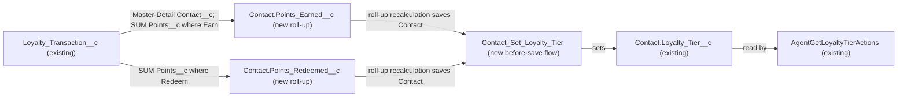

# Implementation spec — Keep Contact loyalty tier in sync with net points

> Recalculate `Contact.Loyalty_Tier__c` from the contact's net loyalty points (Earn minus Redeem) whenever a Loyalty Transaction is inserted, updated, deleted, or undeleted.

_Based on the requirement, the evidence reported by AskCoworker, and read-only org queries where noted. Assumptions and missing evidence are identified below. Specification only — nothing is implemented or deployed._

---

## 1. The requirement

Keep `Contact.Loyalty_Tier__c` up to date from the contact's points balance. The user clarified (*user decision*) that the balance is net points (sum of Earn `Points__c` minus sum of Redeem `Points__c` across all `Loyalty_Transaction__c` records), with tiers Explorer 0–999, Insider 1,000–4,999, Pronto Plus 5,000–9,999, Pronto One 10,000–24,999, Pronto Elite 25,000+, recalculated on every transaction insert, update, and delete, and that tiers can go down. The request contained no out-of-scope instructions.

| # | Responsibility | Trigger | Where it lives |
| --- | --- | --- | --- |
| 1 | Hold total Earn points per contact | `Loyalty_Transaction__c` insert, update, delete, undelete | `Contact.Points_Earned__c` (roll-up summary) |
| 2 | Hold total Redeem points per contact | `Loyalty_Transaction__c` insert, update, delete, undelete | `Contact.Points_Redeemed__c` (roll-up summary) |
| 3 | Set `Loyalty_Tier__c` from net points, up or down | Contact create or update, including the parent update caused by roll-up recalculation | `Contact_Set_Loyalty_Tier` (before-save record-triggered flow) |
| 4 | Prove the chain works in bulk and on delete/undelete | Test run | `LoyaltyTierAutomationTest` (Apex test class) |

## 2. Grounding — reuse before building

Target org: `TestWriteSpecDE` (Developer Edition, org ID `00Dak00001COqNeEAL`, not a sandbox). API version: `67.0` (org). No `sfdx-project.json` exists in the project, so no `sourceApiVersion` was read. _verified by org query_

- **`Contact.Loyalty_Tier__c`** (CustomField, restricted picklist) — the target. Values `Explorer`, `Insider`, `Pronto Plus`, `Pronto One`, `Pronto Elite`; default `Explorer`. All 198 contacts have a null value (re-run: `COUNT() WHERE Loyalty_Tier__c != null` = 0). _verified by org query_
- **`Loyalty_Transaction__c`** (CustomObject) — the points ledger. `Contact__c` is `MasterDetail` to Contact (relationship name `Loyalty_Transactions`, `reparentableMasterDetail` = false); `Points__c` is Number (double); `Transaction_Type__c` is a picklist with `Earn`, `Redeem`; `Transaction_Source__c` has `Order`, `Promotion`, `Manual Adjustment`. The object holds 0 records. _verified by org query_
- **`AgentGetLoyaltyTierActions`** (ApexClass, `with sharing`) — the only reader of `Loyalty_Tier__c` found (MetadataComponentDependency and a search of all 70 unmanaged Apex class bodies). It reads the field and does not write it; no `GenAiFunctionDefinition` targets it. Its descriptions stay true after this change. _verified by org query_
- **Existing automation on Contact and `Loyalty_Transaction__c`:** 0 Apex triggers (0 unmanaged triggers in the org), 0 flows triggered on either object (`FlowDefinitionView` queried per object), 0 validation rules on either object. The only scheduled flow, `Orch`, is managed (`runtime_industries_recurrence`) and has no trigger object. _verified by org query_
- **No existing balance field:** Contact has 13 custom fields (Tooling `CustomField`), none a points, balance, earned, or redeemed field, and none is a roll-up. Org-wide, the only unmanaged fields matching Point/Tier/Loyal/Balance are `Loyalty_Transaction__c.Points__c` and `Contact.Loyalty_Tier__c`; every other match is a Data 360 `ssot` field. No Loyalty Management standard objects exist in `sf sobject list --sobject all`. _verified by org query_
- **Names are free:** no ApexClass other than `AgentGetLoyaltyTierActions` matches `%Loyalty%`, and no flow matches `%Loyal%` or `%Tier%`. _verified by org query_

Candidates examined and rejected: `Contact.Level__c` — picklist `Secondary`, `Tertiary`, `Primary`, a contact-role concept, not a loyalty tier; `Contact.Lifetime_Orders__c` and `Contact.Lifetime_Value__c` — order and spend numbers, not points; `Transaction__c` — has no points field; the `ssot__` Loyalty data model fields — Data 360 objects, not CRM fields the flow can read.

Evidence sources: `sf org display`; `sf sobject list` (custom and all); `sobject describe` of Contact and `Loyalty_Transaction__c`; Tooling `CustomField`, `EntityDefinition`, `ApexTrigger`, `ApexClass` bodies, `ValidationRule`, `MetadataComponentDependency`, `GenAiFunctionDefinition`, `CustomField.Metadata`; standard `FlowDefinitionView`, `FieldPermissions`, `ObjectPermissions`, `PermissionSet`, `DataStream`, `Organization`, and aggregate data counts. AskCoworker returned no citedReferences. AskCoworker was called for D1, I, and R (runtime and security halves). D2 was skipped: D1 plus the org queries answered every D2 topic (no automation, one reader, no agent action, no data streams). After four wrong AskCoworker claims (listed in Section 8), the T call was skipped and testing was designed from org queries and documented platform behavior.

## 3. Architecture

Why the pieces are drawn this way:

1. `Loyalty_Transaction__c.Contact__c` is Master-Detail to Contact (*verified by org query*), so roll-up summary fields are the standard mechanism for per-contact totals. A roll-up SUM supports a filter on a picklist value (*assumption (documented platform behavior)*). One SUM cannot subtract, so Earn and Redeem are two roll-ups.
2. A roll-up recalculation after a child insert, update, delete, or undelete saves the parent Contact and fires the parent's record-triggered flows (*assumption (documented platform behavior)*; load-bearing, tested in Section 7). The automation therefore sits on the parent, per the design rules.
3. The flow is before-save (fast field update): it only sets a field on the record being saved, needs no DML, and runs with no entry condition so every Contact save re-derives the tier. It computes net points in a flow formula from the two roll-ups, so no extra formula field is needed.
4. `Loyalty_Tier__c` stays a picklist because `AgentGetLoyaltyTierActions` reads it and converting a field to a formula is not supported in place (design rule).
5. No Apex trigger: no code is needed, and none exists on either object (*verified by org query*).

## 4. Metadata changes

**Data model**

- **Create `Contact.Points_Earned__c`** — CustomField, Roll-Up Summary, label "Points Earned". Summarized object `Loyalty_Transaction__c` (via `Contact__c`); operation SUM of `Points__c`; filter `Transaction_Type__c` equals `Earn`. Shows 0 when no matching children. Internal helper for the flow; no layout placement and no field-access grants (see Section 8).
- **Create `Contact.Points_Redeemed__c`** — CustomField, Roll-Up Summary, label "Points Redeemed". Summarized object `Loyalty_Transaction__c` (via `Contact__c`); operation SUM of `Points__c`; filter `Transaction_Type__c` equals `Redeem`. Redeem points are stored as positive numbers and subtracted (*user decision*). Internal helper; no layout placement and no grants.

**Automation**

- **Create `Contact_Set_Loyalty_Tier`** — Flow, record-triggered on Contact, "A record is created or updated", optimized for Fast Field Updates (before-save), no entry condition, delivered Active. Formula resource `NetPoints` (Number, 0 decimals): `BLANKVALUE({!$Record.Points_Earned__c}, 0) - BLANKVALUE({!$Record.Points_Redeemed__c}, 0)`. Decision, evaluated in order: `NetPoints >= 25000` → `Pronto Elite`; `>= 10000` → `Pronto One`; `>= 5000` → `Pronto Plus`; `>= 1000` → `Insider`; default → `Explorer` (covers 0–999 and negative balances). Assignment sets `{!$Record.Loyalty_Tier__c}` to the matching value. Blank roll-ups are treated as 0, so a new contact gets `Explorer`.

**Tests**

- **Create `LoyaltyTierAutomationTest`** — ApexClass (`@IsTest`). Exercises the roll-up recalculation and the flow through real DML, which a Flow Test cannot do (see Section 7).

## 5. Data 360 (Data Cloud) data involved

Not applicable — this change does not use Data 360. The internal permission set `sfdc_a360_sfcrm_data_extract` (namespace `sfdcInternalInt`) has Read on `Loyalty_Transaction__c`, `Points__c`, `Transaction_Type__c`, and `Contact.Loyalty_Tier__c`, and the org has 0 `DataStream` records (*verified by org query*). If a stream is configured later, it would pick up the new tier values with no change here (*assumption*).

## 6. Security considerations

- **Execution context:** record-triggered flows run in system context without sharing; the before-save flow sets `Loyalty_Tier__c` regardless of the saving user's field-level security (*assumption (documented platform behavior)*). Roll-up recalculation is a platform operation that does not check the user's access to the summarized fields (*assumption (documented platform behavior)*).
- **Who can edit the tier today** (FieldPermissions rows for `Contact.Loyalty_Tier__c`, complete): Edit on `Agentforce_Reference_App` (unmanaged) and `sfdc_accelerate_dms` (`sfdcInternalInt`); Read only on `sfdc_a360_sfcrm_data_extract`, `sfdc_slack`, and `Pronto_Deep_Dive_Workshop`. No profile rows (*verified by org query*). Those users can still type a tier, but the flow overwrites it on the same save (*user decision*: the tier always follows the balance).
- **Who can create transactions** (ObjectPermissions Create on `Loyalty_Transaction__c`, complete): `Agentforce_Reference_App`, `sfdc_accelerate_dms`, and the `System Administrator` profile (*verified by org query*). They need no new access for the recalculation.
- **New fields:** deploying `Points_Earned__c` and `Points_Redeemed__c` grants no field access to any profile or permission set; admins do not bypass field-level security (*assumption (documented platform behavior)*). They stay hidden, which is intended: the flow reads them in system context. No permission set changes.
- **Data exposure:** no new data is exposed. `AgentGetLoyaltyTierActions` runs `with sharing` and returns only the tier, as today (*verified by org query*).

## 7. Testing strategy

`LoyaltyTierAutomationTest` (Apex, runs as the test's running user; inserts Contacts and `Loyalty_Transaction__c` records it creates itself, no org record IDs):

| Case | Setup and action | Expected |
| --- | --- | --- |
| New contact | Insert a Contact with no transactions | `Loyalty_Tier__c` = `Explorer` |
| Boundaries | Earn 999, then 1 more; repeat at 4,999/5,000, 9,999/10,000, 24,999/25,000 | `Explorer` → `Insider` → `Pronto Plus` → `Pronto One` → `Pronto Elite` exactly at each lower bound |
| Redeem lowers tier | Earn 5,000, then Redeem 4,500 | `Pronto Plus`, then `Explorer` (net 500) |
| Negative net | Earn 100, Redeem 300 | `Explorer` |
| Update type or points | Change a 1,000-point Earn to Redeem; change `Points__c` | Tier recalculated both times |
| Delete | Delete the Earn that lifts a contact to `Insider` | Tier goes down to `Explorer` |
| Undelete | Undelete it | Tier returns to `Insider` |
| Bulk | Insert 200 transactions across 50 contacts in one DML | Every contact's tier matches its net; no limit errors |
| Manual edit | Update a contact's `Loyalty_Tier__c` to `Pronto Elite` with net 0 | Saved value is `Explorer` |
| Blank points | Insert an Earn with `Points__c` = null | Contributes 0; no error |

The load-bearing assumption in Section 8 (roll-up recalculation fires the parent's before-save flow on child insert, update, delete, and undelete) is proven by the Delete, Undelete, and Update cases. Recommended verification (manual, sandbox): create a contact and a few transactions in the UI and confirm the tier; confirm `AgentGetLoyaltyTierActions` returns the recalculated tier. Nothing here claims tests have run.

## 8. Open decisions

### Open

1. **Backfill existing contacts (non-blocking).** All 198 contacts have a null tier and 0 transactions exist (*verified by org query*). Roll-up creation does not save the parents through the flow, so existing contacts keep a null tier until their next save. Data step after deployment: export Contact `Id`, `Loyalty_Tier__c`, then run a no-change update on all contacts (Data Loader or Bulk API, by a user with Edit on Contact) so the flow sets `Explorer`. Rollback: re-import the export. Recommended default: run it.
2. **Deployment sequence (non-blocking).** Deploy `Contact.Points_Earned__c` and `Contact.Points_Redeemed__c` first (the flow references them), then `Contact_Set_Loyalty_Tier` and `LoyaltyTierAutomationTest`, then the backfill in item 1.
3. **Proposal: sign guard on `Points__c` (non-blocking).** The design assumes Redeem points are entered as positive numbers (*user decision*). Nothing enforces this; a negative Redeem would add points. Proposal (not in inventory): a validation rule `Points__c < 0` on `Loyalty_Transaction__c`.
4. **Proposal: show the balance (non-blocking).** No one asked to see the net balance. Proposal (not in inventory): a formula field for net points, plus Read grants on a new dedicated permission set and layout placement.
5. **Load-bearing assumption (non-blocking, tested).** A roll-up recalculation fires the parent Contact's record-triggered flows on child insert, update, delete, and undelete (*assumption (documented platform behavior)*). All rows depend on it; the Section 7 Delete, Undelete, and Update cases verify it.

### Resolved

- **Tier thresholds** (*user decision*): Explorer 0–999, Insider 1,000–4,999, Pronto Plus 5,000–9,999, Pronto One 10,000–24,999, Pronto Elite 25,000+. Negative balances map to `Explorer` (*assumption*: the lowest tier).
- **Balance definition and sign** (*user decision*): net = Earn minus Redeem across all transactions, with Redeem stored positive. No data settles the convention (0 transactions, *verified by org query*).
- **Downgrades and hand edits** (*user decision*): tiers can go down and are recalculated on every transaction change; the tier always follows the balance, so hand-set values are overwritten.
- **Flow reads roll-ups, not a formula field** (*assumption*): AskCoworker proposed a `Contact.Net_Loyalty_Points__c` formula field and an `ISCHANGED` entry condition. Replaced with a flow formula resource and no entry condition: fewer components, and every save re-derives the tier.
- **Dropped AskCoworker proposal:** the permission set `Loyalty_Tier_Automation_Access`. It is speculative (the flow runs in system context) and proposed Edit on roll-up and formula fields, which are read-only (*assumption (documented platform behavior)*).
- **AskCoworker wrong claims (4, so every kept fact was checked):** (1) Edit grants on roll-up/formula fields; (2) an automation user needing a permission set for a system-context flow; (3) a "2,000 records per transaction" before-save flow limit (flows run in batches of 200 records within the transaction limits; not used); (4) "FieldPermissions SOQL returned 0 rows" for fields that do not exist yet, and an inference that Data Cloud "already ingests" transactions while the org has 0 `DataStream` records (*verified by org query*). AskCoworker's "[Verified: FieldDefinition SOQL]" labels are *reported by AskCoworker*; the facts used were re-checked by org query.

## 9. Change set

| # | Action | Type | API name | Module | Why |
| --- | --- | --- | --- | --- | --- |
| 1 | Create | CustomField | `Contact.Points_Earned__c` | force-app/main/default/objects/Contact/fields | SUM of Earn points per contact |
| 2 | Create | CustomField | `Contact.Points_Redeemed__c` | force-app/main/default/objects/Contact/fields | SUM of Redeem points per contact |
| 3 | Create | Flow | `Contact_Set_Loyalty_Tier` | force-app/main/default/flows | Sets `Loyalty_Tier__c` from net points on every Contact save |
| 4 | Create | ApexClass | `LoyaltyTierAutomationTest` | force-app/main/default/classes | Tests roll-up to flow chain, boundaries, delete/undelete, bulk |

Two roll-up summaries on Contact feed a before-save Contact flow that sets the existing `Loyalty_Tier__c` picklist from net points.

Total: 4 · Create: 4 · Update: 0 · Delete: 0
