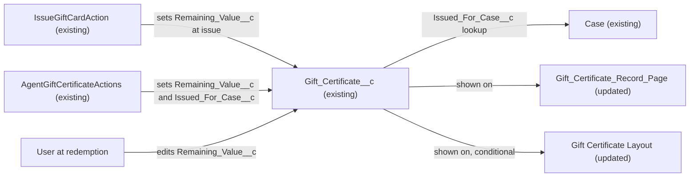

# Implementation spec — Gift certificate remaining balance and service-recovery case link

> Surface the existing remaining-balance field and the existing Case lookup on the gift certificate record so users can track the balance left after partial redemptions and see the Case a service-recovery certificate was issued for.

_Based on the requirement, the evidence reported by AskCoworker, and read-only org queries where noted. Assumptions and missing evidence are identified below. Specification only — nothing is implemented or deployed._

---

## 1. The requirement

Gift certificates must track the balance left after partial redemptions and link to the Case they were issued for when issued as a service recovery; both fields already exist, so the gap is only placing `Gift_Certificate__c.Remaining_Value__c` on the record page (and, conditionally, both fields on the page layout). The request contained no out-of-scope instructions.

| # | Responsibility | Trigger | Where it lives |
| --- | --- | --- | --- |
| 1 | Store the balance left after partial redemptions | User edits the record at redemption; set at issue by existing Apex | `Gift_Certificate__c.Remaining_Value__c` (existing) |
| 2 | Show the remaining balance to users on the record | Record page load | `Gift_Certificate_Record_Page` (Update); `Gift_Certificate__c-Gift Certificate Layout` (Conditional Update) |
| 3 | Link a service-recovery certificate to its Case | User or agent action sets the lookup | `Gift_Certificate__c.Issued_For_Case__c` (existing), already on `Gift_Certificate_Record_Page` |
| 4 | Show certificates issued for a Case from the Case side | Not specified | Child relationship `Case_Gift_Certificates__r` (existing); Case page placement is a proposal (Section 8) |

## 2. Grounding — reuse before building

Target org: `TestWriteSpecDE` (org ID `00Dak00001COqNeEAL`, connected). API version: `67.0` (org; no `sfdx-project.json` in the project, so no `sourceApiVersion`).

- **`Gift_Certificate__c`** (CustomObject) — the gift certificate object; internal sharing `ReadWrite`, external `Private`. _verified by org query_
- **`Gift_Certificate__c.Remaining_Value__c`** (CustomField, Currency, precision 18, scale 2, nillable, updateable) — description "The remaining monetary value available for redemption." This is the balance field the requirement asks for. _verified by org query_
- **`Gift_Certificate__c.Original_Value__c`** (CustomField, Currency 18,2) — "The original monetary value of the gift certificate at time of issue." _verified by org query_
- **`Gift_Certificate__c.Issued_For_Case__c`** (CustomField, Lookup to `Case`, not required, `deleteConstraint` `SetNull`, relationship name `Issued_For_Case__r`, child relationship on Case `Case_Gift_Certificates__r`) — description "Links this gift certificate to the service Case it was issued for (e.g., recovery)." _verified by org query_
- **`Gift_Certificate__c.Status__c`** (CustomField, Picklist) — values `Draft`, `Active`, `Partially Redeemed`, `Fully Redeemed`, `Expired`, `Cancelled`. _verified by org query_
- **`Gift_Certificate__c.Type__c`** (CustomField, Picklist) — values `Purchased`, `Recovery`, `Promotion`, `Loyalty Reward`, `Referral Bonus`. _verified by org query_
- **`IssueGiftCardAction`** (ApexClass, `with sharing`, invocable "Issue Gift Card") — creates certificates, sets `Value__c`, `Original_Value__c`, and `Remaining_Value__c` to the gift value and `Status__c = 'Active'`; defaults `Type__c` to `Recovery`; has no Case input. _verified by org query_
- **`AgentGiftCertificateActions`** (ApexClass) — creates certificates, sets `Original_Value__c` and `Remaining_Value__c` to the gift value, and sets `Issued_For_Case__c` from an optional `caseId` input. _verified by org query_
- **`Gift_Certificate_Record_Page`** (FlexiPage, Dynamic Forms) — places `Storefront__c`, `Notes__c`, `Recipient__c`, `Status__c`, `Issue_Date__c`, `Issued_By__c`, `Issued_For_Case__c`, `Type__c`, `Value__c`, `Original_Value__c`; does not place `Remaining_Value__c`. _verified by org query_
- **`Gift_Certificate__c-Gift Certificate Layout`** (Layout) — places only `Name`, `Recipient__c`, `OwnerId`, `CreatedById`, `LastModifiedById`. _verified by org query_
- Automation on `Gift_Certificate__c`: 0 Apex triggers, 0 record-triggered flows (`FlowDefinitionView`), 0 validation rules. Unmanaged Apex referencing `Gift_Certificate` (all 70 unmanaged classes scanned): `AgentGiftCertificateActions`, `IssueGiftCardAction`, `RenderGiftCardAction`, `RenderGiftCardActionTest`. No class contains "redeem" or "Redemption"; nothing decrements `Remaining_Value__c`. _verified by org query_
- Data: 1 record (`Status__c = Active`, `Type__c = Recovery`), `Remaining_Value__c = 50`, `Original_Value__c = 50`, `Issued_For_Case__c` blank. _verified by org query_

Candidates examined and rejected: a new redemption child object (for example `Gift_Certificate_Redemption__c`) — no such object exists, and the requirement asks for the balance, not a redemption log (Section 8); `Refund__c.Case__c` — a lookup from Refund to Case, a different concept; `9sd…` Data 360 fields such as `RemainingValueAmount` and `BalanceAmount` — data model object fields, not on `Gift_Certificate__c`; `Value__c` (Currency 18,0) — the face value, not the balance.

Evidence sources: `sf org display`; `sf sobject list --sobject custom`; `sobject describe` of `Gift_Certificate__c` and `Case`; Tooling `EntityDefinition`, `CustomField` (object list, concept search across all objects, `Metadata` of `Issued_For_Case__c`), `ApexTrigger`, `ValidationRule`, `MetadataComponentDependency` (object and four fields), `ApexClass` bodies, `Layout`, `FlexiPage` metadata, `FieldDefinition` history tracking; standard `FlowDefinitionView`, `FieldPermissions`, `ObjectPermissions`, `EntityDefinition` sharing, `TabDefinition`, `DataStream`, record counts. AskCoworker returned no citedReferences.

## 3. Architecture

Why the pieces are drawn this way:

1. `IssueGiftCardAction` and `AgentGiftCertificateActions` are the only verified writers of `Remaining_Value__c`; they set it at issue. _verified by org query_
2. After issue, the balance is maintained by editing the record at redemption; no redemption automation exists or is added. _assumption_ (Section 8)
3. `Issued_For_Case__c` is the existing optional lookup to `Case`. _verified by org query_
4. The record page and layout are the only changes; no automation is added, so the diagram has no event edges.

## 4. Metadata changes

**UX**

- **Update `Gift_Certificate_Record_Page`** — FlexiPage. Add a Dynamic Forms field instance for `Record.Remaining_Value__c` in the same field section as `Record.Original_Value__c`, directly after it. No other change; `Issued_For_Case__c` is already placed.
- **Update `Gift_Certificate__c-Gift Certificate Layout`** — Layout. Conditional: only if some users are assigned this page layout without `Gift_Certificate_Record_Page` being their active Lightning record page (activation and assignment cannot be read). Add `Remaining_Value__c` and `Issued_For_Case__c` to the Information section. Retrieve the layout before editing.

## 5. Data 360 (Data Cloud) data involved

Not applicable — this change does not use Data 360. `SELECT COUNT() FROM DataStream` returned 0, so no data stream ingests `Gift_Certificate__c`. _verified by org query_

## 6. Security considerations

- **Execution context.** No code or automation is added. Existing writer `IssueGiftCardAction` is `with sharing`. _verified by org query_ Internal sharing is `ReadWrite` for `Gift_Certificate__c` and `ReadWriteTransfer` for `Case`; external is `Private` for both. _verified by org query_
- **Field access (FieldPermissions rows, complete for these two fields).** Read and Edit on `Remaining_Value__c` and `Issued_For_Case__c`: permission sets `Agentforce_Reference_App`, `Pronto_Deep_Dive_Workshop`, `Agentforce_Action_Access`, `sfdc_accelerate_dms`. Read only: `sfdc_a360_sfcrm_data_extract`, `sfdc_slack`. No profile has a row, including `System Administrator`. _verified by org query_
- Admins do not bypass field-level security: View All Data and Modify All Data never grant field access, so a System Administrator without one of those permission sets will not see either field on the page. _assumption (documented platform behavior)_ Dynamic Forms and layouts omit fields the user cannot read. _assumption (documented platform behavior)_
- **Object access.** Read and Edit on `Gift_Certificate__c`: the four permission sets above and profile `System Administrator`; Read only: `sfdc_a360_sfcrm_data_extract`, `sfdc_slack`, profile `Analytics Cloud Integration User`. _verified by org query_
- **Permission set changes.** None. The users who edit balances already have Edit through the existing permission sets. _assumption_
- **Data exposure.** Placing `Remaining_Value__c` shows the balance to every user with Read on the field and access to the record; no new record or field access is granted.

## 7. Testing strategy

No Apex, flow, or validation rule is added, so there are no automated tests. Recommended manual verification in a sandbox:

1. As a user with `Agentforce_Reference_App`, open a certificate: `Remaining_Value__c` shows next to `Original_Value__c`; editing it to a partial balance (for example 50 to 30) saves.
2. Open a certificate with a blank `Remaining_Value__c`: the field renders blank, not 0.
3. As a user with `sfdc_slack` or another read-only grant (if it has an interactive user), the field is read-only; as a user with no grant, the field is absent.
4. Open a `Recovery` certificate with `Issued_For_Case__c` set: the Case link renders and opens the Case; on the Case, the certificate is reachable through `Case_Gift_Certificates__r` where that related list is placed.
5. Delete a linked Case in the sandbox: `Issued_For_Case__c` is cleared (`SetNull`) and the certificate remains.
6. Load-bearing check: confirm which record page and layout users actually get (Lightning App Builder activation, Page Layout Assignment). This decides whether the Conditional layout row is delivered.
7. Issue a certificate through `IssueGiftCardAction`: `Remaining_Value__c` equals the gift value (regression of existing behavior).

## 8. Open decisions

### Open

1. **`Gift_Certificate__c-Gift Certificate Layout` placement (non-blocking).** Conditional row: record page activation and layout assignment cannot be read. The current layout lacks most fields while `Gift_Certificate_Record_Page` has them, which suggests the FlexiPage is the page in use. Recommended default: check activation in Lightning App Builder; deliver the layout update only if some users see the layout.
2. **Profile field access (non-blocking).** No profile, including `System Administrator`, has FieldPermissions on `Remaining_Value__c` or `Issued_For_Case__c`. Users see the fields only through the four permission sets in Section 6. Recommended default: no change; assign one of those permission sets to anyone who redeems certificates.
3. **Redemption mechanism (non-blocking, proposal).** Nothing in the org records a redemption or decrements `Remaining_Value__c`; the balance is maintained by editing the field. Proposal: a redemption action (screen flow first, Apex only if an agent must call it) that decrements the balance and sets `Status__c` to `Partially Redeemed` or `Fully Redeemed`.
4. **Balance guard (non-blocking, proposal).** No validation rule prevents `Remaining_Value__c` from going below 0 or above `Original_Value__c`. Proposal: a validation rule `OR(Remaining_Value__c < 0, Remaining_Value__c > Original_Value__c)`; with `Original_Value__c` blank, the second test is blank and does not fire.
5. **Case required for Recovery (non-blocking, proposal).** `Issued_For_Case__c` stays optional. `IssueGiftCardAction` creates `Recovery` certificates with no Case input, and the one existing `Recovery` record has no Case, so a required rule would break that caller. Proposal: add a `caseId` input to `IssueGiftCardAction` before any enforcement.
6. **Balance history (non-blocking, proposal).** Field history tracking is off for `Remaining_Value__c`, `Status__c`, and `Issued_For_Case__c`. _verified by org query_ Proposal: enable it if an audit of balance changes is needed.
7. **Case-side related list (non-blocking, proposal).** Placing the `Case_Gift_Certificates__r` related list on the Case record page was not inspected or requested.

### Resolved

- **Redemption recording (assumption).** Asked how partial redemptions should be recorded; the user had no preference. Default: keep `Remaining_Value__c` as the stored balance edited at redemption, with no new object.
- **Case link enforcement (assumption).** Asked whether `Issued_For_Case__c` must be required for `Type__c = Recovery`; the user had no preference. Default: keep it optional (see Open 5).
- **AskCoworker corrections.** D1 reported `Original_Value__c` and `Remaining_Value__c` as Currency(16,2); describe shows precision 18, scale 2. The security call described profile-owned permission sets as unrecognized and said `Analytics Cloud Integration User` has Edit on `Gift_Certificate__c`; `ObjectPermissions` shows Read only. After these two wrong claims, every kept AskCoworker fact was re-verified by org query.
- **Dropped AskCoworker proposals.** Inventory rows `RedeemGiftCertificateAction`, `RedeemGiftCertificateActionTest`, and permission set `Gift_Certificate_Redemption` were dropped: the redemption action is behavior the requirement does not name, Apex was proposed where a flow could work, and existing permission sets already grant the access. T's "blocking" validation rule is a proposal (Open 4) because stronger guards are not requested.
- D2 was skipped: org queries answered its questions (no triggers, flows, or validation rules; all Apex writers found; permission sets read).

## 9. Change set

| # | Action | Type | API name | Module | Why |
| --- | --- | --- | --- | --- | --- |
| 1 | Update | FlexiPage | `Gift_Certificate_Record_Page` | force-app/main/default/flexipages | Place `Remaining_Value__c` so users can see and edit the balance |
| 2 | Update | Layout | `Gift_Certificate__c-Gift Certificate Layout` | force-app/main/default/layouts | Conditional: place `Remaining_Value__c` and `Issued_For_Case__c` for users on the layout |

Both fields already exist, so the change only places the balance field on the record page (and conditionally both fields on the layout).

Total: 2 · Create: 0 · Update: 2 · Delete: 0
