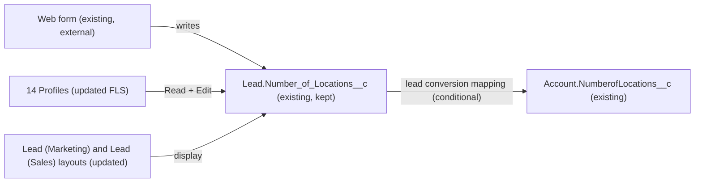

# Implementation spec — Retire the duplicate Lead "Number of Locations" field

> Keep `Lead.Number_of_Locations__c`, move any values and all user access and layout placement from `Lead.NumberofLocations__c` to it, then delete `Lead.NumberofLocations__c`.

_Based on the requirement, the evidence reported by AskCoworker, and read-only org queries where noted. Assumptions and missing evidence are identified below. Specification only — nothing is implemented or deployed._

---

## 1. The requirement

Lead has two custom fields labelled "Number of Locations"; remove one. The user chose to keep `Lead.Number_of_Locations__c` because their web form writes to it, to migrate data from `Lead.NumberofLocations__c`, and then to delete `Lead.NumberofLocations__c` (*user decision*).

| # | Responsibility | Trigger | Where it lives |
| --- | --- | --- | --- |
| 1 | Users who can see and edit the retired field can see and edit the kept field | Deployment | 14 Profile updates |
| 2 | The kept field appears where the retired field appeared | Deployment | `Lead-Lead %28Marketing%29 Layout`, `Lead-Lead %28Sales%29 Layout` |
| 3 | Existing values in the retired field are copied to the kept field | Data step before the delete | Data step (Section 8) |
| 4 | Lead conversion keeps populating `Account.NumberofLocations__c`, if it does today | Lead conversion | `LeadConvertSettings` (Conditional) |
| 5 | The duplicate field no longer exists | Deployment (destructive) | Delete of `Lead.NumberofLocations__c` |

## 2. Grounding — reuse before building

Target org: `TestWriteSpecDE` (ID `00Dak00001COqNeEAL`, connected). API version: `67.0` (org). No `sfdx-project.json` exists in the project, so no `sourceApiVersion` was read.

- **`Lead.NumberofLocations__c`** (CustomField, Id `00Nak00004nK0UdEAK`) — label "Number of Locations", type Number, precision 3, scale 0, not required, unmanaged. Populated on 0 of 5 Leads. _verified by org query_
- **`Lead.Number_of_Locations__c`** (CustomField, Id `00Nak00004nK0THEA0`) — label "Number of Locations", type Number, precision 5, scale 0, not required, unmanaged. Populated on 0 of 5 Leads. No Lead has both fields populated. _verified by org query_
- **`Account.NumberofLocations__c`** (CustomField, Id `00Nak00004nK0UREA0`) — label "Number of Locations", Number(3,0); populated on 10 of 200 Accounts. It is the likely Lead conversion target of the retired field. _verified by org query_ (the mapping itself is an _assumption_; lead field mappings cannot be read)
- **References to `Lead.NumberofLocations__c`** — `MetadataComponentDependency` returns only `Lead (Marketing) Layout` and `Lead (Sales) Layout`. `Lead (Support) Layout` and `Lead Layout` do not reference it. _verified by org query_
- **References to `Lead.Number_of_Locations__c`** — `MetadataComponentDependency` returns no rows: it is on no layout. _verified by org query_
- **`Lead_Record_Page`** (FlexiPage, Dynamic Forms) — its field items do not include either field; `Lead_Record_Page1` has no field items. _verified by org query_
- **Automation and code** — no Apex trigger on Lead; none of the 70 unmanaged Apex class bodies mention either field; none of the 13 active unmanaged flows or the draft `Personalized_Recommendations` flow mention either field; no record-triggered flows on Lead; no Lead validation rules or workflow rules. _verified by org query_ Managed package Apex bodies cannot be read.
- **Field access (FieldPermissions, complete for both fields)** — `Lead.NumberofLocations__c` has 49 rows: 45 profiles and 4 permission sets. Of those profiles, 14 also have Lead object access and all 14 have Read and Edit: `System Administrator`, `Standard User`, `Custom: Sales Profile`, `Custom: Marketing Profile`, `Marketing User`, `Contract Manager`, `Solution Manager`, `Read Only`, `Gold Partner User`, `Silver Partner User`, `Partner Community User`, `Partner Community Login User`, `Analytics Cloud Integration User`, `Analytics Cloud Security User`. `Lead.Number_of_Locations__c` has no profile rows and 4 permission set rows: `Agentforce_Reference_App` (Read, Edit), `sfdc_accelerate_dms` (Read, Edit), `sfdc_a360_sfcrm_data_extract` (Read), `sfdc_slack` (Read). _verified by org query_
- **Permission sets** — `Agentforce_Reference_App` is unmanaged; the three `sfdc_*` sets are in namespace `sfdcInternalInt` (Session type) and cannot be edited. All four already grant at least Read on both fields, so none changes. _verified by org query_
- **History tracking** — off for both fields. **Data 360** — `DataStream` count is 0. _verified by org query_

Candidates examined and rejected: deleting `Lead.Number_of_Locations__c` instead — rejected by the user because the web form writes to it (*user decision*). No other field on any object has a `DeveloperName` like `%Location%` with this meaning apart from the three above; the other matches are Data 360 `ssot` model fields such as `LocationId` (_verified by org query_). No custom object other than Lead is involved (full custom object list scanned).

Evidence sources: `sf org display`; Tooling `CustomField` (Lead and org-wide `%Location%`); `sobject describe` on Lead and Account; Lead and Account value counts; Tooling `MetadataComponentDependency`, `Layout`, `FlexiPage` (list and metadata), `ApexClass` and `ApexTrigger` bodies, `Flow` metadata, `ValidationRule`, `WorkflowRule`; `FlowDefinitionView`; `FieldPermissions`, `ObjectPermissions`, `PermissionSet`, `PermissionSetAssignment`, active users by profile; `FieldDefinition` history tracking; `DataStream`; `sf sobject list`. AskCoworker returned no citedReferences. After four wrong AskCoworker claims (Section 8), the security half of *R* and the *T* call were skipped and those topics were covered with the org queries above; every AskCoworker fact kept in this spec was checked against an org query or documented behavior. *D2* was skipped because *D1* and the step 3 queries already answered its questions (no triggers, flows, validation rules, workflow, or Apex on these fields).

## 3. Architecture

Why the pieces are drawn this way:

1. The web form writes `Lead.Number_of_Locations__c` (*user decision*); it is external, and nothing about it changes.
2. The 14 profiles are the ones that can reach the retired field today (FieldPermissions plus Lead ObjectPermissions, _verified by org query_). Granting them the same Read and Edit on the kept field means no user loses access. The other 31 profiles with rows on the retired field have no Lead object access, so their field rows grant nothing usable (_verified by org query_).
3. The two layouts are the only components that reference the retired field (_verified by org query_); swapping the field keeps it visible where it was.
4. The conversion edge is conditional: the current mapping cannot be read (_assumption_).
5. The retired field is not drawn because it is deleted.

## 4. Metadata changes

**UI**

- **Update `Lead-Lead %28Marketing%29 Layout`** — Layout. Replace the `NumberofLocations__c` layout item with `Number_of_Locations__c` in the same section and position, same behavior (Edit).
- **Update `Lead-Lead %28Sales%29 Layout`** — Layout. Replace the `NumberofLocations__c` layout item with `Number_of_Locations__c` in the same section and position, same behavior (Edit).

**Security**

- **Update `Admin`** — Profile (System Administrator). Add `fieldPermissions` for `Lead.Number_of_Locations__c`: readable true, editable true.
- **Update `Standard`** — Profile (Standard User). Add `fieldPermissions` for `Lead.Number_of_Locations__c`: readable true, editable true.
- **Update `Custom%3A Sales Profile`** — Profile. Add `fieldPermissions` for `Lead.Number_of_Locations__c`: readable true, editable true.
- **Update `Custom%3A Marketing Profile`** — Profile. Add `fieldPermissions` for `Lead.Number_of_Locations__c`: readable true, editable true.
- **Update `MarketingProfile`** — Profile (Marketing User). Add `fieldPermissions` for `Lead.Number_of_Locations__c`: readable true, editable true.
- **Update `ContractManager`** — Profile (Contract Manager). Add `fieldPermissions` for `Lead.Number_of_Locations__c`: readable true, editable true.
- **Update `SolutionManager`** — Profile (Solution Manager). Add `fieldPermissions` for `Lead.Number_of_Locations__c`: readable true, editable true.
- **Update `ReadOnly`** — Profile (Read Only). Add `fieldPermissions` for `Lead.Number_of_Locations__c`: readable true, editable true (matches the retired field; the profile has no Lead Edit, so users can only read).
- **Update `Gold Partner User`** — Profile. Add `fieldPermissions` for `Lead.Number_of_Locations__c`: readable true, editable true.
- **Update `Silver Partner User`** — Profile. Add `fieldPermissions` for `Lead.Number_of_Locations__c`: readable true, editable true.
- **Update `Partner Community User`** — Profile. Add `fieldPermissions` for `Lead.Number_of_Locations__c`: readable true, editable true.
- **Update `Partner Community Login User`** — Profile. Add `fieldPermissions` for `Lead.Number_of_Locations__c`: readable true, editable true.
- **Update `Analytics Cloud Integration User`** — Profile. Add `fieldPermissions` for `Lead.Number_of_Locations__c`: readable true, editable true.
- **Update `Analytics Cloud Security User`** — Profile. Add `fieldPermissions` for `Lead.Number_of_Locations__c`: readable true, editable true.

**Other**

- **Update `LeadConvertSettings`** — LeadConvertSettings. Conditional: only if Setup > Object Manager > Lead > Fields & Relationships > Map Lead Fields currently maps `Lead.NumberofLocations__c` to `Account.NumberofLocations__c` (or another target). Then remap `Lead.Number_of_Locations__c` to the same target before the delete. Retrieve the current settings before editing. If the platform rejects a Number(5,0) to Number(3,0) mapping, see Section 8, Open item 2.

**Data model**

- **Delete `Lead.NumberofLocations__c`** — CustomField. Impact: the field, its values, its 49 FieldPermissions rows, and its layout items are removed. Today it holds no values on any of the 5 Leads. Prerequisites: all Update rows above are deployed; the data step has run; the lead mapping check is done; `sf project retrieve` of the field into source control as a backup. Rollback: restore the field from Setup > Deleted Fields within 15 days (values come back with it), then redeploy the retrieved layouts and profiles; after 15 days, redeploy the field from source control (values are lost).

## 5. Data 360 (Data Cloud) data involved

Not applicable — this change does not use Data 360. The org has 0 data streams (_verified by org query_). The managed set `sfdc_a360_sfcrm_data_extract` already grants Read on both fields, so the kept field stays readable to it (_verified by org query_).

## 6. Security considerations

- No code or automation runs; the change is field-level security and layout placement only.
- Access after the change, from FieldPermissions rows (_verified by org query_ for the current rows; the new rows are this spec's changes): the 14 profiles in Section 4 get Read and Edit on `Lead.Number_of_Locations__c`, the same as they have on `Lead.NumberofLocations__c` today. Users with active accounts on these profiles today: `System Administrator` (1), `Analytics Cloud Integration User` (1), `Analytics Cloud Security User` (1) (_verified by org query_).
- Profiles that do not get access: the 31 other profiles with rows on the retired field (for example `Customer Community User`, `Chatter Free User`, `Merchant Support Profile`, `Customer Support Profile`, `Einstein Agent User`) have no Lead object access, so the retired field's rows give them nothing (_verified by org query_). `Custom: Support Profile` has Lead access but no row on either field, and stays without access.
- Permission sets: `Agentforce_Reference_App` keeps Read and Edit on the kept field; it had only Read on the retired field, so it gains nothing new. The `sfdcInternalInt` sets keep their current rows and cannot be edited (_verified by org query_).
- View All Data and Modify All Data do not grant field access, and deploying the profiles grants access only to the fields listed in them (_assumption (documented platform behavior)_).
- Data exposure does not change: the kept field holds the same kind of value, and the audience matches today's audience of the retired field.

## 7. Testing strategy

Declarative-only change; no Apex or Flow tests are added. Recommended manual verification in a sandbox:

1. After deploying the layouts and profiles, log in as (or use Login As for) a `Standard User` and a `Read Only` user: the Marketing and Sales Lead layouts show "Number of Locations" once, bound to `Number_of_Locations__c`; Standard User can edit it, Read Only can only view it.
2. Enter 1500 in the field on a Lead: it saves (precision 5). This is a value the retired field (precision 3) could not hold.
3. Submit the web form in the sandbox: the value lands in `Number_of_Locations__c` as before.
4. Data step check: `SELECT COUNT() FROM Lead WHERE NumberofLocations__c != null` before and after the copy; after the copy, no Lead has a value in `NumberofLocations__c` that differs from `Number_of_Locations__c`, except conflicts listed for review.
5. Lead conversion (load-bearing check for the `LeadConvertSettings` row): convert a Lead with `Number_of_Locations__c` = 3 and confirm whether `Account.NumberofLocations__c` is set to 3 on the new Account. Repeat with 1500 to see how the 3-digit Account field behaves.
6. After the delete: the field appears under Setup > Deleted Fields; the Lead record page and both layouts still render; report and list view filters that used the field are fixed (step 6 in Section 8).

## 8. Open decisions

### Open

1. **Lead conversion mapping of `Lead.NumberofLocations__c` (non-blocking).** The mapping cannot be read with read-only queries. Before the delete, check Map Lead Fields. If a mapping exists, the `LeadConvertSettings` row applies; if not, drop that row. Whether Salesforce blocks deleting a mapped field or removes the mapping silently was not verified; do the remap first either way. Recommended default: remap to `Account.NumberofLocations__c`.
2. **Precision mismatch on conversion (non-blocking).** `Lead.Number_of_Locations__c` is Number(5,0) and `Account.NumberofLocations__c` is Number(3,0) (_verified by org query_). If Map Lead Fields does not allow the pair, or values over 999 fail conversion, the proposal is to widen `Account.NumberofLocations__c` to precision 5. That is not in the inventory because it changes an Account field with 10 populated values.
3. **Reports and list views (non-blocking).** These cannot be read. Before the delete, check reports and list views for filters or columns on `Lead.NumberofLocations__c` and switch them to `Lead.Number_of_Locations__c`.
4. **External writers of the retired field (non-blocking).** Web forms, imports, or integrations outside the org that post `NumberofLocations__c` (or its field ID `00Nak00004nK0Ud`) will stop setting a value after the delete. The user reports that the web form uses the kept field (*user decision*); other writers are Not specified.
5. **Dynamic Forms page (non-blocking proposal).** `Lead_Record_Page` shows neither field; page activation cannot be read. Adding `Number_of_Locations__c` to it is a proposal, not a change, because the retired field is not there today.

### Resolved

- **Which field to keep:** keep `Lead.Number_of_Locations__c`, migrate data from `Lead.NumberofLocations__c`, then delete it (*user decision*). Evidence given to the user: the retired field is on two layouts and has profile access, while the kept field has neither; neither holds data.
- **Profile scope:** only the 14 profiles with Lead object access get the new rows (*assumption*); the other 31 profiles' rows on the retired field grant nothing usable. Parity for them is a proposal.
- **Data step (deployment order):** (1) deploy the 2 layouts and 14 profiles; (2) run `SELECT COUNT() FROM Lead WHERE NumberofLocations__c != null`; if the count is above 0, export `Id, NumberofLocations__c, Number_of_Locations__c` as a backup, then copy `NumberofLocations__c` into `Number_of_Locations__c` only where `Number_of_Locations__c` is blank, and list Leads where both are populated with different values for the record owner to resolve. The loading user needs Read on the retired field and Edit on the kept field (System Administrator has both after step 1). Today the copy moves 0 records (_verified by org query_). Rollback: re-import the export; (3) check and remap Map Lead Fields; (4) retrieve `Lead.NumberofLocations__c` into source control; (5) deploy the delete; (6) fix reports and list views. Steps 2 and 3 are blocking for delivery of the delete.
- **No notification Task:** no Lead loses a value, because values are copied before the delete (*assumption*).
- **AskCoworker corrections:** (a) it called the 45 `X00…` FieldPermissions parents "managed/system permission sets"; they are profile-owned permission sets (`IsOwnedByProfile` = true, _verified by org query_). Its new permission set `Lead_Locations_Access` built on that claim was dropped as speculative. (b) It said a custom field's API name cannot be changed; custom field API names can be edited in Setup (_assumption (documented platform behavior)_); the rename alternative was not needed anyway. (c) It said a field on a layout cannot be deleted; deleting a custom field removes it from layouts (_assumption (documented platform behavior)_); the layout rows stay for placement parity, not as a delete prerequisite. (d) It said `sfdc_a360_sfcrm_data_extract` has no row on `Lead.Number_of_Locations__c`; it has Read (_verified by org query_), so its proposed grant was dropped. Its single Profile row for 14 profiles was split into one row per profile, and its no-op `Agentforce_Reference_App` row was dropped. Its claim that no reports reference the field could not be verified and was dropped (Open item 3).

## 9. Change set

| # | Action | Type | API name | Module | Why |
| --- | --- | --- | --- | --- | --- |
| 1 | Update | Layout | `Lead-Lead %28Marketing%29 Layout` | force-app/main/default/layouts | Show the kept field where the retired field was |
| 2 | Update | Layout | `Lead-Lead %28Sales%29 Layout` | force-app/main/default/layouts | Show the kept field where the retired field was |
| 3 | Update | Profile | `Admin` | force-app/main/default/profiles | Read and Edit on the kept field, matching the retired field |
| 4 | Update | Profile | `Standard` | force-app/main/default/profiles | Read and Edit on the kept field, matching the retired field |
| 5 | Update | Profile | `Custom%3A Sales Profile` | force-app/main/default/profiles | Read and Edit on the kept field, matching the retired field |
| 6 | Update | Profile | `Custom%3A Marketing Profile` | force-app/main/default/profiles | Read and Edit on the kept field, matching the retired field |
| 7 | Update | Profile | `MarketingProfile` | force-app/main/default/profiles | Read and Edit on the kept field, matching the retired field |
| 8 | Update | Profile | `ContractManager` | force-app/main/default/profiles | Read and Edit on the kept field, matching the retired field |
| 9 | Update | Profile | `SolutionManager` | force-app/main/default/profiles | Read and Edit on the kept field, matching the retired field |
| 10 | Update | Profile | `ReadOnly` | force-app/main/default/profiles | Read and Edit on the kept field, matching the retired field |
| 11 | Update | Profile | `Gold Partner User` | force-app/main/default/profiles | Read and Edit on the kept field, matching the retired field |
| 12 | Update | Profile | `Silver Partner User` | force-app/main/default/profiles | Read and Edit on the kept field, matching the retired field |
| 13 | Update | Profile | `Partner Community User` | force-app/main/default/profiles | Read and Edit on the kept field, matching the retired field |
| 14 | Update | Profile | `Partner Community Login User` | force-app/main/default/profiles | Read and Edit on the kept field, matching the retired field |
| 15 | Update | Profile | `Analytics Cloud Integration User` | force-app/main/default/profiles | Read and Edit on the kept field, matching the retired field |
| 16 | Update | Profile | `Analytics Cloud Security User` | force-app/main/default/profiles | Read and Edit on the kept field, matching the retired field |
| 17 | Update | LeadConvertSettings | `LeadConvertSettings` | force-app/main/default/settings | Conditional: remap conversion to the kept field if the retired field is mapped today |
| 18 | Delete | CustomField | `Lead.NumberofLocations__c` | force-app/main/default/objects/Lead/fields | Remove the duplicate field after access, placement, data, and mapping move to `Lead.Number_of_Locations__c` |

The kept field `Lead.Number_of_Locations__c` takes over the retired field's profile access, layout placement, data, and conversion mapping, and then `Lead.NumberofLocations__c` is deleted.

Total: 18 · Create: 0 · Update: 17 · Delete: 1
