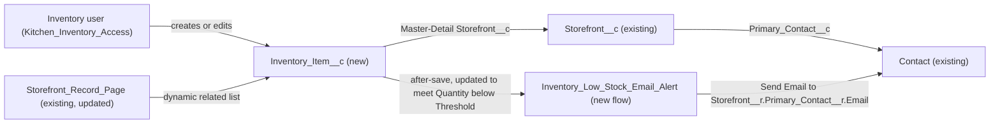

# Implementation spec — Kitchen inventory with low-stock email alerts per storefront

> Track ingredient stock levels per `Storefront__c` in a new `Inventory_Item__c` object and email the storefront's primary contact when an item's quantity falls below its reorder threshold.

_Based on the requirement, the evidence reported by AskCoworker, and read-only org queries where noted. Assumptions and missing evidence are identified below. Specification only — nothing is implemented or deployed._

---

## 1. The requirement

Each storefront records its ingredients with a quantity on hand, a unit of measure, and a reorder threshold; when an item's quantity drops below its threshold, the storefront's Primary Contact receives an email. The object shape and the alert recipient are *user decisions*. The request contained no out-of-scope instructions.

| # | Responsibility | Trigger | Where it lives |
| --- | --- | --- | --- |
| 1 | Record ingredient stock (quantity, unit, reorder threshold) per storefront | User creates or edits an inventory item | `Inventory_Item__c` (new), child of `Storefront__c` |
| 2 | Show a storefront's inventory items | User opens a storefront record | `Storefront_Record_Page` related list; `Inventory_Item__c` tab |
| 3 | Email the storefront's Primary Contact when an item runs low | Item created with, or updated to, `Quantity_On_Hand__c < Reorder_Threshold__c` | `Inventory_Low_Stock_Email_Alert` flow (new) |
| 4 | Give inventory users access | Permission set assignment | `Kitchen_Inventory_Access` (new) |

## 2. Grounding — reuse before building

Target org: `TestWriteSpecDE` (org ID `00Dak00001COqNeEAL`, connected). API version: `67.0` (org). The project has no `sfdx-project.json`, so there is no `sourceApiVersion`. _verified by org query_

- **`Storefront__c`** (CustomObject) — the parent for inventory. It has 21 records, all owned by the user "OrgFarm EPIC". Internal sharing model `ReadWrite`; external `Private`. _verified by org query_
- **`Storefront__c.Primary_Contact__c`** (Lookup to `Contact`) — the alert recipient. All 21 storefronts have a primary contact, all 21 of those contacts have an `Email`, and 0 have `HasOptedOutOfEmail = true`. _verified by org query_
- **`Storefront_Record_Page`** (FlexiPage, `RecordPage`, Id `0M0ak00000GBmLSCA1`) — uses Dynamic Forms (`flexipage:fieldSection`) and six `lst:dynamicRelatedList` components. _verified by org query_ Its activation and assignment cannot be read.
- **`Storefront__c-Storefront Layout`** (Layout) — the only layout on `Storefront__c`. _verified by org query_
- **Access to `Storefront__c` today** (complete list of ObjectPermissions rows): Read and Edit through `Agentforce_Reference_App`, `sfdc_accelerate_dms`, and the System Administrator profile. Read only through `Pronto_Deep_Dive_Workshop`, `sfdc_a360_sfcrm_data_extract`, `sfdc_slack`, and the Analytics Cloud Integration User profile. _verified by org query_
- **No existing inventory concept.** Tooling `CustomField` names matching Stock, Inventor, Ingredient, Threshold, Reorder, Quantity, or Par_Level return only Data 360 data model object fields (`ssot` namespace, `9sd…` tables), none on CRM objects. `sf sobject list --sobject all` has no Ingredient, Stock, Supplier, or `ProductItem` object. The Order Management objects `InventoryReservation` and `InventoryItemReservation`, and `Location`, exist, but they model commerce order reservations, not kitchen ingredients. _verified by org query_
- **No automation on `Storefront__c`, `Menu__c`, or `Menu_Item__c`**: 0 Apex triggers and 0 record-triggered flows (FlowDefinitionView by `TriggerObjectOrEventId`). _verified by org query_ The object is referenced by 20 Apex classes, 4 flow references (`Issue Refund`, `Apply Remediation`, `Partner Quality Watchlist`), and `Storefront_Record_Page` (MetadataComponentDependency); none of them changes. _verified by org query_
- **Free names:** no `Kitchen_Inventory_Access` permission set, no flow with "Inventory" in its API name, no email template matching Inventory or Stock, and no `OrgWideEmailAddress`. _verified by org query_
- **`CustomNotificationType`**: only four packaged or unrelated types exist (`enablement_coaching_feedback_ready`, `Config_Delete_Complete`, `Security_Center_Extension_Alerts`, `Shield_Extension_Alerts`). _verified by org query_ Not used, because the recipient is a Contact, not a user.

Candidates examined and rejected: `Product2` — it has `QuantityUnitOfMeasure` but no stock level, threshold, or storefront relationship, and it is the sales product catalog (_reported by AskCoworker_; the object exists, _verified by org query_). `InventoryReservation` / `Location` — Order Management reservation model, not ingredient stock. `Menu_Item__c` — its custom fields are `Available`, `Calories`, `Description`, `Image_URL`, `Menu_Category`, `Menu`, `Price` (complete Tooling list); it is a sold dish, not an ingredient. _verified by org query_ `Agentforce_Reference_App` — broad existing permission set; not widened (design rule).

Evidence sources: `sf org display`; `sf sobject list` (custom and all); Tooling `CustomField`, `EntityDefinition`, `ApexTrigger`, `Layout`, `FlexiPage` (with `Metadata`), `MetadataComponentDependency`, `CustomNotificationType`; standard `FlowDefinitionView`, `ObjectPermissions`, `FieldPermissions`, `PermissionSet`, `PermissionSetAssignment`, `Profile`, `User`, `OrgWideEmailAddress`, `EmailTemplate`, `DataStream`, and aggregate queries on `Storefront__c`. AskCoworker returned no citedReferences. AskCoworker made four wrong claims in this run (Section 8, Resolved), so the *T* call was skipped under Rule 3; Section 7 and Section 8 were built from the org queries and documented platform behavior.

## 3. Architecture

Why the pieces are drawn this way:

1. `Inventory_Item__c` is a new child of `Storefront__c` through a Master-Detail field, so each item belongs to exactly one storefront and inherits its sharing (`ControlledByParent`). The user chose a new object per storefront (*user decision*). Master-Detail rather than Lookup is an *assumption*: inventory has no meaning without its storefront.
2. The flow is a record-triggered after-save flow on `Inventory_Item__c` — the standard declarative mechanism for sending an email when a record meets a condition. No Apex is needed. An email alert (`WorkflowAlert`) was not chosen because its recipient types cannot address a Contact that is two relationships away (`Storefront__r.Primary_Contact__r`); the flow's Send Email action can (*assumption (documented platform behavior)*).
3. The flow reads `$Record.Storefront__r.Primary_Contact__r.Email` directly, with no Get Records elements.
4. `Storefront__c` → `Contact` through `Primary_Contact__c` is existing (_verified by org query_).

## 4. Metadata changes

**Data model**

- **Create `Inventory_Item__c`** — CustomObject. Label "Inventory Item", plural "Inventory Items". Name field: Text, label "Ingredient Name". Sharing: `ControlledByParent`. Allow Reports enabled; Track Field History off.
- **Create `Inventory_Item__c.Storefront__c`** — CustomField, Master-Detail(`Storefront__c`). Label "Storefront". Relationship name `Inventory_Items` (child relationship `Inventory_Items__r`). Reparenting not allowed (default). Sharing setting: Read/Write on the master required (default); internal sharing on `Storefront__c` is `ReadWrite`, so internal users meet it.
- **Create `Inventory_Item__c.Quantity_On_Hand__c`** — CustomField, Number(16, 2). Label "Quantity on Hand". Required; default 0.
- **Create `Inventory_Item__c.Unit_of_Measure__c`** — CustomField, restricted Picklist. Label "Unit of Measure". Values: `Each`, `g`, `kg`, `oz`, `lb`, `mL`, `L`. Required. The value list is an *assumption* (standard kitchen units); admins can extend it.
- **Create `Inventory_Item__c.Reorder_Threshold__c`** — CustomField, Number(16, 2). Label "Reorder Threshold". Required, no default, so every item gets a deliberate threshold. Help text: "An email is sent to the storefront's primary contact when Quantity on Hand falls below this value."

**Automation**

- **Create `Inventory_Low_Stock_Email_Alert`** — Flow, record-triggered, after-save, on `Inventory_Item__c`, "A record is created or updated". Entry conditions (all): `Quantity_On_Hand__c` Less Than `{!$Record.Reorder_Threshold__c}`. Run option: "Only when a record is updated to meet the condition requirements", so it fires once per crossing, and on create when the new record is already below threshold. Decision: continue only when `$Record.Storefront__r.Primary_Contact__r.Email` is not blank and `$Record.Storefront__r.Primary_Contact__r.HasOptedOutOfEmail` is false. Action: core Send Email (`emailSimple`) with `recipientAddressList` = `{!$Record.Storefront__r.Primary_Contact__r.Email}`, `senderType` = `DefaultWorkflowUser`, subject "Low stock: {!$Record.Name} at {!$Record.Storefront__r.Name}", plain-text body with the item name, `Quantity_On_Hand__c`, `Unit_of_Measure__c`, and `Reorder_Threshold__c`. Delivered status: Active.

**UX**

- **Create `Inventory_Item__c-Inventory Item Layout`** — Layout. Fields: `Name`, `Storefront__c`, `Quantity_On_Hand__c`, `Unit_of_Measure__c`, `Reorder_Threshold__c`, and the system information section (a Master-Detail child has no Owner field).
- **Create `Inventory_Item__c`** — CustomTab, standard object tab so users can open and list items.
- **Update `Storefront_Record_Page`** — FlexiPage. Add one `lst:dynamicRelatedList` for `Inventory_Items__r` with columns `Name`, `Quantity_On_Hand__c`, `Unit_of_Measure__c`, `Reorder_Threshold__c`, placed next to the existing related lists. No other component changes. Shared page: every user assigned to it sees the list only if they have Read on `Inventory_Item__c`.
- **Update `Storefront__c-Storefront Layout`** — Layout. Conditional: needed only if `Storefront_Record_Page` is not the active record page for the users who manage inventory (activation cannot be read). Add the "Inventory Items" related list with the same columns.

**Security**

- **Create `Kitchen_Inventory_Access`** — PermissionSet. `Inventory_Item__c`: Read, Create, Edit, Delete. FieldPermissions Read and Edit on `Inventory_Item__c.Quantity_On_Hand__c`, `Inventory_Item__c.Unit_of_Measure__c`, `Inventory_Item__c.Reorder_Threshold__c` (the Master-Detail field and `Name` are always accessible). `Storefront__c`: Read (required to see the master record). Tab setting for `Inventory_Item__c`: Visible. No Contact access (the flow reads the contact in system context).

## 5. Data 360 (Data Cloud) data involved

Not applicable — this change does not use Data 360. The org has 0 `DataStream` records (_verified by org query_); the only Data 360 artifacts found are `ssot` data model object fields unrelated to this design.

## 6. Security considerations

- **Execution context.** Record-triggered flows run in system context without sharing, and do not enforce CRUD or FLS on the fields they read. _assumption (documented platform behavior)_ The flow reads the item, its storefront, and the primary contact's `Email` and `HasOptedOutOfEmail` regardless of the editing user's access.
- **Record access.** `Inventory_Item__c` is `ControlledByParent`; `Storefront__c` internal sharing is `ReadWrite` (_verified by org query_), so every internal user with `Kitchen_Inventory_Access` can see and edit the items of every storefront. External sharing on `Storefront__c` is `Private` (_verified by org query_).
- **Field-level security.** Deploying the new fields grants no access to any profile or permission set outside the deployment, and View All Data / Modify All Data do not grant field access. _assumption (documented platform behavior)_ After deployment, only `Kitchen_Inventory_Access` has FieldPermissions rows for the new fields; the System Administrator profile gets none unless an admin is assigned the permission set.
- **Who gets the permission set.** No profile or permission set in the org is named for kitchen staff; the only standard users are "OrgFarm EPIC" (System Administrator) and integration or agent users (_verified by org query_). Assignment is a Setup step (Section 8).
- **Data exposure.** The email sends the ingredient name, storefront name, quantity, unit, and threshold to the primary contact's inbox, which is outside Salesforce. The sender is the org's default workflow user, because no `OrgWideEmailAddress` exists (_verified by org query_).
- **Opt-out.** The flow skips contacts with `HasOptedOutOfEmail = true` (design rule: respect email opt-out); 0 current primary contacts have opted out (_verified by org query_).

## 7. Testing strategy

No Apex is added, and the flow's only outcome is an email, which a Flow Test cannot assert, so there are no test components in the inventory. Recommended verification in a sandbox:

1. **Create below threshold.** Create an item with `Quantity_On_Hand__c` = 2, `Reorder_Threshold__c` = 5 on a storefront whose primary contact has an email you control → one email arrives with the correct values.
2. **Crossing on update.** Edit an item from 10 to 3 (threshold 5) → one email. Edit it again from 3 to 2 → no second email (already matching). Restock to 8, then drop to 4 → one new email.
3. **Boundary.** Quantity equal to threshold (5 = 5) → no email (strictly below).
4. **Threshold change.** Raise `Reorder_Threshold__c` above the current quantity → one email.
5. **Opt-out and missing email.** A primary contact with `HasOptedOutOfEmail = true`, or without `Email` → no email and the save succeeds.
6. **Bulk.** Data Loader update of 200 items crossing the threshold → 200 emails, no flow errors; check the org's daily single-email limit in a sandbox before bulk loads.
7. **Permissions.** A user with only `Kitchen_Inventory_Access` can create, edit, and delete items and see the related list; a user without it does not see the related list or the tab.
8. **Delete and undelete.** Deleting a storefront deletes its items (Master-Detail cascade); undeleting an item does not send an email.
9. **Load-bearing: page activation.** Confirm in Lightning App Builder whether `Storefront_Record_Page` is the active page for the target users; this settles the Conditional `Storefront__c-Storefront Layout` row.
10. **Load-bearing: email deliverability.** Confirm Setup → Deliverability allows "All email" in the target org before relying on the alert.

## 8. Open decisions

### Open

1. **Conditional row `Storefront__c-Storefront Layout` (non-blocking).** Needed only if `Storefront_Record_Page` is not active for the inventory users. Settle by checking the page's activation in Lightning App Builder (sandbox or production check; not readable by query). Recommended default: include it; it is harmless if the page is active.
2. **Permission set assignment (blocking for delivery).** No kitchen-staff persona exists in the org. Assign `Kitchen_Inventory_Access` in Setup → Permission Sets → Manage Assignments to the users who maintain stock. Without it, nobody (including admins) can edit the new fields.
3. **Email deliverability (blocking for delivery).** Deliverability cannot be read; sending email is the main purpose of responsibility 3. Confirm Access Level = "All email" (Section 7, case 10).
4. **Sender address (non-blocking).** No `OrgWideEmailAddress` exists; emails come from the default workflow user. Proposal: create an org-wide address (Setup, not deployable) and switch `senderType` to `OrgWideEmailAddress`.
5. **Initial data (non-blocking).** No inventory data exists. Loading each storefront's ingredients is a data step; the loading user needs `Kitchen_Inventory_Access`. Records loaded already below threshold send an email each on insert; load with thresholds first or accept the emails.
6. **Proposals not in inventory.** A low-stock indicator formula (`Quantity_On_Hand__c < Reorder_Threshold__c`) for list views and a roll-up count of low items on `Storefront__c` — not asked for.

Deployment sequence: object and fields → layout, tab, permission set → FlexiPage and conditional layout → flow (Active) → permission set assignments (Setup) → data load.

### Resolved

- **Alert recipient (user decision).** Options were the storefront owner (a User; all 21 owned by "OrgFarm EPIC") or `Primary_Contact__c` (a Contact; all 21 populated with email). The user chose the Primary Contact, so the channel is email.
- **Data structure (user decision).** New Inventory Item object per storefront with quantity, unit, and reorder threshold; "runs low" means below the item's own threshold.
- **Master-Detail, required threshold with no default, strict "below", once-per-crossing firing, unit picklist values, `DefaultWorkflowUser` sender (assumptions).** Chosen as the smallest safe defaults.
- **AskCoworker corrections (4 wrong claims).** (1) "Record-triggered flows run in system context with sharing" — they run without sharing (documented behavior). (2) "Get Records runs one SOQL per record in bulk" — record-triggered flow interviews are bulkified; the design also has no Get Records. (3) "10-email-per-transaction limit applies to the flow Send Email action" — that limit applies to Apex `Messaging.sendEmail` calls; the flow action counts against the daily single-email limit. (4) "With no org-wide address the email comes from the Automated Process user" — the action's sender defaults to the current user; the spec sets `senderType` explicitly.
- **Dropped AskCoworker proposals.** `Is_Low_Stock__c` formula (not needed for the alert; listed as a proposal), `ISCHANGED` entry condition (replaced by "only when updated to meet the condition", which prevents repeat emails), two Get Records elements (replaced by `$Record` cross-object references). AskCoworker's inventory also omitted the new object's layout; added.

## 9. Change set

| # | Action | Type | API name | Module | Why |
| --- | --- | --- | --- | --- | --- |
| 1 | Create | CustomObject | `Inventory_Item__c` | force-app/main/default/objects | Ingredient stock record per storefront |
| 2 | Create | CustomField | `Inventory_Item__c.Storefront__c` | force-app/main/default/objects/Inventory_Item__c/fields | Master-Detail to the owning storefront |
| 3 | Create | CustomField | `Inventory_Item__c.Quantity_On_Hand__c` | force-app/main/default/objects/Inventory_Item__c/fields | Current stock level |
| 4 | Create | CustomField | `Inventory_Item__c.Unit_of_Measure__c` | force-app/main/default/objects/Inventory_Item__c/fields | Unit for the quantity |
| 5 | Create | CustomField | `Inventory_Item__c.Reorder_Threshold__c` | force-app/main/default/objects/Inventory_Item__c/fields | Defines "runs low" per item |
| 6 | Create | Flow | `Inventory_Low_Stock_Email_Alert` | force-app/main/default/flows | Emails the primary contact when quantity crosses below threshold |
| 7 | Create | Layout | `Inventory_Item__c-Inventory Item Layout` | force-app/main/default/layouts | Record layout for the new object |
| 8 | Create | CustomTab | `Inventory_Item__c` | force-app/main/default/tabs | Navigation to inventory items |
| 9 | Update | FlexiPage | `Storefront_Record_Page` | force-app/main/default/flexipages | Show items on the storefront page |
| 10 | Update | Layout | `Storefront__c-Storefront Layout` | force-app/main/default/layouts | Conditional: related list if the FlexiPage is not active |
| 11 | Create | PermissionSet | `Kitchen_Inventory_Access` | force-app/main/default/permissionsets | Dedicated access for inventory users |

A new Master-Detail child of `Storefront__c` holds ingredient stock, and one record-triggered flow emails the storefront's primary contact when an item's quantity crosses below its reorder threshold.

Total: 11 · Create: 9 · Update: 2 · Delete: 0
