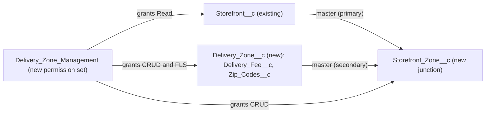

# Implementation spec — Delivery zones with zip code lists and per-zone delivery fees

> Model shared delivery zones that each hold a list of zip codes and a delivery fee, and link each storefront to the zones it delivers to.

_Based on the requirement, the evidence reported by AskCoworker, and read-only org queries where noted. Assumptions and missing evidence are identified below. Specification only — nothing is implemented or deployed._

---

## 1. The requirement

Each storefront delivers to certain zip codes, grouped into delivery zones, and each zone has its own delivery fee. By user decision, zones are shared records linked to storefronts through a junction object, each zone stores its zip codes as a list on the zone record, and the fee is stored on the zone. Also by user decision (recommended default accepted), applying the fee to an order is out of scope, because the org has no order object linked to `Storefront__c`. The request contained no instruction to deploy or change data.

| # | Responsibility | Trigger | Where it lives |
| --- | --- | --- | --- |
| 1 | Define a delivery zone and its delivery fee | User creates or edits a zone | `Delivery_Zone__c`, `Delivery_Zone__c.Delivery_Fee__c` |
| 2 | Record the zip codes a zone covers | User edits a zone | `Delivery_Zone__c.Zip_Codes__c` |
| 3 | Record which zones each storefront delivers to | User adds a zone to a storefront | `Storefront_Zone__c` with `Storefront_Zone__c.Storefront__c` and `Storefront_Zone__c.Delivery_Zone__c` |
| 4 | Let users maintain zones and links in the UI | User opens a storefront or zone record | `Delivery_Zone__c-Delivery Zone Layout`, `Storefront_Zone__c-Storefront Zone Layout`, `Storefront__c-Storefront Layout` |
| 5 | Give zone maintainers access to the new objects | Permission set assignment | `Delivery_Zone_Management` |
| 6 | Charge the zone fee on an order | Not specified | Not applicable — out of scope by user decision; see Section 8 |

## 2. Grounding — reuse before building

Target org: `TestWriteSpecDE` (Developer Edition, org ID `00Dak00001COqNeEAL`). API version: `67.0`.

- **`Storefront__c`** (CustomObject) — the storefront; parent of the new junction. No namespace, sharing model Read/Write, 21 records, all with `Status__c` = `Active`. _verified by org query_
- **`Storefront__c.Address__c`** (compound Address) — the storefront's own address; all 21 records have `Address__PostalCode__s` populated. It is the storefront location, not the list of delivered zip codes, so it is not reused for zones. _verified by org query_
- **No delivery zone, zip list, or fee field exists** on any custom object. The org-wide Tooling `CustomField` scan for `Zip`, `Postal`, `Fee`, `Deliver`, `Zone`, and `Region` returned only standard or Data 360 fields and Lead and Opportunity fields unrelated to storefronts. `Delivery_Zone__c` and `Storefront_Zone__c` do not exist. _verified by org query_
- **`Region__c`** (CustomObject) — exists with 0 records and only `Name` and `Onboarding_Specialist__c` (Lookup to User); no metadata references it. AskCoworker did not report it. It is an onboarding concept, and the user decided not to reuse it. _verified by org query; user decision_
- **`Transaction__c`** (CustomObject) — sales and refunds, 0 records; fields `Contact__c`, `Payment_Method__c`, `Refund_Reason__c`, `Total_Amount__c`, `Transaction_Date__c`, `Transaction_Type__c`. It has no lookup to `Storefront__c`, and no order or cart custom object exists, so nothing in the org can carry a delivery fee on an order. _verified by org query_
- **`Pronto_Orders_API`** (NamedCredential) — exists, which suggests orders are handled outside the org. _verified by org query (existence only)_; its role in ordering is _reported by AskCoworker_ only by name.
- **Automation on `Storefront__c`** — no Apex trigger, no record-triggered flow, and no validation rule. _verified by org query_
- **`Storefront__c-Storefront Layout`** (Layout) — the only layout on `Storefront__c`, no namespace. _verified by org query_
- **Permission sets on `Storefront__c`** — `Agentforce_Reference_App`, `sfdc_accelerate_dms`, and one profile-owned permission set grant Read, Create, Edit, and Delete; `Pronto_Deep_Dive_Workshop`, `sfdc_a360_sfcrm_data_extract`, `sfdc_slack`, and another profile-owned set grant Read only. No permission set named like `Delivery` or `Zone` exists except the namespaced `force` session set `DeliveryEstimationServicePermSet`, which is unrelated. _verified by org query_
- **Apex classes that read or write `Storefront__c`** (`AgentStorefrontActions`, `AgentUpdateStorefrontDetailsActions`, and others) touch no delivery fields. _reported by AskCoworker_
- **Project source** — `force-app` is empty; the default package directory is `force-app`. _verified by file check_

Evidence sources: `sf org display`; `sf sobject list`; `sf sobject describe` of `Storefront__c`, `Region__c`, `Transaction__c`; Tooling queries on `EntityDefinition`, `CustomObject`, `CustomField`, `FieldDefinition`, `MetadataComponentDependency`, `ApexTrigger`, `ValidationRule`, `Layout`; standard queries on `FlowDefinitionView`, `PermissionSet`, `ObjectPermissions`, `NamedCredential`, and record counts. AskCoworker returned no citedReferences.

## 3. Architecture

Why the pieces are drawn this way:

1. `Storefront__c` is the existing storefront object. _verified by org query_
2. `Delivery_Zone__c` is a shared zone record holding the fee and the zip list, because the user chose shared zones with the fee on the zone and zip codes as a list. _user decision_
3. `Storefront_Zone__c` is a junction with two Master-Detail fields, which gives the many-to-many link the user asked for with no code. Sharing is Controlled by Parent, which is the only option for a detail object. _user decision; platform behavior_
4. No Apex, flow, or validation rule is added. The requirement is a data model with maintenance UI; no declarative or code logic is needed to store zones, zips, and fees.
5. No order-side component is drawn, because no order object exists and fee application is out of scope. _verified by org query; user decision_

## 4. Metadata changes

**Data model**

- **Create `Delivery_Zone__c`** — Custom object "Delivery Zone" (plural "Delivery Zones"). `Name` is Text(80). Sharing model Read/Write, matching `Storefront__c`. Allow Search enabled.
- **Create `Delivery_Zone__c.Delivery_Fee__c`** — Currency(16, 2), label "Delivery Fee", not required. The fee charged for deliveries in this zone.
- **Create `Delivery_Zone__c.Zip_Codes__c`** — Long Text Area(32768), 5 visible lines, label "Zip Codes". Help text: "One zip code per line." Holds the zip codes this zone covers.
- **Create `Storefront_Zone__c`** — Custom object "Storefront Zone" (plural "Storefront Zones"), junction between `Storefront__c` and `Delivery_Zone__c`. `Name` is Auto Number `SZ-{00000}`. Sharing model Controlled by Parent.
- **Create `Storefront_Zone__c.Storefront__c`** — Master-Detail to `Storefront__c` (primary master, created first), label "Storefront", relationship name `Storefront_Zones`. Reparenting not allowed.
- **Create `Storefront_Zone__c.Delivery_Zone__c`** — Master-Detail to `Delivery_Zone__c` (secondary master), label "Delivery Zone", relationship name `Storefront_Zones`. Reparenting not allowed.

**UX**

- **Create `Delivery_Zone__c-Delivery Zone Layout`** — Fields `Name`, `Delivery_Fee__c`, `Zip_Codes__c`, `OwnerId`; related list "Storefront Zones" showing `Storefront_Zone__c.Storefront__c`.
- **Create `Storefront_Zone__c-Storefront Zone Layout`** — Fields `Name`, `Storefront__c`, `Delivery_Zone__c`.
- **Update `Storefront__c-Storefront Layout`** — Add the "Storefront Zones" related list (`Storefront_Zone__c` via `Storefront_Zone__c.Storefront__c`) showing `Storefront_Zone__c.Delivery_Zone__c`. No other layout change. Users create a new zone from the Delivery Zone lookup on a new link record and open a zone from the link.

**Security**

- **Create `Delivery_Zone_Management`** — Permission set "Delivery Zone Management". Object access: Read, Create, Edit, Delete on `Delivery_Zone__c` and `Storefront_Zone__c`; Read on `Storefront__c`. Field access: Read and Edit on `Delivery_Zone__c.Delivery_Fee__c` and `Delivery_Zone__c.Zip_Codes__c`. Master-Detail fields need no field permission. Not assigned to anyone by this spec.

## 5. Data 360 (Data Cloud) data involved

Not applicable — this change does not use Data 360. The permission set `sfdc_a360_sfcrm_data_extract` reads `Storefront__c` (_verified by org query_), but no data stream for the new objects is in scope.

## 6. Security considerations

- **Execution context.** No Apex or flow is added, so all access is through the UI and API under the running user's sharing, CRUD, and FLS.
- **Sharing.** `Delivery_Zone__c` is Read/Write, so every internal user who has object Read can see all zones and fees. `Storefront_Zone__c` is Controlled by Parent; for a junction, a user needs access to both master records to see or edit a link (documented Salesforce behavior).
- **CRUD/FLS.** Only `Delivery_Zone_Management` grants access to the new objects in this spec. System administrators get access through their profile. Permission sets are not the only grant path; profiles and permission set groups can also grant access, and none are changed here.
- **Delete impact.** Deleting a `Storefront__c` or a `Delivery_Zone__c` deletes its `Storefront_Zone__c` rows. `Agentforce_Reference_App`, `sfdc_accelerate_dms`, and one profile-owned permission set already grant Delete on `Storefront__c` (_verified by org query_), so users with those sets can remove a storefront's zone links by deleting the storefront. Undeleting the master restores the cascade-deleted junction rows (documented Salesforce behavior).
- **Data exposure.** Zip codes and fees are business data, not personal data. Delivery fees become visible to all users with Read on `Delivery_Zone__c`.

## 7. Testing strategy

The inventory contains no Apex and no automation, so no Apex test class is required for deployment. The cases below are recommended verification, run manually or as an optional scripted test after deployment. No tests have run.

- **Zone and fee.** Create a `Delivery_Zone__c` with `Delivery_Fee__c` = 5.00 and two zip codes in `Zip_Codes__c`; confirm both values save and show on the layout. Create one with a blank fee; confirm it saves.
- **Many-to-many.** Link one zone to two storefronts, and one storefront to two zones; confirm both appear in the "Storefront Zones" related lists on `Storefront__c-Storefront Layout` and `Delivery_Zone__c-Delivery Zone Layout`.
- **Negative.** Try to save a `Storefront_Zone__c` without a storefront or without a zone; confirm the platform blocks it (Master-Detail is required).
- **Bulk.** Load 200 `Storefront_Zone__c` rows with Data Loader or the API; confirm all save.
- **Delete and undelete.** Delete a test zone that has links; confirm its junction rows are deleted and the storefronts remain. Undelete it; confirm the links return. Use test records only, never the 21 existing storefronts.
- **Permission.** As a user with only `Delivery_Zone_Management` plus a minimal profile, confirm the user can create and edit zones and links, can read but not edit `Storefront__c`. As a user without the permission set, confirm zone and link records are not accessible.

## 8. Open decisions

1. **Fee application on orders (non-blocking).** The requirement says "we charge different delivery fees per zone", but no object in the org links an order or transaction to `Storefront__c` (`Transaction__c` has no storefront lookup; _verified by org query_). By user decision, this spec only stores the fee. Whatever system takes orders (possibly the one behind `Pronto_Orders_API`; _assumption_) must read `Delivery_Zone__c.Delivery_Fee__c` for the zone that contains the customer's zip code. Recommended default: specify that lookup in a separate spec when the order system is known.
2. **Zip list format and search limits (non-blocking).** By user decision, zip codes are a list on the zone. A Long Text Area cannot be used in a SOQL `WHERE` filter (documented Salesforce behavior), so finding the zone for a zip code means reading a storefront's zones and parsing each list. Recommended default: one zip code per line, no validation rule. A child object with one record per zip code is the alternative if lookups by zip become necessary.
3. **Same zip in two zones of one storefront (non-blocking).** Nothing prevents a zip code from appearing in two zones linked to the same storefront, which would make the fee ambiguous. Recommended default: document that each zip may appear in only one zone per storefront; enforce it later if needed. Proposal, not in inventory.
4. **Duplicate junction rows (non-blocking).** Nothing prevents linking the same storefront to the same zone twice. Because the fee is on the zone, a duplicate does not change the fee. Recommended default: no enforcement. A unique text key field set by a flow is the proposal if needed; not in inventory.
5. **Who gets `Delivery_Zone_Management` (non-blocking).** The requirement does not say who maintains zones. Recommended default: assign the permission set only to named zone maintainers. Adding the grants to `Agentforce_Reference_App` or `sfdc_accelerate_dms` (as AskCoworker proposed) is not done by default because the requirement did not ask for it.
6. **Zone name uniqueness (non-blocking).** `Delivery_Zone__c.Name` is not unique. Recommended default: leave non-unique; the platform does not support a Unique flag on the standard `Name` field.
7. **Deployment sequence (non-blocking).** Deploy `Delivery_Zone__c` and its fields, then `Storefront_Zone__c` with `Storefront_Zone__c.Storefront__c` before `Storefront_Zone__c.Delivery_Zone__c`, then the tab and layouts, then `Delivery_Zone_Management`. `Storefront__c-Storefront Layout` is not in `force-app`; retrieve it before editing so the update does not overwrite its current content. No data backfill is needed.
8. **Corrections to AskCoworker (recorded).**
   - AskCoworker said no permission set grants Delete on `Storefront__c`; the org query shows three do. The org query is used.
   - AskCoworker did not report `Region__c`; the org scan found it. It is not reused by user decision.
   - AskCoworker (runtime answer) said cascade-deleted junction rows are not restored when the master is undeleted. This contradicts documented Salesforce behavior (undeleting a master restores its detail records), so it is not used.
   - AskCoworker said the `Storefront__c` layout name was unknown; the org query confirmed `Storefront__c-Storefront Layout`.
   - AskCoworker used "prior session" facts about data streams; they were not used.
9. **Dropped from the AskCoworker inventory (proposals, not in inventory).** `Delivery_Zone__c.Storefront_Count__c` (roll-up count of linked storefronts), validation rule `Delivery_Zone__c.Delivery_Fee_Must_Be_Positive`, a duplicate or matching rule on `Storefront_Zone__c`, a zip format validation rule, an Apex test class, and grants on `Agentforce_Reference_App` and `sfdc_accelerate_dms`. None is required by the requirement.
10. **Custom tab for zones (non-blocking).** A custom object tab for `Delivery_Zone__c` would let users list and create zones directly and find them in the App Launcher. It is not in the inventory; zones are reached through the Storefront Zones related lists and the lookup. Recommended default: add the tab if zone maintainers need a zone list view.
11. **Currency (non-blocking).** The org's currency settings were not queried. Recommended default: `Delivery_Fee__c` uses the corporate currency; if multi-currency is enabled, each zone record carries its own currency. _assumption_

## 9. Change set

| # | Action | Type | API name | Module | Why |
| --- | --- | --- | --- | --- | --- |
| 1 | Create | CustomObject | `Delivery_Zone__c` | force-app/main/default/objects/Delivery_Zone__c | Shared delivery zone record (responsibility 1) |
| 2 | Create | CustomField | `Delivery_Zone__c.Delivery_Fee__c` | force-app/main/default/objects/Delivery_Zone__c/fields | Fee per zone (responsibility 1) |
| 3 | Create | CustomField | `Delivery_Zone__c.Zip_Codes__c` | force-app/main/default/objects/Delivery_Zone__c/fields | Zip code list per zone (responsibility 2) |
| 4 | Create | CustomObject | `Storefront_Zone__c` | force-app/main/default/objects/Storefront_Zone__c | Junction between storefronts and zones (responsibility 3) |
| 5 | Create | CustomField | `Storefront_Zone__c.Storefront__c` | force-app/main/default/objects/Storefront_Zone__c/fields | Primary master to `Storefront__c` (responsibility 3) |
| 6 | Create | CustomField | `Storefront_Zone__c.Delivery_Zone__c` | force-app/main/default/objects/Storefront_Zone__c/fields | Secondary master to `Delivery_Zone__c` (responsibility 3) |
| 7 | Create | Layout | `Delivery_Zone__c-Delivery Zone Layout` | force-app/main/default/layouts | Maintain fee, zips, and linked storefronts (responsibility 4) |
| 8 | Create | Layout | `Storefront_Zone__c-Storefront Zone Layout` | force-app/main/default/layouts | Maintain a link record (responsibility 4) |
| 9 | Update | Layout | `Storefront__c-Storefront Layout` | force-app/main/default/layouts | Show and add a storefront's zones (responsibility 4) |
| 10 | Create | PermissionSet | `Delivery_Zone_Management` | force-app/main/default/permissionsets | Least-access grant for zone maintainers (responsibility 5) |

Two new objects, `Delivery_Zone__c` holding the fee and zip list and `Storefront_Zone__c` linking it to `Storefront__c`, with layouts and one permission set; no automation.

Total: 10 · Create: 9 · Update: 1 · Delete: 0
