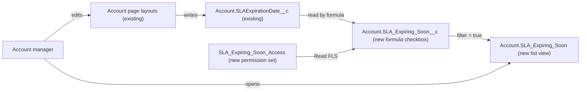

# Implementation spec — Flag accounts whose SLA expires in the next 30 days

> Add a formula checkbox on `Account` that is true when `Account.SLAExpirationDate__c` falls within the next 30 days, and an `Account` list view that shows those accounts so account managers can renew them.

_Based on the requirement, the evidence reported by AskCoworker, and read-only org queries where noted. Assumptions and missing evidence are identified below. Specification only — nothing is implemented or deployed._

---

## 1. The requirement

Flag each `Account` whose SLA expires in the next 30 days and give account managers one place to find those accounts. By user decision, the flag is a new formula checkbox ("SLA Expiring Soon"), the delivery surface is an `Account` list view, and no emails or notifications are sent. The request contained no deploy or data-change instruction.

| # | Responsibility | Trigger | Where it lives |
| --- | --- | --- | --- |
| 1 | Hold the SLA expiration date for each account | User edits the account record | `Account.SLAExpirationDate__c` (existing), edited through the existing `Account` page layouts |
| 2 | Flag accounts whose SLA expiration date is between today and today + 30 days | Evaluated when the record is read (formula) | `Account.SLA_Expiring_Soon__c` (new) |
| 3 | Let account managers find the flagged accounts, soonest expiry first | Account manager opens the list view | `Account.SLA_Expiring_Soon` (new list view) |
| 4 | Let account managers see the new flag field | Permission set assignment | `SLA_Expiring_Soon_Access` (new permission set) |

## 2. Grounding — reuse before building

Target org: `TestWriteSpecDE` (Developer Edition, `00Dak00001COqNeEAL`, not a sandbox). API version: `67.0`.

- **`Account.SLAExpirationDate__c`** (CustomField, Date, unmanaged, updateable, nillable) — the source date for the flag. _verified by org query_
- **`Account.SLAExpirationDate__c` data** — null on all 200 `Account` records; no record falls in the next 30 days or in the past. _verified by org query_ This contradicts AskCoworker's claim that the SLA fields are populated on every record ("frequency = 1.0"); see Section 8.
- **`Account.SLAExpirationDate__c` references** — `MetadataComponentDependency` returns only `Account-Account (Marketing) Layout`, `Account-Account (Support) Layout`, and `Account-Account (Sales) Layout`. No unmanaged Apex class body references it. _verified by org query_
- **`Account.SLA__c`** (CustomField, Picklist: Gold, Silver, Platinum, Bronze) — SLA tier; null on all 200 records. _verified by org query_
- **`Account.SLASerialNumber__c`** (CustomField, Text(10)) — SLA reference number. _verified by org query_
- **`Account.Contract_Status__c`** (CustomField, Picklist incl. `Pending Renewal`) — 190 null, 8 `Signed`, 2 `Pending Renewal`; referenced by no component. Not used, by user decision. _verified by org query_
- **`Account.OwnerId`** — the account manager is the record owner; no separate account-manager field exists on `Account`. _reported by AskCoworker_; the absence of a separate field is _verified by org query_ (full `FieldDefinition` scan of `Account` custom fields). All 200 accounts have one owner. _verified by org query_
- **No existing flag field** — no `Account` field matches SLA expiry or renewal flagging, and `SLA_Expiring_Soon__c` does not exist. _verified by org query_
- **Automation on `Account`** — no Apex triggers, no record-triggered flows, no validation rules. The only scheduled flow in the org is the managed `runtime_industries_recurrence` `Orch` flow, which has no trigger object. _verified by org query_
- **Managed classes `AccountRule`** (namespaces `sc_ext`, `shield_ext`) — bodies are hidden; their behavior is unknown. _verified by org query_ (existence and namespace)
- **Existing `Account` list views** — `AllAccounts`, `Customers`, `Merchants`, `MyAccounts`, `NewLastWeek`, `NewThisWeek`, `PlatinumandGoldSLACustomers`, `RecentlyViewedAccounts`. None is named `SLA_Expiring_Soon`. _verified by org query_
- **Sharing** — `Account` organization-wide default is Public Read/Write. _verified by org query_
- **FLS on `Account.SLAExpirationDate__c`** — Read and Edit are granted by every profile; permission sets `Agentforce_Reference_App`, `sfdc_a360_sfcrm_data_extract`, `sfdc_slack`, `Pronto_Deep_Dive_Workshop` have Read only. `SLA_Expiring_Soon_Access` does not exist. _verified by org query_
- **Users** — one active standard human user (System Administrator), plus integration and agent users. _verified by org query_

Evidence sources: `sf org display`; `Organization` (type, sharing default); Tooling `FieldDefinition`, `CustomField`, `ApexTrigger`, `ValidationRule`, `ApexClass` (bodies scanned), `MetadataComponentDependency`; `FlowDefinitionView`; `sobject describe Account`; `ListView`; `PermissionSet`, `FieldPermissions`, `PermissionSetAssignment`; aggregate counts on `Account`, `Contract`, `ServiceContract`, `Entitlement`, `Asset` (all four have 0 records). AskCoworker returned no citedReferences.

## 3. Architecture

Why the pieces are drawn this way:

1. `Account.SLAExpirationDate__c` is on the three existing `Account` page layouts and is editable by every profile (verified by org query). Users entering the date on those layouts is the only evidenced way the field is populated.
2. `Account.SLA_Expiring_Soon__c` is a formula, so it has no save-time events and needs no scheduled job. It recalculates from `TODAY()` whenever it is read (reported by AskCoworker; consistent with documented formula behavior). A formula was chosen over a scheduled flow that writes a stored checkbox, because nothing needs to be stored and a formula cannot become stale. No Apex is used.
3. The list view filters on the formula field and is the delivery surface chosen by the user.
4. A new formula field deployed through the Metadata API has no field-level access until it is granted. The new permission set grants Read only on the new field, which is the least access that makes the flag visible.

## 4. Metadata changes

**Data model**

- **Create `Account.SLA_Expiring_Soon__c`** — Formula (Checkbox), label "SLA Expiring Soon". Formula: `AND(NOT(ISBLANK(SLAExpirationDate__c)), SLAExpirationDate__c >= TODAY(), SLAExpirationDate__c <= TODAY() + 30)`. True when the SLA expires today or within the next 30 calendar days; false when the date is blank, in the past, or more than 30 days away. Treat blanks as blanks.

**UX**

- **Create `Account.SLA_Expiring_Soon`** — List view on `Account`, label "SLA Expiring Soon". Filter: `SLA_Expiring_Soon__c` equals true. Filter scope: Everything. Columns: `Name`, `Owner` (account manager), `SLAExpirationDate__c`, `SLA__c`, `SLASerialNumber__c`, `Contract_Status__c`. Sort by `SLAExpirationDate__c` ascending (sorting is set in the UI; see Section 8). Visible to all internal users.

**Security**

- **Create `SLA_Expiring_Soon_Access`** — Permission set, label "SLA Expiring Soon Access". Field permission: `Account.SLA_Expiring_Soon__c` Read = true, Edit = false. No object permissions (every profile already grants `Account` Read).

## 5. Data 360 (Data Cloud) data involved

Not applicable — this change does not use Data 360. AskCoworker reported that no `Account` data stream exists; the allowed queries cannot confirm this (`DataStreamDefinition` is not queryable), so it stays _reported by AskCoworker_. The connector permission set `sfdc_a360_sfcrm_data_extract` is not changed.

## 6. Security considerations

- **Execution context.** The formula is evaluated by the platform; there is no Apex or flow, so there is no running-user or sharing context to design. The list view runs as the viewing user, under that user's sharing and FLS (documented platform behavior).
- **Sharing.** `Account` organization-wide default is Public Read/Write (verified by org query), so every internal user with `Account` Read sees every flagged account. Filter scope "Everything" therefore shows all flagged accounts; the `Owner` column tells each manager which are theirs.
- **CRUD/FLS.** The new field is read-only by type. `SLA_Expiring_Soon_Access` grants Read on it and nothing else. Profiles are not changed. Permission sets are not the only grant path: an administrator could also grant the field through profiles, which this spec does not do.
- **Assignment.** The permission set must be assigned to the account managers (today, the single System Administrator user who owns all accounts). Assignment is a data step, not part of the change set; see Section 8.
- **Data exposure.** The flag reveals only whether `Account.SLAExpirationDate__c` falls in a 30-day window. Every profile already reads that date (verified by org query), so no new data is exposed. No grant is made to integration or connector permission sets.

## 7. Testing strategy

The inventory contains no Apex, so no Apex test class is required for deployment and none is planned. The cases below are recommended verification in a sandbox or scratch org after deployment, not tests that ran.

- **Lower boundary.** `SLAExpirationDate__c` = today: flag true.
- **Upper boundary.** `SLAExpirationDate__c` = today + 30: flag true; today + 31: flag false.
- **Mid-window.** Today + 15: flag true.
- **Past date.** Yesterday: flag false.
- **Blank date.** Null: flag false (every account today; the list view returns zero rows until dates are entered).
- **Time passing.** A date of today + 31 becomes flagged the next day without any save (formula uses `TODAY()`).
- **Bulk.** Set dates on 200 accounts through a data load in a test org, half inside and half outside the window: the list view shows exactly the inside half.
- **Permission.** A user with `SLA_Expiring_Soon_Access` sees the "SLA Expiring Soon" column on the record and in the list view; a user without it does not see the field.
- **Negative write.** An attempt to set `SLA_Expiring_Soon__c` through the API is rejected (formula fields are not writable).
- **Delete/undelete.** A deleted account leaves the list view; an undeleted account reappears if its date is in the window.

## 8. Open decisions

### Open

1. **SLA dates are not populated (non-blocking for deployment; required for business value).** `Account.SLAExpirationDate__c` is null on all 200 accounts (verified by org query), so the list view will be empty after deployment. The only evidenced way to fill the field is manual entry on the existing `Account` page layouts. Recommended default: account managers enter the SLA expiration date on each account that has an SLA. If a bulk load is used instead, it is a separate data operation: export `Id`, `SLAExpirationDate__c` first as a backup, load the dates, and roll back by reloading the export. The user had no preference on this point.
2. **Permission set assignment (non-blocking).** `SLA_Expiring_Soon_Access` must be assigned to every account manager, today the one System Administrator user who owns all 200 accounts. Recommended default: assign it to that user after deployment and to each new account manager. No existing permission set identifies account managers (verified by org query).
3. **Boundary of "next 30 days" (non-blocking).** The formula includes today and today + 30. SOQL `NEXT_N_DAYS:30` would exclude today. Recommended default: keep today included, since an SLA expiring today is the most urgent renewal.
4. **List view scope and sort (non-blocking).** Recommended default: filter scope Everything, visible to all internal users, because `Account` sharing is Public Read/Write. Use scope Mine instead if each manager should see only owned accounts. List view sort order is not part of the `ListView` metadata; set the sort on `SLAExpirationDate__c` in the UI after deployment (assumption based on documented metadata).
5. **Deployment sequence (non-blocking).** Deploy `Account.SLA_Expiring_Soon__c` first, then `Account.SLA_Expiring_Soon` and `SLA_Expiring_Soon_Access`, which reference it (they can be one deployment). Then assign the permission set. Rollback: delete the list view and permission set, then the field; no data is stored by these components.
6. **Managed `AccountRule` classes (non-blocking).** The `sc_ext` and `shield_ext` `AccountRule` classes have hidden bodies. They cannot write a formula field, so they cannot affect the flag; their effect on `SLAExpirationDate__c` is Not specified.

### Resolved

- **Flag mechanism (user decision).** New formula checkbox `Account.SLA_Expiring_Soon__c`. Setting `Account.Contract_Status__c` to `Pending Renewal` through a scheduled flow was rejected.
- **Delivery (user decision).** An `Account` list view; no emails, tasks, or notifications.
- **SLA data population claim (conflict settled by org query).** AskCoworker reported the SLA fields as populated on every record; `COUNT(SLAExpirationDate__c)` and `GROUP BY SLA__c` show all 200 values are null. The org query wins.
- **Permission set row corrected.** AskCoworker proposed granting Read on the new field through `Agentforce_Reference_App`. That permission set belongs to the Agentforce reference app, not account managers, and the grant was not requested. It was replaced by the dedicated `SLA_Expiring_Soon_Access` permission set.
- **Apex test class dropped.** AskCoworker proposed an Apex test class `SLAExpiringSoonFormulaTest`. The inventory has no Apex, so it was dropped under the minimal-design rule; its cases are kept in Section 7 as recommended verification.
- **Absence of other SLA stores (verified by org query).** No custom SLA or contract object exists, and `Contract`, `ServiceContract`, `Entitlement`, and `Asset` have 0 records, so `Account.SLAExpirationDate__c` is the only SLA date source.

## 9. Change set

| # | Action | Type | API name | Module | Why |
| --- | --- | --- | --- | --- | --- |
| 1 | Create | CustomField | `Account.SLA_Expiring_Soon__c` | force-app/main/default/objects/Account/fields | Formula checkbox that flags accounts whose SLA expires within 30 days |
| 2 | Create | ListView | `Account.SLA_Expiring_Soon` | force-app/main/default/objects/Account/listViews | Lets account managers find the flagged accounts |
| 3 | Create | PermissionSet | `SLA_Expiring_Soon_Access` | force-app/main/default/permissionsets | Grants Read on the new field so account managers can see the flag |

A formula checkbox on `Account` computes the 30-day SLA flag from the existing `Account.SLAExpirationDate__c`, a list view surfaces it, and a dedicated permission set makes it visible.

Total: 3 · Create: 3 · Update: 0 · Delete: 0
