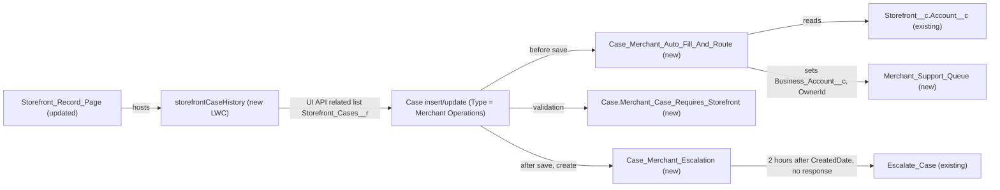

# Implementation spec — Merchant case management

> Link merchant cases to their storefront, fill in the business account, route them to a merchant support queue, escalate them when no agent responds within 2 hours, and show a storefront's last 5 cases on the storefront record page.

_Based on the requirement, the evidence reported by AskCoworker, and read-only org queries where noted. Assumptions and missing evidence are identified below. Specification only — nothing is implemented or deployed._

---

## 1. The requirement

Merchant cases (user decision: `Case.Type` = `Merchant Operations`) must always carry a `Case.Storefront__c`, get `Case.Business_Account__c` filled from the storefront's account, be owned by a new Case queue, be escalated by the existing `Escalate_Case` flow when no agent response (user decision: first outbound email or case comment) exists 2 hours after creation, and a storefront record page component must list the storefront's last 5 cases. The user confirmed all five parts are in scope. The request contained no deploy or data-change instruction.

| # | Responsibility | Trigger | Where it lives |
| --- | --- | --- | --- |
| 1 | Every merchant case is linked to a storefront | Case insert or update with `Type` = `Merchant Operations` | `Case.Merchant_Case_Requires_Storefront` (new validation rule) on existing field `Case.Storefront__c` |
| 2 | Auto-fill the business account from the storefront | Case insert, or update that changes `Storefront__c`, for merchant cases | `Case_Merchant_Auto_Fill_And_Route` (new before-save flow) writing existing field `Case.Business_Account__c` |
| 3 | Route merchant cases to the merchant support queue | Case insert with `Type` = `Merchant Operations` | `Case_Merchant_Auto_Fill_And_Route` sets `Case.OwnerId` to `Merchant_Support_Queue` (new queue) |
| 4 | Escalate when no response within 2 hours | Scheduled path 2 hours after `Case.CreatedDate` | `Case_Merchant_Escalation` (new flow) calling existing `Escalate_Case` |
| 5 | Show the storefront's last 5 cases on the storefront page | Storefront record page load | `storefrontCaseHistory` (new LWC) placed on `Storefront_Record_Page` |

## 2. Grounding — reuse before building

Target org: `TestWriteSpecDE` (Developer Edition, org ID `00Dak00001COqNeEAL`). API version: `67.0`.

- **`Case.Storefront__c`** (CustomField, Lookup(Storefront), relationship `Storefront__r`, child relationship `Storefront_Cases__r`) — the storefront link already exists; nillable. _verified by org query_
- **`Case.Business_Account__c`** (CustomField, Lookup(Account)) — the auto-fill target already exists. _verified by org query_
- **`Storefront__c.Account__c`** (CustomField, Lookup(Account)) — source of the business account; populated on all 21 `Storefront__c` records. _verified by org query_
- **`Case.Type`** (standard picklist) — includes `Merchant Operations`; 0 of 9 cases use it today. Case has no record types. _verified by org query_
- **`Case.Status`** (standard picklist) — active values `New`, `On Hold`, `Escalated`, `Closed`. _verified by org query_
- **`Escalate_Case`** (Flow, AutoLaunchedFlow, active) — inputs `caseId` and `escalationReason`; sets `IsEscalated` = true, `Priority` = `High`, and updates `Description`. It does not set `Status`. _verified by org query_
- **`Storefront_Record_Page`** (FlexiPage, RecordPage on `Storefront__c`) — target page for the component. _verified by org query_
- **Queues** — `Merchant_Messaging_Queue` is enabled only for `MessagingSession`; `Unqualified_Leads` only for `Lead`. No queue is enabled for `Case`. `Merchant_Support` is a `GuestUserGroup`, not a queue. _verified by org query_
- **`Route_Merchant_to_Queue`, `Route_to_Merchant_Support_Agent`** (Flow, RoutingFlow) — Omni-Channel flows for `MessagingSession` work; they do not route Case records. _verified by org query_
- **Existing Case automation** — no Apex triggers on `Case`, `Storefront__c`, `Account`, `EmailMessage`, or `CaseComment`; no record-triggered flows on those objects; no validation rules on `Case` or `Storefront__c`. _verified by org query_
- **`AssignmentRule` "Standard"** (Case, active) — its entries cannot be read with the allowed commands. _verified by org query_
- **`AgentCaseCreateActions`** (ApexClass, `with sharing`) — inserts Case with optional `Type`, `Storefront__c`, `Business_Account__c`, `OwnerId`. _verified by org query_
- **Field-level security** — `Case.Storefront__c`, `Case.Business_Account__c`, and `Case.Type` are readable and editable in `Agentforce_Reference_App`; Case OWD is `ReadEditTransfer`. _verified by org query_
- **Entitlements** — `SlaProcess` "Standard Case" is active with milestone types `First Response to Customer`, `Escalate Case`, `Close Case`, but 0 `Entitlement` records exist. _verified by org query_
- **LWC** — no existing custom LWC lists cases for a storefront (`caseSummaryRenderer` is an agent card). _verified by org query_

Evidence sources: EntityDefinition, FieldDefinition, `sobject describe` (Case, Storefront__c), Group/QueueSobject, FlowDefinitionView and Flow metadata, ApexTrigger, ApexClass bodies, ValidationRule, AssignmentRule, SlaProcess, MilestoneType, Entitlement, BusinessHours, LightningComponentBundle, FlexiPage, FieldPermissions, Organization, DataStream; AskCoworker (D1, D2, I, R, T) returned no citedReferences.

## 3. Architecture

Why the pieces are drawn this way:

1. The before-save flow sets `Business_Account__c` and `OwnerId` on the record being saved, so no extra DML is needed. Salesforce runs before-save flows before custom validation rules, so the validation rule sees the final values.
2. The validation rule is the only way to guarantee "every merchant case" has a storefront, including cases created by `AgentCaseCreateActions` (verified by org query: it can set `Type` without `Storefront__c`).
3. The escalation flow is a record-triggered after-save flow on create with a scheduled path at `CreatedDate` + 2 hours. The scheduled path re-reads the case and looks up `EmailMessage` (`ParentId` = case, `Incoming` = false) and `CaseComment` (`ParentId` = case, `IsPublished` = true); if none exist, `Status` is not `Closed`, `IsEscalated` is false, and `Type` is still `Merchant Operations`, it calls `Escalate_Case` as a subflow. This reuses the existing escalation logic.
4. The LWC uses the UI API `getRelatedListRecords` wire adapter on `Storefront_Cases__r` with page size 5 sorted by `CreatedDate` descending. No Apex controller is needed, and the UI API enforces the viewer's sharing and FLS.
5. No Apex is used for automation; every automation piece is declarative. The only Apex is the test class.

## 4. Metadata changes

**Routing**

- **Create `Merchant_Support_Queue`** — Queue labelled "Merchant Support Queue", supported object `Case`. Members are an open decision (Section 8).

**Automation**

- **Create `Case_Merchant_Auto_Fill_And_Route`** — Record-triggered flow on `Case`, before save, on create and update. Entry: `Type` = `Merchant Operations` and `Storefront__c` is not null. Assignment: `Business_Account__c` = `{!$Record.Storefront__r.Account__c}` on create, or on update when `Storefront__c` changed. On create only: Get Records `Group` where `DeveloperName` = `Merchant_Support_Queue` and `Type` = `Queue`, then set `OwnerId` to that Id; if the queue is not found, the flow faults rather than leaving the case silently unrouted.
- **Create `Case_Merchant_Escalation`** — Record-triggered flow on `Case`, after save, on create. Entry: `Type` = `Merchant Operations`. Scheduled path: 2 hours after `CreatedDate`. Path logic: Get Records `Case` by Id; Get Records `EmailMessage` (`ParentId` = case Id, `Incoming` = false); Get Records `CaseComment` (`ParentId` = case Id, `IsPublished` = true); Decision: no email, no comment, `Status` != `Closed`, `IsEscalated` = false, `Type` = `Merchant Operations`; then Subflow `Escalate_Case` with `caseId` = case Id and `escalationReason` = "No agent response within 2 hours".
- **Create `Case.Merchant_Case_Requires_Storefront`** — Validation rule: `AND(ISPICKVAL(Type, "Merchant Operations"), ISBLANK(Storefront__c))`. Error on field `Storefront__c`: "A Merchant Operations case must be linked to a Storefront."

**UI**

- **Create `storefrontCaseHistory`** — LWC, target `lightning__RecordPage` for `Storefront__c`. Uses `@wire(getRelatedListRecords)` with `parentRecordId` = `recordId`, `relatedListId` = `Storefront_Cases__r`, fields `Case.CaseNumber`, `Case.Subject`, `Case.Status`, `Case.Priority`, `Case.CreatedDate`, `pageSize` 5, `sortBy` `-Case.CreatedDate`. Shows each case number as a link to the case, and an empty state when there are no cases.
- **Update `Storefront_Record_Page`** — Add the `storefrontCaseHistory` component to the page (region to be chosen at build time).

**Tests**

- **Create `MerchantCaseAutomationTest`** — Apex test class covering the before-save flow and the validation rule (see Section 7).

## 5. Data 360 (Data Cloud) data involved

Not applicable — this change does not use Data 360. No `DataStream` records exist in the org (verified by org query).

## 6. Security considerations

- **Flow context.** Both record-triggered flows run in system context without sharing (reported by AskCoworker; this is standard Salesforce behavior for record-triggered flows). The scheduled path runs as the Automated Process user (reported by AskCoworker), so `Escalate_Case` updates the case regardless of the creating user's access.
- **CRUD/FLS.** `Case.Storefront__c`, `Case.Business_Account__c`, and `Case.Type` are already readable and editable in `Agentforce_Reference_App`, and readable in `Pronto_Deep_Dive_Workshop` (verified by org query). No new fields are created, so no permission set change is needed. Permission sets are not the only grant path; profiles may also grant these fields.
- **Queue.** Only queue members (and users with access through Case OWD `ReadEditTransfer`, verified by org query) see the routed cases; membership is an open decision.
- **LWC exposure.** The component uses the UI API, which enforces the viewer's sharing and FLS; users who cannot read a case or a field do not see it. With OWD `ReadEditTransfer`, internal users can see all cases (verified by org query). No Apex controller is added, so no `with sharing` decision is needed.
- **Validation rule impact.** Callers of `AgentCaseCreateActions` that pass `Type` = `Merchant Operations` without a storefront will now receive a validation error (verified by org query of the class inputs; the error behavior is standard validation rule behavior).

## 7. Testing strategy

`MerchantCaseAutomationTest` (Apex, planned):

1. Insert a `Merchant Operations` case with a storefront: `Business_Account__c` equals the storefront's `Account__c` and `OwnerId` is `Merchant_Support_Queue`.
2. Insert a `Merchant Operations` case without a storefront: `DmlException` from `Merchant_Case_Requires_Storefront`.
3. Update a merchant case to clear `Storefront__c`: the validation rule blocks the update.
4. Change `Storefront__c` on a merchant case to another storefront: `Business_Account__c` follows the new storefront's account; `OwnerId` is not changed.
5. Insert a case with `Type` = `Customer Order Issue`: no auto-fill and no queue ownership.
6. Bulk: insert 200 merchant cases across several storefronts; every row gets the right account and queue, with no governor limit errors.

Recommended verification (manual; scheduled paths and LWC wires are not covered by the Apex test above):

1. Create a merchant case and send no response; after 2 hours `IsEscalated` is true and `Priority` is `High`.
2. Create a merchant case and send an outbound email within 2 hours; it is not escalated.
3. Create a merchant case and add a public case comment within 2 hours; it is not escalated. Add only an internal (unpublished) comment; it is escalated.
4. Create a merchant case and close it within 2 hours; it is not escalated.
5. Change a merchant case's `Type` away from `Merchant Operations` within 2 hours; it is not escalated.
6. Open a storefront with 7 cases: the component shows exactly the 5 newest. Open a storefront with no cases: the empty state shows.
7. Create a merchant case through the UI with "Assign using active assignment rule" checked, and confirm the owner is still `Merchant_Support_Queue` (see Section 8, decision 4).

No tests have been run.

## 8. Open decisions

1. **Definition of a merchant case (non-blocking).** Asked; the user had no preference. Default: `Case.Type` = `Merchant Operations` (verified picklist value; there are no Case record types). Other options were "any case with a storefront" or the account's `Partner_Account` record type.
2. **Queue (non-blocking).** Asked; the user had no preference. Default: create a new `Merchant_Support_Queue` for `Case`, because the existing `Merchant_Messaging_Queue` serves Messaging sessions. Alternative: add `Case` as a supported object on `Merchant_Messaging_Queue`.
3. **Queue members (non-blocking).** Not specified. Add the merchant support agents or a public group before go-live; routing works without members, but nobody is notified.
4. **Case assignment rule "Standard" may override the queue owner (non-blocking).** The rule is active (verified by org query) but its entries cannot be read. Assignment rules run after before-save flows when the assignment header or checkbox is used, so a matching entry could reassign merchant cases. Default: review the rule entries in Setup and add or reorder an entry for `Type` = `Merchant Operations` if needed; no change is inventoried.
5. **What counts as a response (user decision).** The first outbound email (`EmailMessage.Incoming` = false) or case comment. Assumption: only published (`IsPublished` = true) comments count, so internal notes do not stop escalation.
6. **2 hours are calendar hours (assumption, non-blocking).** The user did not specify business hours. Default: calendar hours from `CreatedDate`. Using `BusinessHours` "Default" would need an entitlement milestone instead.
7. **Escalated status (assumption, non-blocking).** `Escalate_Case` sets `IsEscalated` and `Priority` but not `Status` = `Escalated` (verified by org query). Default: reuse it unchanged; the requirement does not ask for a status change.
8. **Auto-fill overwrites a manually set business account (assumption, non-blocking).** On create and on storefront change, `Business_Account__c` is set from the storefront. Default: the storefront is the source of truth.
9. **Existing cases (non-blocking).** 4 existing cases have a storefront but no business account, and none are `Merchant Operations` (verified by org query). No backfill is in scope; a backfill would be a data operation for a separate procedure.
10. **Deleted and undeleted cases (non-blocking).** A case deleted and restored before its scheduled path runs may not be escalated (reported by AskCoworker). Accept as a known gap.
11. **Conflict: Apex polling for escalation rejected.** AskCoworker proposed a `Queueable` and a `Schedulable` Apex class because "scheduled paths fire at a fixed clock time and cannot be cancelled". This contradicts documented Salesforce behavior: scheduled paths run at an offset from a record date field, and the path's Decision re-checks conditions at run time. The Apex rows were replaced with the `Case_Merchant_Escalation` scheduled path.
12. **Conflict: Get Records in before-save flows.** AskCoworker stated that before-save flows cannot use Get Records and proposed a Custom Label holding the queue Id. Before-save flows do support Get Records, so the queue is looked up by `DeveloperName` and no Custom Label is added.
13. **Inventory corrections.** Merged AskCoworker's separate after-save routing flow into the before-save flow (OwnerId can be set before save, which avoids a second DML); added the validation rule AskCoworker omitted, because it is needed to guarantee "every merchant case" is linked; dropped the `Agentforce_Reference_App` FLS row because the FLS already exists (verified by org query); dropped AskCoworker's "grant FLS to Pronto_Deep_Dive_Workshop" and "grant LWC access" proposals because Read already exists and an Apex-free LWC needs no grant; dropped the optional Apex controller for the LWC; removed the Type filter from the LWC because the requirement asks for the last 5 cases of any type; removed AskCoworker's "Conditional:" queue-email condition because a queue email is optional.
14. **Standard related list alternative (non-blocking).** A Dynamic Related List on `Storefront_Record_Page` could show 5 cases sorted by date without code. The requirement explicitly asks for an LWC, so the LWC is kept.
15. **Case creators in managed flows (non-blocking).** `CreateCase`, `CreateCaseEnhancedData` (namespace `SvcCopilotTmpl`), and `Create_Case` (namespace `setup_service_experience`) create cases; their logic was not inspected. If they set `Type` = `Merchant Operations` without a storefront, the validation rule will block them.

## 9. Change set

| # | Action | Type | API name | Module | Why |
| --- | --- | --- | --- | --- | --- |
| 1 | Create | Queue | `Merchant_Support_Queue` | Not specified | No Case-enabled queue exists; routing target for merchant cases |
| 2 | Create | Flow | `Case_Merchant_Auto_Fill_And_Route` | Not specified | Fills `Business_Account__c` from the storefront and routes to the queue |
| 3 | Create | Flow | `Case_Merchant_Escalation` | Not specified | Escalates via `Escalate_Case` when there is no response 2 hours after creation |
| 4 | Create | ValidationRule | `Case.Merchant_Case_Requires_Storefront` | force-app/main/default/objects | Guarantees every merchant case is linked to a storefront |
| 5 | Create | LightningComponentBundle | `storefrontCaseHistory` | force-app/main/default/lwc | Shows the storefront's last 5 cases |
| 6 | Update | FlexiPage | `Storefront_Record_Page` | force-app/main/default/flexipages | Places the component on the storefront page |
| 7 | Create | ApexClass | `MerchantCaseAutomationTest` | force-app/main/default/classes | Tests auto-fill, routing, validation, and bulk behavior |

A before-save flow, a validation rule, and a scheduled-path flow on `Case` deliver linking, auto-fill, routing, and escalation, reusing `Escalate_Case`; an Apex-free LWC on `Storefront_Record_Page` shows the last 5 cases.

Total: 7 · Create: 6 · Update: 1 · Delete: 0
