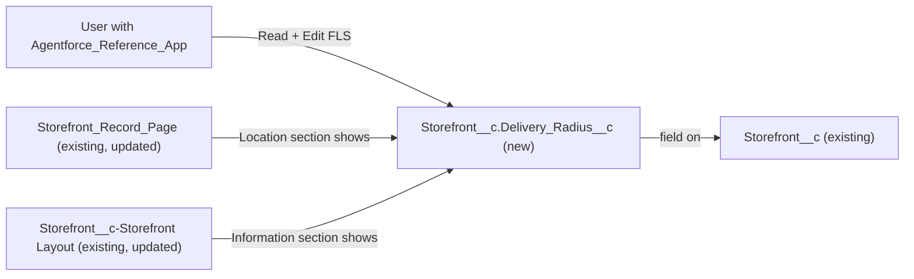

# Implementation spec — Delivery Radius (miles) field on Storefront

> Add a number field that stores each storefront's delivery radius in miles, and make it visible and editable for the users who already edit storefronts.

_Based on the requirement, the evidence reported by AskCoworker, and read-only org queries where noted. Assumptions and missing evidence are identified below. Specification only — nothing is implemented or deployed._

---

## 1. The requirement

The request "add a field" was clarified by the user as a "Delivery Radius (miles)" number field on `Storefront__c` (user decision). The request contained no deploy or data-change instruction.

| # | Responsibility | Trigger | Where it lives |
| --- | --- | --- | --- |
| 1 | Store a storefront's delivery radius in miles | User or API saves a `Storefront__c` record | `Storefront__c.Delivery_Radius__c` (new) |
| 2 | Show the field on the storefront record page and layout | User opens or edits a `Storefront__c` record | `Storefront_Record_Page` and `Storefront__c-Storefront Layout` (existing, updated) |
| 3 | Let users who already edit storefronts read and edit the field | User opens or edits a `Storefront__c` record | `Agentforce_Reference_App` (existing, updated) |

## 2. Grounding — reuse before building

Target org: `TestWriteSpecDE` (Developer Edition, not a sandbox, org ID `00Dak00001COqNeEAL`). API version: `67.0`.

- **`Storefront__c`** (CustomObject) — the target object; exists, no namespace, `DurableId` `01Iak00000Dx4JV`, 21 records, internal sharing model `ReadWrite`, external `Private`. _verified by org query_
- **Storefront fields** — 28 fields, including `Storefront__c.Address__c` (Address) and `Storefront__c.Status__c` (Picklist). None stores a radius, distance, or delivery value. _verified by org query_
- **Same concept elsewhere** — a Tooling `CustomField` search on `Radius`, `Distance`, `Mile`, `Delivery`, and `Range` returned no field that means a storefront delivery radius. The matches are unrelated (for example `Lead.Delivery_Capability__c`, `datamask__Masking_Field__mdt` `Range_Max`/`Range_Min`, and standard-object distance fields). _verified by org query_
- **Automation on `Storefront__c`** — 0 Apex triggers, 0 flows triggered on the object (`FlowDefinitionView`), 0 validation rules. _verified by org query_
- **Apex that reads `Storefront__c`** — `AgentStorefrontActions` (`without sharing`), `AgentGetStorefrontsByAccountActions`, `AgentUpdateStorefrontDetailsActions`, `AgentUpdateStorefrontHoursActions`, `StorefrontPickerController`, `StorefrontPickerAction` (all `with sharing`), and `StorefrontPickerActionTest`. No body contains `Radius` or `FIELDS(`. _verified by org query (classes named `%Storefront%` only; partial)_ AskCoworker reports that these classes use explicit field lists. _reported by AskCoworker_
- **`Storefront__c-Storefront Layout`** (Layout) — the only layout on the object; its "Information" section holds `Address__c`. _verified by org query_
- **`Storefront_Record_Page`** (FlexiPage, RecordPage) — uses Dynamic Forms field sections; its "Location" section holds `Record.Address__c`. _verified by org query_
- **Object access** — `Agentforce_Reference_App` (Regular, no namespace, 1 assignment) and `sfdc_accelerate_dms` (namespace `sfdcInternalInt`) have Read and Edit on `Storefront__c`; `Pronto_Deep_Dive_Workshop` (no namespace), `sfdc_slack` and `sfdc_a360_sfcrm_data_extract` (namespace `sfdcInternalInt`) have Read only. Of two profiles, one has Read only and one has Read and Edit. This list of `ObjectPermissions` rows is complete. _verified by org query_
- **Data 360** — `SELECT COUNT() FROM DataStream` returned 0. _verified by org query_

Evidence sources: `sf org display`; Tooling `EntityDefinition`, `CustomField`, `ValidationRule`, `ApexTrigger`, `ApexClass`, `Layout.Metadata`, `FlexiPage.Metadata`; standard `FieldDefinition`, `FlowDefinitionView`, `ObjectPermissions`, `FieldPermissions`, `PermissionSet`, `PermissionSetAssignment`, `Organization`, `DataStream`, and a record count. AskCoworker returned no citedReferences.

## 3. Architecture

Why the pieces are drawn this way:

1. `Storefront__c.Delivery_Radius__c` is a plain Number field on `Storefront__c`, the object the user named. No formula, roll-up, or automation is needed to store a value (user decision; Rule 4).
2. `Storefront_Record_Page` uses Dynamic Forms (verified by org query), so it does not take field placement from the layout. Both components are updated, and the field is placed next to `Address__c`, the storefront's location.
3. `Agentforce_Reference_App` is the only non-namespaced permission set with Edit on `Storefront__c` (verified by org query). A new custom field has no field-level access until it is granted (assumption (documented platform behavior)).
4. No Apex is used. No existing Apex class references the field, and none is changed.

## 4. Metadata changes

**Schema**

- **Create `Storefront__c.Delivery_Radius__c`** — Number, precision 4, scale 1 (0.0 to 999.9). Label "Delivery Radius (miles)". Not required, no default value; the 21 existing records stay blank. Help text: "Maximum delivery distance from this storefront, in miles."

**UI**

- **Update `Storefront__c-Storefront Layout`** — Add `Delivery_Radius__c` to the "Information" section, after `Address__c`. Depends on the field.
- **Update `Storefront_Record_Page`** — Add `Record.Delivery_Radius__c` to the "Location" field section, after `Record.Address__c`. Depends on the field.

**Access**

- **Update `Agentforce_Reference_App`** — Grant Read and Edit field permission on `Storefront__c.Delivery_Radius__c`. No object permission change (Read and Edit already granted).

## 5. Data 360 (Data Cloud) data involved

Not applicable — this change does not use Data 360. The org has 0 data streams (verified by org query).

## 6. Security considerations

- **Sharing:** `Storefront__c` internal sharing is `ReadWrite` and external is `Private` (verified by org query). Record access does not change. Field-level security is the only control on the new field.
- **CRUD/FLS:** The inventory grants Read and Edit on the field only to `Agentforce_Reference_App` (1 assignment). Profiles and the other permission sets that read `Storefront__c` get no access to the field from this spec; see Section 8.
- **Namespaced permission sets:** `sfdc_accelerate_dms`, `sfdc_slack`, and `sfdc_a360_sfcrm_data_extract` have namespace `sfdcInternalInt` (verified by org query) and are not changed by this spec.
- **Apex context:** `AgentStorefrontActions` runs `without sharing` (verified by org query), but it does not reference the field, so it does not expose it.
- **Data exposure:** The field holds an operational distance, not personal data (assumption).

## 7. Testing strategy

The inventory has no Apex, so no Apex test is added. The following are recommended verification steps, not planned tests:

1. **Save a value:** as a user with `Agentforce_Reference_App`, edit a storefront, set `Delivery_Radius__c` to `12.5`, save, and confirm the value.
2. **Blank value:** save a storefront with `Delivery_Radius__c` blank; the save succeeds because the field is not required.
3. **Boundaries:** `0` and `999.9` save; `1000` is rejected by the field's precision (assumption (documented platform behavior)); a value with two decimals is rounded to one decimal (assumption (documented platform behavior)).
4. **Placement:** the field appears in the "Location" section of `Storefront_Record_Page` and the "Information" section of `Storefront__c-Storefront Layout`.
5. **No access:** a user without `Agentforce_Reference_App` and without profile access does not see the field.
6. **Bulk:** update the 21 existing records through the API or Data Loader in one batch with mixed blank and non-blank values; no automation runs on the object (verified by org query), so no errors are expected.
7. **Regression:** run `StorefrontPickerActionTest` and use the storefront picker and agent storefront actions; they do not reference the field and should behave as before.

## 8. Open decisions

### Open

1. **Read access for other readers (non-blocking).** `Pronto_Deep_Dive_Workshop` and two profiles (one with Edit) have access to `Storefront__c` but get no access to the new field. `sfdc_accelerate_dms` users (Edit on the object) also get no access, and that permission set is namespaced. Recommended default: grant only `Agentforce_Reference_App` now; add Read to `Pronto_Deep_Dive_Workshop`, or a separate permission set for other users, only if the business asks.
2. **Precision (non-blocking).** No preference was given. Default Number(4,1), which allows up to 999.9 miles (assumption). Change the precision before deployment if larger values or finer precision are needed.
3. **Value range rule (non-blocking).** Nothing blocks zero or negative radii. A validation rule such as `AND(NOT(ISBLANK(Delivery_Radius__c)), Delivery_Radius__c <= 0)` is a proposal only, not in the inventory, because the requirement asks only for the field.
4. **Active record page (non-blocking).** Whether `Storefront_Record_Page` is the active Lightning record page for all apps and profiles was not checked (assumption). If another page or the layout alone is in use, users see the field through `Storefront__c-Storefront Layout`.
5. **Deployment sequence (non-blocking).** Deploy `Storefront__c.Delivery_Radius__c` first, or in the same deployment as `Storefront__c-Storefront Layout`, `Storefront_Record_Page`, and `Agentforce_Reference_App`, which reference it. No data backfill is needed; existing records stay blank. The local project does not contain `Storefront__c` source, so the objects must be retrieved before editing.

### Resolved

- **Field and object:** "Delivery Radius (miles)", a number field on `Storefront__c` (user decision, from the clarifying question).
- **Precision corrected:** AskCoworker proposed Number(5,2) and said it allows 99999 miles; precision 5 with scale 2 allows only 999.99. Replaced with Number(4,1) as the default (assumption).
- **Module paths corrected:** AskCoworker gave `objects/Storefront__c/layouts`, `flexiPages`, and `permissionSets`; the standard source folders are `layouts`, `flexipages`, and `permissionsets`.
- **Test rows dropped:** AskCoworker proposed adding methods to `StorefrontPickerActionTest`. The inventory has no Apex, so this change is not needed (Rule 4).
- **Validation rules:** AskCoworker reported them as unknown in D2; a Tooling query found 0 on `Storefront__c`.
- **Sharing model:** AskCoworker reported `ReadWrite` from a prior session; confirmed by org query.

## 9. Change set

| # | Action | Type | API name | Module | Why |
| --- | --- | --- | --- | --- | --- |
| 1 | Create | CustomField | `Storefront__c.Delivery_Radius__c` | force-app/main/default/objects/Storefront__c/fields | Stores the delivery radius in miles (Responsibility 1) |
| 2 | Update | Layout | `Storefront__c-Storefront Layout` | force-app/main/default/layouts | Shows the field on the layout (Responsibility 2) |
| 3 | Update | FlexiPage | `Storefront_Record_Page` | force-app/main/default/flexipages | Dynamic Forms page needs explicit placement (Responsibility 2) |
| 4 | Update | PermissionSet | `Agentforce_Reference_App` | force-app/main/default/permissionsets | Grants Read and Edit on the field to storefront editors (Responsibility 3) |

One new Number field on `Storefront__c`, placed on the existing layout and Dynamic Forms page, and granted through the one editable permission set that already edits storefronts.

Total: 4 · Create: 1 · Update: 3 · Delete: 0
