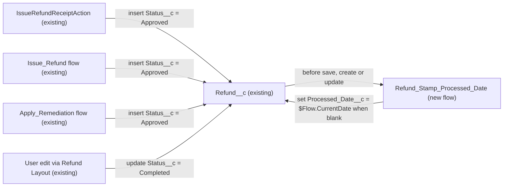

# Implementation spec — Stamp Refund Processed Date on Completion

> Set `Refund__c.Processed_Date__c` to the current date automatically when a refund reaches `Status__c = 'Completed'`, without overwriting an existing date.

_Based on the requirement, the evidence reported by AskCoworker, and read-only org queries where noted. Assumptions and missing evidence are identified below. Specification only — nothing is implemented or deployed._

---

## 1. The requirement

The requirement asks to stamp the processed date automatically when a refund is approved. The user decided that the stamp belongs to the `Completed` status (the money has gone out), not `Approved`, and that the date is set only when `Refund__c.Processed_Date__c` is blank. The request contained no deploy or data-change instruction.

| # | Responsibility | Trigger | Where it lives |
| --- | --- | --- | --- |
| 1 | Set `Refund__c.Processed_Date__c` to the current date when a refund has `Status__c = 'Completed'` | `Refund__c` create or update where `Status__c = 'Completed'` and `Processed_Date__c` is blank | New before-save record-triggered flow `Refund_Stamp_Processed_Date` |
| 2 | Never overwrite an existing `Refund__c.Processed_Date__c` | Same event | Entry condition of `Refund_Stamp_Processed_Date` |

## 2. Grounding — reuse before building

Target org: `TestWriteSpecDE` (Developer Edition, user `epic.2b9dd11f2b2a@orgfarm.salesforce.com`). API version: `67.0`.

- **`Refund__c`** (CustomObject, no namespace, DurableId `01Iak00000Dx4KP`) — the refund record that carries the status and the date. _verified by org query_
- **`Refund__c.Status__c`** (Picklist: `Pending`, `Approved`, `Processing`, `Completed`, `Failed`, `Cancelled`) — `Completed` is the trigger value. _verified by org query_
- **`Refund__c.Processed_Date__c`** (Date, updateable, nillable, description "The date the refund was processed/completed") — the stamp target. It already exists, so no new field is needed. _verified by org query_
- **`Refund__c.Issue_Date__c`** (Date) — already set to today by every creator; it is not the processed date and is not changed. _verified by org query_
- **No existing automation on `Refund__c`** — zero Apex triggers (Tooling `ApexTrigger`), zero record-triggered flows (`FlowDefinitionView`), zero validation rules (Tooling `ValidationRule`). _verified by org query_
- **`IssueRefundReceiptAction`** (ApexClass, `with sharing`) — inserts `Refund__c` with `Status__c = 'Approved'` and `Issue_Date__c = Date.today()`; does not reference `Processed_Date__c`. _verified by org query_
- **`Issue_Refund`** and **`Apply_Remediation`** (active autolaunched Flows) — each has a `Create_Refund` element that inserts `Refund__c` with `Status__c = 'Approved'` and `Issue_Date__c = $Flow.CurrentDate`; neither sets `Processed_Date__c`. AskCoworker did not report these flows; they were found through `MetadataComponentDependency`. _verified by org query_
- **`Refund Layout`** (Layout) — the only component that references `Refund__c.Processed_Date__c`; it also references `Status__c`. _verified by org query_
- **No existing flow named `Refund_Stamp_Processed_Date`** or any `FlowDefinition` starting with `Refund`. _verified by org query_
- **Field permissions on `Refund__c.Processed_Date__c`** — Edit in `Agentforce_Reference_App`, `Pronto_Deep_Dive_Workshop`, `sfdc_accelerate_dms`; Read only in `sfdc_a360_sfcrm_data_extract`, `sfdc_slack`. The same three permission sets have Edit on `Status__c`. _verified by org query_
- **Data shape** — `Refund__c` has 0 records, so no backfill is needed. _verified by org query_

Evidence sources: `sf org display`; `sf sobject describe Refund__c`; Tooling `EntityDefinition`, `CustomField`, `ApexTrigger`, `ValidationRule`, `FlowDefinition`, `Flow.Metadata`, `ApexClass.Body`, `MetadataComponentDependency`; standard `FlowDefinitionView`, `FieldPermissions`, `COUNT()` and `GROUP BY` on `Refund__c`. AskCoworker returned no citedReferences.

## 3. Architecture

Why the pieces are drawn this way:

1. The three creators insert refunds as `Approved` (verified by org query). With the user decision, inserts as `Approved` do not match the entry condition, so they do not stamp.
2. No component in the org sets `Status__c = 'Completed'` (verified by org query: the only `Status__c` references are the three creators and `Refund Layout`). The move to `Completed` is therefore a user edit or an external API update. The user-edit edge is an inference from the layout reference (assumption).
3. `Refund_Stamp_Processed_Date` is a before-save record-triggered flow. A before-save flow changes `$Record` in the same save without extra DML (documented Salesforce behavior). A flow is chosen over Apex because the logic is one conditional field assignment; no code is needed.

## 4. Metadata changes

**Automation**

- **Create `Refund_Stamp_Processed_Date`** — Record-triggered Flow on `Refund__c`, trigger "A record is created or updated", optimized for Fast Field Updates (before save). Entry conditions (all must be true): `{!$Record.Status__c}` Equals `Completed`; `{!$Record.Processed_Date__c}` Is Null `true`. When to run: every time a record is updated and meets the condition. One Assignment element sets `{!$Record.Processed_Date__c}` = `{!$Flow.CurrentDate}`. Status Active. No other elements.

## 5. Data 360 (Data Cloud) data involved

Not applicable — this change does not use Data 360. AskCoworker reported that no Data Stream uses `Refund__c` (from a "prior session"); the allowed query on `DataStreamDefinition` failed ("sObject type not supported"), so this is _reported by AskCoworker_ only. `sfdc_a360_sfcrm_data_extract` has Read on `Refund__c.Processed_Date__c` (verified by org query), so any existing extract would receive the stamped value without a change.

## 6. Security considerations

- **Execution context.** A record-triggered flow runs in system context without sharing (documented Salesforce behavior). The stamp is set whatever the running user's field-level security on `Processed_Date__c`.
- **CRUD/FLS.** The user who changes `Status__c` to `Completed` needs Edit on `Refund__c` and on `Refund__c.Status__c`. Today that comes from `Agentforce_Reference_App`, `Pronto_Deep_Dive_Workshop`, and `sfdc_accelerate_dms` (verified by org query). Permission sets are not the only grant path; profiles can also grant it.
- **Permission set changes.** None. No new field, so no new FLS is required.
- **Data exposure.** No new data is exposed. `Processed_Date__c` keeps its current Read grants (verified by org query).
- **Manual edits.** Users with Edit on `Processed_Date__c` can still set or clear it by hand. The flow does not lock the field (see Section 8).

## 7. Testing strategy

The inventory has no Apex test class. Flows do not count toward the 75% Apex coverage requirement. The cases below are recommended verification, run in a sandbox or scratch org, or as Flow tests if the team adds them (Section 8).

| # | Case | Setup | Expected |
| --- | --- | --- | --- |
| 1 | Happy path | Insert `Approved`, update to `Completed` | `Processed_Date__c` = today |
| 2 | Never overwrite | `Processed_Date__c` = yesterday, update to `Completed` | Date stays yesterday |
| 3 | Create as `Completed` | Insert with `Status__c = 'Completed'`, blank date | `Processed_Date__c` = today |
| 4 | Negative: other statuses | Update to `Approved`, `Processing`, `Failed`, `Cancelled` | Date stays blank |
| 5 | Existing creators | Run `IssueRefundReceiptAction`, `Issue_Refund`, `Apply_Remediation` | Refund created as `Approved`; date stays blank |
| 6 | Re-save | Save a `Completed` record with a date again | Date unchanged |
| 7 | Bulk | Update 200 records to `Completed` in one call | All 200 stamped; no limit errors |
| 8 | Permission | As a user with `sfdc_slack` Read-only FLS on `Processed_Date__c` but Edit on `Status__c` via another grant, update to `Completed` | Date stamped (system context) |
| 9 | Delete and undelete | Delete a stamped record, then undelete | Date is preserved; the flow does not run on undelete |

These tests have not been run.

## 8. Open decisions

1. **Trigger status (user decision).** The requirement says "approved". The field description says "processed/completed", and all three creators already insert as `Approved` (verified by org query), so stamping on `Approved` would equal `Issue_Date__c`. The user chose `Completed` and "only set if blank".
2. **Create path kept (non-blocking).** AskCoworker proposed an update-only flow with a `$Record__Prior.Status__c` check, and later suggested dropping the create trigger. Correction: the flow runs on create and update, because no validation rule stops an insert with `Status__c = 'Completed'` (verified by org query), and the blank-date guard already prevents overwrites. The prior-value check is not needed and was dropped.
3. **Apex test class not added (non-blocking).** AskCoworker marked an Apex test class as blocking for 75% coverage. That contradicts documented Salesforce behavior: the 75% rule applies to Apex, and this inventory has no Apex. Flow test coverage is required only in production orgs that deploy flows as active with the flow coverage setting on. Recommended default: no test class; add Flow tests if the target production org requires flow coverage.
4. **What sets `Completed` (non-blocking).** No component in the org sets `Status__c = 'Completed'` (verified by org query). The stamp fires for whatever process does it (user edit or API). Building that transition is out of scope.
5. **Cleared date re-stamped (non-blocking).** If a user clears `Processed_Date__c` on a `Completed` record and saves, the flow stamps today again. Recommended default: accept.
6. **Status moves off `Completed` (non-blocking).** The date is kept if the status later changes (for example to `Failed`). Recommended default: accept; clearing it is not in the requirement.
7. **Time zone (non-blocking).** `$Flow.CurrentDate` uses the running user's time zone (assumption about platform behavior). Recommended default: accept.
8. **Module path (assumption).** `force-app/main/default/flows` does not exist locally yet; the path follows the default package directory in `sfdx-project.json` and the standard source layout.
9. **Data 360 (assumption).** Not verifiable with the allowed queries; see Section 5.

## 9. Change set

| # | Action | Type | API name | Module | Why |
| --- | --- | --- | --- | --- | --- |
| 1 | Create | Flow | `Refund_Stamp_Processed_Date` | force-app/main/default/flows | Stamps `Refund__c.Processed_Date__c` with the current date when `Status__c` is `Completed` and the date is blank |

One before-save record-triggered flow on `Refund__c` sets the existing `Processed_Date__c` field; no new fields, code, or permission changes.

Total: 1 · Create: 1 · Update: 0 · Delete: 0
