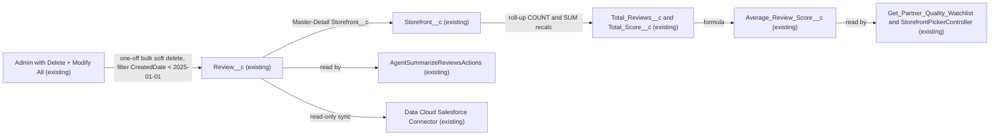

# Implementation spec — Review test data cleanup (records created before 2025)

> Define a safe, reviewable procedure for removing `Review__c` test records created before 2025, and confirm that no metadata changes are needed.

_Based on the requirement, the evidence reported by AskCoworker, and read-only org queries where noted. Assumptions and missing evidence are identified below. Specification only — nothing is implemented or deployed._

---

## 1. The requirement

Remove old test `Review__c` records, defined in the request as records created before 2025. The request to run `sf data delete bulk` directly was not carried out, because this process produces a specification only and never changes org data. The user had no preference between a zero-change procedure and new cleanup components, so the recommended default applies: a zero-change spec that documents the cleanup procedure (user decision).

| # | Responsibility | Trigger | Where it lives |
| --- | --- | --- | --- |
| 1 | Identify `Review__c` records to remove (`CreatedDate < 2025-01-01T00:00:00Z`) | Manual, before cleanup | Read-only SOQL query (Section 7) |
| 2 | Delete the identified records | Manual one-off data operation, run by an authorized admin | `sf data delete bulk` (outside this spec; not run) |
| 3 | Recalculate parent review totals | Platform, on child delete | `Storefront__c.Total_Reviews__c`, `Storefront__c.Total_Score__c` (roll-up summaries) |
| 4 | Refresh the stored review summary text | Not specified | `Storefront__c.Review_Summary__c` (plain text, no automation) |

## 2. Grounding — reuse before building

Target org: `TestWriteSpecDE` (Developer Edition, org ID `00Dak00001COqNeEAL`). API version: `67.0`.

- **Record volume** — `Review__c` holds 92 records, all created at `2026-08-27T19:22:20Z`, across 19 `Storefront__c` parents. **0 records** have `CreatedDate < 2025-01-01T00:00:00Z`. `Order_Date__c` values are also all in 2026. The cleanup as requested matches no records today. _verified by org query_
- **`Review__c`** (CustomObject) — deletable. Fields: `Storefront__c`, `Comments__c`, `Customer__c`, `Order_Date__c`, `Rating__c`, `Status__c` (picklist: `Submitted`, `Published`). No custom child objects. _verified by org query_
- **No test-data marker** — `Review__c` has no field that identifies a record as test data. `CreatedDate` is the only available proxy. _verified by org query_
- **`Review__c.Storefront__c`** (CustomField, Master-Detail to `Storefront__c`, cascade delete) — deleting a review recalculates parent roll-ups. _verified by org query_
- **`Review__c.Customer__c`** (CustomField, Lookup to `Contact`) — deletion does not affect the `Contact`. _verified by org query_
- **`Storefront__c.Total_Reviews__c`** (CustomField, roll-up COUNT of `Review__c`, no filter) and **`Storefront__c.Total_Score__c`** (CustomField, roll-up SUM of `Review__c.Rating__c`, no filter) — decrease automatically on delete. _verified by org query_
- **`Storefront__c.Average_Review_Score__c`** (CustomField, formula `Total_Score__c / Total_Reviews__c`, `BlankAsZero`) — for storefronts with zero reviews the value is blank (null), not 0. Two of 21 storefronts are in that state today. _verified by org query_
- **`Storefront__c.Review_Summary__c`** (CustomField, Long Text Area, not calculated) — does not update when reviews are deleted. _verified by org query_
- **Automation** — no Apex triggers, no record-triggered flows, and no validation rules on `Review__c` or `Storefront__c`. No purge or cleanup Apex class exists. _verified by org query_
- **Delete access** — Delete and Modify All on `Review__c` are granted by permission sets `Agentforce_Reference_App` and `sfdc_accelerate_dms` and by the System Administrator profile. _verified by org query_
- **`sfdc_a360_sfcrm_data_extract`** (PermissionSet, Data Cloud Salesforce Connector) — Read on `Review__c`, no Delete. _verified by org query_
- **`AgentSummarizeReviewsActions`** (ApexClass, `with sharing`) — reads `Review__c` by `Storefront__c` and an `Order_Date__c` window. **`AgentReviewActions`** (ApexClass) — inserts `Review__c`. Existence verified by org query; behavior reported by AskCoworker.
- **`Get_Partner_Quality_Watchlist`** (Flow, autolaunched) — reads `Storefront__c` by `Average_Review_Score__c`. **`StorefrontPickerController`** (ApexClass) — shows `Average_Review_Score__c`. _reported by AskCoworker_

Evidence sources: `sf org display`; `sf sobject describe` on `Review__c` and `Storefront__c`; SOQL counts grouped by `CALENDAR_YEAR(CreatedDate)` and `CALENDAR_YEAR(Order_Date__c)`; Tooling `ApexTrigger`, `ValidationRule`, `CustomField.Metadata`, `ApexClass`; `FlowDefinitionView`; `ObjectPermissions`; `CronTrigger`. AskCoworker returned no citedReferences.

## 3. Architecture

Why the pieces are drawn this way:

1. The admin node represents a user holding `Agentforce_Reference_App`, `sfdc_accelerate_dms`, or the System Administrator profile, the only grants with Delete on `Review__c` (verified by org query).
2. `Review__c` to `Storefront__c` is the Master-Detail relationship on `Review__c.Storefront__c` (verified by org query).
3. The roll-up and formula edges come from the `CustomField` metadata of `Total_Reviews__c`, `Total_Score__c`, and `Average_Review_Score__c` (verified by org query).
4. The read edges to `Get_Partner_Quality_Watchlist`, `StorefrontPickerController`, and `AgentSummarizeReviewsActions` are reported by AskCoworker.
5. The Data Cloud edge is the Read grant on `sfdc_a360_sfcrm_data_extract` (verified by org query). No trigger or flow fires on delete, so no other node is drawn.

## 4. Metadata changes

No metadata changes are required.

The cleanup is a one-off data operation. Existing permissions, the Master-Detail roll-ups, and the absence of delete-time automation already support it. Today it would affect 0 records.

## 5. Data 360 (Data Cloud) data involved

Data 360 reads `Review__c` through the Data Cloud Salesforce Connector permission set `sfdc_a360_sfcrm_data_extract` (Read only; verified by org query). AskCoworker reports that deleted records are removed from the data stream on the next sync, which changes any segment or calculated insight that uses review data. No Data 360 metadata change is needed. Which Data 360 objects consume `Review__c` data is Not specified.

## 6. Security considerations

- **Execution context.** `sf data delete bulk` runs as the authenticated CLI user. That user needs Delete and Modify All on `Review__c`, granted today by `Agentforce_Reference_App`, `sfdc_accelerate_dms`, or the System Administrator profile (verified by org query). Permission sets and profiles are not the only grant paths; permission set groups and sharing can also grant access.
- **CRUD/FLS.** Deleting a Master-Detail child needs Delete on `Review__c` only, not on `Storefront__c`. FLS does not govern record deletion (reported by AskCoworker).
- **Hard delete.** `--hard-delete` needs the "Bulk API Hard Delete" user permission and cannot be undone (reported by AskCoworker). Soft delete is the recommended default (Section 8).
- **Data exposure.** No new exposure. Soft-deleted records stay in the Recycle Bin for 15 days, visible to their owners and to admins (reported by AskCoworker). `Review__c.Comments__c` and `Review__c.Customer__c` may hold customer data; confirm that no retention rule requires keeping them.
- **Guardrail.** Run the cleanup in a sandbox or scratch org first, and only after the pre-delete count in Section 7 is reviewed.

## 7. Testing strategy

The inventory contains no test components, and no tests were run. All cases below are recommended verification for whoever runs the cleanup.

**Before the cleanup**

1. `SELECT COUNT() FROM Review__c WHERE CreatedDate < 2025-01-01T00:00:00Z` — confirm the number of records to delete. It returns 0 today (verified by org query); if it is still 0, do not run the delete.
2. `SELECT Storefront__c, COUNT(Id) FROM Review__c WHERE CreatedDate < 2025-01-01T00:00:00Z GROUP BY Storefront__c` — list affected storefronts.
3. Record `Total_Reviews__c`, `Total_Score__c`, and `Average_Review_Score__c` for each affected storefront as a baseline.
4. Identify storefronts where every review would be deleted. After the delete, their `Average_Review_Score__c` becomes blank (verified by org query on the two storefronts that have zero reviews today).

**After the cleanup**

5. Rerun query 1; it returns 0.
6. Requery the three `Storefront__c` fields; totals decrease by exactly the deleted count and rating sum.
7. Check `Storefront__c.Review_Summary__c` on affected storefronts; it still holds the old text and needs a refresh (Section 8).
8. For soft delete, confirm the records are in the Recycle Bin. Undelete one record in a sandbox and confirm the roll-ups return to their prior values.
9. Run `AgentSummarizeReviewsActions` and `Get_Partner_Quality_Watchlist` for an affected storefront; results match the remaining records.

**Bulk.** The Bulk API processes records in batches; for large volumes, confirm the roll-up values after the job completes.

## 8. Open decisions

1. **Definition of test data (blocking before any real cleanup).** No field marks a `Review__c` record as test data, and `CreatedDate < 2025-01-01` matches 0 records (verified by org query). All 92 records were loaded at one instant on 2026-08-27, so the "old test reviews" the user wants removed may not be identifiable by date at all. Recommended default: confirm with the business owner which records are test data (for example, a list of storefronts, a loading user via `CreatedById`, or the 2026-08-27 load) before running any delete.
2. **Date field for the cutoff (non-blocking).** `CreatedDate` (system-stamped) or `Order_Date__c` (user-entered). Both have no values before 2025 (verified by org query). Recommended default: `CreatedDate`.
3. **Soft delete or hard delete (non-blocking).** Recommended default: soft delete (the `sf data delete bulk` default), so records can be restored for 15 days. Hard delete only after the soft-delete result is confirmed.
4. **Stale `Storefront__c.Review_Summary__c` (non-blocking).** The field is plain text and does not update when reviews are deleted (verified by org query). Recommended default: regenerate or clear it on affected storefronts after the cleanup as a data task; no metadata change.
5. **Storefronts left with no reviews (non-blocking).** Their `Average_Review_Score__c` becomes blank. AskCoworker reported it becomes 0 because of `BlankAsZero`; an org query on the two storefronts that have zero reviews today shows blank, so the org query wins. Blank values may change `Get_Partner_Quality_Watchlist` results. Recommended default: accept the blank value and review affected storefronts after the cleanup.
6. **Validation rules not reported by AskCoworker (non-blocking).** AskCoworker reported validation rules as unknown; a Tooling query found none on either object (verified by org query).
7. **Repeatable cleanup (non-blocking).** A test-data marker field on `Review__c` or a scheduled purge batch would make future cleanups precise. AskCoworker proposed both as alternatives only; they are not in the inventory, per the recommended default the user accepted.
8. **Execution of the delete (non-blocking).** The request asked for `sf data delete bulk` to be run directly. It was not run; this spec does not change org data. An authorized admin runs it after decision 1 is resolved.

## 9. Change set

| # | Action | Type | API name | Module | Why |
| --- | --- | --- | --- | --- | --- |

No metadata changes are required. The cleanup is a one-off data deletion on `Review__c` that relies on existing permissions and the existing Master-Detail roll-ups to `Storefront__c`.

Total: 0 · Create: 0 · Update: 0 · Delete: 0
