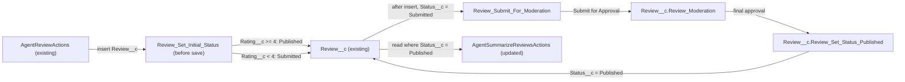

# Implementation spec — Rating-based review publishing and moderation

> Publish `Review__c` records rated 4 or 5 immediately, and hold records rated 1 to 3 for moderator approval before they are returned to customers.

_Based on the requirement, the evidence reported by AskCoworker, and read-only org queries where noted. Assumptions and missing evidence are identified below. Specification only — nothing is implemented or deployed._

---

## 1. The requirement

The requirement contradicts itself ("published immediately" and "approved by moderation before anyone can see it"); the user resolved it as follows: reviews rated 4 or 5 publish immediately, and reviews rated 1 to 3 require moderation approval before they are visible (user decision). The request contained no deploy or data-change instruction.

| # | Responsibility | Trigger | Where it lives |
| --- | --- | --- | --- |
| 1 | Set `Review__c.Status__c` to `Published` for ratings of 4 or more, otherwise `Submitted` | `Review__c` insert (before save) | `Review_Set_Initial_Status` (new Flow) |
| 2 | Submit reviews with status `Submitted` for moderation | `Review__c` insert (after save) | `Review_Submit_For_Moderation` (new Flow) |
| 3 | Route the review to a moderator; on approval set `Status__c` to `Published` | Submit for Approval | `Review__c.Review_Moderation` (new ApprovalProcess), `Review__c.Review_Set_Status_Published` (new WorkflowFieldUpdate) |
| 4 | Return only published reviews to customers | Agent action call | `AgentSummarizeReviewsActions` (existing ApexClass, updated) |
| 5 | Test the behaviors above | Apex test run | `AgentActionsTest` (existing ApexClass, updated) |

## 2. Grounding — reuse before building

Target org: `TestWriteSpecDE` (connected; user `epic.2b9dd11f2b2a@orgfarm.salesforce.com`). API version: `67.0`.

- **`Review__c`** (CustomObject, no namespace, DurableId `01Iak00000Dx4JW`) — the review record. Master-Detail child of `Storefront__c` through `Review__c.Storefront__c`; sharing model `ControlledByParent`. _verified by org query_
- **`Review__c.Status__c`** (Picklist) — values `Submitted` and `Published` only; no default value. This field carries the published state. _verified by org query_
- **`Review__c.Rating__c`** (Number) — the rating the publish rule uses. _verified by org query_
- **Existing data** — all 92 `Review__c` records have `Status__c` = null; 52 have `Rating__c >= 4`, 40 have `Rating__c < 4`, none have a null rating. _verified by org query_
- **Automation on `Review__c`** — no Apex triggers, no record-triggered flows (`FlowDefinitionView`), no validation rules, and no approval processes (`ProcessDefinition`). _verified by org query_
- **`AgentReviewActions`** (ApexClass, `with sharing`) — the only creator found; sets `Status__c = 'Submitted'` on insert. It stays unchanged; the before-save flow overrides the status for high ratings. _verified by org query_
- **`AgentSummarizeReviewsActions`** (ApexClass, `with sharing`) — the customer-facing read path; queries `Review__c` by `Storefront__c` and `Order_Date__c` with no `Status__c` filter. No `WITH USER_MODE`, `WITH SECURITY_ENFORCED`, or `stripInaccessible` in either class. _verified by org query_
- **`MetadataComponentDependency` on `Review__c`** — only `AgentReviewActions` and `AgentSummarizeReviewsActions` reference the object. _verified by org query_
- **`AgentActionsTest`** (ApexClass) — contains `reviewCreate_returnsDtos` (rating 5, no status assertion); no test method calls `AgentSummarizeReviewsActions`. _verified by org query_
- **`Storefront__c.Total_Reviews__c`** (COUNT) and **`Storefront__c.Total_Score__c`** (SUM of `Review__c.Rating__c`) — roll-ups with no filter; feed `Storefront__c.Average_Review_Score__c`, the `Storefront__c-Storefront Layout`, and the `Partner Quality Watchlist` flow. _verified by org query_
- **`Storefront__c`** internal sharing `ReadWrite`, external `Private`. _verified by org query_
- **`Agentforce_Reference_App`** (PermissionSet) — Read and Edit on `Review__c`, no Create; Read on `Review__c.Status__c`. _verified by org query_
- **Data Cloud** — a `default` DataSpace exists, no data streams or calculated insights; `sfdc_a360_sfcrm_data_extract` has Read on `Review__c`. _reported by AskCoworker_

Evidence sources: Tooling `EntityDefinition`, `ApexTrigger`, `ValidationRule`, `ApexClass` bodies, `CustomField.Metadata`, `MetadataComponentDependency`; standard `FlowDefinitionView`, `ProcessDefinition`, `ObjectPermissions`, `FieldPermissions`, aggregate `Review__c` counts; `sobject describe` of `Review__c` and `Storefront__c`. AskCoworker returned no citedReferences.

## 3. Architecture

Why the pieces are drawn this way:

1. `AgentReviewActions` is the only creator found and sets `Submitted` (verified by org query). It is not changed, so the rule also covers records created through other paths.
2. `Review_Set_Initial_Status` is a before-save flow because it updates only the triggering record; this avoids a second DML. It runs on create only.
3. `Review_Submit_For_Moderation` is an after-save flow because Submit for Approval needs a saved record Id. Its entry condition is `Status__c = 'Submitted'`, so reviews rated 4 or 5 never enter moderation.
4. `Review__c.Review_Moderation` supplies routing, record locking, and approval history without code. Its final approval action is `Review__c.Review_Set_Status_Published`.
5. `AgentSummarizeReviewsActions` is the only customer-facing read path found (verified by org query). Because `Review__c` sharing is `ControlledByParent`, sharing cannot hide single reviews, so the filter belongs in the query. This is an existing Apex class, so the change is Apex; no declarative feature filters an Apex query.

## 4. Metadata changes

**Automation**

- **Create `Review_Set_Initial_Status`** — Record-triggered Flow on `Review__c`, before save, on create. Decision: `Rating__c >= 4` sets `Status__c = 'Published'`; otherwise (including a null rating) sets `Status__c = 'Submitted'`.
- **Create `Review_Submit_For_Moderation`** — Record-triggered Flow on `Review__c`, after save, on create, entry condition `Status__c = 'Submitted'`. Action: Submit for Approval with process `Review__c.Review_Moderation`.
- **Create `Review__c.Review_Moderation`** — ApprovalProcess on `Review__c`. Entry criteria: `Status__c = 'Submitted'`. One step; approver is a named user (see Section 8). Record locked while pending. Final approval action: `Review__c.Review_Set_Status_Published`, then unlock. Final rejection: unlock; `Status__c` stays `Submitted`.
- **Create `Review__c.Review_Set_Status_Published`** — WorkflowFieldUpdate on `Review__c` that sets `Status__c` to `Published`. Used only by `Review__c.Review_Moderation`.

**Apex**

- **Update `AgentSummarizeReviewsActions`** — add `AND Status__c = 'Published'` to the `Review__c` query `WHERE` clause so unmoderated reviews are not returned.

**Tests**

- **Update `AgentActionsTest`** — add test methods for both flows, the approval path, and the `AgentSummarizeReviewsActions` filter (see Section 7).

## 5. Data 360 (Data Cloud) data involved

Not applicable — this change does not use Data 360. AskCoworker reports a `default` DataSpace with no data streams; if a future stream syncs `Review__c`, unmoderated reviews would sync too (Section 8).

## 6. Security considerations

- **Execution context.** Both record-triggered flows run in system context. The approval field update runs in system context. `AgentSummarizeReviewsActions` stays `with sharing`; it does not enforce FLS on its query (verified by org query), so the new `Status__c` filter does not need a new FLS grant.
- **Sharing.** `Review__c` sharing is `ControlledByParent` and `Storefront__c` internal sharing is `ReadWrite` (verified by org query). Internal users can still see unmoderated reviews in list views, reports, and the UI. The requirement's visibility rule is enforced for customers on the `AgentSummarizeReviewsActions` read path only.
- **CRUD/FLS.** No permission set change is in the inventory. The approver needs Read access to `Review__c` through `Storefront__c`; internal `ReadWrite` sharing provides it (verified by org query).
- **Data exposure.** Unmoderated ratings still count in the `Storefront__c.Total_Reviews__c` and `Storefront__c.Total_Score__c` roll-ups and in `Storefront__c.Average_Review_Score__c` (Section 8).

## 7. Testing strategy

Planned test methods in `AgentActionsTest`:

- Insert with `Rating__c` 5 and 4: `Status__c = 'Published'`; no `ProcessInstance` created.
- Insert with `Rating__c` 3 and 1: `Status__c = 'Submitted'`; one pending `ProcessInstance` exists.
- Approve the pending work item through `Approval.ProcessWorkitemRequest`: `Status__c = 'Published'`.
- Reject the pending work item: `Status__c` stays `Submitted`.
- `AgentSummarizeReviewsActions` with a mix of `Published` and `Submitted` reviews returns only the `Published` ones; with none published it returns an empty result without an exception.
- Bulk: insert 200 reviews (100 rated 4 or more, 100 rated below 4) in one DML; assert 100 `Published`, 100 `Submitted`, and 100 pending approvals.
- Existing `reviewCreate_returnsDtos` (rating 5) keeps passing; add an assertion that its status is `Published`.

Recommended verification (no planned test): run `AgentReviewActions` as an agent user with ratings 5 and 2 and confirm the moderator receives only the second; confirm locked records cannot be edited by non-approvers. Delete, undelete, and reparenting need no test: no automation runs on delete or undelete, and reparenting of the Master-Detail field was not checked (reported by AskCoworker as not allowed).

## 8. Open decisions

1. **Contradictory requirement (resolved, user decision).** The user chose: ratings 4 to 5 publish immediately; ratings 1 to 3 require moderation.
2. **Existing reviews with null status (non-blocking; required before deployment).** All 92 records have `Status__c` = null (verified by org query). After the filter, none are returned. User had no preference. Recommended default: a separate data task, outside this spec, sets the 52 records rated 4 or more to `Published` and the 40 rated below 4 to `Submitted` and submits them for approval. This spec does not change data.
3. **Approver (non-blocking).** User had no preference. Default: a named user chosen at build time. AskCoworker proposed a queue; `Review__c` is a Master-Detail child and has no owner, so a queue cannot be used. Conflict recorded; queue rejected.
4. **Rejected state (non-blocking).** No `Rejected` picklist value exists. Default: rejected reviews stay `Submitted` and hidden. AskCoworker also referred to a `Pending_Moderation` value that does not exist (verified by org query); dropped. Proposal: add a `Rejected` value if the business needs to report rejections.
5. **Rating edited after creation (non-blocking).** Both flows run on create only. Default: editing a published review's rating does not send it to moderation. Not specified by the user.
6. **Roll-ups include unmoderated ratings (non-blocking).** `Storefront__c.Total_Reviews__c` and `Storefront__c.Total_Score__c` have no filter (verified by org query). Proposal, not in inventory: add a `Status__c = Published` filter to both roll-ups if the average score must exclude unmoderated reviews.
7. **Internal visibility (non-blocking).** Internal users can still read unmoderated reviews because of `ControlledByParent` sharing. Default: the rule applies to the customer-facing agent read path only.
8. **`Agentforce_Reference_App` lacks Create on `Review__c` (non-blocking).** Verified by org query. AskCoworker called this blocking; it predates this requirement and is not in scope. No grant proposed.
9. **Inventory corrections.** AskCoworker's first inventory added `Pending_Moderation` and `Rejected` values, a default value, and a `Review_Moderator` permission set; all were dropped under Rule 4 (not requested; approver access comes from sharing). AskCoworker stated approvers need Edit on `Review__c` and that the query filter needs Read FLS; the verified class has no FLS enforcement, and approval requires record read access — conflicts recorded, no grant added.
10. **Approval submission limit (non-blocking).** AskCoworker reports a limit of 1,000 approval submissions per transaction; not verified by org query. Agent-driven creation is one record at a time.
11. **Review summary field (non-blocking).** `Storefront__c.Review_Summary__c` is read by the `Partner Quality Watchlist` flow; its writer was not identified. If it is generated from all reviews, it may include unmoderated text. Not specified.

## 9. Change set

| # | Action | Type | API name | Module | Why |
| --- | --- | --- | --- | --- | --- |
| 1 | Create | Flow | `Review_Set_Initial_Status` | force-app/main/default/flows | Publish ratings 4 to 5 immediately; mark others `Submitted` |
| 2 | Create | Flow | `Review_Submit_For_Moderation` | force-app/main/default/flows | Send `Submitted` reviews to moderation automatically |
| 3 | Create | ApprovalProcess | `Review__c.Review_Moderation` | force-app/main/default/approvalProcesses | Moderator approval with locking and history |
| 4 | Create | WorkflowFieldUpdate | `Review__c.Review_Set_Status_Published` | force-app/main/default/workflows | Set `Published` on final approval |
| 5 | Update | ApexClass | `AgentSummarizeReviewsActions` | force-app/main/default/classes | Return only published reviews to customers |
| 6 | Update | ApexClass | `AgentActionsTest` | force-app/main/default/classes | Cover flows, approval, and filter |

Two record-triggered flows set the initial status by rating and submit low-rated reviews to an approval process, and the customer read path returns only published reviews.

Total: 6 · Create: 4 · Update: 2 · Delete: 0
