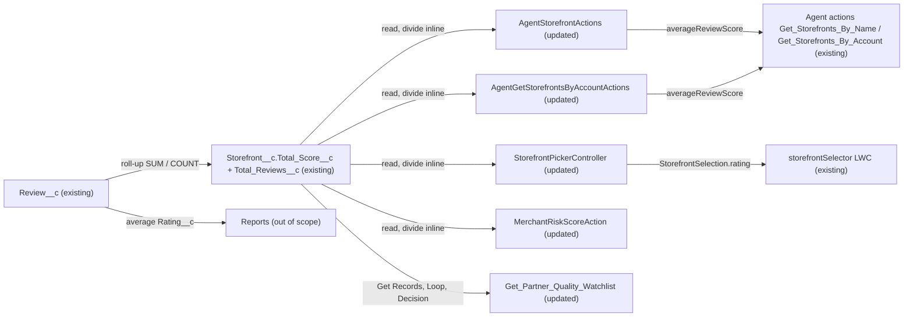

# Implementation spec — Remove Storefront Average Review Score field

> Delete `Storefront__c.Average_Review_Score__c` and move its four Apex readers, one flow, and one layout onto the retained roll-ups `Storefront__c.Total_Score__c` and `Storefront__c.Total_Reviews__c`, so the average is computed where it is needed (including reports).

_Based on the requirement, the evidence reported by AskCoworker, and read-only org queries where noted. Assumptions and missing evidence are identified below. Specification only — nothing is implemented or deployed._

---

## 1. The requirement

Remove the formula field `Storefront__c.Average_Review_Score__c`; the business will compute the average review score in reports instead. By user decision, the roll-ups `Storefront__c.Total_Score__c` and `Storefront__c.Total_Reviews__c` stay, and no report is built as part of this spec (the report is a separate deliverable). Because an active flow, a page layout, and four Apex classes read the field, they must stop reading it before it can be deleted. The request contained no deploy or data-change instruction.

| # | Responsibility | Trigger | Where it lives |
| --- | --- | --- | --- |
| 1 | Stop storing an average review score on the storefront | Deployment of the field delete | `Storefront__c.Average_Review_Score__c` (deleted) |
| 2 | Keep agent actions returning `averageReviewScore` | Agent actions `Get_Storefronts_By_Name`, `Get_Storefronts_By_Account` | `AgentStorefrontActions`, `AgentGetStorefrontsByAccountActions` |
| 3 | Keep the storefront picker card rating | LWC `storefrontSelector` calls the controller | `StorefrontPickerController` |
| 4 | Keep the reviews factor of the merchant risk score | Invocable call | `MerchantRiskScoreAction` |
| 5 | Keep the partner quality watchlist | Autolaunched flow invocation (caller Not specified) | `Get_Partner_Quality_Watchlist` |
| 6 | Compute the average in reports | Report run | Not specified (reports are out of scope; `Review__c.Rating__c` average or `Total_Score__c / Total_Reviews__c`) |

## 2. Grounding — reuse before building

Target org: `TestWriteSpecDE` (Developer Edition, `00Dak00001COqNeEAL`). API version: `67.0`.

- **`Storefront__c.Average_Review_Score__c`** (CustomField, Number formula, precision 18, scale 1) — formula `Total_Score__c / Total_Reviews__c`, `formulaTreatBlanksAs` = `BlankAsZero`. The field to delete. _verified by org query_
- **`Storefront__c.Total_Score__c`** and **`Storefront__c.Total_Reviews__c`** (CustomField, roll-up summaries over `Review__c`) — kept; they supply the average after the change. _verified by org query (field list); roll-up operations reported by AskCoworker_
- **`Review__c.Storefront__c`** (Master-Detail to `Storefront__c`) and **`Review__c.Rating__c`** (Number(1,0)) — the source a report can average. _verified by org query_
- **Data shape** — 21 `Storefront__c` records; average ranges 1 to 4.6; 2 records have `Total_Reviews__c` = 0 and a null `Average_Review_Score__c`; 92 `Review__c` records. _verified by org query_
- **References to the field** (`MetadataComponentDependency` on the field Id, plus a scan of all 70 unmanaged Apex class bodies): _verified by org query_
  - `Storefront__c-Storefront Layout` (Layout).
  - `AgentStorefrontActions` (ApexClass, `without sharing`) — SELECTs the field, maps it to `StorefrontSummary.averageReviewScore`; target of agent action `Get_Storefronts_By_Name` (GenAiFunctionDefinition).
  - `AgentGetStorefrontsByAccountActions` (ApexClass, `with sharing`) — same pattern; target of `Get_Storefronts_By_Account`.
  - `StorefrontPickerController` (ApexClass, `with sharing`) — two SELECTs; sets `StorefrontPickerAction.StorefrontSelection.rating`; referenced by LWC `storefrontSelector`.
  - `MerchantRiskScoreAction` (ApexClass, `with sharing`) — `scoreReviews` averages the field across an Account's storefronts and skips nulls. AskCoworker did not report this class.
  - `Get_Partner_Quality_Watchlist` (Flow, active autolaunched, version 2 of 2) — Get Records `Get_Watchlist_All_Cuisines` and `Get_Watchlist_By_Cuisine` filter `Average_Review_Score__c` at or below a threshold, filter `Total_Reviews__c >= minReviews`, sort ascending by the field, limit `maxResults`; output `watchlistStorefronts` includes the field. AskCoworker did not report this flow.
- **Tests** — `AgentActionsTest`, `StorefrontPickerActionTest`, `MerchantRiskScoreActionTest` reference the changed classes and do not assert on the average. _verified by org query_
- **Callers of the flow** — no `MetadataComponentDependency` rows and no GenAiFunctionDefinition target. _verified by org query_
- **No triggers or record-triggered flows** on `Storefront__c` or `Review__c`. _reported by AskCoworker_
- **Field-level security** — permission sets `Agentforce_Reference_App`, `sfdc_accelerate_dms`, `Pronto_Deep_Dive_Workshop`, `sfdc_a360_sfcrm_data_extract`, `sfdc_slack` grant Read on `Average_Review_Score__c`, and the same five grant Read on `Total_Score__c` and `Total_Reviews__c`. _verified by org query_
- **Data 360** — `DataStream` count is 0. _verified by org query_
- **Reports** — no `Report` named like "Review" or "Storefront" exists. _verified by org query_

Evidence sources: `sf org display`; Tooling `EntityDefinition`, `CustomField` (list and `Metadata`), `MetadataComponentDependency` (field, classes, flow), `ApexClass` bodies, `Flow` versions and `Metadata`, `Layout`, `FlexiPage`; standard `FlowDefinitionView`, `GenAiFunctionDefinition`, `FieldPermissions`, `FieldDefinition`, `Report`, `DataStream`, and aggregate counts on `Storefront__c` and `Review__c`. AskCoworker returned no citedReferences.

## 3. Architecture

Why the pieces are drawn this way:

1. `Review__c` feeds `Total_Score__c` and `Total_Reviews__c` through the Master-Detail roll-ups (verified by org query). These two fields replace the deleted formula as the single source for the average.
2. The four Apex classes already query `Storefront__c` and map the value into their outputs (verified by org query). They are updated in place because the field reference is inside their SOQL and mapping code; no declarative feature can change an Apex field reference. No new class or helper is added.
3. `Get_Partner_Quality_Watchlist` stays declarative. Get Records cannot filter or sort on a computed expression, so the threshold moves into a Loop with a Decision on a formula resource.
4. `storefrontSelector` and the agent actions are unchanged; they keep receiving the same property names (verified by org query).
5. Reports average `Review__c.Rating__c` (or divide the two roll-ups); building them is out of scope by user decision.
6. `Average_Review_Score__c` is not drawn because it is deleted.

## 4. Metadata changes

**Automation**

- **Update `AgentStorefrontActions`** — Remove `Average_Review_Score__c` from the SOQL SELECT and add `Total_Score__c`, `Total_Reviews__c`. Set `s.averageReviewScore` to `(Total_Score__c / Total_Reviews__c).setScale(1)` when `Total_Reviews__c` is non-null and greater than 0, otherwise null (matches the formula's scale and its null result on the 2 zero-review storefronts). Update the `@InvocableVariable` description, which names the deleted field. Sharing (`without sharing`) unchanged.
- **Update `AgentGetStorefrontsByAccountActions`** — Same change as `AgentStorefrontActions`, including the `@InvocableVariable` description.
- **Update `StorefrontPickerController`** — In both SELECTs, replace `Average_Review_Score__c` with `Total_Score__c`, `Total_Reviews__c`. Set `sel.rating` with the same guarded division.
- **Update `MerchantRiskScoreAction`** — In the storefront SELECT, replace `Average_Review_Score__c` with `Total_Score__c`, `Total_Reviews__c`. In `scoreReviews`, compute each storefront's average with the same guarded division and keep skipping storefronts whose average is null. Scoring bands unchanged. Compute the per-storefront average in one private method inside this class rather than repeating the expression.
- **Update `Get_Partner_Quality_Watchlist`** — In `Get_Watchlist_All_Cuisines` and `Get_Watchlist_By_Cuisine`, remove the `Average_Review_Score__c` filter, sort, and `maxResults` limit, keep `Status__c = Active`, `Total_Reviews__c >= minReviews`, and (by-cuisine only) `Cuisine__c = cuisineScope`, and replace `Average_Review_Score__c` in the queried fields with `Total_Score__c`. Store results in a working collection. Add a Loop over it, a number formula resource for the loop record's `Total_Score__c / Total_Reviews__c`, and a Decision that adds the record to `watchlistStorefronts` only when `Total_Reviews__c > 0` and the formula is at or below `scoreThreshold`, stopping once `maxResults` records are added. Activate as a new version (version 2 becomes obsolete). Worst-first ordering is not preserved (see Section 8).

**UX**

- **Update `Storefront__c-Storefront Layout`** — Remove `Storefront__c.Average_Review_Score__c` from the layout. Prerequisite for the delete.

**Tests**

- **Update `AgentActionsTest`** — Insert `Review__c` children so the roll-ups populate; assert `averageReviewScore` equals the computed average for both actions, and is null for a storefront with no reviews.
- **Update `StorefrontPickerActionTest`** — Assert `rating` equals the computed average, and is null for a storefront with no reviews.
- **Update `MerchantRiskScoreActionTest`** — Assert the reviews factor uses the computed averages and skips a storefront with no reviews; assert the "No reviews" branch when every storefront has zero reviews.

**Data model**

- **Delete `Storefront__c.Average_Review_Score__c`** — Impact: the field and its values disappear from the org, its `FieldPermissions` rows are removed by the platform, and any report, list view, or external query that selects it stops working. Prerequisites: every Automation, UX, and Tests change above is deployed first, with tests passing; reports and list views that use the field are checked (Section 8). The platform keeps a deleted custom field recoverable for 15 days (reported by AskCoworker). `Total_Score__c` and `Total_Reviews__c` are kept.

## 5. Data 360 (Data Cloud) data involved

Not applicable — this change does not use Data 360. The org has no `DataStream` records (verified by org query); `sfdc_a360_sfcrm_data_extract` reads the field today, but no stream ingests it.

## 6. Security considerations

- **Execution context.** `AgentStorefrontActions` runs `without sharing`; `AgentGetStorefrontsByAccountActions`, `StorefrontPickerController`, and `MerchantRiskScoreAction` run `with sharing` (verified by org query). None of the queries enforce FLS (`WITH USER_MODE`, `WITH SECURITY_ENFORCED`, or `stripInaccessible` are absent; verified by org query). This spec does not change sharing or FLS enforcement. `Get_Partner_Quality_Watchlist` has no `runInMode` set (verified by org query); its runtime context depends on the caller (reported by AskCoworker as system context).
- **CRUD/FLS.** Every permission set that reads `Average_Review_Score__c` also reads `Total_Score__c` and `Total_Reviews__c` (verified by org query). Profiles were not checked separately; the query covered all `FieldPermissions` rows for the field, and all were permission sets.
- **Permission sets.** No permission set changes.
- **Data exposure.** No new data is exposed. The computed average is derived from two fields the same users can already read.

## 7. Testing strategy

Planned tests (in the inventory):

- `AgentActionsTest` — average for a storefront with reviews (for example ratings 3, 4, 5 gives 4.0) for both agent action classes; null for a storefront with no `Review__c` children.
- `StorefrontPickerActionTest` — `rating` equals the computed average; null for zero reviews.
- `MerchantRiskScoreActionTest` — mixed storefronts (one with reviews, one without) score only the reviewed one; all-zero-review storefronts return the "No reviews" factor at 40 points.

Recommended verification (no planned test):

- The flow has no Apex test. Run `Get_Partner_Quality_Watchlist` in Flow debug with default inputs (`scoreThreshold` 4, `minReviews` 5, `maxResults` 25) and with a `cuisineScope`, and compare the returned storefronts with a manual `Total_Score__c / Total_Reviews__c` calculation. Confirm zero-review storefronts are excluded when `minReviews` is 0.
- Bulk: run each agent action with an Account that owns several storefronts; the change adds no queries, so query counts stay the same.
- After the field delete, confirm the four classes still compile, the layout opens, and `storefrontSelector` cards show the same ratings as before.
- Before the field delete, check reports and list views on `Storefront__c` for the field.

No tests were run.

## 8. Open decisions

1. **Consumers of the field (non-blocking).** User decision: the user had no preference; the recommended default is used: rewrite each consumer to divide `Total_Score__c` by `Total_Reviews__c`, null when there are no reviews. The user decided to keep both roll-ups and not to build a report in this spec.
2. **Watchlist ordering and cap (non-blocking).** Get Records and Collection Sort sort only by a field, so the flow can no longer return storefronts worst-first by average. Default: return qualifying storefronts in query order, capped at `maxResults`. Alternative: move the ranking into an Apex invocable, which adds a class. The flow has no known callers (verified by org query), so the impact is unknown.
3. **Hard-coded threshold in `Get_Watchlist_By_Cuisine` (non-blocking).** That element compares against the literal `25` instead of `scoreThreshold` (verified by org query), so it applies no real threshold, contrary to its own description. Default: use `scoreThreshold` in the new Decision for both branches. Confirm this with the flow owner.
4. **Reports, list views, and external readers not verified (non-blocking).** `MetadataComponentDependency` does not reliably list reports or list views, and the `Report` query only matched by name. External API clients are unknown. Check them before the delete.
5. **Local source missing (non-blocking).** `force-app` contains no source for these components. They must be retrieved before implementation; this spec did not retrieve them.
6. **Deployment order (non-blocking).** Deploy all Update changes first, then the Delete in a separate deployment.
7. **Inventory corrections (non-blocking).** AskCoworker's inventory omitted `MerchantRiskScoreAction` and `Get_Partner_Quality_Watchlist` from discovery (added from org queries). Its flow row was `Conditional:` on how to filter a computed value; resolved to Loop plus Decision because Get Records cannot filter on an expression. Its test rows assumed existing assertions on the average; none exist (verified by org query), so the test rows add assertions. Its suggestion that `storefrontSelector` needs a null guard was dropped: `rating` is already null for the 2 zero-review storefronts today.
8. **Conflict: flow loop limit (non-blocking).** AskCoworker warned of a 2,000-element flow loop limit. Salesforce removed the per-interview executed-element limit in API version 57.0; the documented governor limits (such as SOQL rows) still apply. With 21 storefronts this is not a risk.
9. **Roll-up definitions (non-blocking).** The SUM of `Review__c.Rating__c` and COUNT of `Review__c` are reported by AskCoworker; the field types are verified, but the roll-up `Metadata` was not queried. Assumption: the definitions are unfiltered.

## 9. Change set

| # | Action | Type | API name | Module | Why |
| --- | --- | --- | --- | --- | --- |
| 1 | Update | ApexClass | `AgentStorefrontActions` | force-app/main/default/classes | Stop reading the deleted field; compute the average from the roll-ups |
| 2 | Update | ApexClass | `AgentGetStorefrontsByAccountActions` | force-app/main/default/classes | Stop reading the deleted field; compute the average from the roll-ups |
| 3 | Update | ApexClass | `StorefrontPickerController` | force-app/main/default/classes | Stop reading the deleted field for the picker rating |
| 4 | Update | ApexClass | `MerchantRiskScoreAction` | force-app/main/default/classes | Stop reading the deleted field in the reviews factor |
| 5 | Update | Flow | `Get_Partner_Quality_Watchlist` | force-app/main/default/flows | Replace the filter and sort on the deleted field |
| 6 | Update | Layout | `Storefront__c-Storefront Layout` | force-app/main/default/layouts | Remove the field so it can be deleted |
| 7 | Update | ApexClass | `AgentActionsTest` | force-app/main/default/classes | Cover the computed average and the zero-review case |
| 8 | Update | ApexClass | `StorefrontPickerActionTest` | force-app/main/default/classes | Cover the computed rating and the zero-review case |
| 9 | Update | ApexClass | `MerchantRiskScoreActionTest` | force-app/main/default/classes | Cover the reviews factor with computed averages |
| 10 | Delete | CustomField | `Storefront__c.Average_Review_Score__c` | force-app/main/default/objects/Storefront__c/fields | The requirement: remove the field |

Every reader of the formula moves to the retained roll-ups, then the formula field is deleted.

Total: 10 · Create: 0 · Update: 9 · Delete: 1
