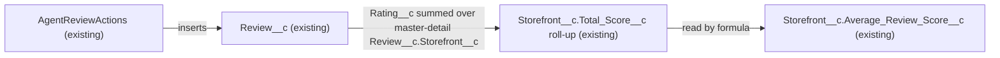

# Implementation spec — Sum of review scores per storefront

> Document that the existing roll-up field `Storefront__c.Total_Score__c` already tracks the sum of all review scores per storefront, and name it as the input for the ranking algorithm.

_Based on the requirement, the evidence reported by AskCoworker, and read-only org queries where noted. Assumptions and missing evidence are identified below. Specification only — nothing is implemented or deployed._

---

## 1. The requirement

The org must hold, for each storefront, the sum of all review scores so that a ranking algorithm can read it; this is already met by `Storefront__c.Total_Score__c`, so no metadata changes are required. The request contained no deploy or data-change instruction. The ranking algorithm itself is not part of this requirement.

| # | Responsibility | Trigger | Where it lives |
| --- | --- | --- | --- |
| 1 | Keep the sum of all `Review__c.Rating__c` values per storefront | Insert, update, delete, or undelete of a `Review__c` record | `Storefront__c.Total_Score__c` (existing roll-up summary) |
| 2 | Make the sum readable by the ranking algorithm's user | Not specified (the algorithm does not exist yet) | Field-level Read on `Storefront__c.Total_Score__c` in 5 existing permission sets |

## 2. Grounding — reuse before building

Target org: `TestWriteSpecDE` (Developer Edition, org ID `00Dak00001COqNeEAL`, not a sandbox). API version: `67.0`.

- **`Storefront__c`** (CustomObject) — the "storefront" in the requirement; no namespace (`DurableId` `01Iak00000Dx4JV`). _verified by org query_
- **`Review__c`** (CustomObject) — the reviews whose scores are summed; no namespace (`DurableId` `01Iak00000Dx4JW`). _verified by org query_
- **`Review__c.Rating__c`** (CustomField, Number(1,0), not required) — the per-review score; its description says "typically ranging from 1 (poor) to 5 (excellent)". None of the 92 `Review__c` records has a null `Rating__c`. _verified by org query_
- **`Review__c.Storefront__c`** (CustomField, Master-Detail to `Storefront__c`) — child relationship `Reviews__r`, `reparentableMasterDetail` false, cascade delete. _verified by org query_
- **`Storefront__c.Total_Score__c`** (CustomField, Roll-Up Summary) — `summaryOperation` sum, `summarizedField` `Review__c.Rating__c`, `summaryForeignKey` `Review__c.Storefront__c`, no filter items. Description: "The total score of the storefronts reviews, used to calculate the average." _verified by org query_
- **Stored values of `Storefront__c.Total_Score__c`** — for the three storefronts with the highest `SUM(Review__c.Rating__c)` (33, 29, 28), `Total_Score__c` holds the same values; minimum across 21 storefronts is 0. The describe result reports precision 1 for the field, but stored values above 9 show that sums are not truncated. _verified by org query_
- **`Storefront__c.Total_Reviews__c`** (CustomField, Roll-Up Summary, count of `Review__c`, no filter) and **`Storefront__c.Average_Review_Score__c`** (CustomField, Formula `Total_Score__c / Total_Reviews__c`) — related existing aggregates; not the sum itself. _verified by org query_
- **References to `Storefront__c.Total_Score__c`** — `MetadataComponentDependency` returns `Storefront Layout` (Layout) and `Average_Review_Score` (CustomField). A search of the bodies of all 70 non-namespaced Apex classes finds no reference to `Total_Score__c`. _verified by org query_
- **Apex that touches the related fields** — `AgentReviewActions` and `AgentSummarizeReviewsActions` reference `Review__c` and `Rating__c`; `AgentStorefrontActions`, `AgentGetStorefrontsByAccountActions`, `StorefrontPickerController`, and `MerchantRiskScoreAction` reference `Average_Review_Score__c`. _verified by org query_ (AskCoworker did not report `MerchantRiskScoreAction`.) AskCoworker reports that `AgentReviewActions` inserts `Review__c` records and that `AgentSummarizeReviewsActions` computes its own windowed, capped average from `Rating__c` rather than reading `Total_Score__c`. _reported by AskCoworker_
- **Automation on `Storefront__c` and `Review__c`** — no Apex triggers (Tooling `ApexTrigger`), no flows with either object as trigger object (`FlowDefinitionView`), no validation rules (Tooling `ValidationRule`). _verified by org query_
- **Same concept elsewhere** — a Tooling `CustomField` search for `Score`, `Rank`, and `Rating` names finds no other field that sums review scores per storefront; the other matches belong to unrelated security, risk, and standard objects. No ranking field exists on `Storefront__c`. _verified by org query_
- **Field-level access to `Storefront__c.Total_Score__c`** — `FieldPermissions` returns Read true, Edit false in exactly five permission sets: `Agentforce_Reference_App`, `sfdc_accelerate_dms`, `sfdc_a360_sfcrm_data_extract`, `sfdc_slack`, `Pronto_Deep_Dive_Workshop`. No profile-owned rows are returned. This list is complete for `FieldPermissions`. _verified by org query_
- **`Review__c.Status__c`** (CustomField, Picklist: `Submitted`, `Published`) — all 92 `Review__c` records have a null `Status__c`. _verified by org query_
- **Data 360** — `SELECT COUNT() FROM DataStream` returns 0. _verified by org query_

Evidence sources: `sf org display`; `EntityDefinition`; `sobject describe` of both objects; Tooling `CustomField` lists and `Metadata` for `Total_Score`, `Total_Reviews`, `Storefront`, `Rating`; aggregate `SUM`/`COUNT` queries on `Review__c` and `Storefront__c`; Tooling `ApexTrigger`, `ValidationRule`, `MetadataComponentDependency`, `ApexClass` bodies; `FlowDefinitionView`; `FieldPermissions`; `Organization`; `DataStream`. AskCoworker returned no citedReferences.

## 3. Architecture

Why the pieces are drawn this way:

1. `Review__c` feeds `Storefront__c.Total_Score__c` through a sum roll-up with no filter over the master-detail field `Review__c.Storefront__c` (verified by org query).
2. `Storefront__c.Average_Review_Score__c` reads `Total_Score__c` in its formula (verified by org query).
3. `AgentReviewActions` references `Review__c` and `Rating__c` (verified by org query); that it inserts reviews is reported by AskCoworker.
4. The ranking algorithm is not drawn because it does not exist in the org (verified by org query: no ranking field and no Apex reference to `Total_Score__c`).

No Apex is proposed: the sum is already maintained declaratively by the platform roll-up.

## 4. Metadata changes

No metadata changes are required.

## 5. Data 360 (Data Cloud) data involved

Not applicable — this change does not use Data 360. The org has no data streams (verified by org query).

## 6. Security considerations

- **Execution context.** The platform recalculates the roll-up when child records change; it does not depend on the sharing or field-level access of the user who edits the `Review__c` record. _assumption (documented platform behavior)_
- **CRUD/FLS.** `Storefront__c.Total_Score__c` is read-only as a roll-up summary. Read is granted, and Edit is not, in `Agentforce_Reference_App`, `sfdc_accelerate_dms`, `sfdc_a360_sfcrm_data_extract`, `sfdc_slack`, and `Pronto_Deep_Dive_Workshop`; no profile grants it (verified by org query). Permission sets and profiles are the only field-level grant paths, so the user or integration that runs the ranking algorithm must hold one of these permission sets, or a new grant must be designed with the algorithm.
- **Permission set changes.** None.
- **Data exposure.** No change. The field holds an aggregate of ratings and exposes no reviewer identity. _assumption_

## 7. Testing strategy

No test components are in the inventory, and no tests ran. The following are recommended verification steps for the existing behavior the ranking algorithm will rely on:

1. **Sum equals children.** For a sample of storefronts, compare `Storefront__c.Total_Score__c` with `SUM(Review__c.Rating__c)` grouped by `Review__c.Storefront__c` (already matched for the top three storefronts by read-only query).
2. **Insert, update, delete, undelete.** In a sandbox or scratch org, insert a review, change its `Rating__c`, delete it, and undelete it; confirm `Total_Score__c` changes by the rating each time.
3. **Bulk.** Insert 200 `Review__c` records for one storefront in one transaction and confirm the sum.
4. **Empty and null.** A storefront with no reviews shows 0 (verified by org query: minimum value 0). A review with a null `Rating__c` adds nothing to the sum (assumption, documented platform behavior; no such records exist today).
5. **Permission.** As a user with only `Agentforce_Reference_App`, read `Total_Score__c`; as a user with none of the five permission sets, confirm the field is not readable.

## 8. Open decisions

### Open

1. **Status filter on the sum (non-blocking).** `Storefront__c.Total_Score__c` has no filter, and the requirement says "all review scores", so every review counts regardless of `Review__c.Status__c` (`Submitted` or `Published`). All 92 current reviews have a null status, so a filter would change nothing today. Recommended default: keep the unfiltered roll-up. If the ranking algorithm should count only `Published` reviews, that becomes an Update to `Storefront__c.Total_Score__c` and needs a new spec. _assumption_
2. **Access for the ranking algorithm's user (non-blocking).** The algorithm and its running user do not exist yet. Recommended default: when the algorithm is designed, assign it one of the five permission sets that already grant Read, or design a least-privilege grant at that time. _assumption_

### Resolved

- **Requirement already met.** AskCoworker reported that `Total_Score__c` is a sum roll-up of `Rating__c`; org queries confirmed the roll-up definition and that the stored values match child sums. Zero-change spec.
- **Proposals dropped (Rule 4).** AskCoworker listed a ranking formula field, a batch-computed rank field, and a trigger-maintained sum as alternatives. None is in scope: the requirement asks to track the sum, which already exists. AskCoworker also suggested a validation rule for null `Rating__c`; it is not required by this requirement and is dropped.
- **Profile access.** AskCoworker reported profile-level access as unknown. The unfiltered `FieldPermissions` query for the field returned no profile-owned rows, so no profile grants Read (verified by org query).
- **Missed reader.** AskCoworker did not report `MerchantRiskScoreAction`; the Apex body search shows it references `Average_Review_Score__c`, which is derived from `Total_Score__c`. It is unaffected because nothing changes.
- **User questions.** None were asked: the requirement is already met and has no blocking fork.

## 9. Change set

| # | Action | Type | API name | Module | Why |
| --- | --- | --- | --- | --- | --- |

No metadata changes are required. The existing roll-up `Storefront__c.Total_Score__c` already sums `Review__c.Rating__c` per storefront.

Total: 0 · Create: 0 · Update: 0 · Delete: 0
