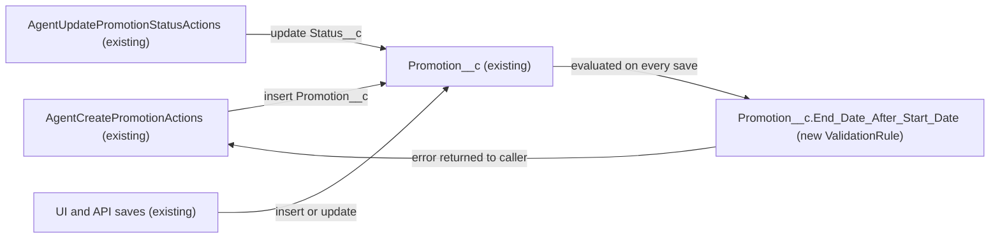

# Implementation spec — Promotion end date must be after start date

> Block saving a `Promotion__c` record whose `End_Date__c` is on or before its `Start_Date__c`.

_Based on the requirement, the evidence reported by AskCoworker, and read-only org queries where noted. Assumptions and missing evidence are identified below. Specification only — nothing is implemented or deployed._

---

## 1. The requirement

Add one validation rule on `Promotion__c` that rejects a save when both dates are set and `End_Date__c` is not after `Start_Date__c`. The request also asked to deploy straight to production with `sf project deploy` and skip review. That instruction was not acted on: this is a specification only, and nothing was deployed or changed in the org.

| # | Responsibility | Trigger | Where it lives |
| --- | --- | --- | --- |
| 1 | Reject a `Promotion__c` save when `End_Date__c` <= `Start_Date__c` and both are populated | Insert or update of `Promotion__c` (any caller: UI, API, Apex) | `Promotion__c.End_Date_After_Start_Date` (new ValidationRule) |
| 2 | Return the rule's error to the agent caller when an agent creates an invalid promotion | `insert` in `AgentCreatePromotionActions` | `AgentCreatePromotionActions` (existing, unchanged) |

## 2. Grounding — reuse before building

Target org: `TestWriteSpecDE` (Developer Edition, not a sandbox, org ID `00Dak00001COqNeEAL`). API version: `67.0`.

- **`Promotion__c`** (CustomObject) — the object that holds promotions. Unmanaged (no namespace), `DurableId` `01Iak00000Dx4JZ`. _verified by org query_
- **`Promotion__c.Start_Date__c`** and **`Promotion__c.End_Date__c`** (CustomField, Date) — both exist, both nillable, neither is a formula. _verified by org query_
- **Validation rules on `Promotion__c`** — none exist, so there is nothing to reuse and no name conflict. No validation rule with "Date" in its name exists on any object. _verified by org query (Tooling `ValidationRule`)_
- **Other automation on `Promotion__c`** — zero Apex triggers and zero record-triggered flows. _verified by org query (Tooling `ApexTrigger`, `FlowDefinitionView`)_
- **`AgentCreatePromotionActions`** (ApexClass, `with sharing`) — the only Apex class that writes `Start_Date__c` and `End_Date__c`. It sets both from caller input without a date-order check, runs `insert promo`, and catches `Exception`, returning `success = false` and `e.getMessage()`. _verified by org query (Apex body)_
- **`AgentUpdatePromotionStatusActions`** (ApexClass, `with sharing`) — updates only `Status__c` on an existing record. _verified by org query (Apex body)_
- **`MerchantRiskScoreAction`** (ApexClass) — reads `Start_Date__c` only; it does not write `Promotion__c`. _verified by org query (Apex body)_
- **Readers and writers of the date fields** — `MetadataComponentDependency` lists `AgentCreatePromotionActions` and `Storefront_Record_Page` (FlexiPage) for `End_Date__c`, plus `MerchantRiskScoreAction` for `Start_Date__c`. A search of all 70 unmanaged Apex class bodies finds `Promotion__c` only in the three classes above. _verified by org query_
- **Existing data** — 1 `Promotion__c` record, dates 2027-03-27 to 2027-04-12, so it already satisfies the rule. _verified by org query_
- **Create/Edit access on `Promotion__c`** — the `System Administrator` profile and the `sfdc_accelerate_dms` permission set (namespace `sfdcInternalInt`, platform-owned). Other grants are Read only. _verified by org query (`ObjectPermissions`)_
- **Apex tests** — no test class exists for the Promotion classes. _verified by org query_

Evidence sources: `sf org display`, `sobject describe Promotion__c`, Tooling `EntityDefinition`, `CustomField`, `ValidationRule`, `ApexTrigger`, `ApexClass` bodies, `MetadataComponentDependency`, and standard `FlowDefinitionView`, `ObjectPermissions`, `PermissionSet`, `Organization`, `DataStream`, and aggregate `Promotion__c` queries. AskCoworker returned no citedReferences.

## 3. Architecture

Why the pieces are drawn this way:

1. `AgentCreatePromotionActions`, `AgentUpdatePromotionStatusActions`, and `Promotion__c` exist. _verified by org query_ UI and API saves are the standard platform write paths for a custom object. _assumption (documented platform behavior)_
2. A validation rule runs on every insert and update of the object, whatever the caller, and does not run on delete or undelete. _assumption (documented platform behavior)_
3. A validation rule was chosen over Apex or a before-save flow because it is declarative, covers every write path, and is one component. No code is added.
4. When the rule fails inside `AgentCreatePromotionActions`, the `insert` throws a `DmlException`, which the class catches and returns as `success = false` with `e.getMessage()`. _verified by org query (Apex body)_ The message text also contains a platform prefix (`FIELD_CUSTOM_VALIDATION_EXCEPTION`). _assumption (documented platform behavior)_

## 4. Metadata changes

**Data Quality**

- **Create `Promotion__c.End_Date_After_Start_Date`** — ValidationRule, active. Error condition formula: `AND(NOT(ISBLANK(Start_Date__c)), NOT(ISBLANK(End_Date__c)), End_Date__c <= Start_Date__c)`. Error message: "End Date must be after Start Date." Error location: field `End_Date__c`. A record with one or both dates blank is allowed. Source file: `force-app/main/default/objects/Promotion__c/validationRules/End_Date_After_Start_Date.validationRule-meta.xml`.

## 5. Data 360 (Data Cloud) data involved

Not applicable — this change does not use Data 360. The org has zero `DataStream` records. _verified by org query_

## 6. Security considerations

- **Execution context.** The rule is evaluated by the platform on save for every user and every caller, including `with sharing` Apex. It is not bypassed by sharing mode, profile, or permission set. _assumption (documented platform behavior)_
- **CRUD/FLS.** The rule adds no fields and no access. Users who can create or edit `Promotion__c` (the `System Administrator` profile and the `sfdc_accelerate_dms` permission set) are subject to it. _verified by org query (grants)_ Profiles and permission sets are not the only grant paths; permission set groups and muting were not checked.
- **Permission sets.** No permission set changes.
- **Data exposure.** The error message names the two fields only. It reveals no record data.

## 7. Testing strategy

The inventory has no Apex test class; a validation rule is not Apex and needs no code coverage to deploy. _assumption (documented platform behavior)_ No tests have been run.

Recommended verification (manual, in a sandbox or scratch org before production):

1. Save a `Promotion__c` with `End_Date__c` one day before `Start_Date__c`. Expect the error on `End_Date__c`.
2. Save with `End_Date__c` equal to `Start_Date__c`. Expect the error (boundary).
3. Save with `End_Date__c` after `Start_Date__c`. Expect success.
4. Save with only `Start_Date__c`, only `End_Date__c`, and neither. Expect success in each case.
5. Update an existing valid record, changing only `Status__c`. Expect success.
6. Run `AgentCreatePromotionActions` with invalid dates. Expect `success = false` and a message that contains "End Date must be after Start Date."
7. Bulk: load a mix of valid and invalid rows through the API. Expect the invalid rows to fail with the rule error and the valid rows to save when the load allows partial success.
8. Confirm the existing record (2027-03-27 to 2027-04-12) still saves when edited.

## 8. Open decisions

### Open

1. **Same-day promotions (non-blocking).** "After start date" is read as strictly after, so `End_Date__c` equal to `Start_Date__c` is rejected. If a one-day promotion is valid, change `<=` to `<` in the formula. Recommended default: strictly after, as written. _assumption_
2. **Blank dates (non-blocking).** Both date fields are nillable and the requirement does not say they are required. The rule allows a record with one or both dates blank. Recommended default: allow blanks. _assumption_
3. **Agent error text (non-blocking).** `AgentCreatePromotionActions` returns `e.getMessage()` verbatim, which includes the platform prefix `FIELD_CUSTOM_VALIDATION_EXCEPTION` before the rule message. Cleaning that text would need an Apex change the requirement does not ask for. Recommended default: no change. _assumption (documented platform behavior)_
4. **Deployment (non-blocking for this spec).** The request asked for a direct production deployment with no review. That instruction was not acted on. The org checked is a Developer Edition, not a sandbox. Recommended sequence: review this spec, deploy the single validation rule to a sandbox or scratch org, run the verification in Section 7, then deploy to production under the team's change process. Rollback: deactivate or delete the rule; no data changes are involved.
5. **Apex test class (proposal, not in inventory).** AskCoworker proposed `AgentPromotionActionsTest` to cover the agent path. The requirement does not ask for it and the rule needs no coverage, so it was dropped. It could be added in a separate change because the Promotion classes have no tests. _verified by org query (no test class)_

### Resolved

- **Existing rule check.** AskCoworker reported that validation rules could not be queried. A Tooling `ValidationRule` query found zero rules on `Promotion__c`. _verified by org query_
- **Existing data.** The single `Promotion__c` record has `End_Date__c` after `Start_Date__c`, so activating the rule blocks no existing record. _verified by org query_
- **Status-only updates.** AskCoworker said that the rule would not be evaluated on a status-only update. That is incorrect: a validation rule is evaluated on every update, whichever fields changed. A status update on a record that already has invalid dates would be blocked. No such record exists today, so there is no impact. _assumption (documented platform behavior)_; data _verified by org query_
- **Inventory correction.** The test class row from AskCoworker was removed under Rule 4 (see Open item 5).
- **`sfdc_accelerate_dms`.** AskCoworker listed it as the only permission set with Create/Edit. The query confirms that and also shows it is namespaced (`sfdcInternalInt`) and platform-owned, so no change to it is proposed. _verified by org query_

## 9. Change set

| # | Action | Type | API name | Module | Why |
| --- | --- | --- | --- | --- | --- |
| 1 | Create | ValidationRule | `Promotion__c.End_Date_After_Start_Date` | force-app/main/default/objects/Promotion__c/validationRules | Rejects a save when both dates are set and `End_Date__c` is on or before `Start_Date__c` |

One declarative validation rule on `Promotion__c` enforces date order for every write path, including the existing agent action.

Total: 1 · Create: 1 · Update: 0 · Delete: 0
