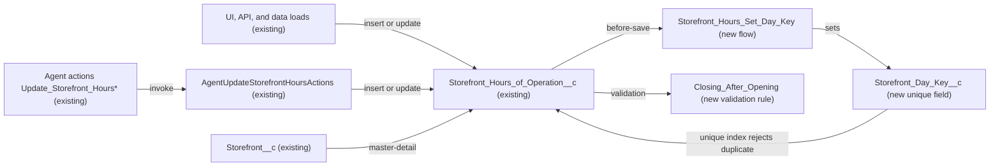

# Implementation spec — Storefront hours validation and one row per day

> Block storefront hours rows whose closing time is not after the opening time, and block a second hours row for the same storefront and day of the week.

_Based on the requirement, the evidence reported by AskCoworker, and read-only org queries where noted. Assumptions and missing evidence are identified below. Specification only — nothing is implemented or deployed._

---

## 1. The requirement

Every save of a `Storefront_Hours_of_Operation__c` row must be rejected when the closing time is not after the opening time, or when the same `Storefront__c` already has a row for the same `Day_of_Week__c`. The user decided that overnight hours (closing after midnight) are not needed. The request contained no deploy or data-change instruction.

| # | Responsibility | Trigger | Where it lives |
| --- | --- | --- | --- |
| 1 | Reject a row whose `Closing_Time__c` is not after `Opening_Time__c` | Insert or update of `Storefront_Hours_of_Operation__c` | `Storefront_Hours_of_Operation__c.Closing_After_Opening` (new validation rule) |
| 2 | Allow only one row per storefront per day of the week | Insert, update, or undelete of `Storefront_Hours_of_Operation__c` | `Storefront_Hours_Set_Day_Key` (new flow) sets `Storefront_Hours_of_Operation__c.Storefront_Day_Key__c` (new unique field) |
| 3 | Protect the 147 existing rows under responsibility 2 | One-time data step after deployment | Backfill procedure in Section 8 |

## 2. Grounding — reuse before building

Target org: `TestWriteSpecDE` (Developer Edition, org ID `00Dak00001COqNeEAL`, not a sandbox). API version: `67.0`. The project's `force-app/main/default/objects` and `classes` folders are empty, so all metadata evidence comes from the org. _verified by project file_

- **`Storefront_Hours_of_Operation__c`** (CustomObject, `DurableId` `01Iak00000Dx4KM`, no namespace) — the hours object; one row per storefront per day. _verified by org query_
- **`Storefront_Hours_of_Operation__c.Storefront__c`** (Master-Detail to `Storefront__c`) — not reparentable, cascade delete, relationship name `Storefronts`. Because it cannot be reparented, only `Day_of_Week__c` can change a row's storefront-and-day pair after insert. _verified by org query_
- **`Storefront_Hours_of_Operation__c.Day_of_Week__c`** (Picklist, unrestricted, nillable) — values `Monday` to `Sunday`. _verified by org query_
- **`Storefront_Hours_of_Operation__c.Opening_Time__c`** and **`Storefront_Hours_of_Operation__c.Closing_Time__c`** (Text(255)) — times are free text, not the `Time` type, so a plain comparison does not order them correctly. _verified by org query_
- **Existing data** — 147 rows across 21 storefronts, 21 rows per day, 0 duplicate (`Storefront__c`, `Day_of_Week__c`) pairs, 0 rows with a blank day, opening, or closing time. Every time value uses 12-hour text (for example `08:00 AM`, `5:00 PM`), and every row's closing time is after its opening time. _verified by org query_
- **`AgentUpdateStorefrontHoursActions`** (ApexClass, `with sharing`) — the only Apex class that references the hours object (search of all 70 unnamespaced Apex bodies). It looks up the row for the storefront and normalized day, then runs `insert` or `update`, and returns any exception message in its `Response.message`. Its invocable variables describe 24-hour `HH:MM` input (for example `"09:00"`). It is the invocation target of agent actions `Update_Storefront_Hours` and four `Update_Storefront_Hours_179…` versions. _verified by org query_
- **`Storefront_Record_Page`** (FlexiPage) — references the hours fields; it is the only other dependency returned by `MetadataComponentDependency` for them. _verified by org query_
- **Automation** — 0 Apex triggers in the org reference storefronts, 0 record-triggered flows and 0 validation rules exist on `Storefront__c` or `Storefront_Hours_of_Operation__c`. _verified by org query_
- **Same concept elsewhere** — no field on any object already holds a storefront-and-day key (Tooling `CustomField` search for `%Time%`, `%Day%`, `%Hour%`, `%Key%`, `%Unique%`). _verified by org query_
- **Write access** — Create and Edit on the hours object: permission sets `Agentforce_Reference_App` and `sfdc_accelerate_dms`, and one profile-owned permission set; read-only: `sfdc_a360_sfcrm_data_extract`, `sfdc_slack`, and one other profile-owned permission set. _verified by org query_
- AskCoworker's D2 answer found no validation rule, trigger, or flow enforcing either rule, and reported that uniqueness is enforced only inside `AgentUpdateStorefrontHoursActions`. _reported by AskCoworker_ (the absence of automation is also verified by org query above).

Evidence sources: `sf org display`; `EntityDefinition`, `FieldDefinition`, `sobject describe`, and `CustomField.Metadata` for the object and fields; Tooling `ApexTrigger`, `ValidationRule`, `ApexClass` bodies, `MetadataComponentDependency`, `GenAiFunctionDefinition`; `FlowDefinitionView`; `ObjectPermissions`, `FieldPermissions`; aggregate queries on the hours data; `DataStream` count. AskCoworker returned no citedReferences.

## 3. Architecture

Why the pieces are drawn this way:

1. `Storefront_Hours_of_Operation__c` has three evidenced write paths: the agent class, and direct UI or API DML by holders of Create and Edit. _verified by org query_ Both rules must live on the object itself so that every path is covered; the agent class's own lookup-before-insert protects only its path.
2. `Storefront_Hours_Set_Day_Key` is a before-save record-triggered flow that writes `Storefront__c & ":" & TEXT(Day_of_Week__c)` into `Storefront_Day_Key__c`. The field's unique index is what rejects a duplicate. A database unique index also rejects duplicates inside one bulk DML and across concurrent transactions, which a query-based check in a trigger or flow cannot guarantee. _assumption (documented platform behavior)_
3. `Closing_After_Opening` is a validation rule. It converts each time text to minutes since midnight and compares them. A formula can do this with `REGEX`, `FIND`, `LEFT`, `MID`, `VALUE`, and `MOD`, so Apex is not needed. _assumption (documented platform behavior)_
4. Before-save flows run before custom validation rules, and the unique index is checked when the record is written, so the key is always set before it is checked. _assumption (documented platform behavior)_
5. No Apex is created. AskCoworker proposed an Apex trigger and test class; that proposal was rejected (Section 8, Resolved).

## 4. Metadata changes

**Data model**

- **Create `Storefront_Hours_of_Operation__c.Storefront_Day_Key__c`** — Text(50), label `Storefront Day Key`, Unique, case-insensitive (so `monday` and `Monday` collide), not External ID, not required. Help text: "Set automatically; one value per storefront and day of the week." The value is at most 28 characters (18-character ID, `:`, `Wednesday`). Not added to any page layout or permission set (Section 6).

**Automation**

- **Create `Storefront_Hours_Set_Day_Key`** — record-triggered flow on `Storefront_Hours_of_Operation__c`, "Fast Field Updates" (before-save), runs when a record is created or updated, with no entry conditions so it runs on every save (the backfill in Section 8 depends on this). One Assignment element: if `Day_of_Week__c` is blank, set `Storefront_Day_Key__c` to blank; otherwise set it to `{!$Record.Storefront__c} & ":" & TEXT({!$Record.Day_of_Week__c})` using the 18-character ID. Active on deployment.
- **Create `Storefront_Hours_of_Operation__c.Closing_After_Opening`** — validation rule, active, error location `Closing_Time__c`, error message: "Closing time must be after opening time on the same day. Enter times as HH:MM (24-hour, for example 21:00) or h:mm AM/PM (for example 9:00 PM)." It fires only when both times are populated, and then rejects the record when either value does not match an accepted format, or when closing minutes are less than or equal to opening minutes. Accepted formats (`P` below): `(0?[0-9]|1[0-9]|2[0-3]):[0-5][0-9]|(0?[1-9]|1[0-2]):[0-5][0-9] ?[AaPp][Mm]`. Minutes for a value `T` = `IF(CONTAINS(UPPER(TRIM(T)), "M"), MOD(VALUE(LEFT(TRIM(T), FIND(":", TRIM(T)) - 1)), 12) + IF(CONTAINS(UPPER(TRIM(T)), "P"), 12, 0), VALUE(LEFT(TRIM(T), FIND(":", TRIM(T)) - 1))) * 60 + VALUE(MID(TRIM(T), FIND(":", TRIM(T)) + 1, 2))`. Formula shape: `AND(NOT(ISBLANK(Opening_Time__c)), NOT(ISBLANK(Closing_Time__c)), OR(NOT(REGEX(TRIM(Opening_Time__c), P)), NOT(REGEX(TRIM(Closing_Time__c), P)), IF(AND(REGEX(TRIM(Opening_Time__c), P), REGEX(TRIM(Closing_Time__c), P)), Minutes(Closing_Time__c) <= Minutes(Opening_Time__c), FALSE)))`, with `P` and `Minutes` written out in full. `12:00 AM` and `00:00` are 0 minutes and `12:00 PM` is 720 minutes, so a closing time of midnight is rejected, which matches the user decision that overnight hours are not needed.

## 5. Data 360 (Data Cloud) data involved

Not applicable — this change does not use Data 360. The org has 0 `DataStream` records. _verified by org query_

## 6. Security considerations

- **Execution context.** The before-save flow runs in system context, so it sets `Storefront_Day_Key__c` whatever the running user's field-level security. Validation rules and the unique index apply to every user and every write path, including `AgentUpdateStorefrontHoursActions` (which runs `with sharing`) and integrations. _assumption (documented platform behavior)_
- **CRUD/FLS.** No object permission changes. `Storefront_Day_Key__c` gets no field permission in any permission set or profile: users do not need to see or edit it, and the flow writes it in system context. Users therefore cannot overwrite the key by hand. A System Administrator can still see it through "View All Fields"-style profile access; that is acceptable because the value is only a storefront ID and a day name.
- **Permission sets.** None are changed. Existing Create and Edit grants (`Agentforce_Reference_App`, `sfdc_accelerate_dms`, one profile) keep working and become subject to both rules. _verified by org query_ Permission sets are not the only grant path; profiles also grant access.
- **Data exposure.** The key exposes nothing that is not already on the record. The rejection message for a duplicate is the platform's `DUPLICATE_VALUE` message, which includes the ID of the existing row; the caller can already read that row if it can read the object. _assumption (documented platform behavior)_
- **Agent path.** When a rule rejects a save, `AgentUpdateStorefrontHoursActions` returns `success = false` with the exception message instead of throwing. _verified by org query_

## 7. Testing strategy

The inventory contains no Apex, so no Apex test class is required. All cases below are recommended verification, run in `TestWriteSpecDE` after deployment and before the backfill, unless stated otherwise.

- **Time order, positive:** `08:00 AM`–`10:00 PM`, `5:00 PM`–`10:00 PM` (no leading zero), `09:00`–`21:00` (24-hour), and mixed `9:00 AM`–`21:00` all save.
- **Time order, negative:** closing before opening (`10:00 PM`–`08:00 AM`, `21:00`–`09:00`), equal times (`09:00 AM`–`09:00 AM`), and closing at midnight (`08:00 AM`–`12:00 AM`, `08:00`–`00:00`) are rejected with the rule's message on `Closing_Time__c`.
- **Edge cases:** `12:00 PM`–`1:00 PM` saves (noon is 720 minutes); `12:30 AM`–`1:00 AM` saves; `9:00pm` and `9:00 PM` both parse.
- **Format, negative:** `9am`, `21:00:00`, `24:00`, `13:00 PM`, and `Closed` in either field are rejected. This also confirms that `VALUE` is not evaluated on an invalid value (the `IF` guard).
- **Partial times:** only one time populated, or both blank, saves (the rule does not fire).
- **Criteria transitions on update:** changing a valid row's closing time to before its opening time is rejected; clearing one time on an update saves; adding the second time to a row that had one time runs the check.
- **Uniqueness:** a second row for the same storefront and day is rejected on insert; changing `Day_of_Week__c` on an update to a day that already has a row is rejected; changing it to a free day saves and the key changes; `monday` against an existing `Monday` row is rejected.
- **Bulk:** a 200-row insert through the API with valid rows saves; a batch with two rows for the same storefront and day rejects the second row with `DUPLICATE_VALUE` (with all-or-none off) and saves the rest.
- **Delete and undelete:** deleting a row frees its day for a new row; undeleting the original row from the Recycle Bin while a replacement exists fails on the unique index.
- **Agent path:** invoke `Update_Storefront_Hours` with `openingTime` `21:00` and `closingTime` `09:00`; the response has `success = false` and the rule's message. Invoke it for an existing day; it updates that row (its own lookup), and no duplicate is created.
- **Permission:** a user with only `sfdc_slack` (Read) cannot create rows (CRUD, not these rules); a user with `Agentforce_Reference_App` hits both rules like any other user.
- **Backfill check:** after the backfill in Section 8, `SELECT COUNT() FROM Storefront_Hours_of_Operation__c WHERE Storefront_Day_Key__c = null` returns 0, then a duplicate insert for an existing pre-deployment day is rejected.

## 8. Open decisions

### Open

1. **Deployment sequence and backfill (non-blocking).** The unique index does not protect the 147 existing rows until their keys are set, because the key is blank on existing rows after deployment. Sequence: (1) deploy `Storefront_Hours_of_Operation__c.Storefront_Day_Key__c`; (2) deploy `Storefront_Hours_Set_Day_Key` and `Storefront_Hours_of_Operation__c.Closing_After_Opening`; (3) export `Id`, `Storefront__c`, `Day_of_Week__c`, `Opening_Time__c`, `Closing_Time__c`, `Notes__c` for all rows as a backup; (4) run a bulk update that submits only `Id` for all 147 rows (for example with Data Loader or `sf data update bulk`), which fires the flow and sets each key without changing business data; (5) confirm 0 rows have a blank key. No business values change. The backfill cannot fail on the new validation rule, because every existing row uses a 12-hour format and closes after it opens. _verified by org query_ It could fail on the unique index only if a duplicate appears between the check above and the backfill; if that happens, resolve the duplicate with the business before rerunning. Rollback: clear `Storefront_Day_Key__c` on all rows and deactivate the flow, or delete the field; the backup restores any value if needed.
2. **Accepted time formats (non-blocking).** The fields are text, the existing data uses 12-hour format, and the agent action documents 24-hour format. The user had no preference. Default: accept both `HH:MM` and `h:mm AM/PM`, and reject any other text when both times are populated. _assumption_ Converting the fields to the `Time` type was not chosen, because it needs a data migration and changes the input contract of `AgentUpdateStorefrontHoursActions`.
3. **Blank times (non-blocking).** The user had no preference. Default: the rule applies only when both times are populated, so a row with one or both times blank (for example a closed day) saves. _assumption_ Existing data has no blank times. _verified by org query_
4. **Blank day of week (non-blocking).** `Day_of_Week__c` is not required and the picklist is unrestricted. A row with a blank day gets a blank key, and the unique index allows many blank-key rows, so rows without a day are not limited. Existing data has no blank days. _verified by org query_ Default: leave as is; making `Day_of_Week__c` required or restricting the picklist is a separate proposal the requirement did not ask for.
5. **Duplicate error message (non-blocking).** A duplicate is rejected with the platform's unique-value message, not custom text, and the agent returns that text. Default: accept it. A custom message would need a flow Get Records check with a Custom Error element in addition to the index.
6. **Unreadable automation (non-blocking).** Only record-triggered flows were checked; process builder, workflow rules, and other automation types that the allowed queries cannot read could also write these rows. Any such writer is still subject to both rules.

### Resolved

- **Overnight hours:** not needed. _user decision_ A closing time at or after midnight is therefore rejected.
- **Apex trigger rejected.** AskCoworker's inventory proposed a `StorefrontHoursValidation` Apex trigger and a `StorefrontHoursValidationTest` class, stating that a validation rule cannot parse text times and that uniqueness needs Apex. _reported by AskCoworker_ Both statements were rejected: the formula in Section 4 parses both formats with standard functions, and a unique field with a before-save flow is declarative and also enforces uniqueness for bulk and concurrent writes, which a query-based trigger check does not. _assumption (documented platform behavior)_ Rule 4 (prefer declarative) applies.
- **Agent class write method.** AskCoworker's runtime answer said the class uses `upsert`; the class body shows separate `insert` and `update`. _verified by org query_ This does not change the design.
- **Backfill method.** AskCoworker recommended anonymous Apex for the backfill; the spec uses an ID-only bulk update instead, which needs no code. The backfill is a data step, not part of the change set.
- **Same-batch duplicates.** AskCoworker described duplicate handling within one bulk DML as non-deterministic. With a unique index the later duplicate row fails with `DUPLICATE_VALUE` (or the whole batch fails when all-or-none is on). _assumption (documented platform behavior)_
- **Undelete.** AskCoworker said detail rows cannot be undeleted on their own. A detail row deleted by itself can be undeleted from the Recycle Bin, and the unique index is checked when it is restored. _assumption (documented platform behavior)_
- **Key field access.** AskCoworker suggested optional Read access for `Agentforce_Reference_App` and `sfdc_accelerate_dms`. Not added: no one needs to see the key (least access).
- **D1 timeout.** The first D1 call timed out and was resent as a narrower question, which succeeded.

## 9. Change set

| # | Action | Type | API name | Module | Why |
| --- | --- | --- | --- | --- | --- |
| 1 | Create | CustomField | `Storefront_Hours_of_Operation__c.Storefront_Day_Key__c` | force-app/main/default/objects/Storefront_Hours_of_Operation__c/fields | Unique index that allows one row per storefront and day |
| 2 | Create | Flow | `Storefront_Hours_Set_Day_Key` | force-app/main/default/flows | Sets the key from `Storefront__c` and `Day_of_Week__c` on every save |
| 3 | Create | ValidationRule | `Storefront_Hours_of_Operation__c.Closing_After_Opening` | force-app/main/default/objects/Storefront_Hours_of_Operation__c/validationRules | Rejects a closing time that is not after the opening time |

A before-save flow fills a unique storefront-and-day key, and a validation rule compares the parsed opening and closing times, so both rules apply to every write path without Apex.

Total: 3 · Create: 3 · Update: 0 · Delete: 0
