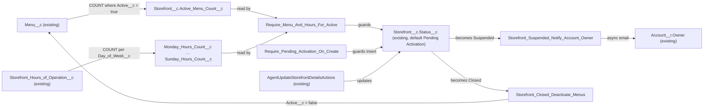

# Implementation spec — Storefront lifecycle enforcement

> Enforce the `Storefront__c` status lifecycle: default to Pending Activation, guard activation on active menus and seven-day hours, email the Account owner on suspension, and deactivate menus on closure.

_Based on the requirement, the evidence reported by AskCoworker, and read-only org queries where noted. Assumptions and missing evidence are identified below. Specification only — nothing is implemented or deployed._

---

## 1. The requirement

New storefronts start as Pending Activation; a storefront cannot become Active without at least one active menu and hours for all seven days; a suspended storefront notifies the owner of its related Account (user decision: "account owner" means `Storefront__c.Account__r.Owner`); a closed storefront deactivates its menus. The request contained no deploy or data-change instruction.

| # | Responsibility | Trigger | Where it lives |
| --- | --- | --- | --- |
| 1 | New storefronts start as Pending Activation | `Storefront__c` insert | `Storefront__c.Status__c` default value; `Storefront__c.Require_Pending_Activation_On_Create` |
| 2 | Block the transition to Active unless at least one active menu exists | `Storefront__c` update where `Status__c` changes to Active | `Storefront__c.Active_Menu_Count__c`; `Storefront__c.Require_Menu_And_Hours_For_Active` |
| 3 | Block the transition to Active unless hours exist for all seven days | `Storefront__c` update where `Status__c` changes to Active | `Storefront__c.Monday_Hours_Count__c` … `Storefront__c.Sunday_Hours_Count__c`; `Storefront__c.Require_Menu_And_Hours_For_Active` |
| 4 | Email the Account owner when a storefront becomes Suspended | `Storefront__c` update where `Status__c` becomes Suspended | `Storefront_Suspended_Notify_Account_Owner` |
| 5 | Deactivate all active menus when a storefront becomes Closed | `Storefront__c` update where `Status__c` becomes Closed | `Storefront_Closed_Deactivate_Menus` |

## 2. Grounding — reuse before building

Target org: `TestWriteSpecDE` (Developer Edition, not a sandbox). API version: `67.0`.

- **`Storefront__c.Status__c`** (CustomField, picklist) — values Active, Inactive, Pending Activation, Suspended, Closed; no default value; nillable. _verified by org query_
- **`Storefront__c.Account__c`** (CustomField, lookup to `Account`) — populated on all 21 storefronts; nillable, so future records can leave it blank. _verified by org query_
- **`Storefront__c.OwnerId`** — User on all 21 storefronts; not the notification recipient (user decision). _verified by org query_
- **`Storefront__c.Menu_Count__c`** (CustomField, roll-up) — COUNT of `Menu__c` over `Menu__c.Storefront__c` with no filter, so it counts inactive menus too and cannot serve the activation guard. _verified by org query_
- **Other roll-ups on `Storefront__c`** — `Total_Reviews__c`, `Total_Score__c`, `Menu_Count__c` (3 in total), leaving room for 8 more under the per-object roll-up limit. _verified by org query_ (limit value: _assumption (documented platform behavior)_: 25 per object by default)
- **`Menu__c.Active__c`** (CustomField, checkbox, default true) and **`Menu__c.Storefront__c`** (master-detail, relationship `Menus`, not reparentable). _verified by org query_
- **`Storefront_Hours_of_Operation__c.Day_of_Week__c`** (CustomField, picklist Monday … Sunday, nillable) and **`Storefront_Hours_of_Operation__c.Storefront__c`** (master-detail, relationship `Storefronts`, not reparentable). No uniqueness rule prevents two rows for the same day; no duplicates exist today. _verified by org query_
- **Automation on `Storefront__c`, `Menu__c`, `Storefront_Hours_of_Operation__c`** — 0 Apex triggers, 0 record-triggered flows (and no flow whose API name contains Storefront or Menu), 0 validation rules, 0 email alerts, no storefront email templates. _verified by org query_
- **`AgentUpdateStorefrontDetailsActions`** (ApexClass, `with sharing`) — the only unmanaged Apex class that writes `Storefront__c.Status__c` (`sf.Status__c = req.status; update sf;`) and it catches exceptions and returns `e.getMessage()`, so a validation-rule error reaches the agent as the response message. _verified by org query_ (Apex body search)
- **`AgentCreateMenuWithItemsActions`, `AgentUpdateMenuActions`** (ApexClass) — write `Menu__c.Active__c`; **`AgentUpdateStorefrontHoursActions`** (ApexClass) — inserts and updates `Storefront_Hours_of_Operation__c`. These changes recalculate the new roll-ups. _verified by org query_ (Apex body search)
- **`AgentActionsTest`, `StorefrontPickerActionTest`, `MerchantRiskScoreActionTest`** (ApexClass, tests) — insert `Storefront__c` without setting `Status__c`; no unmanaged Apex assigns a storefront status literal. _verified by org query_ (Apex body search)
- **Current data** — all 21 storefronts are Active; 21 distinct storefronts have at least one active menu (23 menus, all active); every day of the week has 21 hours rows with no duplicate (storefront, day) pair, so every storefront has all seven days. _verified by org query_
- **Permission sets with Create/Edit on `Storefront__c` and `Menu__c`** — `Agentforce_Reference_App`, `sfdc_accelerate_dms`; read-only: `sfdc_a360_sfcrm_data_extract`, `sfdc_slack`, `Pronto_Deep_Dive_Workshop` (Storefront only). _verified by org query_ (complete for non-profile permission sets on these two objects)
- **Data 360** — `SELECT COUNT() FROM DataStream` returns 0. _verified by org query_

Evidence sources: `sf sobject describe` on the three objects; Tooling `EntityDefinition`, `CustomField` (field list and `Metadata` for `Menu_Count__c` and both master-detail fields), `ApexTrigger`, `ValidationRule`, `WorkflowAlert`, `ApexClass` bodies; `FlowDefinitionView`; `EmailTemplate`; `CustomNotificationType`; `ObjectPermissions`; aggregate data queries; `Organization`. AskCoworker returned no citedReferences.

## 3. Architecture

Why the pieces are drawn this way:

1. `Storefront__c.Status__c` is the single lifecycle field (_verified by org query_); every rule keys off it. The existing `AgentUpdateStorefrontDetailsActions` path is shown because validation rules apply to its `update` just as to the UI (_assumption (documented platform behavior)_).
2. Validation rules cannot query child records, so child facts are surfaced as roll-up summary fields on the master (_assumption (documented platform behavior)_). `Menu_Count__c` is unfiltered (_verified by org query_), so a new filtered roll-up `Active_Menu_Count__c` is needed.
3. Roll-ups cannot count distinct values. One filtered COUNT per day gives an exact "day is covered" signal that tolerates duplicate or blank-day rows; a single COUNT of all hours rows would not (six days plus a duplicate would pass). This choice is recorded in Section 8.
4. Suspension and closure are two record-triggered after-save flows, each with the entry condition "`Status__c` equals X" and "only when a record is updated to meet the condition requirements". This fires exactly once per transition into that status, including Suspended → Closed. A single flow with the entry condition "Suspended or Closed" would not fire for Suspended → Closed (_assumption (documented platform behavior)_), so the AskCoworker proposal for one flow was split.
5. The suspension email runs on the flow's asynchronous path so that an email failure does not roll back the status change (_assumption (documented platform behavior)_). Menu deactivation runs on the immediate path so it commits in the same transaction as the Closed status.
6. No Apex is added except the test class; every behavior is declarative.

## 4. Metadata changes

**Default status**

- **Update `Storefront__c.Status__c`** — Set `Pending Activation` as the picklist default value. Existing values and existing records are unchanged; the default applies only when an insert does not supply a value.
- **Create `Storefront__c.Require_Pending_Activation_On_Create`** — Validation rule. Formula: `ISNEW() && NOT(ISPICKVAL(Status__c, "Pending Activation"))`. Error on `Status__c`: "New storefronts must start as Pending Activation." Blocks creating a storefront in any other status (including blank) from every path.

**Activation guard**

- **Create `Storefront__c.Active_Menu_Count__c`** — Roll-up summary, COUNT of `Menu__c` over `Menu__c.Storefront__c`, filter `Active__c` equals True. Label "Active Menu Count".
- **Create `Storefront__c.Monday_Hours_Count__c`** — Roll-up summary, COUNT of `Storefront_Hours_of_Operation__c` over `Storefront_Hours_of_Operation__c.Storefront__c`, filter `Day_of_Week__c` equals Monday.
- **Create `Storefront__c.Tuesday_Hours_Count__c`** — Same as Monday, filter `Day_of_Week__c` equals Tuesday.
- **Create `Storefront__c.Wednesday_Hours_Count__c`** — Same, filter `Day_of_Week__c` equals Wednesday.
- **Create `Storefront__c.Thursday_Hours_Count__c`** — Same, filter `Day_of_Week__c` equals Thursday.
- **Create `Storefront__c.Friday_Hours_Count__c`** — Same, filter `Day_of_Week__c` equals Friday.
- **Create `Storefront__c.Saturday_Hours_Count__c`** — Same, filter `Day_of_Week__c` equals Saturday.
- **Create `Storefront__c.Sunday_Hours_Count__c`** — Same, filter `Day_of_Week__c` equals Sunday.
- **Create `Storefront__c.Require_Menu_And_Hours_For_Active`** — Validation rule. Formula: `ISPICKVAL(Status__c, "Active") && ISCHANGED(Status__c) && (Active_Menu_Count__c < 1 || Monday_Hours_Count__c = 0 || Tuesday_Hours_Count__c = 0 || Wednesday_Hours_Count__c = 0 || Thursday_Hours_Count__c = 0 || Friday_Hours_Count__c = 0 || Saturday_Hours_Count__c = 0 || Sunday_Hours_Count__c = 0)`. Error on `Status__c`: "A storefront needs at least one active menu and hours for all 7 days before it can be Active." `ISCHANGED` limits the rule to the transition, so roll-up recalculations on already-Active storefronts are not blocked. Insert as Active is already blocked by `Require_Pending_Activation_On_Create`.

**Automation**

- **Create `Storefront_Suspended_Notify_Account_Owner`** — Record-triggered flow on `Storefront__c`, after save, "A record is updated", entry condition `Status__c` equals Suspended, "Only when a record is updated to meet the condition requirements". Asynchronous path: Decision "`$Record.Account__c` is not null"; if true, Send Email core action to `$Record.Account__r.Owner.Email` with subject "Storefront {!$Record.Name} has been suspended" and a plain-text body with the storefront name, the Account name, and a link to the record (text template inside the flow; no separate email template). If `Account__c` is null, the flow ends without sending.
- **Create `Storefront_Closed_Deactivate_Menus`** — Record-triggered flow on `Storefront__c`, after save, "A record is updated", entry condition `Status__c` equals Closed, "Only when a record is updated to meet the condition requirements". Immediate path: Update Records on `Menu__c` where `Storefront__c` equals `$Record.Id` and `Active__c` equals True; set `Active__c` to False. No Get Records or loop (bulkified by the flow runtime).

**Tests**

- **Create `StorefrontLifecycleTest`** — Apex test class that asserts the default status, both validation rules, both flows, and bulk behavior through DML (cases listed in Section 7).

## 5. Data 360 (Data Cloud) data involved

Not applicable — this change does not use Data 360. The org has 0 data streams (_verified by org query_).

## 6. Security considerations

- **Execution context.** Validation rules and roll-ups evaluate regardless of the running user's FLS or sharing (_assumption (documented platform behavior)_). Both record-triggered flows run in system context without sharing (_assumption (documented platform behavior)_), so `Storefront_Closed_Deactivate_Menus` deactivates every active menu of the storefront even if the user who closed it cannot edit those menus. This is the intended effect of the requirement.
- **Existing callers.** `AgentUpdateStorefrontDetailsActions` (`with sharing`) now receives a validation error when it sets Active without the prerequisites, or when any insert path supplies a non-Pending status; it returns the message as `out.message` with `success = false` (_verified by org query_). No caller change is needed.
- **CRUD/FLS.** The nine new roll-up fields are read-only by nature. No permission set change is in the inventory: the validation rule does not need FLS, and the requirement does not ask users to see the counts. System administrators see them by default. See Section 8 for the optional grant.
- **Permission sets.** `Agentforce_Reference_App` and `sfdc_accelerate_dms` hold Create/Edit on `Storefront__c` and `Menu__c` (_verified by org query_); profiles may also grant access and were not enumerated.
- **Data exposure.** The suspension email goes only to the Account owner's email address and contains the storefront name, Account name, and record link. No new field stores an email address.

## 7. Testing strategy

`StorefrontLifecycleTest` (planned; test data creates its own `Account`, `Storefront__c`, `Menu__c`, and `Storefront_Hours_of_Operation__c` records and runs as the test user):

- **Default status:** insert without `Status__c` → `Pending Activation`.
- **Insert guard (negative):** insert with Active, Suspended, or Closed → `DmlException` with the `Require_Pending_Activation_On_Create` message. Insert with explicit Pending Activation → succeeds.
- **Activation guard (negative):** Pending Activation → Active with no menus; with only inactive menus; with one active menu and six days; with seven rows where one day is duplicated and one is missing → each blocked.
- **Activation guard (positive):** one active menu and all seven days → Active. Suspended → Active with prerequisites → allowed; without → blocked.
- **Transition-only:** on an Active storefront, deactivate its last menu or delete an hours row → save succeeds (rule does not fire without a status change); then an unrelated field update on that storefront also succeeds.
- **Suspension:** Active → Suspended with `Test.startTest()`/`Test.stopTest()` to run the asynchronous path → no exception; status is Suspended. Suspended with null `Account__c` → no exception. Email delivery is not asserted in Apex.
- **Closure:** Active → Closed → all child menus `Active__c = false`; menus of another storefront are unchanged. Suspended → Closed → menus deactivated. Closed with no active menus → no error.
- **Bulk:** 200 storefronts inserted, activated, and closed in single DML statements → all assertions hold without governor-limit errors.

Recommended verification (manual, no planned test): suspend a storefront in the org and confirm the Account owner receives the email; run `AgentUpdateStorefrontDetailsActions` with status Active on a storefront missing a day and confirm the agent returns the validation message; run `AgentActionsTest`, `StorefrontPickerActionTest`, and `MerchantRiskScoreActionTest` after deployment to confirm they still pass with the new default; test as a user whose only grant is `Agentforce_Reference_App`.

## 8. Open decisions

### Open

1. **Reactivation of menus after Closed (non-blocking).** Nothing reactivates menus if a Closed storefront later returns to Pending Activation or Active; the activation guard then requires at least one menu to be reactivated first. Recommended default: no reactivation (not requested).
2. **Changes after activation (non-blocking).** The guard applies only to the transition to Active. An Active storefront can later lose its last active menu or a day of hours without being blocked or changed. Also, `AgentCreateMenuWithItemsActions` and `AgentUpdateMenuActions` can still create or reactivate menus on a Closed storefront. Recommended default: leave as is (the requirement covers transitions only).
3. **Suspension email preconditions (non-blocking).** Delivery depends on the org's email deliverability setting and the Account owner having a valid email; neither was checked (not readable with the allowed commands). Send Email counts against the org's daily single-email limit, which is low in Developer Edition orgs (_assumption (documented platform behavior)_). Because the email runs on the asynchronous path, a failure does not block the suspension but produces a flow error email to the admin.
4. **Visibility of the roll-up fields (non-blocking).** No page layout or permission set change is proposed; the counts are helper fields. If users need to see why activation is blocked, add Read FLS on the nine fields to a dedicated permission set and place them on the Storefront layout. Granting them to `Agentforce_Reference_App` or `sfdc_accelerate_dms` is not a default.
5. **Deployment sequence (non-blocking).** Deploy the nine roll-up fields first (they calculate for the 21 existing storefronts on save), then the picklist default and both validation rules, then both flows (deployed inactive in production unless flow test coverage is set up; activate after `StorefrontLifecycleTest` passes), then the test class with the rest. Existing data already satisfies the guard, and no existing record changes status. Rollback: deactivate the flows, deactivate or delete the validation rules, clear the picklist default, then delete the roll-up fields.

### Resolved

- **Notification recipient (user decision).** Asked: Account owner (`Storefront__c.Account__r.Owner`) or Storefront record owner (`Storefront__c.OwnerId`)? Answer: the account owner as stated, so `Account__r.Owner`.
- **Notification channel (assumption).** User had no preference; email is the default. An in-app custom notification would add a `CustomNotificationType` (none exists for storefronts; _verified by org query_).
- **Insert enforcement (assumption).** User had no preference; the default adds `Require_Pending_Activation_On_Create` in addition to the picklist default, so "start as Pending Activation" holds for every insert path.
- **Day coverage design (correction to AskCoworker).** AskCoworker proposed one COUNT roll-up of all hours rows compared with 7 and marked it `Conditional:` on uniqueness. Rejected: counts rows, not days (a duplicate plus a missing day, or blank-day rows, would pass). Replaced by seven filtered roll-ups, which are exact regardless of duplicates; AskCoworker's later "duplicates inflate the count" concern does not apply to per-day counts.
- **Recipient formula field and email template (correction to AskCoworker).** AskCoworker proposed `Storefront__c.Account_Owner_Email__c` and an `EmailTemplate` `Storefront_Suspended_Notification`, claiming flows cannot traverse relationships for the recipient. Rejected: flow `$Record` supports cross-object references such as `$Record.Account__r.Owner.Email` (_assumption (documented platform behavior)_), and the body is a text template inside the flow. Both components dropped, which also removes the email-exposure concern AskCoworker raised.
- **Picklist formula syntax (correction to AskCoworker).** AskCoworker's formulas compared picklists with `=`/`!=` and used `PRIORVALUE`; picklist fields require `ISPICKVAL` (_assumption (documented platform behavior)_). Rewritten with `ISPICKVAL` and `ISCHANGED`.
- **One flow vs two (correction to AskCoworker).** Split into two flows so Suspended → Closed deactivates menus (see Section 3, item 5).
- **Test class not conditional (correction to AskCoworker).** AskCoworker made `StorefrontLifecycleTest` conditional on Apex coverage; it is unconditional because it is the only automated verification of the new rules and flows.
- **Existing tests (settled by org query).** AskCoworker flagged that existing tests might insert storefronts with a non-Pending status. The Apex body search found no storefront status assignment, so they receive the new default.
- **Out-of-scope AskCoworker content.** An open decision about `Onboarding_Application__c` and references to a separate "Storefront Hours" spec were unrelated to this requirement and dropped.
- **Deviation from sequence.** The recipient choice was sent to AskCoworker's inventory call before the user was asked; the user's later answer matched, so no resend was needed.

## 9. Change set

| # | Action | Type | API name | Module | Why |
| --- | --- | --- | --- | --- | --- |
| 1 | Update | CustomField | `Storefront__c.Status__c` | force-app/main/default/objects/Storefront__c/fields | Default new storefronts to Pending Activation |
| 2 | Create | ValidationRule | `Storefront__c.Require_Pending_Activation_On_Create` | force-app/main/default/objects/Storefront__c/validationRules | Block inserts in any other status |
| 3 | Create | CustomField | `Storefront__c.Active_Menu_Count__c` | force-app/main/default/objects/Storefront__c/fields | Count active menus for the activation guard |
| 4 | Create | CustomField | `Storefront__c.Monday_Hours_Count__c` | force-app/main/default/objects/Storefront__c/fields | Monday coverage for the activation guard |
| 5 | Create | CustomField | `Storefront__c.Tuesday_Hours_Count__c` | force-app/main/default/objects/Storefront__c/fields | Tuesday coverage for the activation guard |
| 6 | Create | CustomField | `Storefront__c.Wednesday_Hours_Count__c` | force-app/main/default/objects/Storefront__c/fields | Wednesday coverage for the activation guard |
| 7 | Create | CustomField | `Storefront__c.Thursday_Hours_Count__c` | force-app/main/default/objects/Storefront__c/fields | Thursday coverage for the activation guard |
| 8 | Create | CustomField | `Storefront__c.Friday_Hours_Count__c` | force-app/main/default/objects/Storefront__c/fields | Friday coverage for the activation guard |
| 9 | Create | CustomField | `Storefront__c.Saturday_Hours_Count__c` | force-app/main/default/objects/Storefront__c/fields | Saturday coverage for the activation guard |
| 10 | Create | CustomField | `Storefront__c.Sunday_Hours_Count__c` | force-app/main/default/objects/Storefront__c/fields | Sunday coverage for the activation guard |
| 11 | Create | ValidationRule | `Storefront__c.Require_Menu_And_Hours_For_Active` | force-app/main/default/objects/Storefront__c/validationRules | Block the transition to Active without an active menu and seven days of hours |
| 12 | Create | Flow | `Storefront_Suspended_Notify_Account_Owner` | force-app/main/default/flows | Email the Account owner on suspension |
| 13 | Create | Flow | `Storefront_Closed_Deactivate_Menus` | force-app/main/default/flows | Deactivate menus on closure |
| 14 | Create | ApexClass | `StorefrontLifecycleTest` | force-app/main/default/classes | Verify the rules and flows, including bulk |

Roll-up fields surface child facts on `Storefront__c`, two validation rules guard creation and activation, and two record-triggered flows handle suspension and closure.

Total: 14 · Create: 13 · Update: 1 · Delete: 0
