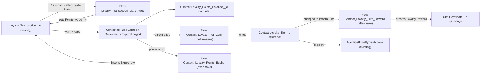

# Implementation spec — Loyalty program v2: points balance, tier auto-calc, 12-month expiry, and Pronto Elite reward

> Keep a points balance on each `Contact`, derive `Contact.Loyalty_Tier__c` from it, expire unredeemed points 12 months after they are earned, and issue one `Gift_Certificate__c` when a customer reaches Pronto Elite.

_Based on the requirement, the evidence reported by AskCoworker, and read-only org queries where noted. Assumptions and missing evidence are identified below. Specification only — nothing is implemented or deployed._

---

## 1. The requirement

Add a declarative loyalty engine on the existing `Loyalty_Transaction__c` ledger: roll-up balance fields on `Contact`, automatic `Contact.Loyalty_Tier__c` assignment, FIFO expiry of points older than 12 months through new `Expire` ledger rows, and a one-time `Gift_Certificate__c` of type `Loyalty Reward` on reaching `Pronto Elite`. No user decision changed the scope. The request contained no deploy or data-change instruction.

| # | Responsibility | Trigger | Where it lives |
| --- | --- | --- | --- |
| 1 | Points balance on `Contact` | Insert, update, delete, or undelete of a `Loyalty_Transaction__c` row | Roll-ups `Contact.Loyalty_Points_Earned__c`, `Contact.Loyalty_Points_Redeemed__c`, `Contact.Loyalty_Points_Expired__c`; formula `Contact.Loyalty_Points_Balance__c` |
| 2 | Tier auto-calculation | `Contact` update where an earned, redeemed, or expired roll-up changed | Flow `Contact_Loyalty_Tier_Calc` (before-save) writing existing `Contact.Loyalty_Tier__c` |
| 3 | Points expire after 12 months | 12 months after an `Earn` row is created | Flow `Loyalty_Transaction_Mark_Aged` (scheduled path), roll-up `Contact.Loyalty_Points_Aged__c`, flow `Contact_Loyalty_Points_Expire` inserting `Expire` rows |
| 4 | Gift certificate on reaching Pronto Elite | `Contact.Loyalty_Tier__c` changes to `Pronto Elite` and no reward was issued before | Flow `Contact_Loyalty_Elite_Reward` creating `Gift_Certificate__c`; guard `Contact.Loyalty_Elite_Reward_Issued__c` |

## 2. Grounding — reuse before building

Target org: `TestWriteSpecDE` (Developer Edition, `00Dak00001COqNeEAL`, not a sandbox). API version: `67.0`.

- **`Loyalty_Transaction__c`** (CustomObject) — the existing points ledger. Fields: `Contact__c` Master-Detail(`Contact`), cascade delete, not updateable (not reparentable); `Points__c` Number(18,0), not required; `Transaction_Type__c` picklist `Earn`, `Redeem`, not restricted, no record types; `Transaction_Source__c` picklist `Order`, `Promotion`, `Manual Adjustment`. The only date is `CreatedDate`. 0 records exist. _verified by org query_
- **`Contact.Loyalty_Tier__c`** (CustomField) — restricted picklist `Explorer`, `Insider`, `Pronto Plus`, `Pronto One`, `Pronto Elite`; description "The customer's current loyalty program tier." All 198 Contacts have it blank. Its only referencing component in `MetadataComponentDependency` is `AgentGetLoyaltyTierActions`; an Apex body search of all 70 unnamespaced classes finds the same single reader. _verified by org query_
- **`AgentGetLoyaltyTierActions`** (ApexClass, `with sharing`) — agent action that reads `Contact.Loyalty_Tier__c` by Contact Id or email and handles a blank tier. It stays unchanged and starts returning the calculated tier. _verified by org query_
- **`Gift_Certificate__c`** (CustomObject) — reward target. `Recipient__c` Lookup(`Contact`); `Type__c` includes `Loyalty Reward`; `Status__c` includes `Active`; `Value__c`, `Original_Value__c`, `Remaining_Value__c` (Currency); `Issue_Date__c`, `Expiration_Date__c` (Date); `Source_Channel__c`. 1 existing record (type `Recovery`). _verified by org query_
- **`AgentGiftCertificateActions`** and **`IssueGiftCardAction`** (ApexClass) — existing certificate writers. `AgentGiftCertificateActions` processes only `requests[0]`, so it is not reused from bulk record-triggered automation. _verified by org query_
- **No points or balance field exists.** Tooling `CustomField` search (unnamespaced, `%Point%`, `%Balance%`, `%Tier%`, `%Expir%`, `%Loyal%`, `%Elite%`) returns only `Loyalty_Transaction__c.Points__c`, `Contact.Loyalty_Tier__c`, `Gift_Certificate__c.Expiration_Date__c`, and two unrelated fields. No Loyalty Management standard objects (for example `LoyaltyProgramMember`) exist. _verified by org query_
- **No automation on the three objects.** 0 Apex triggers, 0 record-triggered flows, 0 validation rules on `Contact`, `Loyalty_Transaction__c`, `Gift_Certificate__c`; no flow named like Loyalty, Tier, or Point; the one active scheduled flow is `Orch`. _verified by org query_
- **Scheduled jobs** — five `CronTrigger` jobs exist; none relate to loyalty. _reported by AskCoworker_
- **Access today (partial: permission sets only, profiles not listed).** `Loyalty_Transaction__c`: `Agentforce_Reference_App`, `sfdc_accelerate_dms` Read/Create/Edit; `sfdc_a360_sfcrm_data_extract`, `sfdc_slack` Read. `Gift_Certificate__c`: also `Agentforce_Action_Access` and `Pronto_Deep_Dive_Workshop` Read/Create/Edit. _verified by org query_
- **`Loyalty_Transaction__ChangeEvent`** exists, so Change Data Capture is selected for the ledger; subscribers are not known. _verified by org query_
- **Project source** — `force-app/main/default` has no `objects`, `classes`, or `triggers` content for these components. _verified by project file_

Evidence sources: `sf org display`; `sf sobject list` (custom and all); `sobject describe` of `Contact`, `Loyalty_Transaction__c`, `Gift_Certificate__c`; Tooling `CustomField`, `CustomField.Metadata`, `ApexTrigger`, `ValidationRule`, `ApexClass` bodies, `MetadataComponentDependency`, `Layout`, `FlexiPage`, `GenAiFunctionDefinition`; standard `FlowDefinitionView`, `ObjectPermissions`, `FieldPermissions`, `RecordType`, `DataStream`, `Organization`, aggregate data queries. AskCoworker returned no citedReferences.

## 3. Architecture

Why the pieces are drawn this way:

1. `Loyalty_Transaction__c.Contact__c` is master-detail, so roll-up summary fields on `Contact` can sum `Points__c` by `Transaction_Type__c` without code. _verified by org query_ (field type); roll-up availability on a master-detail parent is _assumption (documented platform behavior)_.
2. Balance is earned minus redeemed minus expired. Redeem and Expire rows store positive `Points__c`. _assumption_ (0 records exist, so no sign convention can be observed).
3. Expiry uses the FIFO identity: redemptions consume the oldest points first, so the points still to expire equal `MAX(0, Aged − Redeemed − Expired)`. This needs only a per-row "aged" flag and one roll-up, so no Apex batch is required. _assumption_ (design reasoning; replaces an AskCoworker Apex proposal, see Section 8).
4. The roll-up recalculation saves the parent `Contact`, which runs `Contact` before-save and after-save record-triggered flows. _assumption (documented platform behavior: order of execution, roll-up parent save)_.
5. `Contact.Loyalty_Tier__c` is a restricted picklist read by `AgentGetLoyaltyTierActions`, so it is kept and written by a before-save flow (no extra DML) instead of being replaced by a formula. _verified by org query_ (field and reader).
6. The reward flow creates `Gift_Certificate__c` with a Create Records element, which the flow runtime bulkifies, rather than calling the single-request `AgentGiftCertificateActions`. _verified by org query_ (singleton behavior).

## 4. Metadata changes

**Data model**

- **Update `Loyalty_Transaction__c.Transaction_Type__c`** — Add the picklist value `Expire` (label `Expire`). The object has no record types, so no record type picklist assignment is needed. Existing values `Earn` and `Redeem` are unchanged.
- **Create `Loyalty_Transaction__c.Points_Aged__c`** — Checkbox, label "Points Aged", default unchecked. Set to true only by `Loyalty_Transaction_Mark_Aged` when an `Earn` row is 12 months old.
- **Create `Contact.Loyalty_Points_Earned__c`** — Roll-Up Summary, SUM of `Loyalty_Transaction__c.Points__c`, filter `Transaction_Type__c` equals `Earn`. Shows 0 when there are no matching rows; rows with blank `Points__c` add nothing.
- **Create `Contact.Loyalty_Points_Redeemed__c`** — Roll-Up Summary, SUM of `Loyalty_Transaction__c.Points__c`, filter `Transaction_Type__c` equals `Redeem`.
- **Create `Contact.Loyalty_Points_Expired__c`** — Roll-Up Summary, SUM of `Loyalty_Transaction__c.Points__c`, filter `Transaction_Type__c` equals `Expire`. Depends on the `Expire` value.
- **Create `Contact.Loyalty_Points_Aged__c`** — Roll-Up Summary, SUM of `Loyalty_Transaction__c.Points__c`, filter `Transaction_Type__c` equals `Earn` AND `Points_Aged__c` equals true. Depends on `Loyalty_Transaction__c.Points_Aged__c`.
- **Create `Contact.Loyalty_Points_Balance__c`** — Formula (Number, 0 decimals), label "Loyalty Points Balance": `Loyalty_Points_Earned__c - Loyalty_Points_Redeemed__c - Loyalty_Points_Expired__c`. Blank handling `BlankAsZero`. With all inputs blank or zero the result is 0. It can be negative only if redemptions exceed earned points (no rule prevents that today; see Section 8).
- **Create `Contact.Loyalty_Elite_Reward_Issued__c`** — Checkbox, label "Loyalty Elite Reward Issued", default unchecked. Set to true by `Contact_Loyalty_Elite_Reward`; prevents a second reward.

**Automation**

- **Create `Loyalty_Transaction_Mark_Aged`** — Record-triggered flow on `Loyalty_Transaction__c`, after-save, trigger "A record is created", entry condition `Transaction_Type__c` equals `Earn`. No immediate actions. One scheduled path: 12 months after `CreatedDate`. In the path, a Decision re-checks that `$Record.Transaction_Type__c` is still `Earn` and `Points_Aged__c` is false, then Update Records sets `Points_Aged__c` = true on `$Record`.
- **Create `Contact_Loyalty_Tier_Calc`** — Conditional: the point thresholds for each tier must be supplied (Section 8, Open 1). Record-triggered flow on `Contact`, before-save, trigger "A record is updated", run every time the entry condition is met; entry formula `ISCHANGED({!$Record.Loyalty_Points_Earned__c}) || ISCHANGED({!$Record.Loyalty_Points_Redeemed__c}) || ISCHANGED({!$Record.Loyalty_Points_Expired__c})`. A formula resource computes balance = earned − redeemed − expired (the same expression as `Loyalty_Points_Balance__c`, so the flow does not depend on formula-field evaluation in before-save). A Decision assigns `Loyalty_Tier__c` from highest to lowest threshold: `Pronto Elite`, `Pronto One`, `Pronto Plus`, `Insider`, else `Explorer`. The tier moves down as well as up. Contacts with no ledger rows are never updated and keep a blank tier.
- **Create `Contact_Loyalty_Points_Expire`** — Record-triggered flow on `Contact`, after-save, trigger "A record is updated", run only when the record is updated to meet the condition; entry formula `{!$Record.Loyalty_Points_Aged__c} - {!$Record.Loyalty_Points_Redeemed__c} - {!$Record.Loyalty_Points_Expired__c} > 0`. Create Records inserts one `Loyalty_Transaction__c` with `Contact__c` = `$Record.Id`, `Transaction_Type__c` = `Expire`, `Points__c` = that difference, `Transaction_Source__c` blank. The insert raises `Loyalty_Points_Expired__c` by the same amount, so the condition becomes false and the flow does not re-enter.
- **Create `Contact_Loyalty_Elite_Reward`** — Conditional: the reward value must be supplied (Section 8, Open 2). Record-triggered flow on `Contact`, after-save, trigger "A record is updated", run only when the record is updated to meet the condition; entry formula `ISPICKVAL({!$Record.Loyalty_Tier__c}, 'Pronto Elite') && NOT({!$Record.Loyalty_Elite_Reward_Issued__c})`. Create Records inserts `Gift_Certificate__c` with `Recipient__c` = `$Record.Id`, `Type__c` = `Loyalty Reward`, `Status__c` = `Active`, `Value__c`, `Original_Value__c`, and `Remaining_Value__c` = the reward value (flow constant), `Issue_Date__c` = `{!$Flow.CurrentDate}`, `Expiration_Date__c` blank. Then Update Records sets `$Record.Loyalty_Elite_Reward_Issued__c` = true.

**Security**

- **Create `Loyalty_Program_Access`** — Permission set, label "Loyalty Program Access". Object Read on `Loyalty_Transaction__c`. Field Read (no Edit) on `Contact.Loyalty_Points_Earned__c`, `Contact.Loyalty_Points_Redeemed__c`, `Contact.Loyalty_Points_Expired__c`, `Contact.Loyalty_Points_Aged__c`, `Contact.Loyalty_Points_Balance__c`, `Contact.Loyalty_Elite_Reward_Issued__c`, `Loyalty_Transaction__c.Points_Aged__c`. No existing permission set or profile is changed.

**Tests**

- **Create `LoyaltyProgramFlowsTest`** — Apex test class (`@IsTest`) that exercises the flows through DML, because record-triggered flows have no other automated regression harness that covers the roll-up → parent-save chain. Methods are listed in Section 7.

## 5. Data 360 (Data Cloud) data involved

Not applicable — this change does not use Data 360. `SELECT COUNT() FROM DataStream` returns 0 _verified by org query_. `sfdc_a360_sfcrm_data_extract` has Read on `Loyalty_Transaction__c` today _verified by org query_ but receives no access to the new fields (Section 8).

## 6. Security considerations

- **Execution context.** All four flows are record-triggered and run in system context without sharing, so they read and write the new fields and create `Gift_Certificate__c` and `Expire` rows regardless of the triggering user's CRUD, FLS, or sharing. _assumption (documented platform behavior)_. The scheduled path runs as the Automated Process user. _assumption (documented platform behavior)_.
- **Record ownership.** `Gift_Certificate__c` created by `Contact_Loyalty_Elite_Reward` is owned by the user whose transaction raised the tier, or by the Automated Process user when expiry-driven saves run from the scheduled path. `Loyalty_Transaction__c` is a detail row and follows the `Contact`'s sharing. _assumption (documented platform behavior)_.
- **CRUD/FLS.** The roll-ups and formula are read-only by type. `Points_Aged__c` and `Loyalty_Elite_Reward_Issued__c` are written only by flows; `Loyalty_Program_Access` grants Read only. Existing holders of Edit on `Loyalty_Transaction__c` (`Agentforce_Reference_App`, `sfdc_accelerate_dms`) do not get field access to `Points_Aged__c` unless it is added to those sets. _verified by org query_ (current grants). Permission sets are not the only grant path; profiles (not listed here) can also grant FLS.
- **Who gets access.** Only users assigned `Loyalty_Program_Access` see the new fields. Integration and agent permission sets (`sfdc_a360_sfcrm_data_extract`, `sfdc_slack`, `Agentforce_Reference_App`) get nothing new by default; granting them is an open decision.
- **Data exposure.** No new personal data is stored. Points and tier are customer-program data already present in `Loyalty_Transaction__c` and `Contact.Loyalty_Tier__c`. Change Data Capture on `Loyalty_Transaction__c` will publish events for `Expire` inserts and `Points_Aged__c` updates to any existing subscribers. _verified by org query_ (ChangeEvent object exists); subscribers not specified.

## 7. Testing strategy

Planned test class `LoyaltyProgramFlowsTest` (no tests have run):

- **Balance.** Insert `Earn` 1500 and `Redeem` 500 for one Contact; assert `Loyalty_Points_Earned__c` = 1500, `Loyalty_Points_Redeemed__c` = 500, `Loyalty_Points_Balance__c` = 1000. Insert with blank `Points__c`; assert no change.
- **Tier.** For each threshold boundary (below, equal, above), assert `Loyalty_Tier__c`. Assert a downgrade after a large `Redeem`. Assert a Contact with no ledger rows keeps a blank tier. Depends on Open 1 values.
- **Delete and undelete.** Delete an `Earn` row; assert balance and tier drop. Undelete it; assert they return.
- **Expiry.** Apex tests cannot execute a 12-month scheduled path, so insert an `Earn` row, then update `Points_Aged__c` = true directly, and assert one `Expire` row for `Aged − Redeemed − Expired` and no second `Expire` row. Assert no `Expire` row when redemptions already exceed aged points.
- **Reward.** Raise balance to the Elite threshold; assert one `Gift_Certificate__c` (`Type__c` = `Loyalty Reward`, `Status__c` = `Active`, `Recipient__c` = Contact) and `Loyalty_Elite_Reward_Issued__c` = true. Drop below Elite and return; assert no second certificate. Add points while already Elite; assert no new certificate.
- **Bulk.** Insert 200 `Earn` rows across 200 Contacts in one DML, half crossing the Elite threshold; assert 100 certificates and no limit exception. Insert 200 rows for one Contact; assert the sum.
- **Permission.** Use `System.runAs` with a test user assigned `Loyalty_Program_Access` to assert Read and no Edit on the new fields via `Schema.DescribeFieldResult`.

Recommended verification (manual, in a sandbox or scratch org): activate `Loyalty_Transaction_Mark_Aged` with a temporary short offset to observe the scheduled path end to end, then restore the 12-month offset before deployment; confirm `AgentGetLoyaltyTierActions` returns the calculated tier.

## 8. Open decisions

### Open

1. **Tier point thresholds (blocking for delivery).** Neither the requirement nor any org component defines the balance needed for `Insider`, `Pronto Plus`, `Pronto One`, or `Pronto Elite`; AskCoworker found no enterprise source. `Contact_Loyalty_Tier_Calc` (Conditional) cannot be configured without them. Default: `Explorer` from 0; store the thresholds as flow constants. A `Loyalty_Tier_Threshold__mdt` custom metadata type is a proposal if the business wants to change thresholds without a flow edit.
2. **Pronto Elite reward value (blocking for delivery).** The `Gift_Certificate__c.Value__c` amount is not specified. `Contact_Loyalty_Elite_Reward` (Conditional) needs it. Default: a single flow constant used for `Value__c`, `Original_Value__c`, and `Remaining_Value__c`; `Expiration_Date__c` left blank, matching `AgentGiftCertificateActions` when no date is supplied.
3. **Scheduled path offset unit (non-blocking).** The design uses an offset of 12 months after `CreatedDate`. If the flow builder in this org offers only days for this path, use 365 days. _assumption (documented platform behavior)_.
4. **Deployment sequence (non-blocking).** Deploy in order: `Transaction_Type__c` value and `Points_Aged__c`; the five `Contact` fields; `Loyalty_Program_Access`; the four flows (activate `Contact_Loyalty_Tier_Calc` and `Contact_Loyalty_Elite_Reward` only after Open 1 and 2 are settled); `LoyaltyProgramFlowsTest`. No backfill is needed because 0 `Loyalty_Transaction__c` rows exist _verified by org query_. If historical rows are imported later, their `CreatedDate` is the import date, so they age from import, and the scheduled path is only created for rows inserted after activation.
5. **Permission set assignment and integration access (non-blocking).** Which users get `Loyalty_Program_Access` is not specified. Granting the new fields to `Agentforce_Reference_App`, `sfdc_accelerate_dms`, `sfdc_slack`, or `sfdc_a360_sfcrm_data_extract` was not requested and is left out.
6. **Page placement (non-blocking).** `Contact` has four layouts (`Contact-Contact Layout`, `Contact-Contact (Sales) Layout`, `Contact-Contact (Marketing) Layout`, `Contact-Contact (Support) Layout`) and FlexiPages `Business_Contact_Record_Page` and `Customer_Contact_Record_Page` _verified by org query_; layout assignments cannot be read with the allowed commands. Default: no layout change in this spec; add `Contact.Loyalty_Points_Balance__c` to the layout used by `Customer_Contact_Record_Page` once the assignment is confirmed.
7. **Uncovered transitions (non-blocking).** Manual edits to `Contact.Loyalty_Tier__c` persist until the next balance change, then are overwritten. Manually changing a row's `Transaction_Type__c` after it aged, or editing `Points__c` on an `Expire` row, changes the balance through the roll-ups; no validation rule protects the ledger. Redemptions larger than the balance are not blocked. A validation rule to protect `Points_Aged__c` and `Expire` rows is a proposal, not in the inventory.
8. **Reward on re-attainment (non-blocking).** Default: one reward per Contact for life (the requirement says "when they reach"). A customer who drops below and returns to `Pronto Elite` gets no second certificate.
9. **Change Data Capture subscribers (non-blocking).** `Loyalty_Transaction__ChangeEvent` exists; any subscriber will start receiving `Expire` inserts and `Points_Aged__c` updates. Subscribers not specified.

### Resolved

- **Balance model** — three filtered roll-ups and one formula, with positive `Points__c` on `Redeem` and `Expire` rows. _assumption_: no records exist to show a sign convention; a single signed SUM would break if any writer stores positive redemptions.
- **Tier basis** — current balance (so tiers fall when points expire), not lifetime points. _assumption_: the requirement couples tier to the balance and to expiry.
- **Expiry semantics** — FIFO: points earned more than 12 months ago that were not redeemed expire, recorded as `Expire` ledger rows. _assumption_: this is the standard reading and keeps an auditable ledger.
- **Correction to AskCoworker (I call)** — it proposed an Apex batch `LoyaltyPointsExpiryBatch` and its test because FIFO "cannot be expressed declaratively". The FIFO identity `MAX(0, Aged − Redeemed − Expired)` makes it declarative, so both Apex rows were replaced by `Loyalty_Transaction__c.Points_Aged__c`, `Contact.Loyalty_Points_Aged__c`, `Loyalty_Transaction_Mark_Aged`, and `Contact_Loyalty_Points_Expire` (Rule 4).
- **Correction to AskCoworker (I call)** — it placed tier calculation in an after-save flow on `Loyalty_Transaction__c` that updates the parent. A before-save flow on `Contact`, fired by the roll-up parent save, needs no extra DML and also covers deletes; adopted instead.
- **Correction to AskCoworker (D1)** — it reported `Gift_Certificate__c.Type__c` values as unknown; describe shows `Loyalty Reward` exists, so no picklist change is needed.
- **Corrections to AskCoworker (R and T)** — it claimed the reward flow issues one DML per Contact and risks the 150-DML limit; flow Create Records elements are bulkified per batch. It flagged recursion in `Contact_Loyalty_Points_Expire`; the "updated to meet the condition" entry and the self-cancelling formula prevent re-entry. It proposed `Test.setCreatedDate` to run the scheduled path; Apex tests cannot run scheduled paths, so the test sets `Points_Aged__c` directly. It listed Read grants for `sfdc_slack` and `sfdc_a360_sfcrm_data_extract` as needed; they are not granted (least access; Open 5).
- **Dropped AskCoworker proposals** — validation rule on `Points_Aged__c`, org-wide coverage concern for a Developer Edition deployment, and the tier threshold custom metadata type (kept only as a proposal in Open 1).
- **Duplicate-reward guard** — a `Contact.Loyalty_Elite_Reward_Issued__c` checkbox rather than a lookup for existing `Loyalty Reward` certificates, because other writers (`AgentGiftCertificateActions` accepts any `Type__c`) could create `Loyalty Reward` certificates for other reasons. _assumption_.

## 9. Change set

| # | Action | Type | API name | Module | Why |
| --- | --- | --- | --- | --- | --- |
| 1 | Update | CustomField | `Loyalty_Transaction__c.Transaction_Type__c` | force-app/main/default/objects/Loyalty_Transaction__c/fields | Add `Expire` value for expiry ledger rows |
| 2 | Create | CustomField | `Loyalty_Transaction__c.Points_Aged__c` | force-app/main/default/objects/Loyalty_Transaction__c/fields | Flags `Earn` rows older than 12 months |
| 3 | Create | CustomField | `Contact.Loyalty_Points_Earned__c` | force-app/main/default/objects/Contact/fields | Roll-up of earned points |
| 4 | Create | CustomField | `Contact.Loyalty_Points_Redeemed__c` | force-app/main/default/objects/Contact/fields | Roll-up of redeemed points |
| 5 | Create | CustomField | `Contact.Loyalty_Points_Expired__c` | force-app/main/default/objects/Contact/fields | Roll-up of expired points |
| 6 | Create | CustomField | `Contact.Loyalty_Points_Aged__c` | force-app/main/default/objects/Contact/fields | Roll-up of aged earned points for FIFO expiry |
| 7 | Create | CustomField | `Contact.Loyalty_Points_Balance__c` | force-app/main/default/objects/Contact/fields | Points balance on Contact |
| 8 | Create | CustomField | `Contact.Loyalty_Elite_Reward_Issued__c` | force-app/main/default/objects/Contact/fields | Prevents a second Elite reward |
| 9 | Create | Flow | `Loyalty_Transaction_Mark_Aged` | force-app/main/default/flows | Marks `Earn` rows aged after 12 months |
| 10 | Create | Flow | `Contact_Loyalty_Tier_Calc` | force-app/main/default/flows | Tier auto-calculation from balance |
| 11 | Create | Flow | `Contact_Loyalty_Points_Expire` | force-app/main/default/flows | Inserts `Expire` rows for unredeemed aged points |
| 12 | Create | Flow | `Contact_Loyalty_Elite_Reward` | force-app/main/default/flows | Issues the Pronto Elite gift certificate |
| 13 | Create | PermissionSet | `Loyalty_Program_Access` | force-app/main/default/permissionsets | Read access to the new fields |
| 14 | Create | ApexClass | `LoyaltyProgramFlowsTest` | force-app/main/default/classes | Regression tests for the flows and roll-ups |

A declarative ledger design: roll-ups on `Contact` over `Loyalty_Transaction__c` drive a before-save tier flow, a scheduled path plus an after-save flow expire points FIFO, and an after-save flow issues one `Loyalty Reward` certificate at `Pronto Elite`.

Total: 14 · Create: 13 · Update: 1 · Delete: 0
