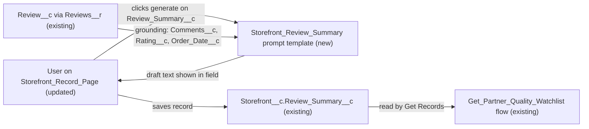

# Implementation spec — AI review summary on the Storefront record

> Let users generate a short AI summary of a storefront's reviews into the existing `Storefront__c.Review_Summary__c` field, directly on the Storefront record page.

_Based on the requirement, the evidence reported by AskCoworker, and read-only org queries where noted. Assumptions and missing evidence are identified below. Specification only — nothing is implemented or deployed._

---

## 1. The requirement

Show a short AI-generated summary of each storefront's `Review__c` records on the `Storefront__c` record. The user had no preference on when the summary is generated, so the design uses on-demand generation from the record page (an *assumption*, see Section 8). The request contained no deploy or data-change instructions.

| # | Responsibility | Trigger | Where it lives |
| --- | --- | --- | --- |
| 1 | Generate a short summary of the storefront's reviews with AI | User clicks the Einstein generate control on the field | `Storefront_Review_Summary` (GenAiPromptTemplate, new) |
| 2 | Store the summary on the storefront | User saves the generated text | `Storefront__c.Review_Summary__c` (existing) |
| 3 | Show the summary on the storefront record | Record page load | `Storefront_Record_Page` (FlexiPage, updated) |

## 2. Grounding — reuse before building

Target org: `TestWriteSpecDE` (Developer Edition, not a sandbox). API version: `67.0`.

- **`Storefront__c.Review_Summary__c`** (CustomField, Long Text Area 1000, plain text, updateable) — description "Concise summary of customer reviews for the storefront."; blank on all 21 `Storefront__c` records. It is reused as the target field; no new field is created. _verified by org query_
- **`Review__c.Storefront__c`** (Master-Detail to `Storefront__c`, child relationship `Reviews__r`, not reparentable, cascade delete). _verified by org query_
- **`Review__c.Comments__c`** (Long Text Area 32768), **`Review__c.Rating__c`** (Number 1,0), **`Review__c.Order_Date__c`** (Date) — the review content used as grounding. `Review__c.Status__c` is null on all 92 reviews, so no status filter is applied. _verified by org query_
- **Review data shape** — 92 `Review__c` records on 19 of 21 storefronts; the most on one storefront is 8; 2 storefronts have none. _verified by org query_
- **`Storefront_Record_Page`** (FlexiPage, RecordPage for `Storefront__c`) — uses Dynamic Forms field sections, including a "Reviews" section with `Total_Reviews__c` and `Average_Review_Score__c`. `Review_Summary__c` is not on this page and not on `Storefront__c-Storefront Layout`. _verified by org query_
- **Automation on `Storefront__c` and `Review__c`** — no Apex triggers, no record-triggered flows, no validation rules. _verified by org query_
- **Readers of `Review_Summary__c`** — `MetadataComponentDependency` lists only the flow `Get_Partner_Quality_Watchlist` (autolaunched, active; read-only Get Records that returns the field). A scan of all 70 unnamespaced Apex class bodies found no reference to `Review_Summary__c`. _verified by org query_
- **`AgentSummarizeReviewsActions`** (ApexClass, `with sharing`, invocable; used by the `Summarize_Reviews` agent actions) — returns review rows and rating statistics to agents; it makes no LLM call and does not write `Review_Summary__c`. It is not changed. _verified by org query_
- **Access** — Read and Edit on `Storefront__c` and on `Review_Summary__c`: `Agentforce_Reference_App` (1 assignee) and `sfdc_accelerate_dms` (namespace `sfdcInternalInt`). Read only: `Pronto_Deep_Dive_Workshop`, `sfdc_slack`, `sfdc_a360_sfcrm_data_extract`. The same five permission sets read `Review__c.Comments__c`. Profile grants were not listed. _verified by org query_
- **`EinsteinGPTPromptTemplateUser`** (platform permission set, namespace `force`) exists and has 0 assignees. _verified by org query_
- **Generative AI** — Agentforce agents exist (`BotDefinition`, `GenAiPlannerDefinition` rows), which indicates Einstein generative AI is enabled. Prompt Builder and Field Generation availability cannot be read with the allowed commands (`GenAiPromptTemplate` is not queryable). _verified by org query_ for the agent rows; availability is an *assumption*.
- **Data 360** — `SELECT COUNT() FROM DataStream` returns 0. _verified by org query_

Evidence sources: EntityDefinition, FieldDefinition, sobject describe, record counts, Tooling `MetadataComponentDependency`, `ApexTrigger`, `FlowDefinitionView`, `ValidationRule`, `Flow.Metadata`, `FlexiPage.Metadata`, `Layout.Metadata`, `CustomField.Metadata`, `ApexClass` bodies, `FieldPermissions`, `ObjectPermissions`, `PermissionSet`, `PermissionSetAssignment`, `GenAiFunctionDefinition`, `DataStream`. AskCoworker returned no citedReferences.

## 3. Architecture

Why the pieces are drawn this way:

1. `Storefront_Record_Page` is the Storefront record page and uses Dynamic Forms; a field placed there can have a Field Generation prompt template assigned. The page is _verified by org query_; the Field Generation behavior is an *assumption (documented platform behavior)*.
2. `Storefront_Review_Summary` is a Field Generation prompt template on `Storefront__c`. It reads the `Reviews__r` related list as grounding. Field Generation places the generated text in the field for the user to review and edit; nothing is written until the user saves. _assumption (documented platform behavior)_
3. The saved text goes into the existing `Review_Summary__c` field, which was created for this purpose and is empty today. _verified by org query_
4. `Get_Partner_Quality_Watchlist` already returns `Review_Summary__c`; it will return the summary once one is saved. It is not changed. _verified by org query_
5. No Apex is used. Prompt Builder with Field Generation is declarative and covers generate, review, and store on one record page.

## 4. Metadata changes

**AI**

- **Create `Storefront_Review_Summary`** — Conditional: Prompt Builder with Field Generation templates is available in `TestWriteSpecDE`. GenAiPromptTemplate of type Field Generation. Object `Storefront__c`; target field `Review_Summary__c`. Grounding: related-list merge field for `Reviews__r` with `Comments__c`, `Rating__c`, and `Order_Date__c`. Instruction (default): "Summarize the customer reviews for this storefront in 3 to 5 sentences and under 900 characters. State the overall sentiment and the most common positive and negative themes. Do not include customer names. If there are no reviews, reply exactly: No reviews yet." The 900-character target leaves room under the 1000-character field limit. Activate the template after deployment.

**UX**

- **Update `Storefront_Record_Page`** — Conditional: the template `Storefront_Review_Summary` can be deployed and activated. Add a field item for `Review_Summary__c` to the existing "Reviews" field section, after `Average_Review_Score__c`, with the Field Generation prompt template set to `Storefront_Review_Summary`. The field is editable on the page for users with Edit access and read-only for others. This page is the only Storefront record page, so all users of it see the new field.

## 5. Data 360 (Data Cloud) data involved

Not applicable — this change does not use Data 360. The org has no data streams (_verified by org query_).

## 6. Security considerations

- **Execution context.** The prompt template runs as the user who clicks generate, and resolves grounding with that user's sharing and field access. _assumption (documented platform behavior)_ `Storefront__c` has internal OWD ReadWrite and `Review__c` is Controlled by Parent (_verified by org query_), so any internal user who can open a storefront can see its reviews.
- **Who can generate and save.** Saving needs Edit on `Storefront__c` and on `Review_Summary__c`. Today that is `Agentforce_Reference_App` and `sfdc_accelerate_dms` (_verified by org query_; profiles not checked). `Pronto_Deep_Dive_Workshop` users can read the summary but cannot save one. No field permission changes are made.
- **Prompt template access.** Running a prompt template needs the platform permission set `EinsteinGPTPromptTemplateUser` (_assumption (documented platform behavior)_). It has 0 assignees (_verified by org query_). Assigning it is a setup step, not part of this change set; see Section 8.
- **Data exposure.** Review comments are free text written by customers and are sent to the LLM through the Einstein Trust Layer. The stored summary is visible to everyone with Read on `Review_Summary__c` (the five permission sets listed in Section 2), the same audience that can already read `Review__c.Comments__c`. The instruction excludes customer names.

## 7. Testing strategy

No Apex is added, so there is no Apex test class. All cases below are recommended manual verification after deployment.

1. **Happy path.** As a user with `Agentforce_Reference_App` and `EinsteinGPTPromptTemplateUser`, open a storefront with 8 reviews, generate, save. `Review_Summary__c` holds 3 to 5 sentences under 1000 characters that match the review content.
2. **No reviews.** Open one of the 2 storefronts with no reviews and generate. The text is "No reviews yet." and no error appears.
3. **Not saved.** Generate, then cancel. `Review_Summary__c` stays unchanged.
4. **Regenerate.** On a storefront with a saved summary, generate again and save. The new text replaces the old.
5. **Stale summary.** Add a review after a summary is saved. The summary does not change until someone regenerates it (expected with on-demand generation).
6. **Read-only user.** As a user with only `Pronto_Deep_Dive_Workshop`, open a storefront. The summary is visible; generate and save are not available.
7. **Missing prompt permission.** As a user with Edit access but without `EinsteinGPTPromptTemplateUser`, confirm that generate is not available.
8. **Existing reader.** Run `Get_Partner_Quality_Watchlist` and confirm it returns the saved summary without errors.

Bulk is not applicable: generation is one record at a time from the page.

## 8. Open decisions

### Open

1. **Prompt Builder and Field Generation availability (blocking).** `Storefront_Review_Summary` and the `Storefront_Record_Page` update are Conditional on Prompt Builder with Field Generation templates being available in `TestWriteSpecDE`. Agents exist, which suggests generative AI is on, but the allowed commands cannot confirm the feature. Confirm in Setup (Einstein Setup, Prompt Builder) before deployment.
2. **Assign `EinsteinGPTPromptTemplateUser` (blocking for delivery).** It has 0 assignees. Without it, no user can run the template, so Responsibility 1 fails. Recommended default: assign it to the users who hold `Agentforce_Reference_App` (1 user today). This is an assignment, not a metadata change.
3. **Deployment sequence (non-blocking).** Deploy and activate `Storefront_Review_Summary`, then deploy `Storefront_Record_Page`, then assign `EinsteinGPTPromptTemplateUser`.
4. **Summary freshness (non-blocking).** Summaries do not update when a `Review__c` is created, edited, deleted, or undeleted, or when the storefront's review set otherwise changes; they reflect the reviews at the last generation. All 21 storefronts start blank until someone generates. If automatic refresh is wanted later, it needs a record-triggered flow on `Review__c` and a different template type; that is not in this spec.
5. **Who may generate (non-blocking).** `Pronto_Deep_Dive_Workshop` is read-only on `Storefront__c` and `Review_Summary__c`. Recommended default: leave it read-only. Granting Edit is a separate decision.

### Resolved

- **On demand versus automatic generation.** Asked the user; no preference. Chose on-demand Field Generation because it needs two components, no Apex, and lets a user review the text before it is saved. _assumption_
- **Reuse `Review_Summary__c`.** The field exists for this purpose and is empty on every record; its only reader is `Get_Partner_Quality_Watchlist`, which is read-only and benefits from a populated value. _verified by org query_
- **AskCoworker D2 said no flow touches the objects.** `MetadataComponentDependency` found `Get_Partner_Quality_Watchlist` reading `Review_Summary__c`; it is autolaunched, not record-triggered, so the "no record-triggered flows" part stands. _verified by org query_
- **Grounding correction.** AskCoworker proposed a SOQL subquery with `ORDER BY` and `LIMIT 10` inside the template. Field Generation templates ground related data through related-list merge fields, not a custom subquery (_assumption (documented platform behavior)_). With at most 8 reviews per storefront (_verified by org query_), no limit is needed.
- **Save behavior correction.** AskCoworker described a read-only text area that writes on generate. Field Generation fills the field as a draft and the user saves the record. _assumption (documented platform behavior)_
- **Length.** AskCoworker suggested "under 1000 characters"; the instruction targets 900 so the output fits the 1000-character field.
- **Dropped AskCoworker proposals.** A `Last_Summary_Generated__c` field with a flow, a custom LWC with Apex, a scheduled batch, and Edit grants for `Pronto_Deep_Dive_Workshop` were not requested and are not in the inventory. AskCoworker's claim that `AgentSummarizeReviewsActions` cannot meet the requirement on its own is confirmed: it does not write the field (_verified by org query_).

## 9. Change set

| # | Action | Type | API name | Module | Why |
| --- | --- | --- | --- | --- | --- |
| 1 | Create | GenAiPromptTemplate | `Storefront_Review_Summary` | force-app/main/default/genAiPromptTemplates | Generates the short review summary from `Reviews__r` into `Review_Summary__c` |
| 2 | Update | FlexiPage | `Storefront_Record_Page` | force-app/main/default/flexipages | Shows `Review_Summary__c` in the Reviews section with the template assigned |

A Field Generation prompt template grounded on the storefront's reviews fills the existing `Review_Summary__c` field from the Storefront record page, where the user reviews and saves it.

Total: 2 · Create: 1 · Update: 1 · Delete: 0
