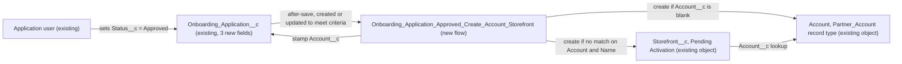

# Implementation spec — Create merchant Account and Storefront on onboarding approval

> When an `Onboarding_Application__c` record reaches `Approved`, a record-triggered flow creates (or reuses) the merchant's business Account and creates a `Storefront__c` in `Pending Activation`, copying the merchant name, address, phone, and cuisine captured on the application.

_Based on the requirement, the evidence reported by AskCoworker, and read-only org queries where noted. Assumptions and missing evidence are identified below. Specification only — nothing is implemented or deployed._

---

## 1. The requirement

When an onboarding application's status becomes `Approved`, create the merchant's Account and Storefront automatically. User decisions widened the scope: the Account is a business (`Partner_Account`) Account, the Storefront starts in `Pending Activation`, and the merchant's address, cuisine, and phone are captured on the application and copied. The application has no address, phone, or cuisine field today, so this spec adds them. No out-of-scope instructions were present.

| # | Responsibility | Trigger | Where it lives |
| --- | --- | --- | --- |
| 1 | Capture merchant address, phone, and cuisine on the application | User edits the application | `Onboarding_Application__c.Address__c`, `Onboarding_Application__c.Phone__c`, `Onboarding_Application__c.Cuisine__c`, `Onboarding_Application__c-Onboarding Application Layout` |
| 2 | Give application users access to the merchant detail fields | Permission set assignment | `Onboarding_Application_Merchant_Details` |
| 3 | Create (or reuse) the merchant's `Partner_Account` Account and link it to the application | Application created or updated into `Status__c = Approved` | `Onboarding_Application_Approved_Create_Account_Storefront` |
| 4 | Create the `Storefront__c` in `Pending Activation`, linked to the Account | Same event, after responsibility 3 | `Onboarding_Application_Approved_Create_Account_Storefront` |

## 2. Grounding — reuse before building

Target org: `TestWriteSpecDE` (org ID `00Dak00001COqNeEAL`, connected). API version: `67.0` (org; no `sfdx-project.json` in the project).

- **`Onboarding_Application__c`** (CustomObject) — the onboarding application. Its complete custom field list (Tooling `CustomField`) is `Account__c`, `Application_Created_Date__c`, `Application_Submitted_Date__c`, `Business_License_Number__c`, `Merchant_Business_Name__c`, `Onboarding_Specialist__c`, `Operational_Procedures__c`, `Status__c`. There is no address, phone, or cuisine field. _verified by org query_
- **`Onboarding_Application__c.Status__c`** (Picklist, required) — active values `Submitted`, `Under Review`, `Approved`, `Onboarded`. _verified by org query_
- **`Onboarding_Application__c.Account__c`** (Lookup to Account, `deleteConstraint` `SetNull`, relationship `Onboarding_Applications`) — reused to link the application to its Account. _verified by org query_
- **`Onboarding_Application__c.Merchant_Business_Name__c`** (Text 100, description "Merchants Business Name") — source for the Account and Storefront names. _verified by org query_
- **`Storefront__c`** (CustomObject) — fields used: `Account__c` (Lookup to Account), `Address__c` (custom compound Address with `Address__Street__s`, `Address__City__s`, `Address__PostalCode__s`, `Address__StateCode__s`, `Address__CountryCode__s`), `Phone__c` (Phone), `Cuisine__c` (unrestricted Picklist, 100 active values), `Status__c` (Picklist: `Active`, `Inactive`, `Pending Activation`, `Suspended`, `Closed`; no default). It has no lookup to `Onboarding_Application__c`. _verified by org query_
- **Account record type `Partner_Account`** (Id `012ak00000DMPd2AAH`) — all 21 existing Storefronts belong to `Partner_Account` Accounts (Type `Restaurant Group` 14, `Independent Vendor` 7); `Customer_Account` holds 190 consumer Accounts. Account has `BillingStateCode` and `BillingCountryCode`, so state and country picklists are enabled. _verified by org query_
- **`Onboarding_Application__c-Onboarding Application Layout`** (Layout) — the only layout on the object; section "Information" holds all custom fields. Both record pages (`Onboarding_Application_Record_Page`, `Onboarding_Application_Record_Page1`) use the record detail panel and no Dynamic Forms fields, so the layout controls field placement. _verified by org query_
- **Existing automation (complete for unmanaged components):** no Apex triggers on `Onboarding_Application__c`, `Storefront__c`, or `Account`; no record-triggered flows in the org (all 14 unmanaged flows are autolaunched, screen, or routing flows); no validation rules on `Onboarding_Application__c`, `Storefront__c`, or `Account`; no approval processes on `Onboarding_Application__c` or `Storefront__c`; no unmanaged Apex class mentions `Onboarding_Application__c` or "Onboarding"; `MetadataComponentDependency` returns no references to `Onboarding_Application__c`. The Account duplicate rule `Standard_Account_Duplicate_Rule` is inactive. _verified by org query_
- **Data shape:** `Onboarding_Application__c` has 0 records. _verified by org query_
- **Access today:** `Onboarding_Application__c` field access (FieldPermissions) is granted only by `sfdc_accelerate_dms` (Read/Edit), `sfdc_a360_sfcrm_data_extract` (Read), and `sfdc_slack` (Read), all in namespace `sfdcInternalInt` and assigned only to the Platform Integration User. No profile has FieldPermissions rows on the object. Object access: those three sets plus the `System Administrator` profile (Read/Create/Edit) and `Analytics Cloud Integration User` profile (Read). _verified by org query_

Candidates examined and rejected: `Account.Cuisine_Type__c` — its value set (20 values) differs from `Storefront__c.Cuisine__c`, so it is not mapped; the 8 unmanaged permission sets AskCoworker listed (`Merchant_Management_Agent_Access`, `Merchant_Account_Manager_Agent_Access`, `Merchant_Support_Agent_Permissions`, `Agentforce_Action_Access`, `Agentforce_Reference_App`, `Pronto_Deep_Dive_Workshop`, `Pronto_ECP_Access`, `Agentforce_Actions`) exist but none grants `Onboarding_Application__c` object access, and widening agent or broad sets is not wanted; `Storefront__c` creators in Apex are test classes only (`StorefrontPickerActionTest`, `MerchantRiskScoreActionTest`, `AgentActionsTest`), so no reusable Storefront-creation service exists.

AskCoworker made four wrong claims in this run, so every AskCoworker fact kept here was verified by org query, and the *R* (runtime and security) and *T* (testing) calls were skipped; those topics are covered by org queries and documented platform behavior.

Evidence sources: `sf org display`; `sf sobject list --sobject custom`; `sobject describe` of `Onboarding_Application__c`, `Storefront__c`, `Account`; Tooling `EntityDefinition`, `CustomField` (list and per-field `Metadata`), `ApexTrigger`, `ApexClass` bodies, `ValidationRule`, `MetadataComponentDependency`, `Layout.Metadata`, `FlexiPage.Metadata`; `FlowDefinitionView`, `ProcessDefinition`, `RecordType`, `DuplicateRule`, `FieldPermissions`, `ObjectPermissions`, `PermissionSet`, `Profile`, aggregate record counts. AskCoworker returned no citedReferences.

## 3. Architecture

Why the pieces are drawn this way:

1. A record-triggered, after-save flow is the platform's declarative mechanism for creating related records on a status change. No trigger, flow, or Apex exists on these objects (_verified by org query_), so there is nothing to extend and no Apex is needed.
2. The flow stamps the existing `Onboarding_Application__c.Account__c` lookup rather than adding a new relationship (_verified by org query_ that the lookup exists).
3. The Storefront links to the Account through the existing `Storefront__c.Account__c` lookup (_verified by org query_). No application-to-Storefront lookup is added; see Section 8 for the duplicate guard.
4. The three new application fields reuse the field types of their `Storefront__c` targets (Address, Phone, Picklist), so values copy without conversion.

## 4. Metadata changes

**Data model**

- **Create `Onboarding_Application__c.Address__c`** — CustomField, type Address (custom compound address, the same type as `Storefront__c.Address__c`), label "Business Address", not required. State and country use the org's state and country picklists. Copied to the Account billing address and to `Storefront__c.Address__c`.
- **Create `Onboarding_Application__c.Phone__c`** — CustomField, type Phone, label "Business Phone", not required. Copied to `Account.Phone` and `Storefront__c.Phone__c`.
- **Create `Onboarding_Application__c.Cuisine__c`** — CustomField, type Picklist, label "Cuisine", unrestricted, not required, no default. Values: a copy of the 100 active values of `Storefront__c.Cuisine__c`, in the same order. Copied to `Storefront__c.Cuisine__c`. A global value set is not used (see Section 8).

**Automation**

- **Create `Onboarding_Application_Approved_Create_Account_Storefront`** — Flow, record-triggered on `Onboarding_Application__c`, after save, "A record is created or updated", entry condition `Status__c` Equals `Approved`, "Only when a record is updated to meet the condition requirements" (equivalent formula: `AND(ISPICKVAL({!$Record.Status__c}, 'Approved'), OR(ISNEW(), ISCHANGED({!$Record.Status__c})))`). Runs in system context without sharing (record-triggered default). Delivered as Active. Steps:
  1. Get Records: `RecordType` where `SobjectType = 'Account'` and `DeveloperName = 'Partner_Account'` (no hard-coded Id).
  2. Formula `MerchantName` = `BLANKVALUE({!$Record.Merchant_Business_Name__c}, {!$Record.Name})`.
  3. Decision: is `{!$Record.Account__c}` blank?
     - Blank: Create Records `Account` with `RecordTypeId` = step 1 Id, `Name` = `MerchantName`, `Phone` = `$Record.Phone__c`, `BillingStreet` = `$Record.Address__Street__s`, `BillingCity` = `$Record.Address__City__s`, `BillingPostalCode` = `$Record.Address__PostalCode__s`, `BillingStateCode` = `$Record.Address__StateCode__s`, `BillingCountryCode` = `$Record.Address__CountryCode__s`. Then Update Records on `$Record`: `Account__c` = new Account Id.
     - Not blank: reuse that Account; do not change its values.
  4. Get Records: first `Storefront__c` where `Account__c` = the Account Id and `Name` = `MerchantName`.
  5. Decision: if none found, Create Records `Storefront__c` with `Name` = `MerchantName`, `Account__c` = the Account Id, `Status__c` = `Pending Activation`, `Phone__c` = `$Record.Phone__c`, `Cuisine__c` = `$Record.Cuisine__c`, `Address__Street__s`, `Address__City__s`, `Address__PostalCode__s`, `Address__StateCode__s`, `Address__CountryCode__s` from the matching `$Record.Address__*__s` components.
  6. Fault paths on the Create and Update elements show a clear error message; the save of the approval rolls back so no half-created merchant remains.

**UX**

- **Update `Onboarding_Application__c-Onboarding Application Layout`** — Layout. Add `Address__c`, `Phone__c`, and `Cuisine__c` (behavior Edit) to the existing "Information" section after `Merchant_Business_Name__c`. This layout is shared by every user of the object; the change only adds fields.

**Security**

- **Create `Onboarding_Application_Merchant_Details`** — PermissionSet, label "Onboarding Application Merchant Details". Object: `Onboarding_Application__c` Read, Create, Edit. Fields: Read and Edit on `Onboarding_Application__c.Address__c`, `Onboarding_Application__c.Phone__c`, `Onboarding_Application__c.Cuisine__c`, `Onboarding_Application__c.Merchant_Business_Name__c`; Read on `Onboarding_Application__c.Account__c`. It grants nothing on Account or `Storefront__c`, because the flow creates those in system context.

## 5. Data 360 (Data Cloud) data involved

Not applicable — this change does not use Data 360.

## 6. Security considerations

- **Execution context:** a record-triggered flow runs in system context without sharing by default, so the user who approves the application does not need Create access on Account or `Storefront__c`, and field-level security does not limit the fields the flow writes. _assumption (documented platform behavior)_ The created Account and Storefront are owned by the user whose save fired the flow. _assumption (documented platform behavior)_
- **Field access today:** no profile has FieldPermissions rows on `Onboarding_Application__c`, and the only grants are the three `sfdcInternalInt` integration permission sets assigned to the Platform Integration User. _verified by org query_ Those managed sets cannot be edited. _verified by org query_ (NamespacePrefix `sfdcInternalInt`) The `System Administrator` profile has object Read/Create/Edit but, with no FieldPermissions rows, its users cannot see the application's custom fields; View All Data and Modify All Data do not grant field access. _assumption (documented platform behavior)_
- **New fields:** deploying `Address__c`, `Phone__c`, and `Cuisine__c` grants no access to any profile or permission set. _assumption (documented platform behavior)_ Access comes only from `Onboarding_Application_Merchant_Details`. Profiles that do not get access: all profiles, including `System Administrator` and `Analytics Cloud Integration User`. Permission sets that do not get access: all existing ones.
- **Required field:** `Status__c` is required, so it has no FieldPermissions rows and is visible and editable to every user with object access. _verified by org query_ (nillable false, no FieldPermissions rows) Who may set `Approved` is therefore controlled only by object Edit access; stronger control is a proposal (Section 8).
- **Data exposure:** the new Account and Storefront follow the org's existing sharing for Account and `Storefront__c`; no sharing changes are made. The Storefront starts in `Pending Activation`, not `Active`.

## 7. Testing strategy

No test component is in the inventory: the flow's main outcome is created related records, so it is covered by manual checks in a sandbox. Nothing here has been run.

Manual verification (sandbox, as a user with `Onboarding_Application_Merchant_Details`):

1. **Happy path:** create an application with `Merchant_Business_Name__c`, `Address__c`, `Phone__c`, and `Cuisine__c`, status `Submitted`; change status to `Approved`. Expect one new `Partner_Account` Account (name, phone, billing address copied), `Account__c` stamped on the application, and one `Storefront__c` in `Pending Activation` with `Account__c`, name, address, phone, and cuisine copied.
2. **Created as Approved:** insert an application directly with `Status__c = Approved`. Expect the same result.
3. **Existing Account:** set `Account__c` to an existing Account, then approve. Expect no new Account, the existing Account unchanged, and one new Storefront on it.
4. **No re-fire:** edit another field on an Approved application. Expect no new records.
5. **Re-approval:** move an Approved application to `Under Review` and back to `Approved`. Expect no second Account (Account__c is set) and no second Storefront (same Account and name).
6. **Blank values:** approve an application with blank `Merchant_Business_Name__c`, address, phone, and cuisine. Expect the Account and Storefront named with the application `Name` (auto number) and blank copied fields.
7. **Bulk:** update 200 applications to `Approved` through Data Loader or anonymous Apex. Expect 200 Accounts and 200 Storefronts with no limit errors.
8. **Permission:** as a user without the permission set, confirm the three new fields are not shown on the page; as a user with it, confirm they are editable.
9. **Picklist copy:** confirm `Onboarding_Application__c.Cuisine__c` values match `Storefront__c.Cuisine__c` and that a copied value appears on the Storefront (load-bearing assumption A2).

## 8. Open decisions

### Open

1. **Permission set assignment (blocking for delivery).** Who captures and approves applications cannot be read from the org: no human user has field access to `Onboarding_Application__c` today (verified by org query). Assign `Onboarding_Application_Merchant_Details` in Setup (Users > Permission Sets > Manage Assignments) to the onboarding team before go-live; without it, users cannot enter the address, phone, cuisine, or merchant name.
2. **Load-bearing assumption A1 — record-triggered flow context (non-blocking).** The design relies on the flow running in system context so approvers need no Account or `Storefront__c` Create access. Verified by manual check 1 run as a non-admin user.
3. **Load-bearing assumption A2 — picklist copy (non-blocking).** `Storefront__c.Cuisine__c` is unrestricted and holds off-list record values (for example `Various` on 11 records, `Fine Dining`, `Fusion`) (verified by org query). The application picklist copies only the active values, so every value a user can pick on the application is valid on the Storefront. Verified by manual check 9.
4. **Proposal: global value set for cuisine (non-blocking).** Promoting `Storefront__c.Cuisine__c` to a global value set would make it restricted and reject the off-list values other writers set, so it is not in the inventory.
5. **Proposal: application status after provisioning (non-blocking).** The flow does not move the application to `Onboarded`; the requirement does not ask for it.
6. **Proposal: existing field access gap (non-blocking).** Other existing application fields (`Onboarding_Specialist__c`, `Business_License_Number__c`, dates, `Operational_Procedures__c`) have no human FieldPermissions; they can be added to the new permission set if the onboarding team needs them.
7. **Proposal: restrict who can approve (non-blocking).** Any user with object Edit can set `Approved`; a validation rule or approval process would limit this.

Deployment sequence: rows 1–3 (fields), then row 6 (permission set) and row 5 (layout), then row 4 (flow), then the permission set assignment.

### Resolved

- **Account type (user decision):** a business Account, record type `Partner_Account`, which holds every Account that owns a Storefront (verified by org query). Account `Type` is left blank because the application does not capture it and the user had no preference (*assumption*).
- **Storefront initial status (user decision):** `Pending Activation`.
- **Copied details (user decision):** merchant name, address, cuisine, and phone. The user assumed those fields exist on the application; only `Merchant_Business_Name__c` does (verified by org query), so `Address__c`, `Phone__c`, and `Cuisine__c` are Creates.
- **Existing Account on the application (*assumption*):** reuse it and do not overwrite its values (derived values fill blanks only).
- **Duplicate guard (*assumption*):** the flow fires only on entry into `Approved`; the Account is created only when `Account__c` is blank; the Storefront is created only when none exists with the same Account and name. No application-to-Storefront lookup is added.
- **Account cuisine (*assumption*):** `Account.Cuisine_Type__c` is not mapped because its value set differs from `Storefront__c.Cuisine__c` (verified by org query).
- **Corrected AskCoworker claims:** D1 said `Onboarding_Application__c` has no Account lookup, and the automation inventory call said `Account__c` and `Merchant_Business_Name__c` do not exist — both from FLS-hidden describes; Tooling `CustomField` shows them. The data-capture call said custom objects cannot have a compound Address field — `Storefront__c.Address__c` is one (verified by org query), so one Address field replaces its five proposed Text fields. It called the two auto-named object-permission holders managed sets — they are the `System Administrator` and `Analytics Cloud Integration User` profiles (verified by org query). It said the `Storefront__c.Cuisine__c` values were not readable — `describe` returned all 100 active values.
- **Corrected AskCoworker design details:** its flow fired on update only (changed to create or update so records created as `Approved` are covered); it hard-coded the record type Id (replaced by a Get Records on `DeveloperName`); it mapped state and country codes to `BillingState` and `BillingCountry` (changed to `BillingStateCode` and `BillingCountryCode`); its guard skipped the Storefront when `Account__c` was set (changed to reuse the Account). Its permission set proposal granted FLS on `Status__c`, which is required and cannot take field permissions; dropped.

## 9. Change set

| # | Action | Type | API name | Module | Why |
| --- | --- | --- | --- | --- | --- |
| 1 | Create | CustomField | `Onboarding_Application__c.Address__c` | force-app/main/default/objects/Onboarding_Application__c/fields | Captures the merchant address to copy to the Account and Storefront |
| 2 | Create | CustomField | `Onboarding_Application__c.Phone__c` | force-app/main/default/objects/Onboarding_Application__c/fields | Captures the merchant phone to copy to the Account and Storefront |
| 3 | Create | CustomField | `Onboarding_Application__c.Cuisine__c` | force-app/main/default/objects/Onboarding_Application__c/fields | Captures the cuisine to copy to the Storefront |
| 4 | Create | Flow | `Onboarding_Application_Approved_Create_Account_Storefront` | force-app/main/default/flows | Creates or reuses the Account and creates the Storefront on approval |
| 5 | Update | Layout | `Onboarding_Application__c-Onboarding Application Layout` | force-app/main/default/layouts | Places the three new fields on the application page |
| 6 | Create | PermissionSet | `Onboarding_Application_Merchant_Details` | force-app/main/default/permissionsets | Grants users access to the merchant detail fields |

One after-save record-triggered flow on `Onboarding_Application__c` provisions a `Partner_Account` Account and a `Pending Activation` Storefront from three new application fields plus the merchant name.

Total: 6 · Create: 5 · Update: 1 · Delete: 0
