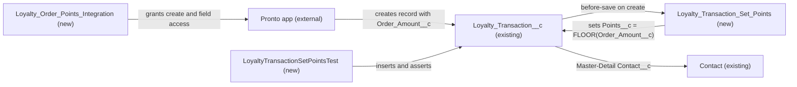

# Implementation spec — Order-sourced loyalty points at 1 point per dollar

> When a `Loyalty_Transaction__c` record with `Transaction_Source__c` = `Order` is created, set `Points__c` to the whole-dollar order amount that the Pronto app sends with the record.

_Based on the requirement, the evidence reported by AskCoworker, and read-only org queries where noted. Assumptions and missing evidence are identified below. Specification only — nothing is implemented or deployed._

---

## 1. The requirement

Every time an order-sourced loyalty transaction is created, award 1 point per dollar of the order amount. The user decided that the order amount comes from the Pronto app payload that creates the loyalty transaction, so the amount is stored on `Loyalty_Transaction__c` itself (no Salesforce order object holds it). The request contained no deploy or data-change instruction.

| # | Responsibility | Trigger | Where it lives |
| --- | --- | --- | --- |
| 1 | Carry the order dollar amount on the loyalty transaction | Pronto app creates `Loyalty_Transaction__c` | `Loyalty_Transaction__c.Order_Amount__c` (new) |
| 2 | Set `Points__c` = whole dollars of the order amount for order-sourced transactions | Create of `Loyalty_Transaction__c` with `Transaction_Source__c` = `Order` | `Loyalty_Transaction_Set_Points` (new flow) |
| 3 | Let the Pronto app's integration user create order-sourced transactions with the amount | Pronto app API call | `Loyalty_Order_Points_Integration` (new permission set) |
| 4 | Prove the points rule | Test run | `LoyaltyTransactionSetPointsTest` (new test class) |

## 2. Grounding — reuse before building

Target org: `TestWriteSpecDE` (Developer Edition, not a sandbox, org ID `00Dak00001COqNeEAL`). API version: `67.0`. _verified by org query_

- **`Loyalty_Transaction__c`** (CustomObject) — the loyalty transaction. Custom fields are exactly `Contact__c` (Master-Detail to `Contact`), `Points__c` (Number 18,0; description "The number of loyalty points involved in the transaction."), `Transaction_Source__c` (Picklist: Order, Promotion, Manual Adjustment), `Transaction_Type__c` (Picklist: Earn, Redeem). There is no amount field and no lookup to any order object. The object has 0 records. _verified by org query_ (Tooling `CustomField` by `TableEnumOrId`, `sobject describe`, `COUNT()`)
- **Automation on `Loyalty_Transaction__c`** — no Apex triggers, no record-triggered flows, no validation rules; `MetadataComponentDependency` returns no references to the object, `Points__c`, or `Transaction_Source__c`; no unmanaged Apex class body (70 classes searched) mentions `Loyalty_Transaction__c`, `Points__c`, or `Transaction_Source__c`. _verified by org query_
- **`Order.TotalAmount`** (standard field, read-only currency) — the standard Order has 0 records, no link to `Loyalty_Transaction__c`, and one record-triggered flow `Create_OS` that is inactive. Not reused. _verified by org query_
- **`Transaction__c.Total_Amount__c`** (Currency 7,2) — `Transaction__c` is a sale/refund record (`Transaction_Type__c`: Sale, Refund) with 0 visible records and no link to `Loyalty_Transaction__c`; its fields are hidden from `sobject describe` by FLS. Not reused. _verified by org query_
- **`OrderPickerController`**, **`OrderStatusCardAction`** (ApexClass) — their comments state that Pronto orders live in the external Heroku Orders API, not in a Salesforce Order object, and both return sample data. _verified by org query_ (Tooling `ApexClass.Body`)
- **`Pronto_Orders_API`** (NamedCredential) — exists; it is an outbound credential for Salesforce calling Pronto. No inbound Pronto integration user was found (active users matching "Pronto" or "Integration": only `Integration User` and `Platform Integration User`). _verified by org query_
- **Permission sets with access to `Loyalty_Transaction__c`** — `Agentforce_Reference_App` (unmanaged, Read/Create/Edit, Edit on `Points__c`); `sfdc_accelerate_dms` (namespace `sfdcInternalInt`, Read/Create/Edit); `sfdc_a360_sfcrm_data_extract` and `sfdc_slack` (namespace `sfdcInternalInt`, Read). The three namespaced sets cannot be edited. _verified by org query_ (`ObjectPermissions`, `FieldPermissions`, `PermissionSet.NamespacePrefix`)
- **Sharing** — `Contact` sharing is Controlled by Parent and `Account` default access is Edit, so a user with Read on `Contact` can see the master record. _verified by org query_
- **Names to create** — no flow `Loyalty_Transaction_Set_Points`, no permission set `Loyalty_Order_Points_Integration`, no Apex class starting with `Loyalty`, no field `Order_Amount__c` on `Loyalty_Transaction__c` exist. _verified by org query_
- The project source (`force-app/main/default`) contains no `Loyalty_Transaction__c` metadata. _verified by project file_

Evidence sources: `sf org display`; `sf sobject list --sobject custom`; `sobject describe` on `Loyalty_Transaction__c`, `Transaction__c`, `Order`; Tooling `EntityDefinition`, `CustomField` (with `Metadata` by Id), `ApexTrigger`, `ValidationRule`, `MetadataComponentDependency`, `ApexClass`, `NamedCredential`, `Layout`; standard `FlowDefinitionView`, `ObjectPermissions`, `FieldPermissions`, `PermissionSet`, `User`, `Organization`, `DataStream`. AskCoworker returned no citedReferences.

## 3. Architecture

Why the pieces are drawn this way:

1. The Pronto app is the creator of order-sourced transactions and the source of the amount. _user decision_ Its orders live outside Salesforce. _verified by org query_ (class comments)
2. `Loyalty_Transaction__c` has no amount field and no order link, so the amount must be stored on it: `Order_Amount__c`. _verified by org query_; _user decision_
3. A before-save record-triggered flow is used, not Apex: the rule reads and writes fields on the same record, needs no query or DML, and before-save flows are the declarative option for same-record updates. _assumption (documented platform behavior)_
4. The test class is Apex because flow logic is tested through Apex DML tests, and active-flow deployment to production can require flow test coverage from Apex tests. _assumption (documented platform behavior)_
5. `Contact` is shown because the integration user needs Read on the master record to create the child. _assumption (documented platform behavior)_

## 4. Metadata changes

**Data model**

- **Create `Loyalty_Transaction__c.Order_Amount__c`** — CustomField, Currency(16,2), label "Order Amount", not required, no default. Description: "Order dollar amount sent by the Pronto app; drives Points__c for order-sourced transactions." Blank for non-order transactions. Not added to `Loyalty_Transaction__c-Loyalty Transaction Layout` (see Section 8).

**Automation**

- **Create `Loyalty_Transaction_Set_Points`** — Flow, record-triggered on `Loyalty_Transaction__c`, "Fast Field Updates" (before save), trigger "A record is created" only. Entry conditions (all): `Transaction_Source__c` Equals `Order`; `Order_Amount__c` Is Null `false`; `Order_Amount__c` Greater Than or Equal `0`. One formula resource `PointsFromAmount` (Number, scale 0) = `FLOOR({!$Record.Order_Amount__c})`, and one Assignment: `{!$Record.Points__c}` = `{!PointsFromAmount}`. No Get Records, no DML. It overwrites any `Points__c` value the caller sent. Results: 48.75 gives 48; 0.99 gives 0; 0 gives 0; blank or negative amount means the flow does not run and `Points__c` keeps the caller's value. Status: Active in source.

**Security**

- **Create `Loyalty_Order_Points_Integration`** — PermissionSet, label "Loyalty Order Points Integration", no license. Object: `Loyalty_Transaction__c` Read and Create; `Contact` Read. Fields: `Loyalty_Transaction__c.Order_Amount__c`, `Loyalty_Transaction__c.Transaction_Source__c`, `Loyalty_Transaction__c.Transaction_Type__c` Read and Edit; `Loyalty_Transaction__c.Points__c` Read only (the flow sets it). No Edit or Delete on the object. Assignment is a post-deployment step (Section 8).

**Tests**

- **Create `LoyaltyTransactionSetPointsTest`** — ApexClass (`@isTest`). Creates an `Account` and `Contact` in setup and covers the cases in Section 7.

## 5. Data 360 (Data Cloud) data involved

Not applicable — this change does not use Data 360. The org has 0 `DataStream` records. _verified by org query_

## 6. Security considerations

- **Execution context.** The before-save flow runs in system context for every creator of `Loyalty_Transaction__c`, so it writes `Points__c` even when the caller has only Read on that field. _assumption (documented platform behavior)_ It also applies to records created by users of `Agentforce_Reference_App` and `sfdc_accelerate_dms`, the existing sets with Create on the object. _verified by org query_ (grants); the application to them is intended.
- **CRUD/FLS.** `Loyalty_Order_Points_Integration` grants the least access the Pronto app needs to create order-sourced records: Read/Create on the object, Read on `Contact`, Edit on the three fields it sends, Read on `Points__c`. The app cannot edit or delete existing transactions. If the app sends `Points__c` in the payload, the API rejects it because the set has no Edit on that field. _assumption (documented platform behavior)_
- **Access to the new field.** Only `Loyalty_Order_Points_Integration` gets access to `Order_Amount__c`. `Agentforce_Reference_App`, `sfdc_accelerate_dms`, `sfdc_a360_sfcrm_data_extract`, `sfdc_slack`, and all profiles get no access to it. Permission sets are not the only grant path; profiles and permission set groups can also grant access.
- **Sharing.** `Contact` access is Controlled by Parent with `Account` default access Edit, so the integration user can see the master `Contact` records. _verified by org query_
- **Data exposure.** `Order_Amount__c` is a monetary amount, not personal data. It is visible only to users with the new permission set. _assumption_

## 7. Testing strategy

`LoyaltyTransactionSetPointsTest` (planned; not run):

1. Order source, amount 48.75 → `Points__c` = 48.
2. Order source, amount 50.00 → `Points__c` = 50.
3. Order source, amount 0 → `Points__c` = 0; amount 0.99 → `Points__c` = 0.
4. Order source, caller sends `Points__c` = 999 and amount 10.00 → `Points__c` = 10 (flow overwrites).
5. Negative: Order source with blank amount → `Points__c` unchanged; amount -1.00 → `Points__c` unchanged.
6. Negative: `Promotion` and `Manual Adjustment` sources with an amount → `Points__c` unchanged.
7. Update: insert an Order record, then change `Order_Amount__c` → `Points__c` is not recalculated (create-only by design).
8. Bulk: insert 200 Order records in one DML → each `Points__c` = FLOOR of its amount.
9. Permission: `System.runAs` a test user assigned `Loyalty_Order_Points_Integration` (inserted `PermissionSetAssignment`) → create succeeds and `Points__c` is set; update of the record fails for lack of Edit.

Delete, undelete, and reparenting are not relevant: the flow runs only on create, and `Contact__c` is Master-Detail. Recommended verification: after deployment and assignment, have the Pronto app post one order-sourced transaction and confirm `Points__c` = whole dollars of `Order_Amount__c`.

## 8. Open decisions

### Open

1. **Pronto app must send `Order_Amount__c` (blocking for delivery).** Points are awarded only if the app populates `Order_Amount__c` and `Transaction_Source__c` = `Order` when it creates the record. That payload change is outside this org's metadata. Recommended default: the Pronto team adds both values to the create call.
2. **Pronto integration user (blocking for delivery).** No inbound Pronto integration user was found; `Pronto_Orders_API` is outbound. _verified by org query_ Recommended default: identify or create the user the app authenticates as and assign `Loyalty_Order_Points_Integration` to it. Granting the set to any existing integration or broad permission set is a decision for the org owner.
3. **Deployment sequence (non-blocking).** Deploy `Loyalty_Transaction__c.Order_Amount__c` first, then `Loyalty_Transaction_Set_Points`, `Loyalty_Order_Points_Integration`, and `LoyaltyTransactionSetPointsTest` together, then assign the permission set. No backfill: the object has 0 records. _verified by org query_
4. **Field placement (non-blocking).** `Order_Amount__c` is not added to `Loyalty_Transaction__c-Loyalty Transaction Layout` because it is written by the integration and no one asked to see it in the UI. Recommended default: leave it off; add it and grant Read in `Agentforce_Reference_App` later if reps need it.
5. **Update and source-change transitions (non-blocking).** The flow runs only on create, per the requirement. A record created as `Promotion` and later changed to `Order`, or an `Order_Amount__c` corrected after create, does not get points recalculated. Recommended default: accept.
6. **Transaction type (non-blocking).** The flow does not set `Transaction_Type__c`; the app is expected to send `Earn` for order awards. _assumption_ Recommended default: accept.

### Resolved

- **Where the order amount lives.** Asked the user; they decided the amount comes from the Pronto app payload that creates the loyalty transaction. _user decision_ This drops the standard `Order.TotalAmount` and `Transaction__c.Total_Amount__c` options (neither is linked to `Loyalty_Transaction__c`; both objects have 0 records). _verified by org query_ The user's belief that order data exists in Salesforce is only partly true: the order objects exist but hold no Pronto order data. _verified by org query_
- **Rounding.** 1 point per whole dollar using `FLOOR`, so 9.99 gives 9. _assumption_ (default; no user preference asked, does not change the inventory)
- **Blank or negative amount.** The flow does not run; `Points__c` keeps the caller's value. _assumption_
- **AskCoworker corrections.** D1 reported that `Transaction__c` has no custom fields; Tooling `CustomField` shows six (including `Total_Amount__c`), hidden from `describe` by FLS. _verified by org query_ R proposed FLS additions to `sfdc_accelerate_dms`, `sfdc_a360_sfcrm_data_extract`, and `sfdc_slack`; those are namespaced (`sfdcInternalInt`) and not editable, and the grants were not requested, so they were dropped. R stated `Order_Amount__c` would flow to Data 360 if a data stream were created; that is not automatic and was dropped. T stated no Apex test is needed; an Apex test class was added for flow coverage.
- **Dropped AskCoworker proposals.** The validation rule `Loyalty_Transaction__c.Order_Amount_Required_For_Order` (not asked for, and it would block existing creators of order-sourced records); FLS grants on `Order_Amount__c` to `Agentforce_Reference_App` (not asked for; see Open item 4).

## 9. Change set

| # | Action | Type | API name | Module | Why |
| --- | --- | --- | --- | --- | --- |
| 1 | Create | CustomField | `Loyalty_Transaction__c.Order_Amount__c` | force-app/main/default/objects/Loyalty_Transaction__c/fields | Stores the order dollar amount sent by the Pronto app |
| 2 | Create | Flow | `Loyalty_Transaction_Set_Points` | force-app/main/default/flows | Sets `Points__c` = FLOOR(`Order_Amount__c`) on create of order-sourced transactions |
| 3 | Create | PermissionSet | `Loyalty_Order_Points_Integration` | force-app/main/default/permissionsets | Lets the Pronto integration user create transactions with the amount |
| 4 | Create | ApexClass | `LoyaltyTransactionSetPointsTest` | force-app/main/default/classes | Tests the points rule, bulk, negative, and permission cases |

The Pronto app writes the order amount onto the new loyalty transaction and a before-save flow converts it to whole-dollar points.

Total: 4 · Create: 4 · Update: 0 · Delete: 0
