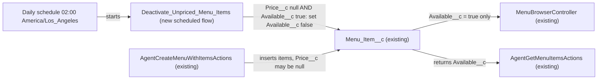

# Implementation spec — Nightly deactivation of menu items with no price

> A schedule-triggered flow runs every night and sets `Menu_Item__c.Available__c` to false on every available menu item whose `Menu_Item__c.Price__c` is blank.

_Based on the requirement, the evidence reported by AskCoworker, and read-only org queries where noted. Assumptions and missing evidence are identified below. Specification only — nothing is implemented or deployed._

---

## 1. The requirement

Every night, menu items that have no price are made unavailable for order. The user decided that "no price" means a blank `Price__c` only; items priced at $0.00 stay available (*user decision*).

| # | Responsibility | Trigger | Where it lives |
| --- | --- | --- | --- |
| 1 | Find menu items where `Price__c` is blank and `Available__c` is true | Daily schedule (nightly, 02:00 org time zone) | `Deactivate_Unpriced_Menu_Items` (new Flow) |
| 2 | Set `Available__c` to false on those items | Same flow run | `Deactivate_Unpriced_Menu_Items` (new Flow) |

## 2. Grounding — reuse before building

Target org: `TestWriteSpecDE` (Developer Edition, `00Dak00001COqNeEAL`, time zone `America/Los_Angeles`). API version: `67.0` (org). No `sfdx-project.json` exists in the project, so no `sourceApiVersion` was read. _verified by org query_

- **`Menu_Item__c`** (CustomObject) — the target object; 206 records; internal sharing `ReadWrite`, external `Private`. _verified by org query_
- **`Menu_Item__c.Price__c`** (CustomField, Currency, precision 18, scale 2, not required, no default) — the "price". Today 0 records have a blank `Price__c` and 0 have `Price__c = 0`. _verified by org query_
- **`Menu_Item__c.Available__c`** (CustomField, Checkbox, default `true`, description "Indicates whether the menu item is currently available for order.") — the only item-level active flag; the seven custom fields on the object are `Available`, `Calories`, `Description`, `Image_URL`, `Menu_Category`, `Menu`, `Price` (Tooling `CustomField`). All 206 records have `Available__c = true`. _verified by org query_
- **`AgentCreateMenuWithItemsActions`** (ApexClass, `with sharing`) — inserts items with `Price__c = mi.price` (may be null) and `Available__c` defaulting to true; this is how unpriced items can appear. _verified by org query (Apex body)_
- **Readers of `Available__c`** (from `MetadataComponentDependency` on the field plus a search of all 70 unmanaged Apex bodies): `MenuBrowserController` (filters `Available__c = true`), `AgentGetMenuItemsActions`, `AgentUpdateMenuItemActions` (also a writer), `AgentCreateMenuWithItemsActions` (writer), `MenuDescriptionPromptGrounding`, and FlexiPage `Menu_Record_Page`. This list is complete for Apex and dependency-tracked metadata; reports and list views were not checked. _verified by org query_
- **Automation on `Menu_Item__c`:** no Apex triggers, no flows with `TriggerObjectOrEventId = 'Menu_Item__c'`, no validation rules. _verified by org query_
- **Scheduled jobs:** the five `CronTrigger` rows are platform jobs (Program Milestone, Program Status Update, Metalytics, Retention Usage, Privacy Center Audit); the only active scheduled flow is `Orch` ("Orchestration flow for Recurrence Scheduler", no trigger object). No unmanaged Apex class implements `Schedulable` or `Database.Batchable`. _verified by org query_
- `Deactivate_Unpriced_Menu_Items` does not exist yet. _verified by org query_

Candidates examined and rejected: `datamask.BatchableLFDeactivate` and `datamask.SchedLFDeactivate` — managed `datamask` package classes, not editable or reusable for this object (*verified by org query*); `Menu__c.Active__c` — menu-level flag, not item-level (*verified by org query*); `Orch` — platform Recurrence Scheduler flow with no trigger object (*verified by org query*).

Evidence sources: `sf org display`; `sf sobject list`; `sobject describe Menu_Item__c`; Tooling `EntityDefinition`, `CustomField` (+ `Metadata` for `Available` and `Price`), `ApexTrigger`, `ValidationRule`, `MetadataComponentDependency`, `ApexClass` bodies; `FlowDefinitionView`; `CronTrigger`; `FieldPermissions`; `PermissionSet`; `Organization`; record counts. AskCoworker (D1, I, R, T) returned no citedReferences; its facts used here were re-checked by org query (_reported by AskCoworker_ only where marked).

## 3. Architecture

Why the pieces are drawn this way:

1. A schedule-triggered flow is the standard declarative mechanism for a nightly record update; no Apex is needed (*assumption (documented platform behavior)*). No existing scheduled job or batch class covers `Menu_Item__c` (*verified by org query*).
2. The flow's start criteria (`Price__c` Is Null = true AND `Available__c` = true) select only items that need the change, so it never rewrites already-unavailable items (*user decision* for the null-only rule).
3. `AgentCreateMenuWithItemsActions` is the verified path by which unpriced, available items enter the object (*verified by org query*).
4. `MenuBrowserController` and `AgentGetMenuItemsActions` are the verified readers whose results change after the flow runs (*verified by org query*).

## 4. Metadata changes

**Automation**

- **Create `Deactivate_Unpriced_Menu_Items`** — Flow, schedule-triggered (`AutoLaunchedFlow`, start type Scheduled). Schedule: Frequency Daily, start time 02:00 in the org time zone (`America/Los_Angeles`), start date the day after deployment. Object `Menu_Item__c`; start conditions (AND): `Price__c` Is Null `true`; `Available__c` Equals `true`. One Update Records element on `$Record`: `Available__c = false`; no other fields change. Delivered status Active. API version 67.0.

## 5. Data 360 (Data Cloud) data involved

Not applicable — this change does not use Data 360.

## 6. Security considerations

- **Execution context:** a schedule-triggered flow runs as the Automated Process user in system context without sharing, so it processes every matching `Menu_Item__c` regardless of owner or the `ReadWrite`/`Private` sharing model. _assumption (documented platform behavior)_
- **CRUD/FLS:** system context does not check the running user's field-level security. No permission set or profile change is needed; AskCoworker's proposed `Menu_Item_Nightly_Job_Access` permission set was dropped (see Section 8).
- **Existing field access (unchanged):** `FieldPermissions` rows for `Menu_Item__c.Available__c` are `Agentforce_Reference_App` (Read, Edit), `sfdc_accelerate_dms` (Read, Edit), `sfdc_a360_sfcrm_data_extract` (Read), `sfdc_slack` (Read); no profile rows were returned. _verified by org query_ View All Data and Modify All Data do not grant field access. _assumption (documented platform behavior)_
- **Data exposure:** the flow only reduces what is shown (unpriced items drop out of `MenuBrowserController` results). No data is sent outside the org.

## 7. Testing strategy

The flow's only logic runs on a schedule, so there is no Flow Test or Apex test row (Flow Tests do not cover schedule-triggered flows). Recommended manual verification in a sandbox; no tests have been run:

1. **Main outcome:** create items with (a) blank `Price__c`, `Available__c` true; (b) `Price__c = 0`; (c) `Price__c = 12.99`; (d) blank `Price__c`, `Available__c` false. Run the flow (Debug in Flow Builder with "Run as scheduled", or wait for the schedule). Expect only (a) to become `Available__c = false`; (b), (c), (d) unchanged.
2. **Bulk:** load 250 items with blank `Price__c`; after the run, all 250 are `Available__c = false` and Setup > Paused and Failed Flow Interviews shows no errors.
3. **No matches:** with no qualifying items (the current org state), the run finishes with no errors and no record changes.
4. **Readers:** after the run, the menu browser (via `MenuBrowserController`) no longer lists item (a); `AgentGetMenuItemsActions` returns it with `available = false`.
5. **Schedule:** Setup > Scheduled Jobs lists the flow at 02:00 America/Los_Angeles.

## 8. Open decisions

### Open

1. **Run time (non-blocking).** "Nightly" gives no time. Default: 02:00 `America/Los_Angeles`, adjustable in Flow Builder without other changes.
2. **Automatic re-activation when a price is added (non-blocking, proposal).** Not requested; items stay unavailable until someone sets `Available__c` back to true (for example through `AgentUpdateMenuItemActions`). `AgentUpdateMenuItemPriceActions` sets only `Price__c`. _verified by org query_
3. **Window between insert and the next run (non-blocking, proposal).** `AgentCreateMenuWithItemsActions` can insert unpriced items as available; they are orderable until the next nightly run. A record-triggered flow or validation rule would close the gap but is not requested.
4. **Reports and list views (non-blocking).** They cannot be read with the allowed commands; check any that filter on `Available__c` after deployment.

### Resolved

- **"No price" = blank `Price__c` only; $0.00 items are not deactivated.** _user decision_
- **"Deactivate" = set `Menu_Item__c.Available__c` to false.** It is the only item-level active flag, and its description matches (*verified by org query*); `Menu__c.Active__c` is menu-level. _assumption_
- **Mechanism:** schedule-triggered flow instead of Schedulable/Batch Apex; 206 records is well within scheduled-flow volume. _assumption_
- **Dropped AskCoworker proposal:** PermissionSet `Menu_Item_Nightly_Job_Access` — no responsibility needs it, because the flow runs in system context as the Automated Process user; it would be a speculative grant.
- **Corrected AskCoworker platform claims:** "Scheduled Flows batch in transactions of up to 2,000 rows" / "a 2,000 DML row limit" and "a single bulk Update DML call" — a schedule-triggered flow runs one interview per matching record, and the platform groups interviews into batches of 200 per transaction; the per-transaction DML row limit is 10,000. _assumption (documented platform behavior)_ The module "Menu Item Automation" was replaced with `force-app/main/default/flows`.
- **Relationship detail:** `Menu_Item__c.Menu__c` is a Lookup (not Master-Detail). _verified by org query_

## 9. Change set

| # | Action | Type | API name | Module | Why |
| --- | --- | --- | --- | --- | --- |
| 1 | Create | Flow | `Deactivate_Unpriced_Menu_Items` | force-app/main/default/flows | Nightly schedule-triggered flow that sets `Available__c` to false where `Price__c` is blank and `Available__c` is true |

One new schedule-triggered flow on `Menu_Item__c` delivers the requirement; nothing else changes.

Total: 1 · Create: 1 · Update: 0 · Delete: 0
