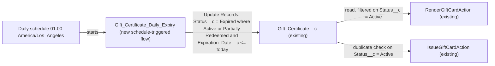

# Implementation spec — Gift certificate automatic expiration

> Set `Gift_Certificate__c.Status__c` to `Expired` automatically when a certificate reaches its `Gift_Certificate__c.Expiration_Date__c`.

_Based on the requirement, the evidence reported by AskCoworker, and read-only org queries where noted. Assumptions and missing evidence are identified below. Specification only — nothing is implemented or deployed._

---

## 1. The requirement

Gift certificates that are still redeemable must move to the `Expired` status without manual action on their expiration date. The request contained no deploy or data-change instruction. No user decision was needed; the defaults taken are listed in Section 8.

| # | Responsibility | Trigger | Where it lives |
| --- | --- | --- | --- |
| 1 | Set `Status__c` to `Expired` on `Active` and `Partially Redeemed` certificates whose `Expiration_Date__c` is today or earlier | Daily schedule, 01:00 org time (`America/Los_Angeles`) | `Gift_Certificate_Daily_Expiry` (new Flow) |
| 2 | Leave `Draft`, `Fully Redeemed`, `Cancelled`, and already `Expired` certificates, and certificates with no `Expiration_Date__c`, unchanged | Same run | `Gift_Certificate_Daily_Expiry` (filter conditions) |

## 2. Grounding — reuse before building

Target org: `TestWriteSpecDE` (Developer Edition, not a sandbox, time zone `America/Los_Angeles`). API version: `67.0`.

- **`Gift_Certificate__c`** (CustomObject) — the only object representing gift certificates; no voucher or coupon custom object exists in the custom object list. _verified by org query_
- **`Gift_Certificate__c.Expiration_Date__c`** (CustomField, Date, not required) — description: "The date after which the gift certificate can no longer be redeemed." _verified by org query_
- **`Gift_Certificate__c.Status__c`** (CustomField, Picklist) — active values `Draft`, `Active` (default), `Partially Redeemed`, `Fully Redeemed`, `Expired`, `Cancelled`. The `Expired` value already exists, so no data model change is needed. _verified by org query_
- **No existing expiration automation.** 0 Apex triggers, 0 record-triggered flows, and 0 validation rules on `Gift_Certificate__c`; no flow whose name contains "Gift"; the only active schedule-triggered flow (`Orch`, namespace `runtime_industries_recurrence`) has no object; no custom scheduled Apex job is in `CronTrigger`. No unmanaged Apex class sets `Status__c` to `Expired`. _verified by org query_
- **`AgentGiftCertificateActions`** (ApexClass, `with sharing`) — creates certificates, sets `Status__c` to `Active` when blank, and takes an optional `Expiration_Date__c` from the caller. _verified by org query_
- **`IssueGiftCardAction`** (ApexClass, `with sharing`) — creates certificates with `Expiration_Date__c` = today + 90 days and `Status__c` = `Active`; its duplicate check filters `Status__c = 'Active'`. _verified by org query_
- **`RenderGiftCardAction`** (ApexClass, `with sharing`) — reads certificates filtered on `Status__c = 'Active'`, so certificates set to `Expired` are no longer rendered. _verified by org query_
- **Readers of `Status__c`** (partial: dependency API plus Apex body search): the three classes above; `Expiration_Date__c` is also referenced by FlexiPage `Storefront_Record_Page`. _verified by org query_
- **Data shape** — 1 `Gift_Certificate__c` record, `Status__c` = `Active`, `Expiration_Date__c` blank; 0 records have a past expiration date. _verified by org query_
- **Access** — Edit on `Status__c` in permission sets `Agentforce_Reference_App`, `Pronto_Deep_Dive_Workshop`, `Agentforce_Action_Access`, `sfdc_accelerate_dms`; Read only in `sfdc_a360_sfcrm_data_extract` and `sfdc_slack` (FieldPermissions, permission sets only; no profile rows returned). _verified by org query_
- **Data 360** — 0 `DataStream` records. _verified by org query_

Evidence sources: `sf org display`; `sf sobject list --sobject custom`; `sf sobject describe Gift_Certificate__c`; Tooling `EntityDefinition`, `CustomField` (with `Metadata` for the two fields), `ApexTrigger`, `ValidationRule`, `ApexClass` bodies, `MetadataComponentDependency`; `FlowDefinitionView`, `CronTrigger`, `FieldPermissions`, `Organization`, `DataStream`, and aggregate record counts. AskCoworker returned no citedReferences.

## 3. Architecture

Why the pieces are drawn this way:

1. A date passing is not a record event, so a record-triggered flow or formula cannot change `Status__c` on the date itself. A schedule-triggered flow is the declarative option that runs without a record edit; no Apex is used. _assumption (documented platform behavior)_
2. The flow has no start object. It uses one Update Records element with conditions, because schedule-triggered flow start conditions cannot compare a field to the current date, while an Update Records filter can use `{!$Flow.CurrentDate}`. _assumption (documented platform behavior)_
3. `Gift_Certificate__c` has no triggers, record-triggered flows, or validation rules, so the update fires no other org automation. _verified by org query_
4. `RenderGiftCardAction` and `IssueGiftCardAction` already filter on `Status__c = 'Active'`, so expired certificates drop out of rendering and the duplicate check without code changes. _verified by org query_

## 4. Metadata changes

**Automation**

- **Create `Gift_Certificate_Daily_Expiry`** — Flow, process type `AutoLaunchedFlow`, start trigger Scheduled, frequency Daily, start time 01:00 in the org time zone (`America/Los_Angeles`), no start object. Label "Gift Certificate Daily Expiry". One element, Update Records (specify conditions to identify records), object `Gift_Certificate__c`, condition logic `(1 OR 2) AND 3`: (1) `Status__c` Equals `Active`; (2) `Status__c` Equals `Partially Redeemed`; (3) `Expiration_Date__c` Less Than or Equal `{!$Flow.CurrentDate}`. Field value: `Status__c` = `Expired`. Records with a blank `Expiration_Date__c` do not satisfy condition 3 and are not changed. No other fields are changed (`Remaining_Value__c` is left as is). Runs in system context; activated on deployment.

## 5. Data 360 (Data Cloud) data involved

Not applicable — this change does not use Data 360. The org has 0 `DataStream` records (_verified by org query_); `sfdc_a360_sfcrm_data_extract` has Read on `Status__c`, so a future data stream would see the new `Expired` values.

## 6. Security considerations

- **Execution context.** Schedule-triggered flows run as the Automated Process user in system context without sharing, so every matching record is updated regardless of owner or sharing, and CRUD/FLS are not checked. _assumption (documented platform behavior)_ The Automated Process user exists in the org. _verified by org query_
- **Permission sets.** No permission set changes. No human or integration user needs new access: the flow runs without a user, and every permission set that reads `Gift_Certificate__c` already has Read on `Status__c`. _verified by org query_ Permission sets are not the only grant path; profiles were not returned by the `FieldPermissions` query.
- **Data exposure.** No new field. The only change is the value of `Status__c`, which is already readable by the listed permission sets, including `sfdc_slack` and `sfdc_a360_sfcrm_data_extract`. _verified by org query_
- **Manual override.** Users with Edit on `Status__c` can still set a certificate back to `Active`; if its `Expiration_Date__c` is still today or earlier, the next run sets it to `Expired` again (see Section 8).

## 7. Testing strategy

The inventory contains no test component. Flows do not need Apex test coverage to deploy, and flow tests do not cover schedule-triggered flows, so all cases below are recommended verification in the org (Flow Builder Debug with rollback off, or wait for the scheduled run). _assumption (documented platform behavior)_

- **Expire, Active:** `Status__c` = `Active`, `Expiration_Date__c` = yesterday → `Expired`.
- **Expire, boundary:** `Status__c` = `Active`, `Expiration_Date__c` = today → `Expired` after the 01:00 run.
- **Expire, Partially Redeemed:** `Expiration_Date__c` = yesterday → `Expired`.
- **Negative, future date:** `Expiration_Date__c` = tomorrow → unchanged.
- **Negative, blank date:** `Expiration_Date__c` blank → unchanged (this covers the one existing record).
- **Negative, excluded statuses:** `Draft`, `Fully Redeemed`, `Cancelled`, `Expired` with a past date → unchanged; `LastModifiedDate` of already `Expired` records does not change.
- **Transitions on update:** change a future-dated `Active` record's date to yesterday → expired on the next run; set an `Expired` record with a past date back to `Active` → expired again on the next run; set it to `Active` with a future date → stays `Active`.
- **Bulk:** 250 `Active` records with a past date and 50 with a future date → exactly the 250 are `Expired` in one run.
- **Downstream:** after expiry, `RenderGiftCardAction` no longer returns the certificate.
- **Schedule:** Setup, Scheduled Jobs shows `Gift_Certificate_Daily_Expiry` with the next run at 01:00 `America/Los_Angeles`.

Deletes and undeletes need no handling: deleted records are not queried, and an undeleted certificate is evaluated on the next run.

## 8. Open decisions

### Open

1. **Expiry moment versus the field description (non-blocking).** The requirement says certificates expire "on" `Expiration_Date__c`, but the field description says the date is the one "after which" the certificate can no longer be redeemed, which would keep it redeemable through that day. The recommended default follows the requirement: the 01:00 run on the expiration date sets `Expired` (condition `<= {!$Flow.CurrentDate}`). To keep certificates redeemable through the date, change condition 3 to Less Than; the inventory does not change.
2. **Certificates without an expiration date never expire (non-blocking).** `Expiration_Date__c` is not required, `AgentGiftCertificateActions` accepts a blank date, and the one existing record has none (_verified by org query_). Recommended default: treat blank as "does not expire". Making the date required is a separate change, not in this spec.
3. **Up to one day of lag after edits (non-blocking).** Records created or edited so that they match (for example, created with a past date through `AgentGiftCertificateActions`, or manually set back to `Active`) are expired on the next daily run, not immediately. Recommended default: accept daily granularity, which meets "on their expiration date".
4. **Volume limit (non-blocking).** The run is one transaction, so one Update Records element can change at most 10,000 records per run (DML row limit). _assumption (documented platform behavior)_ Today 0 records qualify (_verified by org query_). Recommended default: accept; if more than 10,000 certificates could expire on one day, replace the flow with scheduled batch Apex.
5. **Deployment steps (non-blocking).** Deploy the flow active; confirm the schedule under Setup, Scheduled Jobs. No backfill is needed because 0 records currently have a past expiration date (_verified by org query_); any that appear before deployment are expired by the first run.

### Resolved

- **Statuses in scope** — _assumption_: only `Active` and `Partially Redeemed` still have redeemable value; `Draft` is not issued, and `Fully Redeemed`, `Cancelled`, and `Expired` are end states, so they are excluded.
- **Run time** — _assumption_: 01:00 org time, so certificates are expired early on their expiration date.
- **No recipient notification, no change to `Remaining_Value__c`** — _assumption_: the requirement asks only for the status change.
- **Corrections to AskCoworker proposals:** dropped the proposed Apex test class `GiftCertificateExpiryFlowTest` (flows need no Apex coverage, and a schedule-triggered flow cannot be started from `Flow.Interview` in a test, so the proposed test would not exercise it); replaced "processes records in batches of 200" with the single-transaction 10,000-row limit, because a flow without a start object runs one interview; dropped the redundant `!= null` condition (a blank date does not satisfy Less Than or Equal); dropped the Developer Edition scheduling caveat and the time-based workflow fallback (no evidence of such a limit, and workflow rules are retired). Formula-field, before-save flow, and Apex batch alternatives were rejected for the reasons in Section 3.

## 9. Change set

| # | Action | Type | API name | Module | Why |
| --- | --- | --- | --- | --- | --- |
| 1 | Create | Flow | `Gift_Certificate_Daily_Expiry` | force-app/main/default/flows | Daily schedule-triggered flow that sets `Status__c` to `Expired` on `Active` and `Partially Redeemed` certificates whose `Expiration_Date__c` is today or earlier |

One new schedule-triggered flow updates the existing `Status__c` field daily; existing Apex already excludes non-`Active` certificates.

Total: 1 · Create: 1 · Update: 0 · Delete: 0
