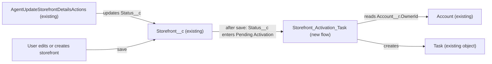

# Implementation spec — Storefront activation call Task

> Create a Task for the account owner, due in 3 business days, whenever a `Storefront__c` record enters the `Pending Activation` status.

_Based on the requirement, the evidence reported by AskCoworker, and read-only org queries where noted. Assumptions and missing evidence are identified below. Specification only — nothing is implemented or deployed._

---

## 1. The requirement

When a storefront is created in, or changed to, `Status__c` = `Pending Activation`, create one Task for the owner of the storefront's Account to make the activation call, due 3 business days (weekdays) later. The requirement contained no deploy or data-change instruction.

| # | Responsibility | Trigger | Where it lives |
| --- | --- | --- | --- |
| 1 | Detect a storefront entering `Pending Activation` | `Storefront__c` created with, or updated to, `Status__c` = `Pending Activation` | `Storefront_Activation_Task` (new Flow) |
| 2 | Create an activation-call Task related to the storefront | Same event | `Storefront_Activation_Task` (Create Records on `Task`) |
| 3 | Assign the Task to the account owner | Same event | `Task.OwnerId` = `Storefront__c.Account__c` → `Account.OwnerId` |
| 4 | Set the due date to 3 business days later | Same event | `Task.ActivityDate` from the flow formula `fxDueDate` |

## 2. Grounding — reuse before building

Target org: `TestWriteSpecDE` (Developer Edition, org ID `00Dak00001COqNeEAL`). API version: `67.0`.

- **`Storefront__c`** (CustomObject) — the storefront. 21 records exist, all with `Status__c` = `Active`. _verified by org query_
- **`Storefront__c.Status__c`** (Picklist) — active values `Active`, `Inactive`, `Pending Activation`, `Suspended`, `Closed`. `Pending Activation` is the trigger value. _verified by org query_
- **`Storefront__c.Account__c`** (Lookup to `Account`, not required) — link to the merchant account. 0 of 21 records have it blank, and 0 have an inactive account owner. _verified by org query_
- **`Account.OwnerId`** (Lookup to `User`) — the account owner who receives the Task. _verified by org query_ (reached through `Account__c`)
- **`Task`** (standard object) — `Task` is a child relationship of `Storefront__c`, so `Task.WhatId` can reference a storefront. `Task.Subject` is a combobox (values `Call`, `Email`, `Send Letter`, `Send Quote`, `Other`; free text allowed). `Task.Status` defaults to `Not Started`; `Task.Priority` defaults to `Normal`. Only the `Master` record type exists. _verified by org query_
- **Existing automation** — 0 Apex triggers, 0 record-triggered flows, 0 workflow rules, and 0 validation rules on `Storefront__c`, `Account`, or `Task`. No Apex class in the org's unmanaged code creates a Task for a storefront or references `Pending Activation`. The requirement is not met today. _verified by org query_
- **`AgentUpdateStorefrontDetailsActions`** (ApexClass, `with sharing`) — an Agentforce action that can set `Storefront__c.Status__c` and runs `update` on the storefront. Status changes it makes will also start the new flow. _verified by org query (class body)_
- **`BusinessHours` `Default`** — the only business hours record; it is 24x7 (all start and end times `00:00`), time zone `America/Los_Angeles`. 0 `Holiday` records exist. No Apex uses `BusinessHours`. _verified by org query_
- **Access to `Storefront__c`** — Create/Edit: permission sets `Agentforce_Reference_App` and `sfdc_accelerate_dms`, and one profile; Read only: `Pronto_Deep_Dive_Workshop`, `sfdc_a360_sfcrm_data_extract`, `sfdc_slack`, and one profile. _verified by org query_
- **`Onboarding_Application__c`** (CustomObject) — found in the custom object scan; its `Status__c` values (`Submitted`, `Under Review`, `Approved`, `Onboarded`) do not include an activation state, so it is not in scope. _verified by org query_

Evidence sources: `sf org display`; `sf sobject list --sobject custom`; `sf sobject describe` on `Storefront__c`, `Task`, `Onboarding_Application__c`; Tooling queries on `ApexTrigger`, `ValidationRule`, `WorkflowRule`, `CustomField`, `EntityDefinition`, `ApexClass` bodies; standard queries on `FlowDefinitionView`, `BusinessHours`, `Holiday`, `ObjectPermissions`, `DataStream`, and `Storefront__c` aggregates. AskCoworker returned no citedReferences.

## 3. Architecture

Why the pieces are drawn this way:

1. `Storefront__c` has no automation today (_verified by org query_), so a single new record-triggered flow owns the behavior. A flow is declarative and needs no Apex; no code is proposed.
2. The flow is after-save because it creates a related record (`Task`); before-save flows cannot create other records. _assumption (documented platform behavior)_
3. Both manual saves and `AgentUpdateStorefrontDetailsActions` updates start the flow, because the flow reacts to the record save, not to the caller. _assumption (documented platform behavior)_
4. The owner comes from `{!$Record.Account__r.OwnerId}`, a cross-object reference, so no separate Get Records element on `Account` is needed. _assumption (documented platform behavior)_
5. The due date is a flow formula, not `BusinessHours.addDays`, because the only business hours record is 24x7 and would count weekends (_verified by org query_ for the record; the counting is _assumption (documented platform behavior)_).

## 4. Metadata changes

**Automation**

- **Create `Storefront_Activation_Task`** — Record-triggered flow, after save (Actions and Related Records), object `Storefront__c`, trigger "A record is created or updated", status Active, API version 67.0.
  - Entry condition: `Status__c` Equals `Pending Activation`; "When to run the flow for updated records": "Only when a record is updated to meet the condition requirements". This runs on a create that already meets the condition and on an update from any other value to `Pending Activation`; it does not run when the status stays `Pending Activation` or leaves it.
  - Decision `Has_Account`: continue only when `{!$Record.Account__c}` Is Null = false; otherwise end with no Task.
  - Formula resource `fxDueDate` (Date): `{!$Flow.CurrentDate} + CASE(MOD({!$Flow.CurrentDate} - DATE(1900,1,7), 7), 3, 5, 4, 5, 5, 5, 6, 4, 3)`. `DATE(1900,1,7)` is a Sunday, so the MOD result is 0 = Sunday … 6 = Saturday. Offsets: Sunday, Monday, Tuesday +3; Wednesday, Thursday, Friday +5; Saturday +4. Result: 3 weekdays after the current date (for example Wednesday → Monday, Friday → Wednesday). Holidays are not excluded. The input is never blank (`$Flow.CurrentDate` is always set). Size is far below the 3,900-character formula limit.
  - Create Records `Create_Activation_Task` on `Task`: `OwnerId` = `{!$Record.Account__r.OwnerId}`; `WhatId` = `{!$Record.Id}`; `Subject` = `Activation call`; `ActivityDate` = `{!fxDueDate}`; `Status` = `Not Started`; `Priority` = `Normal`; `Description` = `Activation call for storefront {!$Record.Name}.`
  - No fault path: if the Task cannot be created, the storefront save fails with the error (see Section 8, item 2).

## 5. Data 360 (Data Cloud) data involved

Not applicable — this change does not use Data 360. The org has 0 `DataStream` records (_verified by org query_).

## 6. Security considerations

- **Execution context.** Record-triggered flows run in system context without sharing, so the Task is created whatever the saving user's Task permissions or Account sharing. _assumption (documented platform behavior)_ This applies to saves made through `AgentUpdateStorefrontDetailsActions` as well; that class is `with sharing` (_verified by org query_), so it limits which storefronts the caller can update, not what the flow creates.
- **CRUD/FLS.** The flow reads `Storefront__c.Status__c`, `Storefront__c.Account__c`, `Storefront__c.Name`, and `Account.OwnerId`, and writes standard `Task` fields. No new fields are created, so no field permissions are added.
- **Permission sets.** No permission set or profile changes. The Task owner (the account owner) can see and edit a Task they own through the normal Task owner access. To open the related storefront from the Task, the owner needs Read on `Storefront__c`, which the permission sets and profiles listed in Section 2 grant (partial: this spec did not check which account owners hold them; see Section 8, item 4).
- **Data exposure.** The Task contains only the storefront name and a link to the storefront; no new data is exposed.

## 7. Testing strategy

No Apex is added, so no Apex test class is in the inventory. All cases below are recommended verification in a sandbox or scratch org (no tests have run):

1. Create a `Storefront__c` with `Status__c` = `Pending Activation` and an `Account__c`: one Task with `WhatId` = the storefront, `OwnerId` = the account owner, `Subject` = `Activation call`, `Status` = `Not Started`, `Priority` = `Normal`.
2. Update an `Active` storefront to `Pending Activation`: one Task as in case 1.
3. Due date: for each weekday start, confirm `ActivityDate` (Sunday → Wednesday, Monday → Thursday, Tuesday → Friday, Wednesday → Monday, Thursday → Tuesday, Friday → Wednesday, Saturday → Wednesday). Use a Flow Test or debug run with the current date, or check the formula result on the day.
4. Negative: storefront in `Pending Activation` with blank `Account__c` → no Task and no error.
5. Negative: edit another field on a storefront already in `Pending Activation` → no new Task.
6. Negative: change `Pending Activation` → `Active` → no Task.
7. Re-entry: `Pending Activation` → `Suspended` → `Pending Activation` → a second Task (accepted behavior).
8. Bulk: update 200 storefronts to `Pending Activation` in one save (Data Loader or API) → 200 Tasks, each owned by the right account owner.
9. Caller: set the status through the `AgentUpdateStorefrontDetailsActions` action as a user with `Agentforce_Reference_App` → Task created.
10. Negative: account owner is an inactive user → the storefront save fails with an owner error (confirms Section 8, item 2).

## 8. Open decisions

### Open

1. **Holidays (non-blocking).** "Business days" is implemented as Monday–Friday. The org has 0 `Holiday` records (_verified by org query_), so no holiday calendar exists to honor. Recommended default: weekdays only. If holidays must be skipped later, add a Monday–Friday `BusinessHours` record with holidays and an invocable Apex action calling `BusinessHours.add`.
2. **Inactive account owner (non-blocking).** A Task cannot be assigned to an inactive user; the insert fails and, with no fault path, the storefront save that set `Pending Activation` fails too. _assumption (documented platform behavior)_ Today 0 storefronts have an inactive account owner (_verified by org query_). Recommended default: keep failing loudly so the account is reassigned; a fallback owner would be new scope.
3. **Time zone of "today" (non-blocking).** `$Flow.CurrentDate` is evaluated in the time zone of the user who saves the record. _assumption (documented platform behavior)_ A save late in the evening by a user in a different time zone may count from a different day. Recommended default: accept.
4. **Storefront access for account owners (non-blocking).** This spec did not check whether every account owner has Read on `Storefront__c`. Without it, the Task still appears but the related-to link cannot be opened. Recommended default: no change; grant through an existing permission set if owners report it.
5. **Deployment (non-blocking).** Single component; deploy the flow active. If the target production org enables "Deploy processes and flows as active", it requires flow test coverage; in that case add a Flow Test for cases 1 and 2 before deploying.

### Resolved

- **Trigger events** — _assumption_: fire on create in `Pending Activation` and on update into it; "goes into" covers both. AskCoworker (R) said "Only when a record is updated to meet the condition requirements" does not fire on create; this is wrong for a "created or updated" trigger, which does run on creates that meet the condition. _assumption (documented platform behavior)_ Corrected.
- **Business-day formula** — AskCoworker (I) proposed "+3 days, then +2 if Saturday, +1 if Sunday". That gives wrong dates for Thursday (Monday instead of Tuesday) and Friday (Monday instead of Wednesday). Replaced with the CASE formula in Section 4, checked for all seven start days against a weekday count; `DATE(1900,1,7)` confirmed to be a Sunday. The "blocking" formula-validation item AskCoworker raised is therefore closed.
- **BusinessHours** — AskCoworker said the Default record "has no hours configured". Org query shows all times `00:00`, which Salesforce treats as 24 hours for each day (_assumption (documented platform behavior)_), so it is a 24x7 record and unsuitable for weekday counting.
- **Blank `Account__c`** — _assumption_: create no Task (there is no account owner). 0 records are affected today (_verified by org query_).
- **Re-entry** — _assumption_: each entry into `Pending Activation` creates a new Task; "whenever" implies every entry. No deduplication.
- **Reparenting** — changing `Account__c` on a storefront already in `Pending Activation` does not create or reassign a Task; the existing Task keeps its owner. _assumption_ (not asked for).
- **Delete and undelete** — the flow does not run on delete. Deleting a storefront deletes its related Tasks, and undelete restores them. _assumption (documented platform behavior)_ AskCoworker's "orphaned Tasks" claim was dropped.
- **Inactive owner** — AskCoworker (T) said a Task can be created for an inactive owner; this contradicts documented behavior and is corrected in Open item 2.
- **Subject** — default `Activation call` as free text in the `Subject` combobox (_verified by org query_ that free text is allowed).
- **AskCoworker claim that `AgentUpdateStorefrontDetailsActions` enforces CRUD/FLS** — the class body shows `with sharing` but no CRUD/FLS check was found; the claim was not used.
- **Dropped proposals** — Get Records on `Account` (replaced by a cross-object reference), fallback queue for inactive owners, duplicate-Task check, owner notification, and a formula field on `Storefront__c` were not added (not requested).

## 9. Change set

| # | Action | Type | API name | Module | Why |
| --- | --- | --- | --- | --- | --- |
| 1 | Create | Flow | `Storefront_Activation_Task` | force-app/main/default/flows | Creates the activation-call Task for the account owner, due in 3 weekdays, when a storefront enters `Pending Activation` |

One after-save record-triggered flow on `Storefront__c` creates the Task; no data model, Apex, or permission changes.

Total: 1 · Create: 1 · Update: 0 · Delete: 0
