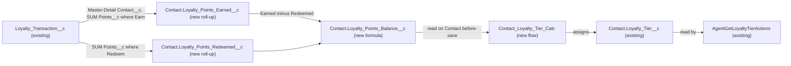

# Implementation spec — Contact loyalty tier kept in sync with points balance

> Derive each loyalty member's points balance from their `Loyalty_Transaction__c` records and keep `Contact.Loyalty_Tier__c` set from that balance automatically.

_Based on the requirement, the evidence reported by AskCoworker, and read-only org queries where noted. Assumptions and missing evidence are identified below. Specification only — nothing is implemented or deployed._

---

## 1. The requirement

Keep `Contact.Loyalty_Tier__c` up to date from the Contact's loyalty points balance. No points balance exists in the org today, so the design adds one (from the existing `Loyalty_Transaction__c` ledger) and a flow that sets the tier from it. No user decision changed the scope. The request contained no deploy or data-change instruction.

| # | Responsibility | Trigger | Where it lives |
| --- | --- | --- | --- |
| 1 | Compute each Contact's points balance (earned minus redeemed) | Insert, update, delete, or undelete of a `Loyalty_Transaction__c` | `Contact.Loyalty_Points_Earned__c`, `Contact.Loyalty_Points_Redeemed__c`, `Contact.Loyalty_Points_Balance__c` |
| 2 | Set `Contact.Loyalty_Tier__c` from the balance for loyalty members | Contact save, including the parent save caused by roll-up recalculation | `Contact_Loyalty_Tier_Calc` (Flow) |
| 3 | Keep existing tier readers working | Not specified | `AgentGetLoyaltyTierActions` (existing, unchanged) |

## 2. Grounding — reuse before building

Target org: `TestWriteSpecDE` (Developer Edition, `00Dak00001COqNeEAL`). API version: `67.0`.

- **`Contact.Loyalty_Tier__c`** (CustomField) — restricted picklist with values `Explorer`, `Insider`, `Pronto Plus`, `Pronto One`, `Pronto Elite`; description "The customer's current loyalty program tier."; blank on all 198 Contacts. Reused as the target; not changed. _verified by org query_
- **`Loyalty_Transaction__c`** (CustomObject) — the points ledger. `Loyalty_Transaction__c.Contact__c` is a Master-Detail to `Contact` (cascade delete, not updateable, so not reparentable). _verified by org query_
- **`Loyalty_Transaction__c.Points__c`** (CustomField) — Number(18,0), not required, no default; description "The number of loyalty points involved in the transaction." _verified by org query_
- **`Loyalty_Transaction__c.Transaction_Type__c`** (CustomField) — picklist `Earn`, `Redeem`. `Loyalty_Transaction__c.Transaction_Source__c` has `Order`, `Promotion`, `Manual Adjustment` and is not used by this design. _verified by org query_
- **Data shape** — 0 `Loyalty_Transaction__c` records exist, so the sign convention of `Points__c` for `Redeem` rows cannot be observed. 187 of 198 Contacts have `Contact.Member_Number__c` populated. _verified by org query_
- **No existing balance or thresholds** — no custom field on any object has a developer name containing Point, Balance, or Tier other than `Loyalty_Transaction__c.Points__c` and `Contact.Loyalty_Tier__c`; the full custom object list contains no unmanaged custom metadata type or custom setting for tiers or thresholds; no unmanaged Apex class references `Points__c` or `Loyalty_Transaction__c`. _verified by org query_
- **No automation on either object** — 0 Apex triggers, 0 flows in `FlowDefinitionView` triggered on `Contact` or `Loyalty_Transaction__c`, 0 validation rules on either object. _verified by org query_
- **`AgentGetLoyaltyTierActions`** (ApexClass) — the only component that references `Contact.Loyalty_Tier__c` (per `MetadataComponentDependency` and a search of all 70 unmanaged Apex bodies); it reads the tier and does not write it. It keeps working unchanged. _verified by org query_ (read-only behavior _reported by AskCoworker_)
- **Tier FLS** — `Contact.Loyalty_Tier__c` Read+Edit in `Agentforce_Reference_App` and `sfdc_accelerate_dms`; Read only in `sfdc_a360_sfcrm_data_extract`, `sfdc_slack`, `Pronto_Deep_Dive_Workshop` (complete list of permission-set grants). `sfdc_accelerate_dms`, `sfdc_a360_sfcrm_data_extract`, and `sfdc_slack` are `sfdcInternalInt` Session permission sets and cannot be edited. _verified by org query_
- **Name availability** — no flow `Contact_Loyalty_Tier_Calc` and no fields `Loyalty_Points_Earned__c`, `Loyalty_Points_Redeemed__c`, `Loyalty_Points_Balance__c` exist. _verified by org query_

Evidence sources: `sf org display`; `sf sobject list --sobject custom`; `sf sobject describe` on `Contact` and `Loyalty_Transaction__c`; Tooling `CustomField`, `CustomField.Metadata`, `EntityDefinition`, `ApexTrigger`, `ValidationRule`, `ApexClass` bodies, `MetadataComponentDependency`; standard `FlowDefinitionView`, `FieldPermissions`, `PermissionSet`, `DataStream`, and aggregate queries on `Contact` and `Loyalty_Transaction__c`. AskCoworker returned no citedReferences.

## 3. Architecture

Why the pieces are drawn this way:

1. `Loyalty_Transaction__c` is the master-detail child of `Contact` (verified by org query), so roll-up summary fields on `Contact` can sum `Points__c` with a filter on `Transaction_Type__c`. Roll-ups recalculate on child insert, update, delete, and undelete without any code (assumption (documented platform behavior)).
2. `Contact.Loyalty_Points_Balance__c` is the single definition of "points balance"; the flow reads it rather than repeating the subtraction.
3. `Contact.Loyalty_Tier__c` stays a restricted picklist because `AgentGetLoyaltyTierActions` reads it (verified by org query); a formula field cannot replace a picklist in place, so a before-save record-triggered flow assigns it. When a roll-up changes, the parent Contact goes through its save procedure, which runs the before-save flow (assumption (documented platform behavior)).
4. No Apex is used: roll-ups, a formula, and a before-save flow cover every event, and a before-save flow needs no SOQL or DML.

## 4. Metadata changes

**Data model**

- **Create `Contact.Loyalty_Points_Earned__c`** — Roll-Up Summary, label "Loyalty Points Earned". Summarized object `Loyalty_Transaction__c` (relationship `Contact__c`), operation `SUM` of `Loyalty_Transaction__c.Points__c`, filter `Transaction_Type__c` equals `Earn`. Returns 0 when there are no matching children; null `Points__c` values contribute nothing.
- **Create `Contact.Loyalty_Points_Redeemed__c`** — Roll-Up Summary, label "Loyalty Points Redeemed". Operation `SUM` of `Loyalty_Transaction__c.Points__c`, filter `Transaction_Type__c` equals `Redeem`. Same blank behavior as the earned roll-up.
- **Create `Contact.Loyalty_Points_Balance__c`** — Formula (Number, 18 digits, 0 decimals), label "Loyalty Points Balance": `Loyalty_Points_Earned__c - ABS(Loyalty_Points_Redeemed__c)`. `ABS` makes the result correct whether `Redeem` rows store positive or negative points, as long as one convention is used consistently (see Section 8). Blank handling `BlankAsZero`; with no transactions the result is 0. The formula is far below the 3,900-character limit.

**Automation**

- **Create `Contact_Loyalty_Tier_Calc`** — Conditional: tier threshold values must be confirmed by the business owner (Section 8, item 1). Record-triggered flow on `Contact`, "Fast Field Updates" (before-save), runs when a record is created or updated. Entry condition: `Member_Number__c` Is Null = False, run every time the condition is met. One formula resource computes the tier from `{!$Record.Loyalty_Points_Balance__c}` and an Assignment element sets `{!$Record.Loyalty_Tier__c}`. Placeholder thresholds: `IF({!$Record.Loyalty_Points_Balance__c} >= 5000, "Pronto Elite", IF({!$Record.Loyalty_Points_Balance__c} >= 3000, "Pronto One", IF({!$Record.Loyalty_Points_Balance__c} >= 1500, "Pronto Plus", IF({!$Record.Loyalty_Points_Balance__c} >= 500, "Insider", "Explorer"))))`. A zero, blank, or negative balance gives `Explorer`. No Get Records and no Update Records elements. Saved and deployed as Active.

## 5. Data 360 (Data Cloud) data involved

Not applicable — this change does not use Data 360. The org has 0 `DataStream` records (verified by org query).

## 6. Security considerations

- **Execution context.** Roll-up recalculation and the before-save flow run in system context, so users who create `Loyalty_Transaction__c` records do not need Edit on `Contact.Loyalty_Tier__c` for the tier to update (assumption (documented platform behavior)). The flow uses no queries, so sharing does not affect which data it reads.
- **CRUD/FLS on the new fields.** No permission set is created or changed. No responsibility in Section 1 requires a person or integration to read the three new balance fields; the flow reads them in system context. Access to them is an open decision (Section 8, item 4).
- **Existing tier access is unchanged.** `Contact.Loyalty_Tier__c` keeps its current grants (Section 2). Users with Edit (`Agentforce_Reference_App`, `sfdc_accelerate_dms`) can still type a tier, but the flow overwrites it on the next save of a member Contact (Section 8, item 5).
- **Data exposure.** The balance fields are numeric aggregates of data users can already see on `Loyalty_Transaction__c`; they add no new PII. Permission sets are not the only grant path; profiles may also grant FLS.

## 7. Testing strategy

The inventory contains no Apex, so there is no Apex test class. A Flow Test is not in the inventory. All cases below are recommended verification in a sandbox after deployment:

- **Earned roll-up and tier.** Insert an `Earn` transaction of 600 points for a member Contact: `Loyalty_Points_Earned__c` = 600, `Loyalty_Points_Balance__c` = 600, `Loyalty_Tier__c` = `Insider`.
- **Redeem lowers the tier.** Insert a `Redeem` transaction of 200 points for the same Contact: balance 400, tier `Explorer`. Repeat with -200 to confirm the `ABS` handling.
- **Thresholds and boundaries.** Walk the balance to 499, 500, 1499, 1500, 2999, 3000, 4999, 5000; the tier changes exactly at each placeholder threshold.
- **Delete and undelete.** Delete the 600-point transaction: balance and tier drop. Undelete it: they return.
- **Update of a transaction.** Change `Points__c` and change `Transaction_Type__c` from `Earn` to `Redeem`: balance and tier follow.
- **Negative and blank inputs.** A transaction with blank `Points__c` changes nothing. Redemptions above earnings give a negative balance and tier `Explorer`.
- **Membership transitions.** A Contact with blank `Member_Number__c` gets balance fields but no tier. Setting `Member_Number__c` on that Contact assigns the tier in the same save. Clearing `Member_Number__c` leaves the last tier in place (Section 8, item 3).
- **Manual override.** Set `Loyalty_Tier__c` by hand on a member Contact: the flow replaces it with the computed tier.
- **Bulk.** Insert 200 transactions across 200 member Contacts in one Data Loader batch, and 200 transactions for one Contact; all balances and tiers are correct with no limit errors.
- **Permission.** As a user with `Agentforce_Reference_App` (Create on `Loyalty_Transaction__c`, verified by org query), insert a transaction; the tier updates. Confirm `AgentGetLoyaltyTierActions` returns the new tier.
- **Backfill.** After the backfill step (Section 8, item 2), every member Contact has a tier.

## 8. Open decisions

### Open

1. **Tier thresholds (blocking for delivery).** No thresholds exist in the org (verified by org query), so `Contact_Loyalty_Tier_Calc` is `Conditional:` on the owner confirming the point values for `Insider`, `Pronto Plus`, `Pronto One`, and `Pronto Elite`. Placeholders 500 / 1,500 / 3,000 / 5,000 are an *assumption*. The three fields can be deployed before the thresholds are known.
2. **Deployment sequence and backfill (blocking for delivery).** Deploy `Contact.Loyalty_Points_Earned__c` and `Contact.Loyalty_Points_Redeemed__c`, then `Contact.Loyalty_Points_Balance__c`, then `Contact_Loyalty_Tier_Calc`. All 187 member Contacts have a blank tier today and roll-ups do not re-save existing Contacts, so a one-time no-change save of the member Contacts (for example a Data Loader update of `Id` only) is needed to assign `Explorer` to them. Because 0 transactions exist, the only effect is setting tiers; the business-record change is reversible by clearing `Loyalty_Tier__c` from an export taken before the save. *assumption*
3. **Contacts that stop matching (non-blocking).** When `Member_Number__c` is cleared, the flow no longer runs and `Loyalty_Tier__c` keeps its last value. Recommended default: leave it; clearing it would add behavior not asked for. *assumption*
4. **Access to the new balance fields (non-blocking).** No FLS or page-layout placement is included because no responsibility needs people to see them. If users or agents should see the balance, add a new dedicated permission set with Read on the three fields rather than widening `Agentforce_Reference_App` or the non-editable `sfdcInternalInt` permission sets. *assumption*
5. **Manual tier edits are overwritten (non-blocking).** Tier becomes system-maintained for member Contacts; any manual override is replaced on the next save. Recommended default: accept. *assumption*

### Resolved

- **Balance definition.** "Points balance" is taken as earned minus redeemed points from `Loyalty_Transaction__c`, because `Transaction_Type__c` has exactly `Earn` and `Redeem` (verified by org query). *assumption*
- **Redeem sign convention.** With 0 transactions the convention cannot be observed (verified by org query); the formula uses `ABS` on the redeemed sum so both conventions give the right balance. This corrects the AskCoworker formula, which assumed positive redeem values. *assumption*
- **Who gets a tier.** Only Contacts with `Member_Number__c` populated (187 of 198, verified by org query), because a member number marks a loyalty member. *assumption*
- **Where thresholds live.** In the flow formula, not in a new custom metadata type, to keep the change minimal. A custom metadata type is a possible follow-up if thresholds change often. *assumption*
- **Flow reads the formula field.** The flow reads `Loyalty_Points_Balance__c` so the balance has one definition. That a before-save flow sees the recalculated formula and roll-up values is *assumption (documented platform behavior)*, checked by the tests in Section 7; if it fails, the flow's formula resource uses the two roll-up fields directly.
- **Dropped AskCoworker proposals.** The following were dropped: granting Read on the new fields to five existing permission sets (three are non-editable `sfdcInternalInt` sets, and widening broad sets is not a default); "0 DataStreams" and permission-set namespaces, which were confirmed by org query; an extra flow path to clear the tier; an `ISCHANGED` entry condition; and validation rules for negative balances or blank points. None of these is needed for the requirement.

## 9. Change set

| # | Action | Type | API name | Module | Why |
| --- | --- | --- | --- | --- | --- |
| 1 | Create | CustomField | `Contact.Loyalty_Points_Earned__c` | force-app/main/default/objects/Contact/fields | Sums earned points from `Loyalty_Transaction__c` |
| 2 | Create | CustomField | `Contact.Loyalty_Points_Redeemed__c` | force-app/main/default/objects/Contact/fields | Sums redeemed points from `Loyalty_Transaction__c` |
| 3 | Create | CustomField | `Contact.Loyalty_Points_Balance__c` | force-app/main/default/objects/Contact/fields | Single definition of the points balance |
| 4 | Create | Flow | `Contact_Loyalty_Tier_Calc` | force-app/main/default/flows | Sets `Loyalty_Tier__c` from the balance on every member Contact save |

Two roll-ups and a formula derive the balance on `Contact`, and a before-save flow maps it to the existing `Loyalty_Tier__c` picklist.

Total: 4 · Create: 4 · Update: 0 · Delete: 0
