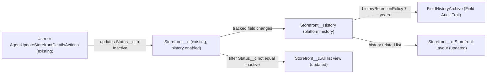

# Implementation spec — Archive Inactive storefronts and retain storefront history for 7 years

> Keep Inactive `Storefront__c` records instead of deleting them, hide them from the default list view, and track field history on `Storefront__c` with a 7-year Field Audit Trail retention policy.

_Based on the requirement, the evidence reported by AskCoworker, and read-only org queries where noted. Assumptions and missing evidence are identified below. Specification only — nothing is implemented or deployed._

---

## 1. The requirement

The request asked to delete all Inactive storefronts and also keep 7 years of history for every storefront. These two parts contradict each other, because deletion removes records and their history. The user decided not to delete: Inactive storefronts stay in the org as archived records and are hidden from the default list view. The requested data deletion was not acted on, and no records were changed. Currently 0 of the 21 `Storefront__c` records are Inactive (_verified by org query_).

| # | Responsibility | Trigger | Where it lives |
| --- | --- | --- | --- |
| 1 | Archive Inactive storefronts by keeping them, instead of deleting them | A user or agent sets `Storefront__c.Status__c` to `Inactive` | `Storefront__c.Status__c` (existing picklist value `Inactive`) |
| 2 | Hide Inactive storefronts from the default list view | Opening the `Storefront__c` list view | `Storefront__c.All` (updated filter) |
| 3 | Record the change history of every storefront | Insert or update of a `Storefront__c` record | Field history tracking on `Storefront__c` and its tracked fields |
| 4 | Retain the history for 7 years | Field Audit Trail archive and retention job | `historyRetentionPolicy` on `Storefront__c` (Conditional: Field Audit Trail) |
| 5 | Let users read the history | Viewing a storefront record | `Storefront__c-Storefront Layout` history related list |

## 2. Grounding — reuse before building

Target org: `TestWriteSpecDE` (Developer Edition, not a sandbox, org ID `00Dak00001COqNeEAL`). API version: `67.0`.

- **`Storefront__c`** (CustomObject) — the storefront object, not namespaced. It has 21 records, and all 21 have `Status__c = 'Active'`. _verified by org query_
- **`Storefront__c.Status__c`** (CustomField, Picklist) — its values are `Active`, `Inactive`, `Pending Activation`, `Suspended`, and `Closed`. The existing `Inactive` value is reused as the archive marker, so no new field is needed. _verified by org query_
- **Field history on `Storefront__c`** — `IsFieldHistoryTracked` is false for every field. `Storefront__History` appears in `EntityDefinition`, but a query on it fails with "not supported", which is consistent with history being turned off. _verified by org query_
- **Field types** — `Description__c`, `Storefront_Overview__c`, and `Review_Summary__c` are `LongTextArea(1000)`. `Address__c` is a compound Address field. `Menu_Count__c`, `Total_Reviews__c`, and `Total_Score__c` are calculated with no formula, so they are roll-up summaries. `Average_Review_Score__c` is the formula `Total_Score__c / Total_Reviews__c`. _verified by org query_
- **`Storefront__c.All`** (ListView) — the only list view on `Storefront__c`. Its filters and columns cannot be read with the allowed commands. _verified by org query_
- **`Storefront__c-Storefront Layout`** (Layout) — the only layout. **`Storefront_Record_Page`** (FlexiPage, RecordPage) is the record page. _verified by org query_
- **Child relationships** — `Review__c`, `Menu__c`, `Storefront_Hours_of_Operation__c`, and `Event_Storefront__c` have `cascadeDelete = true`. `Storefront_Tag__c`, `Promotion__c`, `Case`, `Gift_Certificate__c`, and `Refund__c` do not. These relationships show what a deletion would have destroyed. _verified by org query_
- **Automation** — there are no Apex triggers on `Storefront__c` or its nine custom and standard child objects, and there are no record-triggered flows on `Storefront__c`, `Review__c`, `Menu__c`, `Storefront_Hours_of_Operation__c`, or `Event_Storefront__c`. _verified by org query_
- **Delete access on `Storefront__c`** — granted by the permission sets `Agentforce_Reference_App` and `sfdc_accelerate_dms` (namespace `sfdcInternalInt`) and by one profile-owned permission set (`X00ex00000018ozh_128_09_04_12_1`). Other grants have Read only. This list is complete for `ObjectPermissions`. _verified by org query_
- **`FieldHistoryArchive`** — it can be queried and returns 0 rows. This does not prove that Field Audit Trail is licensed. _verified by org query_
- **Data 360** — `SELECT COUNT() FROM DataStream` returns 0. _verified by org query_
- **Apex readers and writers** — `AgentUpdateStorefrontDetailsActions` updates `Storefront__c`, including `Status__c`. Other `Agent*` classes and `StorefrontPickerController` read `Storefront__c`. No class deletes storefronts. _reported by AskCoworker_

Evidence sources: `sf org display`; `sf sobject describe Storefront__c`; `sf sobject list`; SOQL on `Storefront__c` (grouped by `Status__c`), `Organization`, `FieldDefinition`, `EntityDefinition`, `ListView`, `ObjectPermissions`, `FlowDefinitionView`, `DataStream`, and `FieldHistoryArchive`; Tooling queries on `ApexTrigger`, `CustomObject`, `CustomField` (including `Metadata`), `Layout`, and `FlexiPage`. AskCoworker returned no citedReferences.

## 3. Architecture

Why the pieces are drawn this way:

1. Users and `AgentUpdateStorefrontDetailsActions` write `Status__c` (_reported by AskCoworker_). Setting the value to `Inactive` is the archive action, so no new automation is needed (_user decision_).
2. When `enableHistory` is on and fields have `trackHistory`, the platform writes a `Storefront__History` row for each tracked field that changes (_assumption (documented platform behavior)_).
3. Standard field history is kept for 18 months, or 24 months through the API. Field Audit Trail moves the history to `FieldHistoryArchive` and keeps it for the number of years in `historyRetentionPolicy` (_assumption (documented platform behavior)_).
4. The `All` list view gets a filter that hides records where `Status__c = 'Inactive'` (_user decision_).
5. The layout gets a history related list, so people can see the audit trail (_assumption_). Whether `Storefront_Record_Page` shows layout related lists is not specified.
6. No Apex is used. Every change is declarative configuration of existing components.

## 4. Metadata changes

**History**

- **Update `Storefront__c`** — Conditional: the `historyRetentionPolicy` element deploys only if Field Audit Trail is provisioned. Set `enableHistory = true`, set `trackHistory = true` on `nameField` (`Name`), and add `historyRetentionPolicy` with `archiveRetentionYears = 7`. Keep `archiveAfterMonths` at the default of 18.
- **Update `Storefront__c.Status__c`** — set `trackHistory = true`. This is the main audit field for archiving.
- **Update `Storefront__c.OwnerId`** — set `trackHistory = true`.
- **Update `Storefront__c.Account__c`** — set `trackHistory = true`.
- **Update `Storefront__c.Address__c`** — Conditional: the compound custom Address field must accept `trackHistory` when deployed. Set `trackHistory = true`.
- **Update `Storefront__c.Cuisine__c`** — set `trackHistory = true`.
- **Update `Storefront__c.Type__c`** — set `trackHistory = true`.
- **Update `Storefront__c.Phone__c`** — set `trackHistory = true`.
- **Update `Storefront__c.Primary_Contact__c`** — set `trackHistory = true`.
- **Update `Storefront__c.Image_URL__c`** — set `trackHistory = true`.
- **Update `Storefront__c.Description__c`** — set `trackHistory = true`. As a long text field, it is logged as "edited" without old or new values.
- **Update `Storefront__c.Storefront_Overview__c`** — set `trackHistory = true`. It is logged as "edited" without values.
- **Update `Storefront__c.Review_Summary__c`** — set `trackHistory = true`. It is logged as "edited" without values.

**UI**

- **Update `Storefront__c.All`** — add the filter `Status__c` notEqual `Inactive`. Keep the existing columns and scope, and retrieve the current definition first.
- **Update `Storefront__c-Storefront Layout`** — add the field history related list (`RelatedEntityHistoryList`).

## 5. Data 360 (Data Cloud) data involved

Not applicable — this change does not use Data 360. `DataStream` has 0 records (_verified by org query_).

## 6. Security considerations

- Field history is written by the platform in system context, whatever the running user's sharing is. `AgentUpdateStorefrontDetailsActions` runs `with sharing` (_reported by AskCoworker_). Its updates will create history rows (_assumption (documented platform behavior)_).
- Users can read history rows only if they can read the parent `Storefront__c` record and the tracked field. No new permission set or grant is needed. Existing Read grants on `Storefront__c` come from `Agentforce_Reference_App`, `sfdc_accelerate_dms`, `Pronto_Deep_Dive_Workshop`, `sfdc_a360_sfcrm_data_extract`, `sfdc_slack`, and two profile-owned permission sets (_verified by org query_).
- The list view filter only hides records. Inactive storefronts are still visible through search, reports, the API, the Recently Viewed list, and agent actions to anyone with Read (_assumption (documented platform behavior)_).
- History exposes old and new values of `OwnerId`, `Account__c`, `Primary_Contact__c`, `Phone__c`, and `Address__c` to readers of the record. This is the audit data the requirement asks for.
- Delete on `Storefront__c` is still granted to `Agentforce_Reference_App`, `sfdc_accelerate_dms`, and one profile (_verified by org query_). See Section 8, item 3.

## 7. Testing strategy

The inventory contains no Apex, so no test class is part of it. All cases below are recommended verification to run in a sandbox or scratch org before production. No tests have been run.

1. **Status change.** Update a storefront from `Active` to `Inactive`. The history related list shows `Status__c` with the old value, the new value, the user, and the time.
2. **Other tracked fields.** Change `Phone__c`, `Account__c`, and `Address__c`. Each change creates a history row. Change `Description__c`. The history shows "edited" without values.
3. **Untracked fields (negative).** Add a `Review__c` so that `Total_Reviews__c` changes. No history row appears for that roll-up.
4. **Bulk.** Update 200 storefronts in one Data Loader job. Each record gets one history row per changed tracked field.
5. **List view.** Open `Storefront__c.All`. Inactive records are not listed. Records with `Active`, `Pending Activation`, `Suspended`, or `Closed` still appear.
6. **Archive, not delete.** Query `SELECT COUNT() FROM Storefront__c WHERE Status__c = 'Inactive'`. The archived records still exist.
7. **Permission.** As a user with Read only (for example through `Pronto_Deep_Dive_Workshop`), open an archived storefront. The history is readable and cannot be edited.
8. **Retention (only if Field Audit Trail is provisioned).** Confirm the retention policy on `Storefront__c` in Setup, and query `FieldHistoryArchive WHERE FieldHistoryType = 'Storefront__c'` after the archive job runs.

## 8. Open decisions

### Open

1. **Field Audit Trail provisioning (blocking).** Seven-year retention needs the Field Audit Trail add-on. Standard history is kept for 18 months, or 24 months through the API. `FieldHistoryArchive` can be queried (0 rows), but that does not prove the license. This decides the Conditional `Storefront__c` change. The recommended default is to confirm the license before deployment. Without it, the 7-year responsibility cannot be delivered declaratively, and the alternative is a scheduled export to an external archive, which is out of scope.
2. **`Address__c` history tracking (non-blocking).** The Conditional `Storefront__c.Address__c` change depends on the compound custom Address field accepting `trackHistory`. AskCoworker reported that tracking might be limited. The recommended default is to validate-deploy it in a sandbox. If it is rejected, drop that row and record the gap.
3. **Deletion still allowed (non-blocking; proposal).** Users with Delete (`Agentforce_Reference_App`, `sfdc_accelerate_dms`, one profile) can still delete storefronts, and a hard delete removes standard history. `sfdc_accelerate_dms` is in namespace `sfdcInternalInt` and cannot be edited. The requirement did not ask to restrict deletion, so no change is in the inventory. The proposal is to remove Delete from `Agentforce_Reference_App` and the profile, as a separate decision.
4. **Deployment sequence (non-blocking).** Deploy the `Storefront__c` object change (enabling history) together with the field `trackHistory` changes, or before them. Then deploy the layout. The list view is independent. Retrieve `Storefront__c.All` and `Storefront__c-Storefront Layout` before editing, so their current contents are kept. Rollback: redeploy the retrieved versions, and set `enableHistory = false`. Turning history off deletes the history already collected, so avoid rollback after go-live.
5. **Record page placement (non-blocking; assumption).** It is not specified whether `Storefront_Record_Page` renders the layout's related lists. If it uses a custom related-list component, add the history related list to the FlexiPage.
6. **Tracked field set (non-blocking; assumption).** The user had no preference, so all 13 trackable business fields are tracked: `Name` through the object's `nameField`, and 12 custom and standard fields. That is within the 20-field standard limit. Roll-up and formula fields cannot be tracked.

### Resolved

- **Delete vs. retain (user decision).** Do not delete. Archive by keeping records with `Status__c = 'Inactive'`, and hide them from the default list view. This makes the premise moot: 0 records are Inactive today (_verified by org query_).
- **Retention mechanism.** The user had no preference, so Field Audit Trail with a 7-year policy was chosen as the recommended default (_assumption_).
- **List view filter.** `Status__c` not equal `Inactive` was chosen over `Status__c = 'Active'`, so Pending, Suspended, and Closed storefronts stay visible. This is the default recommended by AskCoworker (_assumption_).
- **Correction: long text fields.** AskCoworker said long text area fields cannot be tracked. Salesforce documents that fields over 255 characters are tracked as edited without old and new values. `Description__c`, `Storefront_Overview__c`, and `Review_Summary__c` are kept in the inventory (_assumption (documented platform behavior)_).
- **Correction: history retention metadata.** AskCoworker proposed a standalone `HistoryRetentionPolicy` component. In the Metadata API, it is the `historyRetentionPolicy` element of `CustomObject`, so it is folded into the `Storefront__c` update.
- **Correction: folded field rows.** AskCoworker listed eight fields in one row. They are split into one row per field. `Name` is tracked through `nameField` on the object.
- **Correction: history entity name.** AskCoworker named it `Storefront__cHistory`. The org shows `Storefront__History` (_verified by org query_).
- **Correction: cascade behavior.** AskCoworker reported `Storefront_Tag__c` as master-detail (cascade) and `Event_Storefront__c` as a lookup (orphaned). The describe shows the reverse: `Event_Storefront__c` cascades and `Storefront_Tag__c` does not (_verified by org query_).
- **Correction: Delete grants.** AskCoworker listed two permission sets with Delete. `ObjectPermissions` also shows a profile-owned grant (_verified by org query_).
- **Not adopted:** AskCoworker proposed a validation rule to block deletion. Validation rules do not run on delete (_assumption (documented platform behavior)_). Blocking deletion was not requested either.

## 9. Change set

| # | Action | Type | API name | Module | Why |
| --- | --- | --- | --- | --- | --- |
| 1 | Update | CustomObject | `Storefront__c` | force-app/main/default/objects | Enable history, track Name, and set a 7-year retention policy (Conditional) |
| 2 | Update | CustomField | `Storefront__c.Status__c` | force-app/main/default/objects | Track archive status changes |
| 3 | Update | CustomField | `Storefront__c.OwnerId` | force-app/main/default/objects | Track owner changes |
| 4 | Update | CustomField | `Storefront__c.Account__c` | force-app/main/default/objects | Track account changes |
| 5 | Update | CustomField | `Storefront__c.Address__c` | force-app/main/default/objects | Track address changes (Conditional) |
| 6 | Update | CustomField | `Storefront__c.Cuisine__c` | force-app/main/default/objects | Track cuisine changes |
| 7 | Update | CustomField | `Storefront__c.Type__c` | force-app/main/default/objects | Track type changes |
| 8 | Update | CustomField | `Storefront__c.Phone__c` | force-app/main/default/objects | Track phone changes |
| 9 | Update | CustomField | `Storefront__c.Primary_Contact__c` | force-app/main/default/objects | Track primary contact changes |
| 10 | Update | CustomField | `Storefront__c.Image_URL__c` | force-app/main/default/objects | Track image URL changes |
| 11 | Update | CustomField | `Storefront__c.Description__c` | force-app/main/default/objects | Log description edits |
| 12 | Update | CustomField | `Storefront__c.Storefront_Overview__c` | force-app/main/default/objects | Log overview edits |
| 13 | Update | CustomField | `Storefront__c.Review_Summary__c` | force-app/main/default/objects | Log review summary edits |
| 14 | Update | ListView | `Storefront__c.All` | force-app/main/default/objects | Hide Inactive storefronts from the default list view |
| 15 | Update | Layout | `Storefront__c-Storefront Layout` | force-app/main/default/layouts | Show the history related list |

Storefronts are archived by status instead of being deleted, hidden from the default list view, and audited through field history with Field Audit Trail retention.

Total: 15 · Create: 0 · Update: 15 · Delete: 0
