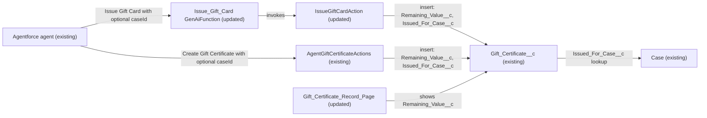

# Implementation spec — Gift certificate remaining balance and service recovery case link

> Surface the existing remaining-balance field on the gift certificate record page, and let the agent's "Issue Gift Card" action link a recovery gift certificate to the case it was issued for.

_Based on the requirement, the evidence reported by AskCoworker, and read-only org queries where noted. Assumptions and missing evidence are identified below. Specification only — nothing is implemented or deployed._

---

## 1. The requirement

Gift certificates must show the balance left after partial redemptions and, for service recovery, link to the case they were issued for. Both fields already exist on `Gift_Certificate__c`; this spec closes two gaps: the balance is not on the record page, and the `IssueGiftCardAction` path (default type Recovery) cannot set the case link. The user had no preference on the two scope questions, so the recommended defaults were taken (Section 8). The request contained no deploy or data-change instruction.

| # | Responsibility | Trigger | Where it lives |
| --- | --- | --- | --- |
| 1 | Store the remaining balance of a gift certificate | Insert (set to the issued value); later edits by whoever records a redemption | `Gift_Certificate__c.Remaining_Value__c` (existing) |
| 2 | Show the remaining balance to users on the record | Viewing a gift certificate record | `Gift_Certificate_Record_Page` (updated) |
| 3 | Store the link from a gift certificate to the case it was issued for | Insert | `Gift_Certificate__c.Issued_For_Case__c` (existing) |
| 4 | Set the case link when a recovery gift certificate is issued through either agent action | Agent invokes "Issue Gift Card" or "Create Gift Certificate" with a case Id | `IssueGiftCardAction` (updated), `Issue_Gift_Card` (updated), `AgentGiftCertificateActions` (existing) |

## 2. Grounding — reuse before building

Target org: `TestWriteSpecDE` (connected; user `epic.2b9dd11f2b2a@orgfarm.salesforce.com`). API version: `67.0`.

- **`Gift_Certificate__c`** (CustomObject) — the gift certificate. Top-level object; no custom child objects, so there is no redemption ledger. _verified by org query_
- **`Gift_Certificate__c.Remaining_Value__c`** (CustomField, Currency 18,2, not required, no default, not formula or roll-up) — description "The remaining monetary value available for redemption." This is the balance field. _verified by org query_
- **`Gift_Certificate__c.Original_Value__c`** (Currency 18,2) and **`Gift_Certificate__c.Value__c`** (Currency 18,0) — issued value; both are on the record page. _verified by org query_
- **`Gift_Certificate__c.Issued_For_Case__c`** (CustomField, Lookup to `Case`, relationship `Case_Gift_Certificates__r`, `deleteConstraint` SetNull, not required, no lookup filter) — description "Links this gift certificate to the service Case it was issued for (e.g., recovery)." _verified by org query_
- **`Gift_Certificate__c.Status__c`** (Picklist: Draft, Active, Partially Redeemed, Fully Redeemed, Expired, Cancelled) and **`Gift_Certificate__c.Type__c`** (Picklist: Purchased, Recovery, Promotion, Loyalty Reward, Referral Bonus). _verified by org query_
- **No automation on `Gift_Certificate__c`**: zero Apex triggers (also zero on `Case`), zero record-triggered flows, zero validation rules. _verified by org query_
- **Apex that references `Gift_Certificate__c`** (complete list from a search of all 70 unmanaged Apex class bodies): `AgentGiftCertificateActions`, `IssueGiftCardAction`, `RenderGiftCardAction`, `RenderGiftCardActionTest`; also `IssueGiftCardActionTest` tests `IssueGiftCardAction`. None decrements `Remaining_Value__c` after insert. _verified by org query_
- **`AgentGiftCertificateActions`** (ApexClass, `with sharing`, agent action `Create_Gift_Certificate_179Kj000000oapj`) — on insert sets `Value__c`, `Original_Value__c`, `Remaining_Value__c` to the gift value, and sets `Issued_For_Case__c` from an optional `caseId` (type `Id`). Already meets responsibility 4 for its path. _verified by org query_
- **`IssueGiftCardAction`** (ApexClass, `with sharing`, unmanaged, agent action `Issue_Gift_Card`) — inserts one `Gift_Certificate__c` with `Remaining_Value__c` = gift value and `Type__c` defaulting to Recovery, but has no case input and never sets `Issued_For_Case__c`. A 24-hour duplicate check returns an existing Active Agentforce certificate for the same recipient, value, and type instead of inserting. Referenced by `RenderGiftCardAction` (reuses `IssueGiftCardAction.GiftCardView`), `IssueGiftCardActionTest`, and LightningRegistryBundle `PT-giftCardView`. _verified by org query_
- **`IssueGiftCardActionTest`** (ApexClass, unmanaged) — methods `issuesGiftCardForContact`, `validatesInputs`. _verified by org query_
- **`Issue_Gift_Card`** (GenAiFunction, unmanaged) — agent action whose invocation target is `IssueGiftCardAction`. _verified by org query_
- **`Gift_Certificate_Record_Page`** (FlexiPage, unmanaged, Dynamic Forms) — "Certificate Details" section shows `Issue_Date__c`, `Issued_By__c`, `Issued_For_Case__c`, `Type__c`, `Value__c`, `Original_Value__c`; `Remaining_Value__c` is not on the page. _verified by org query_
- **`Gift_Certificate__c-Gift Certificate Layout`** (Layout) — contains only `Name`, `Recipient__c`, and system fields. _verified by org query_
- **Field access** — Read and Edit on `Remaining_Value__c` and `Issued_For_Case__c` in permission sets `Agentforce_Action_Access`, `Pronto_Deep_Dive_Workshop`, `Agentforce_Reference_App`, `sfdc_accelerate_dms`; Read only in `sfdc_a360_sfcrm_data_extract` and `sfdc_slack` (permission sets only; profiles not listed). _verified by org query_
- **Case object access** — `Agentforce_Action_Access` has no `Case` object permission; `Agentforce_Actions` has Case Read/Create/Edit. _verified by org query_
- **Data shape** — 1 `Gift_Certificate__c` record (Type Recovery, Status Active, `Issued_For_Case__c` blank); 9 `Case` records. _verified by org query_

Evidence sources: `sf org display`; `sf sobject list --sobject custom`; `sf sobject describe` on `Gift_Certificate__c` and `Case`; Tooling queries on `EntityDefinition`, `CustomField` (list and `Metadata`), `ApexTrigger`, `ValidationRule`, `ApexClass` bodies, `MetadataComponentDependency`, `GenAiFunctionDefinition`, `Layout.Metadata`, `FlexiPage.Metadata`; standard queries on `FlowDefinitionView`, `FieldPermissions`, `ObjectPermissions`, `DataStream`, and aggregate record counts. AskCoworker returned no citedReferences.

## 3. Architecture

Why the pieces are drawn this way:

1. The agent reaches `IssueGiftCardAction` only through the `Issue_Gift_Card` action (verified by org query). An invocable input the action schema does not declare cannot be supplied by the agent, so the action is updated together with the class (assumption (documented platform behavior)).
2. `AgentGiftCertificateActions` already accepts `caseId` and sets `Issued_For_Case__c` (verified by org query), so it is reused unchanged.
3. Apex is changed, not a flow, because the gap is a missing input on an existing invocable Apex method; the only way to add it is to change the class (assumption (documented platform behavior)).
4. `Remaining_Value__c` is shown on the Dynamic Forms page, which is where the other value fields already appear (verified by org query).
5. No automation fires on `Gift_Certificate__c` insert or update (verified by org query), so no edge from the object to other components is drawn.

## 4. Metadata changes

**Automation**

- **Update `IssueGiftCardAction`** — Add an optional input to `IssueGiftCardAction.Request`: `@InvocableVariable(label='Case Id' description='Optional Case Id of the service case this gift certificate is issued for (Gift_Certificate__c.Issued_For_Case__c).' required=false) public Id caseId;` (same name and type as in `AgentGiftCertificateActions`). In `invoke`, on the new-record path, set `gc.Issued_For_Case__c = req.caseId;` before `insert gc;`. The 24-hour duplicate check, its filter, and the returned `GiftCardView` are unchanged; a duplicate call returns the existing certificate and does not change its case link. The class stays `with sharing`. Existing callers that omit `caseId` get the current behavior.
- **Update `Issue_Gift_Card`** — Retrieve before editing. Add `caseId` to the action's input schema as an optional, non-user-input-required text/Id parameter with the description "Case Id of the service case this gift certificate is issued for, for service recovery. Leave blank otherwise." Output schema unchanged.

**Tests**

- **Update `IssueGiftCardActionTest`** — Add methods: `issuesGiftCardWithCaseLink` (insert a `Case`, invoke with `caseId`, assert `Issued_For_Case__c` equals the case Id and `Remaining_Value__c` equals the gift value); `issuesGiftCardWithoutCaseLink` (no `caseId`, assert `Issued_For_Case__c` is null); `duplicateKeepsExistingCaseLink` (second call within 24 hours with a different `caseId` returns the same certificate and its `Issued_For_Case__c` is unchanged). Existing methods unchanged.

**UX**

- **Update `Gift_Certificate_Record_Page`** — Retrieve before editing. Add a field instance `Record.Remaining_Value__c` to the "Certificate Details" section, in the column that holds `Type__c`, `Value__c`, `Original_Value__c`, directly after `Original_Value__c`, UI behavior "none" (editable per FLS). No other page changes. The change applies to every user assigned this page.

## 5. Data 360 (Data Cloud) data involved

Not applicable — this change does not use Data 360. The org has zero `DataStream` records (verified by org query), and no fields are added.

## 6. Security considerations

- **Execution context.** `IssueGiftCardAction` is `with sharing` (verified by org query), so record sharing applies to its query and insert. Plain Apex DML does not enforce CRUD or FLS (assumption (documented platform behavior)); the running user still has Edit on `Issued_For_Case__c` through `Agentforce_Action_Access` (verified by org query).
- **Case lookup.** Saving a lookup to a record the running user cannot see under sharing fails with `INSUFFICIENT_ACCESS_ON_CROSS_REFERENCE_ENTITY`, and an Id that is not an existing `Case` fails with `INVALID_CROSS_REFERENCE_KEY` or `FIELD_INTEGRITY_EXCEPTION` (assumption (documented platform behavior)). In both cases the insert does not happen; the class's existing `catch (Exception e)` returns `success = false` with the exception message (verified by org query).
- **CRUD/FLS.** No permission set changes. Read/Edit on `Remaining_Value__c` and `Issued_For_Case__c` already exists in `Agentforce_Action_Access`, `Pronto_Deep_Dive_Workshop`, `Agentforce_Reference_App`, `sfdc_accelerate_dms`; Read only in `sfdc_a360_sfcrm_data_extract` and `sfdc_slack` (verified by org query, permission sets only). Users who see the record page without FLS on `Remaining_Value__c` will not see the field. Permission sets are not the only grant path; profiles were not listed.
- **Data exposure.** `Remaining_Value__c` becomes visible on the page to users who already have Read FLS through the API; no new data is exposed.

## 7. Testing strategy

- `IssueGiftCardActionTest.issuesGiftCardWithCaseLink` — responsibility 4 (case link set on insert; balance set).
- `IssueGiftCardActionTest.issuesGiftCardWithoutCaseLink` — backward compatibility for callers that omit `caseId`.
- `IssueGiftCardActionTest.duplicateKeepsExistingCaseLink` — duplicate path does not insert or relink.
- Existing `validatesInputs` covers non-positive gift value and missing customer (the class rejects `giftValue <= 0`, verified by org query); no change.
- Bulk: the action processes only the first request in the list (verified by org query); no bulk test is added. Recommended verification: confirm the agent sends one request per invocation.
- Recommended verification (no planned test): invoke "Issue Gift Card" from the agent with a case Id and confirm the new record's `Issued_For_Case__c`; open a gift certificate as a user with `Agentforce_Action_Access` and confirm `Remaining_Value__c` shows under "Certificate Details"; delete a linked test `Case` in a sandbox and confirm `Issued_For_Case__c` becomes blank (SetNull, verified by org query); invoke with a case the user cannot see and confirm the action returns `success = false`.
- Tests have not been run.

## 8. Open decisions

### Open

1. **Who decrements `Remaining_Value__c` on redemption (non-blocking).** No component in the org records redemptions or updates `Remaining_Value__c` after insert (verified by org query). With the chosen default the field is maintained by whoever records a redemption (a user edit or a future integration). A redemption ledger (child object with a roll-up of redeemed amounts and automation to set the balance and `Status__c`) is a proposal, not in this inventory.
2. **Balance and status consistency (non-blocking).** No validation rule stops `Remaining_Value__c` going below zero or above `Original_Value__c`, or keeps `Status__c` (Partially Redeemed, Fully Redeemed) in step with the balance. Proposal only; not requested.
3. **Recovery certificates without a case (non-blocking).** `Issued_For_Case__c` stays optional, and no rule requires it when `Type__c` is Recovery. The existing Recovery record has no case (verified by org query). Requiring it would break `IssueGiftCardAction` calls that omit `caseId`. Proposal only.
4. **Agent instructions (non-blocking).** The agent must supply the case Id for the "Issue Gift Card" action to link it. `Agentforce_Action_Access` has no Case object access (verified by org query); whether the agent user also holds `Agentforce_Actions` or another Case grant was not checked. Topic instructions and assignments are not changed.
5. **Deployment sequence (non-blocking).** Deploy `IssueGiftCardAction` and `IssueGiftCardActionTest` together, then `Issue_Gift_Card`, then `Gift_Certificate_Record_Page`. Retrieve `Issue_Gift_Card` and `Gift_Certificate_Record_Page` into source control before editing; rollback is redeploying the retrieved versions.
6. **Page layout (non-blocking).** `Gift_Certificate__c-Gift Certificate Layout` shows neither field, but the Lightning record page uses Dynamic Forms, so the layout is not changed. Page activation assignments were not checked.

### Resolved

- **Balance design (assumption; user had no preference).** Q: "Should partial redemptions be recorded as separate records that update the balance, or should `Remaining_Value__c` stay the stored balance?" Default taken: keep `Remaining_Value__c` as the stored balance and surface it; no ledger object, because the field already exists and the requirement asks only to track the balance.
- **Case link on `IssueGiftCardAction` (assumption; user had no preference).** Q: "Should the Issue Gift Card action accept an optional case Id?" Default taken: yes, optional input. It defaults `Type__c` to Recovery, so it is the main recovery path, and an optional input does not change behavior for existing callers.
- **Corrections to AskCoworker proposals.** Added `IssueGiftCardActionTest` as its own row (AskCoworker folded it into the class) and `Issue_Gift_Card` (the agent cannot pass an input the action does not declare). AskCoworker's "FLS on `Issued_For_Case__c` unconfirmed" was settled: Edit is granted in `Agentforce_Action_Access` (verified by org query). AskCoworker's "duplicate returns success = false" was corrected: the class returns the existing certificate. AskCoworker's zero-value test case was dropped: the class rejects `giftValue <= 0`. Dropped proposals: Case Id pre-validation query, Case Read on `Agentforce_Action_Access`, balance on the rendered gift card, and a Recovery-requires-case validation rule.
- **Already met.** `Remaining_Value__c` and `Issued_For_Case__c` exist, and `AgentGiftCertificateActions` already sets both (verified by org query), so no field or object is created.

## 9. Change set

| # | Action | Type | API name | Module | Why |
| --- | --- | --- | --- | --- | --- |
| 1 | Update | ApexClass | `IssueGiftCardAction` | force-app/main/default/classes | Add optional `caseId` input and set `Issued_For_Case__c` on insert |
| 2 | Update | ApexClass | `IssueGiftCardActionTest` | force-app/main/default/classes | Cover case link, no-case, and duplicate paths |
| 3 | Update | GenAiFunction | `Issue_Gift_Card` | force-app/main/default/genAiFunctions | Expose `caseId` so the agent can pass it |
| 4 | Update | FlexiPage | `Gift_Certificate_Record_Page` | force-app/main/default/flexipages | Show `Remaining_Value__c` on the record page |

Existing fields hold the balance and the case link; the changes add the case input to the "Issue Gift Card" agent action and show the balance on the record page.

Total: 4 · Create: 0 · Update: 4 · Delete: 0
