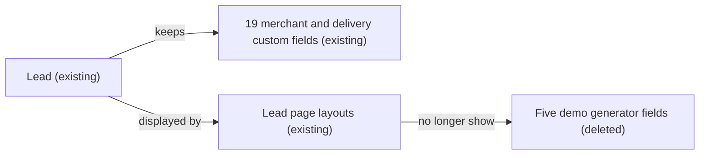

# Implementation spec — Lead demo generator field cleanup

> Delete the five unused GenWatt demo "generator" custom fields from the `Lead` object without affecting the merchant and delivery Lead fields.

_Based on the requirement, the evidence reported by AskCoworker, and read-only org queries where noted. Assumptions and missing evidence are identified below. Specification only — nothing is implemented or deployed._

---

## 1. The requirement

Remove the leftover demo generator fields from `Lead`. The five fields from the GenWatt generator sample data set are in scope; the other 19 Lead custom fields, including `Lead.Number_of_Locations__c`, are not (recommended default, see Section 8). The request contains no deploy or data-change instruction; this spec deploys nothing.

| # | Responsibility | Trigger | Where it lives |
| --- | --- | --- | --- |
| 1 | Identify the leftover demo generator fields on `Lead` | Not specified | `Lead` custom fields (Section 2) |
| 2 | Delete those fields safely, with no data loss and no broken references | Manual metadata deployment | `force-app/main/default/objects/Lead/fields` |
| 3 | Keep the non-demo Lead fields unchanged | Not applicable | `Lead` custom fields (Section 2) |

## 2. Grounding — reuse before building

Target org: `TestWriteSpecDE` (Developer Edition, not a sandbox, Org ID `00Dak00001COqNeEAL`). API version: `67.0`. No other environment is named in the requirement.

- **`Lead`** (standard object) — has 24 unmanaged custom fields (no namespace), all created on 2026-08-27 by the same user. None has a description except `Lead.DBA_Doing_Business_As_Name__c`. _verified by org query_
- **`Lead.CurrentGenerators__c`** (CustomField, Text 100, label "Current Generator(s)") — demo generator field. _verified by org query_
- **`Lead.NumberofLocations__c`** (CustomField, Number 3,0, label "Number of Locations") — demo generator field. _verified by org query_
- **`Lead.Primary__c`** (CustomField, Picklist: `Yes`, `No`) — demo generator field. _verified by org query_
- **`Lead.ProductInterest__c`** (CustomField, Picklist: `GC1000 series`, `GC3000 series`, `GC5000 series`) — demo generator field; the picklist values are generator product lines. _verified by org query_
- **`Lead.SICCode__c`** (CustomField, Text 15) — demo generator field. _verified by org query_
- These five fields form one ID block (`00Nak00004nK0Uc` to `00Nak00004nK0Ug`), separate from the 19 merchant and delivery fields (`00Nak00004nK0T5` to `00Nak00004nK0TN`). _verified by org query_ Matching them to the GenWatt sample set that Developer Edition orgs ship with is an _assumption_ based on names and picklist values.
- **`Lead.Number_of_Locations__c`** (CustomField, Number 5,0, label "Number of Locations") — same label as `Lead.NumberofLocations__c` but part of the merchant field block; not deleted. _verified by org query_
- **Data in the five fields** — 0 of 5 Lead records have a value in any of them. _verified by org query_
- **References to the five fields** — `MetadataComponentDependency` returns only Layouts: `Lead-Lead (Marketing) Layout` (all five), `Lead-Lead (Sales) Layout` (`Lead.CurrentGenerators__c`, `Lead.NumberofLocations__c`, `Lead.ProductInterest__c`), `Lead-Lead (Support) Layout` (`Lead.CurrentGenerators__c`, `Lead.ProductInterest__c`). `Lead-Lead Layout` exists and does not reference them. No FlexiPage, flow, formula, or validation rule reference is returned. _verified by org query_
- **Apex** — none of the 70 unmanaged Apex class bodies or 5 trigger bodies contains any of the five field names; there are no Apex triggers on `Lead`. _verified by org query_
- **Validation rules and flows** — `Lead` has no validation rules. The only Lead-triggered flow is `prm_slack_flows__ApprovalDispatcher` (managed, inactive, record-triggered after save). _verified by org query_
- **Data 360** — `DataStream` count is 0. _verified by org query_
- **Field permissions** — 245 `FieldPermissions` rows on the five fields: 46 profiles, the managed permission sets `sfdc_accelerate_dms` (edit), `sfdc_a360_sfcrm_data_extract` (read), `sfdc_slack` (read) in namespace `sfdcInternalInt`, and the unmanaged permission set `Agentforce_Reference_App` (read). _verified by org query_
- **Project source** — `force-app` contains no Lead object, field, layout, or permission set source, and no file references the five fields. _verified by project file_

Evidence sources: Tooling `CustomField`, `MetadataComponentDependency` (per field), `Layout`, `ValidationRule`, `ApexClass` and `ApexTrigger` bodies; standard `FlowDefinitionView`, `FieldPermissions`, `DataStream`, `ListView`, `Organization`, `Lead` counts; `sf sobject describe Lead`; a search of `force-app`. AskCoworker returned no citedReferences.

## 3. Architecture

Why the pieces are drawn this way:

1. `Lead` keeps its 19 merchant and delivery custom fields, including `Lead.Number_of_Locations__c`. _verified by org query_
2. The Lead page layouts stay. The platform removes a deleted custom field from page layouts automatically, so the layouts need no source change. _assumption (documented platform behavior)_
3. The five demo fields are deleted. Only layouts reference them, so no Apex, flow, formula, or validation rule breaks. _verified by org query_

## 4. Metadata changes

**Field deletion**

- **Delete `Lead.CurrentGenerators__c`** — Impact: removes the field, its layout placements, and its field permissions; 0 records hold data. Prerequisites: re-run the populated-record count just before deployment and confirm 0. Backup: record the field definition (Text 100, label "Current Generator(s)") from Section 2. Rollback: undelete from Setup > Object Manager > Lead > Fields & Relationships > Deleted Fields within 15 days, then re-add to layouts and permissions.
- **Delete `Lead.NumberofLocations__c`** — Impact: removes the field, its layout placements, and its field permissions; 0 records hold data. `Lead.Number_of_Locations__c` is not deleted. Prerequisites, backup (Number 3,0, label "Number of Locations"), and rollback as for `Lead.CurrentGenerators__c`.
- **Delete `Lead.Primary__c`** — Impact: removes the field, its picklist values, its layout placement, and its field permissions; 0 records hold data. Prerequisites, backup (Picklist `Yes`, `No`), and rollback as for `Lead.CurrentGenerators__c`.
- **Delete `Lead.ProductInterest__c`** — Impact: removes the field, its picklist values, its layout placements, and its field permissions; 0 records hold data. Prerequisites, backup (Picklist `GC1000 series`, `GC3000 series`, `GC5000 series`), and rollback as for `Lead.CurrentGenerators__c`.
- **Delete `Lead.SICCode__c`** — Impact: removes the field, its layout placement, and its field permissions; 0 records hold data. Prerequisites, backup (Text 15, label "SIC Code"), and rollback as for `Lead.CurrentGenerators__c`.

## 5. Data 360 (Data Cloud) data involved

Not applicable — this change does not use Data 360. The org has 0 data streams (_verified by org query_), so no Lead stream mapping uses these fields.

## 6. Security considerations

- **Execution context:** field deletion is a metadata deployment. It fires no triggers, flows, or validation rules. _assumption (documented platform behavior)_
- **CRUD/FLS:** the platform removes all 245 field permission rows on deletion, including those on the managed `sfdcInternalInt` permission sets, which could not be edited directly. _assumption (documented platform behavior)_ No permission set or profile change is in the inventory.
- **Permission sets are not the only grant path:** 46 profiles also grant access (_verified by org query_); the deletion removes those grants too.
- **Data exposure:** no data is exposed or lost, because 0 records hold values. _verified by org query_ The deleted fields stop being readable by the Slack and Data 360 extract integration users that had read access. _verified by org query_ (grants) / _assumption_ (effect)

## 7. Testing strategy

The inventory contains no Apex, so no test class is added. All cases below are recommended verification after deployment.

1. **Schema removal:** `sf sobject describe --sobject Lead` does not list the five fields.
2. **Out-of-scope fields intact:** `Lead.Number_of_Locations__c` and the other 18 merchant and delivery fields still exist.
3. **Layouts:** open `Lead-Lead (Marketing) Layout`, `Lead-Lead (Sales) Layout`, and `Lead-Lead (Support) Layout`; the five fields are gone and the layouts save without error.
4. **Permissions:** `FieldPermissions WHERE Field IN (the five fields)` returns 0 rows.
5. **Negative:** a SOQL query that selects `Lead.CurrentGenerators__c` fails with "No such column".
6. **Record operations:** create and edit a Lead in the UI with a sales user; both succeed.
7. **Reports and list views:** open Lead reports and the 7 Lead list views; none show a broken column or filter.

## 8. Open decisions

### Open

1. **Scope of "generator fields" (non-blocking).** The spec deletes the five GenWatt sample fields. `Lead.Number_of_Locations__c` has the same label as `Lead.NumberofLocations__c` but belongs to the merchant field block, so it stays. `Lead.IsConverted_Boolean__c` and the other merchant fields are not demo generator fields. Recommended default: delete only the five. _assumption_
2. **Reports, list views, and email templates not checked (non-blocking).** The allowed queries cannot read report columns or the filters and columns of the 7 Lead list views. Deleting a field removes it from them. _assumption (documented platform behavior)_ Recommended: check Lead reports before deployment.
3. **Deployment sequence (non-blocking).** 1) Re-run `SELECT COUNT() FROM Lead WHERE <field> != null` for each field and confirm 0; if any value appears, export it first. 2) Deploy one destructive change with the five `CustomField` members, without `purgeOnDelete`, so the fields stay recoverable for 15 days. 3) Run the Section 7 checks. The org is a Developer Edition with no sandbox; a trial in a scratch org is optional because the dependency checks found only layouts.
4. **Rollback limits (non-blocking).** An undeleted field returns with its data, but layout placement and field permissions may need to be restored by hand. _assumption (documented platform behavior)_
5. **Managed inactive flow (non-blocking).** `prm_slack_flows__ApprovalDispatcher` is managed and its body could not be read. `MetadataComponentDependency` shows no reference to the five fields. _verified by org query_

### Resolved

- **Layout updates dropped.** AskCoworker proposed Update rows for the Marketing, Sales, Support, and default Lead layouts, and a conditional ListView row, stating that Salesforce blocks deleting a field that is on a layout. That contradicts documented platform behavior: layouts do not block custom field deletion and the field is removed from them automatically. The rows were removed. _assumption (documented platform behavior)_ The conditional `Lead-Lead Layout` row was also settled by query: that layout does not reference the fields. _verified by org query_
- **`Lead.CurrentGenerators__c` is custom, not standard.** AskCoworker D1 suggested it may be a standard Lead field. Tooling `CustomField` shows it is an unmanaged custom field. _verified by org query_
- **Validation rules, Data 360, and inactive flow.** AskCoworker D2 left validation rules and data streams unknown; queries show 0 Lead validation rules and 0 data streams. _verified by org query_
- **Explicit FLS removal rejected.** Not needed; the platform removes grants on deletion, and the `sfdcInternalInt` permission sets are managed. _assumption (documented platform behavior)_

## 9. Change set

| # | Action | Type | API name | Module | Why |
| --- | --- | --- | --- | --- | --- |
| 1 | Delete | CustomField | `Lead.CurrentGenerators__c` | force-app/main/default/objects/Lead/fields | GenWatt demo field; 0 records populated; only layouts reference it |
| 2 | Delete | CustomField | `Lead.NumberofLocations__c` | force-app/main/default/objects/Lead/fields | GenWatt demo field; 0 records populated; only layouts reference it |
| 3 | Delete | CustomField | `Lead.Primary__c` | force-app/main/default/objects/Lead/fields | GenWatt demo field; 0 records populated; only a layout references it |
| 4 | Delete | CustomField | `Lead.ProductInterest__c` | force-app/main/default/objects/Lead/fields | GenWatt demo field; 0 records populated; only layouts reference it |
| 5 | Delete | CustomField | `Lead.SICCode__c` | force-app/main/default/objects/Lead/fields | GenWatt demo field; 0 records populated; only a layout references it |

One destructive deployment deletes the five demo generator fields; the platform clears their layout placements and permissions.

Total: 5 · Create: 0 · Update: 0 · Delete: 5
