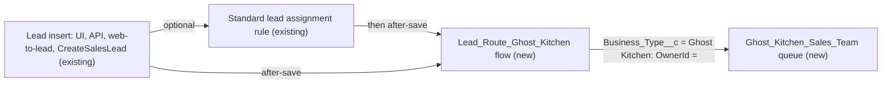

# Implementation spec — Ghost Kitchen lead routing

> Assign every new `Lead` whose `Lead.Business_Type__c` is "Ghost Kitchen" to a new Ghost Kitchen Sales Team queue, and leave all other leads' routing unchanged.

_Based on the requirement, the evidence reported by AskCoworker, and read-only org queries where noted. Assumptions and missing evidence are identified below. Specification only — nothing is implemented or deployed._

---

## 1. The requirement

When a lead from a ghost kitchen is created, set its owner to the Ghost Kitchen Sales Team queue. The user decided that leads of every other business type keep their current routing. The request contained no deploy or data-change instruction.

| # | Responsibility | Trigger | Where it lives |
| --- | --- | --- | --- |
| 1 | Identify a lead as coming from a ghost kitchen | Lead create | `Lead.Business_Type__c` = "Ghost Kitchen" (existing) |
| 2 | Provide a Ghost Kitchen sales team queue that can own leads | Not applicable (configuration) | `Ghost_Kitchen_Sales_Team` (new Queue) |
| 3 | Route the lead to that queue | Lead create, after save | `Lead_Route_Ghost_Kitchen` (new Flow) |
| 4 | Leave the routing of all other leads unchanged | Lead create | Flow entry condition on `Lead.Business_Type__c` |

## 2. Grounding — reuse before building

Target org: `TestWriteSpecDE` (Developer Edition, not a sandbox). API version: `67.0`.

- **`Lead.Business_Type__c`** (CustomField, restricted picklist) — the routing criterion. Active values include "Ghost Kitchen". It is the only field in the org whose name matches Business Type, Ghost, or Kitchen on `Lead`; the only other match is an unrelated `KitchenCount` field on a platform entity. The only component that references it is `Lead-Lead Layout`. _verified by org query_
- **`Lead.Industry`** (standard picklist) — has no ghost kitchen value, so it is not an alternative criterion. _verified by org query_
- **Queues** — only `Merchant_Messaging_Queue` (supports `MessagingSession`) and `Unqualified_Leads` (supports `Lead`) exist. No queue or public group named Ghost, Kitchen, or Sales exists. _verified by org query_
- **Lead assignment rule `Standard`** (AssignmentRule, active) — its rule entries cannot be read with the allowed commands. _verified by org query_ (existence and status only)
- **Automation on `Lead`** — no Apex triggers, no validation rules, no active record-triggered flows (the only one, `prm_slack_flows__ApprovalDispatcher`, is managed and inactive), no active Process Builder processes, and no unmanaged Apex class that mentions `Lead` (70 classes searched). _verified by org query_
- **`sales_sfa_flows__CreateSalesLead`** (Flow, managed, autolaunched, active) — "Searches for an existing lead record. If one isn't found, creates a new lead record." Whether it sets `Lead.Business_Type__c` cannot be read. _verified by org query_
- **Lead sharing** — org-wide default `ReadEditTransfer` (Public Read/Write/Transfer). _verified by org query_
- **Data shape** — 5 leads exist, all with blank `Lead.Business_Type__c`; no lead is owned by a queue. _verified by org query_
- **Data 360** — 0 `DataStream` records. _verified by org query_
- Permission sets `Agentforce_Reference_App` and `sfdc_accelerate_dms` can create and edit `Lead`. _reported by AskCoworker_

Evidence sources: Tooling queries on `ApexTrigger`, `ValidationRule`, `CustomField`, `MetadataComponentDependency`, `ApexClass` bodies, `FlowDefinition`; standard queries on `Group`, `QueueSobject`, `AssignmentRule`, `FlowDefinitionView`, `Organization`, `Lead` aggregates, `DataStream`; `sf sobject describe` of `Lead`. AskCoworker returned no citedReferences.

## 3. Architecture

Why the pieces are drawn this way:

1. Leads are created through the UI, the API, web-to-lead, and the managed flow `sales_sfa_flows__CreateSalesLead`. _verified by org query_ for the managed flow; the other channels are standard Lead entry points. _assumption (documented platform behavior)_
2. The active `Standard` assignment rule runs only when the insert asks for it (web-to-lead, the "Assign using active assignment rule" option in the UI, or the API assignment rule header). In the documented order of execution, assignment rules run before after-save record-triggered flows. _assumption (documented platform behavior)_
3. `Lead_Route_Ghost_Kitchen` is an after-save flow so that it runs after the `Standard` rule and its owner value is final for ghost kitchen leads, whether or not the rule ran and whatever its unreadable entries do. For every other lead the entry condition is false, so the flow does nothing. _assumption_ (design choice; see Section 8)
4. A flow is used rather than Apex because the behavior is a single filtered field update. No code is needed.

## 4. Metadata changes

**Foundation**

- **Create `Ghost_Kitchen_Sales_Team`** — Queue. Label "Ghost Kitchen Sales Team". Supported object (`queueSobject`): `Lead`. Queue email: not set; "send email to members": off. Queue members: not specified (see Section 8). Created first because the flow looks it up by developer name.

**Routing**

- **Create `Lead_Route_Ghost_Kitchen`** — Flow. Record-triggered on `Lead`, trigger "A record is created", optimized for "Actions and Related Records" (after save), run in system context. Entry condition: `Business_Type__c` Equals "Ghost Kitchen". Elements: (1) Get Records on `Group` where `DeveloperName` = "Ghost_Kitchen_Sales_Team" and `Type` = "Queue", first record, Id only; (2) Decision: if no queue is found, end without changes and send a fault notification (do not set `OwnerId` to blank); (3) Update Records on the triggering `Lead`: `OwnerId` = the queue Id. No other field is changed. Status: Active on deploy.

## 5. Data 360 (Data Cloud) data involved

Not applicable — this change does not use Data 360. The org has 0 data streams. _verified by org query_

## 6. Security considerations

- **Execution context.** The record-triggered flow runs in system context without sharing, so it can read `Group` and set `Lead.OwnerId` whatever the creating user's permissions. _assumption (documented platform behavior)_
- **Sharing.** The Lead org-wide default is Public Read/Write/Transfer, so the creator keeps read and edit access after the owner changes to the queue, and queue members can see and edit the lead without extra sharing. _verified by org query_ (org-wide default); the effect is _assumption (documented platform behavior)_.
- **CRUD/FLS.** No new fields. No permission set changes are needed: the flow does not depend on user FLS, and queue members work leads through queue membership and the existing Lead access grants. Permission sets are not the only grant path; profiles also grant Lead access and were not changed.
- **Data exposure.** No new data is exposed. The lead's owner becomes a queue, which is visible to every user who can read the lead.

## 7. Testing strategy

The inventory contains no Apex and no flow test component, so no automated test is planned. Recommended verification in a sandbox or scratch org after deployment:

1. Create a lead with `Lead.Business_Type__c` = "Ghost Kitchen" in the UI, without the assignment rule option. Expect `OwnerId` = `Ghost_Kitchen_Sales_Team`.
2. Repeat with the "Assign using active assignment rule" option checked, and through the API with the assignment rule header. Expect `OwnerId` = the queue in both cases.
3. Create leads with another business type (for example "Restaurant Group") and with a blank business type, with and without the assignment rule. Expect the same owner as before the change.
4. Bulk: insert 200 leads in one call, mixed ghost kitchen and other types. Expect only the ghost kitchen leads on the queue, and no governor limit error.
5. Update an existing lead's `Lead.Business_Type__c` to "Ghost Kitchen". Expect no owner change (create only; see Section 8).
6. Run `sales_sfa_flows__CreateSalesLead` with a ghost kitchen lead if that action can set the business type. Expect `OwnerId` = the queue.
7. Negative: in a test org without the queue, create a ghost kitchen lead. Expect the lead to save with its original owner and a fault notification.
8. Delete and undelete a routed lead. Expect no flow run and no owner change.

## 8. Open decisions

### Open

1. **Queue members (non-blocking).** The user gave no member list, and no role, public group, or user in the org is identified with ghost kitchens. Default: deploy the queue without members; the sales team lead adds users, roles, or a public group to `Ghost_Kitchen_Sales_Team` right after deployment. Until then, routed leads are owned by the queue but nobody receives them in a queue view.
2. **Leads that become ghost kitchen leads on update (non-blocking).** The flow runs on create only, because the requirement says "comes in". A lead created with a blank or different business type and later changed to "Ghost Kitchen" is not routed, and a lead changed away from "Ghost Kitchen" stays on the queue. Default: accept. If update routing is wanted, add the "created or updated" trigger with the condition "only when a record is updated to meet the condition requirements".
3. **`Standard` assignment rule entries (non-blocking).** The entries cannot be read. If an entry deliberately sends ghost kitchen leads to a specific owner, this flow overrides it. Default: accept the override because it is what the requirement asks for; the implementer checks the entries in Setup before deployment.
4. **`sales_sfa_flows__CreateSalesLead` (non-blocking).** It is not known whether this managed flow sets `Lead.Business_Type__c`. If it never does, leads it creates are not routed. Default: accept; covered by verification step 6.
5. **Deployment sequence (non-blocking).** Deploy `Ghost_Kitchen_Sales_Team` before or together with `Lead_Route_Ghost_Kitchen`; add queue members after the queue exists.

### Resolved

- **Mechanism: flow instead of editing the `Standard` assignment rule.** _assumption_ (user had no preference; the user decided that other leads stay unchanged). The rule's entries cannot be read, and deploying lead assignment rule metadata replaces the whole rule, so an edit risks changing other leads' routing. The flow is additive and also covers inserts that do not apply the rule.
- **After-save instead of before-save.** _assumption (documented platform behavior)_. AskCoworker proposed a before-save flow; a before-save value can be overwritten by the assignment rule, which runs later in the order of execution. The after-save flow runs after the assignment rule.
- **Queue lookup by developer name instead of a hard-coded Id.** AskCoworker proposed hard-coding the queue's 18-character Id; that Id differs between orgs and is unknown before deployment. The Get Records lookup avoids it.
- **Bulk behavior corrected.** AskCoworker claimed the Get Records element runs one SOQL query per record and fails above 100 records. Record-triggered flows run in bulk: each Get Records element runs one query for each batch of up to 200 records. _assumption (documented platform behavior)_. The hard-coded Id alternative is therefore not needed.
- **`QueueSobject` is not a separate change.** AskCoworker listed it as its own row; the supported object is part of the Queue metadata (`queueSobject`), so it is folded into the queue change.
- **Queue name.** "Ghost Kitchen Sales Team" follows the requirement's wording. _assumption_ (the user was not asked; a label detail).
- **Dropped AskCoworker proposals:** an Apex trigger alternative (declarative flow is sufficient) and an after-update routing path (not requested; kept as Open item 2).

## 9. Change set

| # | Action | Type | API name | Module | Why |
| --- | --- | --- | --- | --- | --- |
| 1 | Create | Queue | `Ghost_Kitchen_Sales_Team` | force-app/main/default/queues | No ghost kitchen queue exists; it is the routing target and must support `Lead` |
| 2 | Create | Flow | `Lead_Route_Ghost_Kitchen` | force-app/main/default/flows | Sets `OwnerId` to the queue for new ghost kitchen leads after any assignment rule runs |

A new Lead queue plus one after-save record-triggered flow that assigns new "Ghost Kitchen" leads to it, leaving other leads untouched.

Total: 2 · Create: 2 · Update: 0 · Delete: 0
