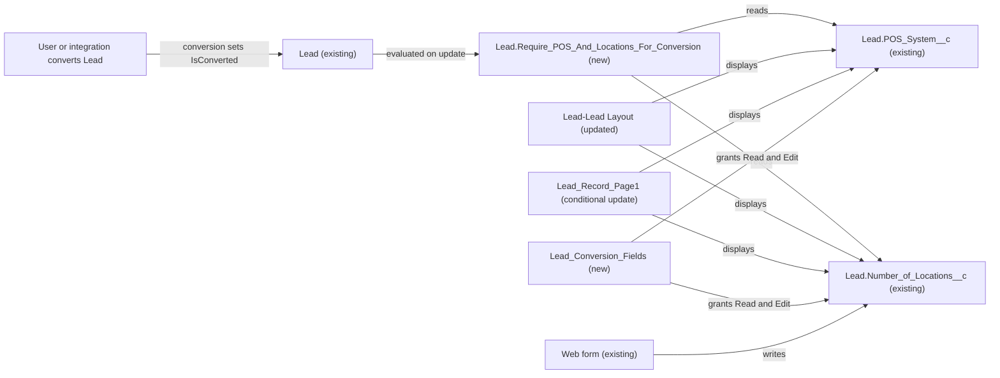

# Implementation spec — Require POS system and number of locations before Lead conversion

> Block conversion of a Lead when `Lead.POS_System__c` or `Lead.Number_of_Locations__c` is blank, and make both fields visible and editable to the people who convert Leads.

_Based on the requirement, the evidence reported by AskCoworker, and read-only org queries where noted. Assumptions and missing evidence are identified below. Specification only — nothing is implemented or deployed._

---

## 1. The requirement

A Lead must have a POS system and a number of locations before it can be converted. The user decided that the number-of-locations field is `Lead.Number_of_Locations__c` (the field the web form writes), not the similarly labelled `Lead.NumberofLocations__c`, and that conversion is blocked when either value is blank. The request contained no deploy or data-change instruction.

| # | Responsibility | Trigger | Where it lives |
| --- | --- | --- | --- |
| 1 | Block conversion when `Lead.POS_System__c` is blank | Lead conversion (`IsConverted` changes to true) | `Lead.Require_POS_And_Locations_For_Conversion` (new validation rule) |
| 2 | Block conversion when `Lead.Number_of_Locations__c` is blank | Lead conversion (`IsConverted` changes to true) | `Lead.Require_POS_And_Locations_For_Conversion` (new validation rule) |
| 3 | Let users who convert Leads see and fill in both fields before converting | Lead record view and edit | `Lead-Lead Layout` (update), `Lead_Record_Page1` (conditional update), `Lead_Conversion_Fields` (new permission set) |

## 2. Grounding — reuse before building

Target org: `TestWriteSpecDE` (Developer Edition, not a sandbox, org ID `00Dak00001COqNeEAL`). API version: `67.0`.

- **`Lead.POS_System__c`** (CustomField, Picklist, label "POS System Used") — the POS system field. Active values: Square, Toast, Clover, Revel, Lightspeed, Other. Not required. _verified by org query_
- **`Lead.Number_of_Locations__c`** (CustomField, Number(5,0), label "Number of Locations") — the number-of-locations field this spec requires. _verified by org query_; the web form writes it. _user decision_
- **`Lead.NumberofLocations__c`** (CustomField, Number(3,0), also labelled "Number of Locations") — a second field with the same label. It is on `Lead-Lead (Sales) Layout` and `Lead-Lead (Marketing) Layout`, and pairs by name with `Account.NumberofLocations__c`. Not used by this spec. _verified by org query_
- **No other POS or location field on Lead or elsewhere.** A Tooling `CustomField` search for `%POS%`, `%Location%`, and `%Storefront%` (Data 360 fields excluded) returned only the three Lead fields above, `Account.NumberofLocations__c`, `Account.Total_Storefronts__c`, and storefront lookup fields on other objects. _verified by org query_
- **Existing automation on Lead** — 0 validation rules, 0 Apex triggers (Lead, Account, Contact, Opportunity), and one record-triggered flow, `ApprovalDispatcher` (after-save, on create, inactive). No custom Apex class body references `POS_System__c`, `Number_of_Locations__c`, `NumberofLocations__c`, or lead conversion (70 un-namespaced classes searched). _verified by org query_
- **Readers of the fields** — `MetadataComponentDependency` shows no references to `Lead.POS_System__c` or `Lead.Number_of_Locations__c`; `Lead.NumberofLocations__c` is referenced only by `Lead-Lead (Sales) Layout` and `Lead-Lead (Marketing) Layout`. _verified by org query_
- **Data** — 5 Leads exist, all unconverted, all with `POS_System__c`, `Number_of_Locations__c`, and `NumberofLocations__c` blank. _verified by org query_
- **Field-level security** — Read and Edit on `Lead.POS_System__c` and `Lead.Number_of_Locations__c` come only from permission sets `Agentforce_Reference_App` (un-namespaced) and `sfdc_accelerate_dms` (namespace `sfdcInternalInt`, Session type, not editable); `sfdc_a360_sfcrm_data_extract` and `sfdc_slack` have Read only. No profile, including System Administrator, has FLS on either field. _verified by org query_
- **Who can convert** — Convert Leads is held by the System Administrator, Standard User, Custom: Sales Profile, Custom: Marketing Profile, Custom: Support Profile, Solution Manager, Marketing User, Contract Manager, Gold Partner User, Partner Community User, and Partner Community Login User profiles, and by permission set `sfdc_accelerate_dms`. _verified by org query_
- **Active users** — the only active standard-license user with a business profile is System Administrator "OrgFarm EPIC", who has `Agentforce_Reference_App`. "Platform Integration User" has `sfdc_accelerate_dms`. _verified by org query_
- **`Lead-Lead Layout`** (Layout) — assigned to 46 profiles including System Administrator; `Lead-Lead (Sales) Layout`, `Lead-Lead (Marketing) Layout`, and `Lead-Lead (Support) Layout` are each assigned to one custom profile. No Lead record types exist. Neither required field is on any layout. _verified by org query_
- **`Lead_Record_Page`** and **`Lead_Record_Page1`** (FlexiPage, RecordPage) — `Lead_Record_Page` renders the layout detail panel; `Lead_Record_Page1` uses Dynamic Forms field instances and no detail panel. Which one is activated could not be read. _verified by org query_
- **Data 360** — `SELECT COUNT() FROM DataStream` returned 0. _verified by org query_
- **Validation rules on Lead run during conversion only when the Lead Settings option "Require Validation for Converted Leads" is enabled.** _assumption (documented platform behavior)_

Evidence sources: `sf org display`; `sf sobject describe` on Lead; `sf sobject list --sobject custom`; Tooling queries on `CustomField`, `MetadataComponentDependency`, `ValidationRule`, `ApexTrigger`, `ApexClass` bodies, `Layout`, `ProfileLayout`, `FlexiPage`; standard queries on `FlowDefinitionView`, `FieldPermissions`, `PermissionSet`, `PermissionSetAssignment`, `User`, `RecordType`, `Lead` aggregates, `DataStream`, `Organization`. AskCoworker returned no citedReferences.

## 3. Architecture

Why the pieces are drawn this way:

1. Conversion is an update of the Lead that sets `IsConverted` to true; the new validation rule evaluates on that update and blocks the conversion when either field is blank. _assumption (documented platform behavior)_; it requires "Require Validation for Converted Leads" (Section 8, item 1).
2. A validation rule is the declarative way to block the save; no Apex is used. There is no existing automation on Lead to extend. _verified by org query_
3. Both fields are on no layout and have no profile FLS, so users who convert Leads could not fill them in; the layout, record page, and permission set changes close that gap. _verified by org query_
4. The web form writes `Lead.Number_of_Locations__c`. _user decision_ The rule does not fire on insert, so web-form Lead creation is unaffected.

## 4. Metadata changes

**Enforcement**

- **Create `Lead.Require_POS_And_Locations_For_Conversion`** — Validation rule on Lead, active. Error condition formula: `AND(ISCHANGED(IsConverted), IsConverted, OR(ISPICKVAL(POS_System__c, ""), ISBLANK(Number_of_Locations__c)))`. Error message: "POS System and Number of Locations are required before a Lead can be converted." Error location: Top of Page. Blank handling: `ISPICKVAL(POS_System__c, "")` is true when no value is selected; `ISBLANK(Number_of_Locations__c)` is true only when the field is empty, so `0` counts as populated (default; see Section 8, item 4). The rule does not fire on insert (`ISCHANGED` is false on insert) or on updates that do not convert the Lead. Formula size is far below the 3,900-character limit.

**UI**

- **Update `Lead-Lead Layout`** — Add `POS_System__c` and `Number_of_Locations__c` as editable fields to the "Lead Information" section. This layout is shared by 46 profiles, including System Administrator; adding two fields changes the page for all of them but removes nothing. The Sales, Marketing, and Support Lead layouts are not changed (Section 8, item 5). Retrieve the layout before editing.
- **Update `Lead_Record_Page1`** — Conditional: only if `Lead_Record_Page1` is the activated Lead record page for any app, profile, or the org default. Add Dynamic Forms field instances for `POS_System__c` and `Number_of_Locations__c` (editable) to the main field section. Retrieve the page before editing.

**Access**

- **Create `Lead_Conversion_Fields`** — New permission set, label "Lead Conversion Fields". Field permissions: Read and Edit on `Lead.POS_System__c` and `Lead.Number_of_Locations__c`. No object permissions (users who convert already have Lead Read and Edit through their profile). Assign to users who convert Leads and do not already have `Agentforce_Reference_App`. Not granted: no change to any profile, to `Agentforce_Reference_App`, to `sfdc_accelerate_dms`, `sfdc_a360`, `sfdc_a360_sfcrm_data_extract`, or `sfdc_slack`.

## 5. Data 360 (Data Cloud) data involved

Not applicable — this change does not use Data 360. The org has 0 data streams (_verified by org query_).

## 6. Security considerations

- **Execution context.** A validation rule runs for every save path (UI, API, Apex, flows) regardless of the running user's sharing or FLS. _assumption (documented platform behavior)_ It adds no data access.
- **Integration caller.** `sfdc_accelerate_dms` (assigned to "Platform Integration User") holds Convert Leads and Read/Edit on both fields. _verified by org query_ Any conversion it performs with a blank value will be blocked (Section 8, item 3).
- **CRUD/FLS.** `Lead_Conversion_Fields` grants Read and Edit on the two fields only. The current System Administrator already has this access through `Agentforce_Reference_App`, so no assignment is needed for existing users. _verified by org query_ Profiles are not changed; a converting user without `Agentforce_Reference_App` or `Lead_Conversion_Fields` cannot see or fill the fields and will be blocked by the rule.
- **Data exposure.** The layout and page changes show a POS vendor picklist and a location count to users who have FLS. No personal data is added.
- Permission sets are not the only grant path; profile FLS could also grant access, but no profile does today.

## 7. Testing strategy

No Apex, flow, or test component is in the inventory. The cases below are recommended verification after deployment (in a sandbox or this org after enabling the Lead setting); none have run.

| # | Case | Expected |
| --- | --- | --- |
| 1 | Convert a Lead with both fields blank (UI) | Blocked with the error message |
| 2 | `POS_System__c` blank, `Number_of_Locations__c` = 5 | Blocked |
| 3 | `POS_System__c` = Toast, `Number_of_Locations__c` blank | Blocked |
| 4 | Both populated | Conversion succeeds |
| 5 | `POS_System__c` = Square, `Number_of_Locations__c` = 0 | Conversion succeeds (0 counts as populated) |
| 6 | Create a Lead with both fields blank (UI and web form) | Saves; rule does not fire on insert |
| 7 | Edit another field on an unconverted Lead with both fields blank | Saves |
| 8 | Bulk: API convert 200 Leads, half populated and half blank | Blank ones fail per record; populated ones convert |
| 9 | Permission: a test user with Convert Leads and `Lead_Conversion_Fields` opens a Lead | Both fields visible and editable on the active record page |
| 10 | Permission: a test user with Convert Leads and neither permission set | Fields not visible; conversion blocked (confirms assignment is required) |
| 11 | Integration: convert via API as the user with `sfdc_accelerate_dms` with a blank field | Blocked |

Delete and undelete do not evaluate validation rules; no case is needed. Converted Leads cannot be reconverted, so no recursion case applies.

## 8. Open decisions

### Open

1. **"Require Validation for Converted Leads" must be enabled (blocking for delivery, load-bearing).** Validation rules run during conversion only when this Lead Settings option is on. It cannot be read with the allowed commands. Recommended: confirm in Setup > Lead Settings and enable it before deploying the rule; without it, the rule never blocks conversion.
2. **Which Lead record page is active (blocking for delivery).** `Lead_Record_Page1` (Dynamic Forms) and `Lead_Record_Page` (layout detail panel) both exist, and activation cannot be read. The `Lead_Record_Page1` change is Conditional: on it being activated for any app, profile, or the org default. If only `Lead_Record_Page` is active, the layout update is enough and that row is dropped.
3. **Integration conversions (non-blocking).** `sfdc_accelerate_dms` holds Convert Leads; whether it converts Leads is not known. Recommended: confirm with the integration owner that it populates both fields before converting, or that blocked conversions are acceptable.
4. **Zero locations (non-blocking).** The rule treats `0` as populated because the requirement says "blank". If zero should also block conversion, add `Number_of_Locations__c <= 0` to the `OR`.
5. **Other Lead layouts (non-blocking).** `Lead-Lead (Sales) Layout`, `Lead-Lead (Marketing) Layout`, and `Lead-Lead (Support) Layout` are not updated; their profiles have no active users (_verified by org query_). The Sales and Marketing layouts already show `Lead.NumberofLocations__c` with the same label "Number of Locations", so adding the second field there would show two identical labels. Recommended: update them when users are assigned to those profiles, and consider relabelling or retiring `Lead.NumberofLocations__c` in a separate change.
6. **Existing Leads (non-blocking).** All 5 unconverted Leads have both fields blank and cannot be converted until someone fills them in. This is the intended behavior; no data change is part of this spec.
7. **Permission set assignment (non-blocking).** Assign `Lead_Conversion_Fields` to any future user who converts Leads without `Agentforce_Reference_App`. No current user needs it.
8. **Deployment sequence.** Enable the Lead setting (item 1), deploy `Lead_Conversion_Fields`, then `Lead-Lead Layout` and (if active) `Lead_Record_Page1`, then activate `Lead.Require_POS_And_Locations_For_Conversion` last so users can fill in the fields before the rule applies.

### Resolved

- **Which "Number of Locations" field (user decision).** Asked because two Lead fields share the label and the evidence was split: `Lead.NumberofLocations__c` is on layouts and pairs with `Account.NumberofLocations__c`, while `Lead.Number_of_Locations__c` was created with `POS_System__c` and shares its FLS. The user chose `Lead.Number_of_Locations__c` because the web form writes it, and asked to block conversion when either field is blank.
- **Validation rule instead of Apex or a flow (assumption).** No existing Lead automation to extend; a validation rule is the smallest declarative option. Field-level "required" was rejected because it would also block Lead creation, including the web form.
- **Corrections to AskCoworker.** The inventory said `Lead-Lead Layout` is assigned to the Standard User, Sales, and Marketing profiles; the Sales and Marketing profiles use their own layouts (_verified by org query_). AskCoworker T stated that `sfdc_accelerate_dms` "converts Leads via API" as verified; the org query shows only that it holds Convert Leads. AskCoworker omitted the "Require Validation for Converted Leads" dependency; added as item 1. Proposals to delete `Lead.NumberofLocations__c` and an error-placement follow-up were dropped as out of scope.

## 9. Change set

| # | Action | Type | API name | Module | Why |
| --- | --- | --- | --- | --- | --- |
| 1 | Create | ValidationRule | `Lead.Require_POS_And_Locations_For_Conversion` | force-app/main/default/objects/Lead/validationRules | Blocks conversion when POS system or number of locations is blank |
| 2 | Update | Layout | `Lead-Lead Layout` | force-app/main/default/layouts | Lets users on the main Lead layout fill in both fields before converting |
| 3 | Update | FlexiPage | `Lead_Record_Page1` | force-app/main/default/flexipages | Conditional: shows both fields if this Dynamic Forms page is active |
| 4 | Create | PermissionSet | `Lead_Conversion_Fields` | force-app/main/default/permissionsets | Grants Read and Edit on both fields, which no profile grants today |

A new Lead validation rule blocks conversion when either field is blank, and a layout, record page, and permission set make the fields fillable.

Total: 4 · Create: 2 · Update: 2 · Delete: 0
