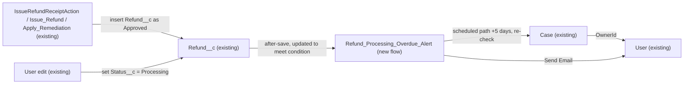

# Implementation spec — Refund Processing overdue alert to the Case owner

> Alert the owner of the linked Case when a `Refund__c` record has stayed in `Status__c` = `Processing` for more than 5 days.

_Based on the requirement, the evidence reported by AskCoworker, and read-only org queries where noted. Assumptions and missing evidence are identified below. Specification only — nothing is implemented or deployed._

---

## 1. The requirement

The requirement "Customers are complaining. Do something about refunds." gave no outcome, so the user was asked; the user decided that the problem is refunds sitting in `Processing` too long, and that the owner of the linked Case must be alerted when a refund has been in `Processing` for more than 5 days (*user decision*). The request contained no deploy or data-change instruction.

| # | Responsibility | Trigger | Where it lives |
| --- | --- | --- | --- |
| 1 | Start a 5-day timer when a refund enters `Processing` | `Refund__c` created with, or updated to, `Status__c` = `Processing` | `Refund_Processing_Overdue_Alert` (new record-triggered flow) |
| 2 | Stop the timer when the refund leaves `Processing` | `Refund__c` updated so `Status__c` is no longer `Processing` | `Refund_Processing_Overdue_Alert` (entry condition and Decision re-check) |
| 3 | Email the owner of `Refund__c.Case__c` when the refund is still `Processing` after 5 days | Scheduled path, 5 days after the triggering save | `Refund_Processing_Overdue_Alert` (scheduled path) |

## 2. Grounding — reuse before building

Target org: `TestWriteSpecDE` (Developer Edition, not a sandbox, org ID `00Dak00001COqNeEAL`). API version: `67.0`.

- **`Refund__c`** (CustomObject) — the refund record. Internal sharing model `ReadWrite`, external `Private`, no namespace (editable). _verified by org query_
- **`Refund__c.Status__c`** (CustomField, picklist) — values `Pending`, `Approved`, `Processing`, `Completed`, `Failed`, `Cancelled`. Field history tracking is on. _verified by org query_
- **`Refund__c.Case__c`** (CustomField, Lookup(Case)) — the linked complaint Case whose owner receives the alert. Nullable. _verified by org query_
- **`Case.OwnerId`** (standard field) — the alert recipient. All 9 Cases in the org are owned by Users (none by queues). _verified by org query_
- **Writers of `Refund__c`** — `IssueRefundReceiptAction` (Apex), `Issue_Refund` and `Apply_Remediation` (active autolaunched flows). All three insert with `Status__c` = `Approved`. No Apex class sets `Processing` (search of all 70 non-namespaced Apex bodies). `MetadataComponentDependency` on `Refund__c` returns exactly these three components. _verified by org query_ (AskCoworker reported only the Apex class.)
- **Automation on `Refund__c`** — 0 Apex triggers, 0 record-triggered flows, 0 validation rules. _verified by org query_
- **Existing records** — 0 `Refund__c` records, so no refund is currently in `Processing`. _verified by org query_
- **No existing equivalent** — no field on `Refund__c` records when `Processing` started, no flow named like `%Refund%` other than the two above, and no `CustomNotificationType` for refunds (only 4 platform types). _verified by org query_
- **Case data** — 1 Case with `Type` = `Refund / Compensation` and `Reason` = `Refund amount question`. _verified by org query_

Evidence sources: `sf org display`; `sobject describe Refund__c`; Tooling `EntityDefinition`, `ApexTrigger`, `ValidationRule`, `CustomField` (concept search), `CustomNotificationType`, `MetadataComponentDependency`, `Flow.Metadata` for `Issue_Refund` and `Apply_Remediation`, `ApexClass` bodies; `FlowDefinitionView`; `FieldDefinition` history tracking; aggregates on `Refund__c`, `Case`, and `Organization`. AskCoworker returned no citedReferences.

## 3. Architecture

Why the pieces are drawn this way:

1. The three existing writers insert refunds as `Approved` (*verified by org query*), so they do not start the timer. A refund reaches `Processing` only through a manual edit or future automation (*verified by org query*: no code or flow sets it).
2. A single record-triggered flow is used because no automation exists on `Refund__c` (*verified by org query*) and Flow scheduled paths deliver a time-based check declaratively. No Apex is needed.
3. The scheduled path is anchored to the triggering save, so no date-stamp field is needed (*assumption (documented platform behavior)*: a scheduled path's time source can be the time the record was created or updated).
4. At run time the flow reads the Case and then the owning User to get the email address, and sends the email with the Send Email core action.

## 4. Metadata changes

**Automation**

- **Create `Refund_Processing_Overdue_Alert`** — Record-triggered flow on `Refund__c`, after save, trigger "A record is created or updated". Entry condition: `Status__c` Equals `Processing`; "When to run the flow for updated records" = "Only when a record is updated to meet the condition requirements". No immediate-path elements. Scheduled path `Processing_Over_5_Days`: time source "When the record is created or updated" (`RecordTriggerEvent`), offset 5 Days after. Scheduled path elements, in order: (1) Decision `Still_Processing_With_Case`: `{!$Record.Status__c}` Equals `Processing` AND `{!$Record.Case__c}` Is Null False; otherwise end. (2) Get Records `Get_Case`: `Case` where `Id` = `{!$Record.Case__c}`, first record, fields `OwnerId`, `CaseNumber`. (3) Get Records `Get_Owner`: `User` where `Id` = `{!Get_Case.OwnerId}` AND `IsActive` = true, first record, field `Email`. (4) Decision `Owner_Has_Email`: `Get_Owner` is not null AND `{!Get_Owner.Email}` Is Null False; otherwise end (covers queue owners, whose `OwnerId` is not a User, and inactive users). (5) Action `Send_Overdue_Email` (core action `emailSimple`): `emailAddresses` = `{!Get_Owner.Email}`; `emailSubject` = "Refund {!$Record.Name} has been in Processing for more than 5 days"; `emailBody` = refund name, `Amount__c`, `Issue_Date__c`, Case number `{!Get_Case.CaseNumber}`, and the record link; `sendRichBody` = false. Fault connector on the email action ends the interview without retry. Days are calendar days. Status: Active on deploy is a release choice, not part of this spec.

## 5. Data 360 (Data Cloud) data involved

Not applicable — this change does not use Data 360. The flow writes no records. The connector permission set `sfdc_a360_sfcrm_data_extract` has Read on `Refund__c` (*reported by AskCoworker*), and this change does not alter what it can read.

## 6. Security considerations

- **Execution context:** record-triggered flows run in system context without sharing, so the Get Records elements return the Case and User regardless of the editing user's access (*assumption (documented platform behavior)*). The flow performs no DML.
- **CRUD/FLS:** only users who can edit `Refund__c.Status__c` can start the timer. Existing grants (Read/Create/Edit/Delete on `Refund__c` for `Pronto_Deep_Dive_Workshop`, `Agentforce_Reference_App`, `sfdc_accelerate_dms`) are *reported by AskCoworker* and not changed. Permission sets are not the only grant path (profiles also grant access).
- **Permission sets:** no changes. No new field, so no FLS grants.
- **Data exposure:** the email goes only to the owner of the linked Case and contains the refund name, amount, issue date, and Case number. With internal sharing `ReadWrite` on `Refund__c` (*verified by org query*), an internal Case owner can already read the refund, so the email exposes nothing new. The email leaves Salesforce as plain text; it contains no customer contact details.

## 7. Testing strategy

The inventory contains no test component. Flow tests are not planned because the behavior lives on a scheduled path. All cases below are **recommended verification** in a test org, run by shortening the offset or by checking the pending scheduled path in Setup > Time-Based Workflow / Paused and Waiting Interviews.

1. **Happy path:** update a refund linked to a Case owned by an active User with an email from `Approved` to `Processing`. A pending scheduled interview exists; after 5 days the owner receives one email.
2. **Create in Processing:** insert a refund with `Status__c` = `Processing` and a Case. A scheduled interview is registered.
3. **Leaves Processing before 5 days:** move `Processing` to `Completed` (and separately to `Failed`, `Cancelled`). The pending interview is removed, and even if it runs, the Decision re-check sends no email.
4. **Re-enters Processing:** `Processing` → `Approved` → `Processing`. Only one alert, timed from the second entry.
5. **Stays Processing, other field edited:** edit `Amount__c` while `Processing`. No new interview is registered and the original timer is unchanged.
6. **No Case:** `Case__c` blank. No email.
7. **Queue or inactive owner, or owner without email:** no email and no flow error.
8. **Reparenting:** change `Case__c` to another Case before the 5 days end. The owner of the Case linked at run time receives the email.
9. **Delete and undelete:** delete a refund in `Processing` before the 5 days end; no email. Undelete does not start a new timer.
10. **Bulk:** update 200 refunds to `Processing` in one Data Loader call. 200 interviews are registered and each sends at most one email.
11. **Non-matching status:** update to `Pending`. No interview.

## 8. Open decisions

### Open

1. **Nothing moves refunds into `Processing` (non-blocking).** All three writers insert `Approved` (*verified by org query*). The alert fires only after a person or future automation sets `Processing`. Recommended default: accept; automating status progression is a separate requirement.
2. **Refunds with no Case get no alert (non-blocking).** `Refund__c.Case__c` is nullable (*verified by org query*). Recommended default: skip them, as the user asked for the Case owner. Alerting someone else would be a new requirement.
3. **Email deliverability (non-blocking).** The Send Email action sends from the default sender; Developer Edition deliverability settings cannot be read with the allowed commands. Recommended default: confirm Setup > Deliverability allows "All email" before activation; an org-wide From address is optional.
4. **Deployment sequence (non-blocking).** Single component; no backfill because there are 0 `Refund__c` records (*verified by org query*). If refunds are already in `Processing` when the flow is activated, they will not be alerted until they re-enter `Processing`.

### Resolved

- **Scope (user decision).** Question: what should "do something about refunds" deliver — (a) alert on refunds stuck in a status, (b) automate the status lifecycle, or (c) reporting on refund complaints? Answer: refunds sit in `Processing` too long; alert the Case owner when a refund is `Processing` for more than 5 days.
- **Alert channel (assumption).** Email to the Case owner, chosen over a custom bell notification because it needs one component instead of two (no `CustomNotificationType` exists, *verified by org query*) and "alert" does not require in-app delivery.
- **Threshold unit (assumption).** 5 calendar days after entering `Processing`, not business days; the user gave no preference.
- **Dropped AskCoworker proposals.** `Refund__c.Processing_Since__c` (CustomField), a before-save stamp flow `Refund_Stamp_Processing_Date`, and a `Refund__c-Refund Layout` update were dropped: the scheduled path can be anchored to the triggering save, so no date field is needed, and the layout change was not requested (Rule 4).
- **Corrected AskCoworker runtime claims.** AskCoworker said scheduled paths are not cancelled when the record stops matching and that pending interviews run for deleted records, and that inserts do not trigger the flow. Corrected to documented behavior (*assumption (documented platform behavior)*): with "Only when a record is updated to meet the condition requirements", pending scheduled paths are removed when an update makes the record stop matching, and a record created already matching the condition triggers the flow when the trigger is "created or updated". Whether a pending path runs after the refund is deleted is not verified; if it runs, `$Record` cannot be loaded and the interview ends without an email (recommended verification case 9). The Decision re-check is kept as a guard. This also removes the duplicate-email risk AskCoworker raised for re-entry into `Processing`.
- **Developer Edition capacity (assumption (documented platform behavior)).** AskCoworker marked Developer Edition scheduled-path support as blocking. Scheduled paths are available in Developer Edition, subject to the org's 24-hour scheduled flow interview limit; with 0 refunds this is not a concern.
- **Missed components.** AskCoworker reported only `IssueRefundReceiptAction` as a writer; org queries found `Issue_Refund` and `Apply_Remediation` as well. Both set `Approved`, so the design is unchanged.
- **Unrelated finding dropped.** AskCoworker's note on `CaseSummaryCardAction` returning a synthetic case number on failure is outside this requirement.

## 9. Change set

| # | Action | Type | API name | Module | Why |
| --- | --- | --- | --- | --- | --- |
| 1 | Create | Flow | `Refund_Processing_Overdue_Alert` | force-app/main/default/flows | Emails the linked Case owner when a refund stays in `Processing` for more than 5 days |

One record-triggered flow on `Refund__c` with a 5-day scheduled path re-checks the status and emails the linked Case owner.

Total: 1 · Create: 1 · Update: 0 · Delete: 0
