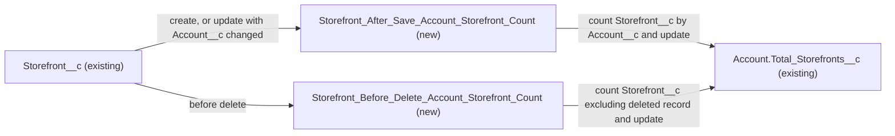

# Implementation spec — Maintain Account Total Storefronts and remove Total Orders

> Keep `Account.Total_Storefronts__c` equal to the number of `Storefront__c` records on each Account, and delete the unused `Account.Total_Orders__c`.

_Based on the requirement, the evidence reported by AskCoworker, and read-only org queries where noted. Assumptions and missing evidence are identified below. Specification only — nothing is implemented or deployed._

---

## 1. The requirement

The requirement asks to make `Account.Total_Storefronts__c` and `Account.Total_Orders__c` work or delete them; by user decision, `Account.Total_Storefronts__c` is kept and maintained by two record-triggered flows on `Storefront__c`, and `Account.Total_Orders__c` is deleted because Salesforce holds no order data. The premise "never populated" is partly false: 10 Accounts hold a one-time seeded `Account.Total_Storefronts__c` value that is correct today but is not maintained by anything.

| # | Responsibility | Trigger | Where it lives |
| --- | --- | --- | --- |
| 1 | Set the parent Account's storefront count when a storefront is created | `Storefront__c` created | `Storefront_After_Save_Account_Storefront_Count` |
| 2 | Recount the new and the prior Account when a storefront is moved to another Account | `Storefront__c` updated with `Account__c` changed | `Storefront_After_Save_Account_Storefront_Count` |
| 3 | Recount the parent Account when a storefront is deleted | `Storefront__c` deleted | `Storefront_Before_Delete_Account_Storefront_Count` |
| 4 | Remove the unused order count field | Deployment | `Account.Total_Orders__c` (Delete) |

## 2. Grounding — reuse before building

Target org: `TestWriteSpecDE` (Developer Edition, `00Dak00001COqNeEAL`, not a sandbox). API version: `67.0`.

- **`Account.Total_Storefronts__c`** (CustomField, Number(18,0), unmanaged, no description, created 2026-08-27) — the field to maintain. 10 of 200 Accounts have a value; each value equals the Account's current `Storefront__c` count. The other 190 Accounts are null and have no `Storefront__c`. _verified by org query_
- **`Account.Total_Orders__c`** (CustomField, Number(18,0), unmanaged, no description, created 2026-08-27) — non-null on 0 of 200 Accounts. _verified by org query_
- **`Storefront__c.Account__c`** (Lookup to `Account`, relationship name `Accounts__r`, not cascade delete) — the parent link to count. It is a lookup, not master-detail, so a roll-up summary field is not available. 21 `Storefront__c` records, all with `Account__c`, spread over the 10 Accounts above. _verified by org query_
- **Order data** — standard `Order` has 0 records; no custom order object exists in the custom object list; `Transaction__c`, `Loyalty_Transaction__c`, and `Refund__c` have 0 records and none holds an order count per Account. _verified by org query_. `OrderStatusCardAction` states that orders live in an external Heroku Orders API reached through Named Credentials, and returns sample data. _reported by AskCoworker_
- **Readers and writers of both fields** — no `MetadataComponentDependency` rows for either field (18- and 15-character IDs); no unmanaged Apex class (1,496 classes scanned; managed bodies are hidden) or trigger body mentions either field; `force-app` in the project is empty. _verified by org query_; _verified by project file_
- **Automation on `Account`, `Storefront__c`, `Order`** — no Apex triggers on these objects; no record-triggered flow on `Account` or `Storefront__c`; one inactive flow `Create_OS` on `Order`; no validation rules on `Account` or `Storefront__c`. _verified by org query_
- **Field-level security on both fields** (complete for permission sets and profiles) — `sfdc_accelerate_dms` read and edit; `sfdc_a360_sfcrm_data_extract`, `sfdc_slack`, `Agentforce_Reference_App`, `Pronto_Deep_Dive_Workshop` read only. No profile has a row. _verified by org query_
- **Data 360** — 0 `DataStream` records. _verified by org query_
- **New flow names** — neither `Storefront_After_Save_Account_Storefront_Count` nor `Storefront_Before_Delete_Account_Storefront_Count` exists. _verified by org query_

Evidence sources: Tooling `CustomField`, `MetadataComponentDependency`, `ApexClass`, `ApexTrigger`, `ValidationRule`, `FlexiPage`; `sobject describe` of `Account`, `Storefront__c`, `Refund__c`, `Loyalty_Transaction__c`, `Transaction__c`; `sobject list --sobject custom`; `FlowDefinitionView`; `FieldPermissions`; record counts and a per-Account `Storefront__c` count. AskCoworker returned no citedReferences.

## 3. Architecture

Why the pieces are drawn this way:

1. `Storefront__c.Account__c` is a lookup, so a roll-up summary is not possible and a flow maintains the count. _verified by org query_ (relationship type); converting to master-detail was rejected because it changes delete and reparenting behavior of `Storefront__c`.
2. Record-triggered flows run after save on create and update, and before delete; they have no after-delete or undelete trigger. Delete therefore needs its own before-delete flow that excludes the record being deleted. _assumption (documented platform behavior)_
3. Each flow recounts from the database instead of adding or subtracting 1, so values stay correct in bulk transactions and correct any earlier drift on that Account.
4. `Account.Total_Orders__c` is not drawn: it is deleted and has no readers or writers.
5. No Apex is used; the flows cover every responsibility.

## 4. Metadata changes

**Automation**

- **Create `Storefront_After_Save_Account_Storefront_Count`** — Record-triggered flow on `Storefront__c`, "A record is created or updated", optimized for Actions and Related Records (after save). Entry condition formula: `ISNEW() || ISCHANGED({!$Record.Account__c})`. Path A (new parent): if `{!$Record.Account__c}` is not blank, Get Records `Storefront__c` where `Account__c` = `{!$Record.Account__c}` (all records, Id only), assign the collection count (Assignment operator "Equals Count") to a Number variable, and Update Records on the `Account` with Id `{!$Record.Account__c}`, setting `Total_Storefronts__c` to that variable. Path B (prior parent): if the record is not new and `{!$Record__Prior.Account__c}` is not blank, repeat the same count and update for `{!$Record__Prior.Account__c}`. A count of zero writes 0. Runs in system context without sharing. Updates that do not change `Account__c` do not match the entry condition and do not run the flow.
- **Create `Storefront_Before_Delete_Account_Storefront_Count`** — Record-triggered flow on `Storefront__c`, "A record is deleted" (before delete). Decision: if `{!$Record.Account__c}` is blank, end. Otherwise Get Records `Storefront__c` where `Account__c` = `{!$Record.Account__c}` AND `Id` does not equal `{!$Record.Id}`, assign the collection count to a Number variable, and Update Records on the `Account` with Id `{!$Record.Account__c}`, setting `Total_Storefronts__c` to that variable. Runs in system context without sharing.

**Data model**

- **Delete `Account.Total_Orders__c`** — Delete via destructive changes. Impact: 0 non-null values, so no data is lost; no dependencies, Apex, triggers, or flows reference it; the field-level security rows in `sfdc_accelerate_dms`, `sfdc_a360_sfcrm_data_extract`, `sfdc_slack`, `Agentforce_Reference_App`, and `Pronto_Deep_Dive_Workshop` are removed with the field. Prerequisites: check the 75 reports and 8 `Account` list views for the column (not readable with the allowed queries). Backup: retrieve `Account.Total_Orders__c` into source control before the delete. Rollback: restore the field from Deleted Fields within 15 days, or redeploy it from source control and reapply field-level security.

## 5. Data 360 (Data Cloud) data involved

Not applicable — this change does not use Data 360. The org has 0 `DataStream` records; if one ingests `Account` later, it will read the maintained `Account.Total_Storefronts__c` values.

## 6. Security considerations

Both flows run in system context without sharing, so any user who can create, move, or delete a `Storefront__c` updates the parent Account's count even without edit access to that Account. _assumption (documented platform behavior)_. The flow writes a count only; it does not expose storefront data. No permission set changes are needed: read access to `Account.Total_Storefronts__c` already exists in `sfdc_a360_sfcrm_data_extract`, `sfdc_slack`, `Agentforce_Reference_App`, and `Pronto_Deep_Dive_Workshop`, and read and edit in `sfdc_accelerate_dms`. _verified by org query_. No profile grants field-level security on the field, and this spec does not add one. Deleting `Account.Total_Orders__c` removes its grants with it.

## 7. Testing strategy

No test components are in the inventory. Flow Tests do not support delete-triggered flows, so all cases below are recommended verification in a sandbox or scratch org:

1. Create a `Storefront__c` on an Account with 3 storefronts: count becomes 4.
2. Create a `Storefront__c` with blank `Account__c`: no error, no Account update.
3. Move a `Storefront__c` from Account A (3) to Account B (1): A becomes 2, B becomes 2.
4. Move a `Storefront__c` from an Account to blank, and from blank to an Account: only the populated side is recounted.
5. Edit a `Storefront__c` without changing `Account__c`: the flow does not run and the count is unchanged.
6. Delete a `Storefront__c` from an Account with 3: count becomes 2; delete the last storefront: count becomes 0.
7. Bulk: insert 200 `Storefront__c` for one Account and 200 across different Accounts with Data Loader; delete 50 for one Account. Final counts equal a `COUNT(Id) ... GROUP BY Account__c` query, and no limit errors occur.
8. Undelete a deleted `Storefront__c`: the count is not updated (known gap, Section 8).
9. After the delete, `SELECT Total_Orders__c FROM Account LIMIT 1` fails with an invalid field error, and reports and list views still run.

## 8. Open decisions

### Open

1. **Undelete not covered (non-blocking).** Record-triggered flows do not run on undelete, so an undeleted `Storefront__c` leaves its Account's count 1 too low until the next create, move, or delete on that Account. Recommended default: accept; if exact counts are required after undelete, add an Apex trigger on `Storefront__c` for `after undelete` as a later change.
2. **Account merge not covered (non-blocking).** When Accounts are merged, child `Storefront__c` records are reparented to the surviving Account; the flows are not expected to run for that reparenting, so the survivor's count can be too low. _assumption (documented platform behavior)_. Recommended default: after a merge, re-save one storefront or recount manually.
3. **Blank versus 0 for Accounts without storefronts (non-blocking).** 190 Accounts are null today and have no `Storefront__c`; the flows write 0 only when an Account loses its last storefront. Recommended default: a one-time data step after deployment that sets `Account.Total_Storefronts__c` to 0 where it is null (190 records today); export the Id and value first so it can be reverted. The 10 populated Accounts already hold correct counts, so no other backfill is needed.
4. **Manual edits (non-blocking).** `sfdc_accelerate_dms` has edit access to `Account.Total_Storefronts__c`, and a manual edit is overwritten only by the next storefront change on that Account. Recommended default: leave access as is; making the field read-only is a separate change.
5. **Reports and list views for `Account.Total_Orders__c` (non-blocking).** Report and list view columns cannot be read with the allowed queries; 75 reports and 8 `Account` list views exist. The field has no data. Recommended default: search retrieved report and list view metadata for `Total_Orders__c` before the delete and remove the column where found.
6. **Deployment sequence (non-blocking).** Retrieve `Account.Total_Orders__c` into source control; deploy and activate both flows; run the optional data step in item 3; deploy the destructive change for `Account.Total_Orders__c`.
7. **Duplicate location count (non-blocking, out of scope).** `Account.NumberofLocations__c` (Number) holds the same seeded values as `Account.Total_Storefronts__c` on the same 10 Accounts and is not maintained. _verified by org query_. Recommended default: leave it; decide separately whether to delete it or derive it from `Account.Total_Storefronts__c`.
8. **Flow bulk behavior (load-bearing).** The design assumes the flow engine groups the Get Records and Update Records of interviews in one transaction so that 200-record loads stay within limits. _assumption (documented platform behavior)_. Verify with case 7 in Section 7; if limits are hit, replace the flows with one Apex trigger that aggregates by `Account__c`.

### Resolved

- **Scope (user decision).** Asked: "For `Account.Total_Storefronts__c`, maintain it from `Storefront__c` (recommended) or delete it? For `Account.Total_Orders__c`, delete it (recommended; no order data in Salesforce), populate it from the external Orders API, or keep it?" Answer: maintain Total Storefronts; delete Total Orders because there is no order model.
- **Premise corrected.** AskCoworker reported that both fields are null on all Accounts; an org query shows 10 Accounts with correct seeded `Account.Total_Storefronts__c` values.
- **AskCoworker proposals corrected.** One flow with after-delete and undelete triggers was replaced by an after-save flow and a before-delete flow, because record-triggered flows have neither trigger; null guards on `Account__c` and `$Record__Prior.Account__c` were added; the proposed description update on `Account.Total_Storefronts__c` was dropped as not required; the proposed backfill of 190 Accounts "to their actual count" was reduced to an optional 0 fill, because an org query shows those Accounts have no storefronts; the Apex trigger, CDC, and master-detail alternatives were not adopted.

## 9. Change set

| # | Action | Type | API name | Module | Why |
| --- | --- | --- | --- | --- | --- |
| 1 | Create | Flow | `Storefront_After_Save_Account_Storefront_Count` | force-app/main/default/flows | Recount the new and prior Account when a storefront is created or moved |
| 2 | Create | Flow | `Storefront_Before_Delete_Account_Storefront_Count` | force-app/main/default/flows | Recount the Account when a storefront is deleted |
| 3 | Delete | CustomField | `Account.Total_Orders__c` | force-app/main/default/objects/Account/fields | No order data in Salesforce; field is empty and unreferenced |

Two record-triggered flows on `Storefront__c` keep `Account.Total_Storefronts__c` equal to the storefront count, and the empty `Account.Total_Orders__c` is deleted.

Total: 3 · Create: 2 · Update: 0 · Delete: 1
