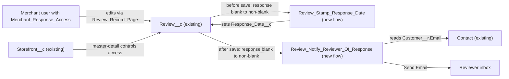

# Implementation spec — Merchant responses to reviews

> Let merchants post a public response on a `Review__c` record, stamp the response date, and email the reviewer when the response is first posted.

_Based on the requirement, the evidence reported by AskCoworker, and read-only org queries where noted. Assumptions and missing evidence are identified below. Specification only — nothing is implemented or deployed._

---

## 1. The requirement

The original requirement ("make reviews better") was too vague to design. After one clarifying question, the user narrowed it to this: merchants must be able to respond publicly to reviews, with a Merchant Response text field and a Response Date on Review, and the reviewer must be notified (*user decision*). The request contained no deploy or data-change instructions.

| # | Responsibility | Trigger | Where it lives |
| --- | --- | --- | --- |
| 1 | Store the merchant's public response text on the review | Merchant edits a review | `Review__c.Merchant_Response__c` |
| 2 | Record the date the response was first posted | `Review__c.Merchant_Response__c` goes from blank to non-blank (create or update) | `Review__c.Response_Date__c`, set by `Review_Stamp_Response_Date` |
| 3 | Notify the reviewer that the merchant responded | Same transition, after save | `Review_Notify_Reviewer_Of_Response` (Send Email to `Review__c.Customer__c` Contact email) |
| 4 | Let merchants enter the response and see the date | User opens a review record | `Merchant_Response_Access`, `Review_Record_Page`, `Review__c-Review Layout` |

## 2. Grounding — reuse before building

Target org: `TestWriteSpecDE` (Developer Edition, not a sandbox). API version: `67.0`.

- **`Review__c`** (CustomObject) — the review record. It has 6 custom fields: `Review__c.Storefront__c` (master-detail to `Storefront__c`, not reparentable, `writeRequiresMasterRead` false), `Review__c.Customer__c` (lookup to `Contact`), `Review__c.Rating__c`, `Review__c.Comments__c` (Long Text Area 32768), `Review__c.Status__c` (picklist: Submitted, Published), and `Review__c.Order_Date__c`. None of them holds a response or a response date. Sharing is `ControlledByParent`. _verified by org query_
- **Same concept elsewhere** — an org-wide Tooling `CustomField` search for `Respon`, `Reply`, and `Merchant` (Data 360 DMO fields filtered out) found only `Account.Merchant_Code__c`, `Account.Merchant_Summary__c`, `Lead.Merchant_Comments__c`, and `Onboarding_Application__c.Merchant_Business_Name__c`. None of them is a per-review response. _verified by org query_
- **`Storefront__c`** (CustomObject) — the merchant entity and the master of `Review__c`. Internal OWD is ReadWrite and external OWD is Private. It has `OwnerId`, `Account__c`, and `Primary_Contact__c`, plus the roll-ups `Total_Reviews__c` and `Total_Score__c`. _verified by org query_
- **`Contact`** — the reviewer, reached through `Review__c.Customer__c`. It has `Email` and `HasOptedOutOfEmail`. Of the 92 reviews, 13 have no `Customer__c` and 0 have an opted-out Customer. Every review that has a Customer has an email. All 92 have a blank `Status__c`. _verified by org query_
- **Automation on `Review__c`** — 0 Apex triggers (on `Review__c`, `Storefront__c`, or `Contact`), 0 record-triggered flows on those objects, and 0 validation rules on `Review__c` or `Storefront__c`. The org has 0 email alerts (`WorkflowAlert`) and 0 `OrgWideEmailAddress` records, and no review-response `EmailTemplate`. _verified by org query_
- **`AgentReviewActions`** and **`AgentSummarizeReviewsActions`** (ApexClass, `with sharing`) — these are the only components that reference `Review__c` (checked with `MetadataComponentDependency` plus a scan of all un-namespaced Apex bodies). Neither calls email APIs. _verified by org query_ `AgentReviewActions` creates reviews with `Status__c = 'Submitted'`, and `AgentSummarizeReviewsActions` reads rating fields. Neither references a response field. _reported by AskCoworker_
- **`Review_Record_Page`** (FlexiPage, RecordPage for `Review__c`) — uses Dynamic Forms field sections that show `Name`, `Storefront__c`, `Customer__c`, `Rating__c`, `Comments__c`, `Status__c`, and `Order_Date__c`. **`Review__c-Review Layout`** is the only layout on the object. No LWC or Aura bundle has "review" in its name. _verified by org query_
- **Access to `Review__c`** (complete list): `Agentforce_Reference_App` (Read/Edit/Delete, 1 assignment), `Pronto_Deep_Dive_Workshop` (Read, 1 assignment), `sfdc_accelerate_dms`, `sfdc_a360_sfcrm_data_extract`, `sfdc_slack` (namespace `sfdcInternalInt`, cannot be edited), and the System Administrator and Analytics Cloud Integration User profiles. No permission set for review responses exists. `Merchant_Management_Agent_Access`, `Merchant_Account_Manager_Agent_Access`, and `Merchant_Support_Agent_Permissions` exist but grant no `Review__c` access. _verified by org query_
- **Experience Cloud sites** `Customer Support`, `Merchant Support`, and one ESW site all have status UnderConstruction. _verified by org query_

Evidence sources: `sf org display`; `sf sobject list --sobject custom`; `sf sobject describe` on `Review__c`, `Storefront__c`, and `Contact`; Tooling queries on `EntityDefinition`, `CustomField` (including `Metadata` for `Review__c.Storefront__c`), `ApexTrigger`, `ValidationRule`, `MetadataComponentDependency`, `ApexClass` bodies, `Layout`, `FlexiPage` (including `Metadata`), `LightningComponentBundle`, `AuraDefinitionBundle`, and `WorkflowAlert`; standard queries on `FlowDefinitionView`, `ObjectPermissions`, `FieldPermissions`, `PermissionSet`, `PermissionSetAssignment`, `EmailTemplate`, `OrgWideEmailAddress`, `Network`, `TabDefinition`, `Organization`, and `Review__c` aggregates. AskCoworker returned no citedReferences.

## 3. Architecture

Why the pieces are drawn this way:

1. `Review__c` is the only object that holds a review, and it has no response fields, so the two new fields go on it (*verified by org query*).
2. The date stamp is a before-save flow. It sets a field on the triggering record without an extra DML statement. A formula cannot hold a first-response date, because `TODAY()` recalculates (*assumption (documented platform behavior)*).
3. The notification is a separate after-save flow, because before-save flows cannot run actions such as Send Email (*assumption (documented platform behavior)*). No Apex is used: the flow Send Email action covers the need declaratively.
4. The reviewer is `Review__c.Customer__c` → `Contact.Email` (*verified by org query*). No trigger, flow, or validation rule on `Review__c` exists that could conflict (*verified by org query*).
5. Access to a review follows its parent `Storefront__c` (`ControlledByParent`, *verified by org query*).

## 4. Metadata changes

**Data model**

- **Create `Review__c.Merchant_Response__c`** — Long Text Area (32768, 5 visible lines), label "Merchant Response", not required, no history tracking. It holds the merchant's public reply.
- **Create `Review__c.Response_Date__c`** — Date, label "Response Date", not required. It is set only by `Review_Stamp_Response_Date`. The type follows the user's wording "Response Date"; Date/Time is an alternative (Section 8).

**Automation**

- **Create `Review_Stamp_Response_Date`** — Record-triggered flow on `Review__c`, before save (Fast Field Updates), on create or update. Entry condition: `Review__c.Merchant_Response__c` Is Null = false, with "Only when a record is updated to meet the condition requirements". This fires on create when the response is filled in, and on an update only when the prior value was blank. One Assignment element sets `{!$Record.Response_Date__c}` = `{!$Flow.CurrentDate}`. On edits after the first response, the date is not changed. If the response is cleared and later refilled, the date is re-stamped.
- **Create `Review_Notify_Reviewer_Of_Response`** — Record-triggered flow on `Review__c`, after save, on create or update, with the same entry condition and "only when updated to meet" setting. A Decision continues only if `{!$Record.Customer__c}` is not null, `{!$Record.Customer__r.Email}` is not null, and `{!$Record.Customer__r.HasOptedOutOfEmail}` is false. Then a Send Email core action sends to `{!$Record.Customer__r.Email}`. The subject is "The merchant responded to your review". The body is a plain-text Text Template that includes `{!$Record.Storefront__r.Name}` and `{!$Record.Merchant_Response__c}`. The sender is the org default (no `OrgWideEmailAddress` exists). It runs in system context without sharing.

**Security**

- **Create `Merchant_Response_Access`** — Permission set. Object: `Review__c` Read and Edit (no Create or Delete); `Storefront__c` Read (needed for access to the detail record). Field access: `Review__c.Merchant_Response__c` Read and Edit; `Review__c.Response_Date__c` Read only; `Review__c.Rating__c`, `Review__c.Comments__c`, and `Review__c.Order_Date__c` Read only, so merchants can see what they are answering. It grants no access to `Review__c.Customer__c` or `Contact`.

**UX**

- **Update `Review_Record_Page`** — Add a "Merchant Response" field section with `Review__c.Merchant_Response__c` (editable) and `Review__c.Response_Date__c` (read-only). This page is shared by everyone who views reviews; the fields show only to users with field access.
- **Update `Review__c-Review Layout`** — Add the same two fields in a "Merchant Response" section, with `Review__c.Response_Date__c` read-only. This covers any context where the Dynamic Forms page is not used. Retrieve the layout before editing it.

## 5. Data 360 (Data Cloud) data involved

Not applicable — this change does not use Data 360. `sfdc_a360_sfcrm_data_extract` has Read on `Review__c` (*verified by org query*), and no data stream ingests `Review__c` (*reported by AskCoworker*). The new fields are not granted to that connector.

## 6. Security considerations

- **Execution context.** Both flows run in system context without sharing, so they can read `Customer__r.Email` even though merchants have no `Contact` access (*assumption (documented platform behavior)*). No Apex is added.
- **Record access.** `Review__c` is `ControlledByParent`, and the internal OWD on `Storefront__c` is ReadWrite (*verified by org query*). So any internal user with `Merchant_Response_Access` can respond to reviews of any storefront, not only their own. Section 8 covers this.
- **CRUD/FLS.** `Merchant_Response_Access` is the only permission set that grants the new fields. `Agentforce_Reference_App` and `Pronto_Deep_Dive_Workshop` are not widened. The namespaced `sfdcInternalInt` sets cannot be edited. Profiles are another grant path: the System Administrator profile gets field access only if it is granted when the fields are deployed. No permission set gets Edit on `Review__c.Response_Date__c`.
- **Data exposure.** The response text is sent by email to the reviewer's `Contact.Email`. That is the intended public disclosure. The email does not include any other review or Contact fields.

## 7. Testing strategy

No Apex is in the inventory, so no Apex tests apply. Recommended verification (no tests are claimed to have run):

1. **Stamp flow.** Build a Flow Test for `Review_Stamp_Response_Date`, or check manually: set a response on a review whose response is blank, and `Review__c.Response_Date__c` equals today. Edit the response again, and the date is unchanged. Create a review with a blank response, and the date stays blank. Create a review with a response already filled in, and the date is stamped.
2. **Notification flow (manual).** Respond on a review whose Customer has an email, and one email arrives with the response text. Edit the response, and no second email is sent. Respond on one of the 13 reviews with no Customer, and the date is stamped with no email and no error. Respond for a test Contact with `HasOptedOutOfEmail` = true, and no email is sent.
3. **Bulk.** Update 200 reviews in one Data Loader batch with no response change, and neither flow runs. Set responses on a batch of reviews and confirm that every eligible reviewer gets one email. In a Developer Edition org, keep the batch below the daily single-email limit (Section 8).
4. **Permissions.** As a user who has only `Merchant_Response_Access`: can open reviews, can edit `Review__c.Merchant_Response__c`, can see `Review__c.Response_Date__c` read-only, cannot edit `Review__c.Comments__c` or `Review__c.Rating__c`, and cannot create or delete reviews. As a `Pronto_Deep_Dive_Workshop` user: cannot see the new fields.
5. **UI.** The "Merchant Response" section appears on `Review_Record_Page` and on `Review__c-Review Layout`.
6. **Delete and undelete.** Neither flow runs on delete or undelete, and no email is sent.

## 8. Open decisions

### Open

1. **Merchant users and permission set assignment (blocking for delivery).** The org does not show who the merchants are: `Storefront__c` has one distinct owner, and the `Merchant Support` site is UnderConstruction (*verified by org query*). Assigning `Merchant_Response_Access` to the merchant users is setup that is not metadata, and responsibility 1 needs it. Default: the merchants are internal users (*assumption, load-bearing*). If they are Experience Cloud users, the permission set also needs a compatible license, plus `Storefront__c` sharing, because the external OWD is Private.
2. **Merchants can respond to any storefront's reviews (non-blocking).** With the internal `Storefront__c` OWD at ReadWrite, the permission set does not limit a merchant to their own storefront. Proposal (not in inventory): a validation rule that allows changes to `Review__c.Merchant_Response__c` only when `$User.Id = Storefront__r.OwnerId`, or tighter `Storefront__c` sharing. Recommended default: accept for now.
3. **Where "publicly" is displayed (non-blocking).** The response has the same visibility as `Review__c.Comments__c` and is emailed to the reviewer. The org has no live customer-facing site, so displaying it on a public storefront page is not specified. `AgentSummarizeReviewsActions` and the Agentforce agents do not return the response. Adding that means an Apex change and a field grant on `Agentforce_Reference_App` (a broad permission set), which is not proposed here.
4. **Email sender and daily limit (non-blocking).** No `OrgWideEmailAddress` exists, so emails come from the org default sender or the running user. Flow Send Email counts against the org's daily single-email limit, which is low in Developer Edition orgs (*assumption (documented platform behavior)*). If a branded sender is wanted, create and verify an `OrgWideEmailAddress` and set it on the Send Email action.
5. **Re-notification on edit (non-blocking).** Default: notify and stamp only when the response goes from blank to non-blank. Edits do not re-notify (*assumption*).
6. **Opt-out handling (non-blocking).** Default: honor `Contact.HasOptedOutOfEmail`, even though the email is transactional (*assumption*). Today 0 reviewers have opted out (*verified by org query*).
7. **Response date precision (non-blocking).** Default: Date, per the user's wording. Switch to Date/Time with `{!$Flow.CurrentDateTime}` if the time of day matters.
8. **Deployment sequence (non-blocking).** Deploy `Review__c.Merchant_Response__c` and `Review__c.Response_Date__c` first. Then deploy `Merchant_Response_Access`, `Review_Record_Page`, and `Review__c-Review Layout`, retrieving the page and layout before editing them. Then activate `Review_Stamp_Response_Date` and `Review_Notify_Reviewer_Of_Response`. No backfill is needed, because no review has a response today.

### Resolved

- **Scope (user decision).** "Make reviews better" was too vague to design, so one question was asked. The user chose merchant public responses: response text, response date, and a reviewer notification.
- **Date stamping moved to a before-save flow.** AskCoworker proposed stamping the date inside the after-save notification flow, after the recipient check. That would leave the date blank for reviews with no Customer, and it adds a DML statement. The design splits it into `Review_Stamp_Response_Date`. The "before-save sub-flow" wording in the proposal does not exist on the platform.
- **Create transitions covered.** AskCoworker proposed update-only flows. The design uses create-or-update with "only when updated to meet the conditions", so a review created with a response is also stamped and notified.
- **Send Email limit corrected.** AskCoworker reported that flow Send Email is limited to 10 emails per transaction and silently drops the rest. That describes the Apex `Messaging.sendEmail` call limit, not flow behavior. The real constraint is the daily single-email limit (Open item 4) (*assumption (documented platform behavior)*).
- **`Storefront__c` Read in the permission set is required, not redundant.** AskCoworker called it redundant because of the ReadWrite OWD. OWD grants record access, not object permission, so object Read on the master is needed.
- **Field type follows the requirement.** AskCoworker proposed Date/Time for `Review__c.Response_Date__c`. Date was chosen per the user's wording (Open item 7).
- **Dropped proposals.** A "Responded" `Status__c` value, an Apex trigger, and a merchant-identity field were not requested and are not in the inventory.

## 9. Change set

| # | Action | Type | API name | Module | Why |
| --- | --- | --- | --- | --- | --- |
| 1 | Create | CustomField | `Review__c.Merchant_Response__c` | force-app/main/default/objects/Review__c/fields | Stores the merchant's public response |
| 2 | Create | CustomField | `Review__c.Response_Date__c` | force-app/main/default/objects/Review__c/fields | Records the date of the first response |
| 3 | Create | Flow | `Review_Stamp_Response_Date` | force-app/main/default/flows | Sets the response date before save when a response is first posted |
| 4 | Create | Flow | `Review_Notify_Reviewer_Of_Response` | force-app/main/default/flows | Emails the reviewer when a response is first posted |
| 5 | Create | PermissionSet | `Merchant_Response_Access` | force-app/main/default/permissionsets | Dedicated merchant access to write responses |
| 6 | Update | FlexiPage | `Review_Record_Page` | force-app/main/default/flexipages | Shows the response fields on the Dynamic Forms record page |
| 7 | Update | Layout | `Review__c-Review Layout` | force-app/main/default/layouts | Shows the response fields where the layout is used |

Two new fields on `Review__c`, a before-save stamp flow, and an after-save email flow deliver merchant responses, with access granted through a dedicated permission set.

Total: 7 · Create: 5 · Update: 2 · Delete: 0
