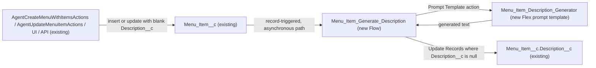

# Implementation spec — AI-generated menu item descriptions

> When a `Menu_Item__c` record is saved with a blank `Menu_Item__c.Description__c`, generate a short description with a Prompt Builder template and write it back to the field.

_Based on the requirement, the evidence reported by AskCoworker, and read-only org queries where noted. Assumptions and missing evidence are identified below. Specification only — nothing is implemented or deployed._

---

## 1. The requirement

The requirement "I want the menu to be smarter" was clarified by the user: when a menu item's description is blank, an AI-generated description should fill it (*user decision*). Generation is automatic when a record is created blank or updated to blank (*assumption*, from the wording "when description is blank"; see Section 8). The request contained no deploy or data-change instruction.

| # | Responsibility | Trigger | Where it lives |
| --- | --- | --- | --- |
| 1 | Detect a `Menu_Item__c` record whose `Description__c` is blank | Record created with a blank description, or updated so the description becomes blank | `Menu_Item_Generate_Description` (Flow, new) |
| 2 | Generate a description of at most 255 characters from the item's own data | Called by the flow on its asynchronous path | `Menu_Item_Description_Generator` (GenAiPromptTemplate, new) |
| 3 | Write the generated text to `Menu_Item__c.Description__c` without overwriting a value set meanwhile | After generation succeeds | `Menu_Item_Generate_Description` (Flow, new) |

## 2. Grounding — reuse before building

Target org: `TestWriteSpecDE` (Developer Edition, `00Dak00001COqNeEAL`, not a sandbox). API version: `67.0`.

- **`Menu_Item__c`** (CustomObject) — the menu item. It has 206 records. Custom fields: `Available__c`, `Calories__c`, `Description__c`, `Image_URL__c`, `Menu_Category__c`, `Menu__c`, `Price__c` (complete list from Tooling `CustomField`). _verified by org query_
- **`Menu_Item__c.Description__c`** (CustomField, Text Area 255, nillable, updateable) — the target field. 0 of 206 records have it blank today. _verified by org query_
- **`Menu_Item__c.Menu__c`** and **`Menu_Item__c.Menu_Category__c`** (CustomField, lookups to `Menu__c` and `Menu_Category__c`, both nillable). _verified by org query_
- **Automation on `Menu_Item__c`** — 0 Apex triggers (on `Menu_Item__c`, `Menu__c`, `Menu_Category__c`, `Storefront__c`), 0 record-triggered flows (on `Menu_Item__c`, `Menu__c`, `Menu_Category__c`), 0 validation rules on `Menu_Item__c`. _verified by org query_
- **Readers and writers of `Menu_Item__c.Description__c`** — `AgentUpdateMenuItemActions` (writes a caller-supplied value), `AgentCreateMenuWithItemsActions` (inserts many items in one DML; description optional), `AgentGetMenuItemsActions` and `MenuBrowserController` (read), `MenuDescriptionPromptGrounding` (reads item descriptions to ground a `Menu__c` prompt). From `MetadataComponentDependency` and a search of all 70 unmanaged Apex class bodies. No class calls an LLM or prompt template for `Menu_Item__c`. _verified by org query_
- **`MenuDescriptionPromptGrounding`** (ApexClass) — an existing Prompt Builder grounding class for `Menu__c` descriptions. It is the closest existing pattern. It works at menu level (one `Menu__c` and all its items), so it cannot ground a single item; it is not reused. AskCoworker did not report it. _verified by org query_
- **`Storefront__c.Cuisine__c`** (CustomField) — exists; it is two relationship hops away from `Menu_Item__c` (`Menu__c` → `Storefront__c`). _verified by org query_
- **`EinsteinGPTPromptTemplatesPsl`** (PermissionSetLicense) is Active, and the platform permission sets `EinsteinGPTPromptTemplateUser` and `EinsteinGPTPromptTemplateManager` exist in the `force` namespace (not editable). _verified by org query_
- **Access to `Menu_Item__c.Description__c`** — Read and Edit: `Agentforce_Reference_App`, `sfdc_accelerate_dms`; Read only: `sfdc_a360_sfcrm_data_extract`, `sfdc_slack`. `Menu_Item__c` Edit is also granted by one profile (`X00ex00000018ozh_128_09_04_12_1`). _verified by org query_
- **Prompt templates** — `GenAiPromptTemplate` is not queryable in this org (query error), and the project has no source files, so a duplicate template cannot be ruled out. No template was reported by AskCoworker. _reported by AskCoworker_
- **Agentforce** — agents `Merchant_Management_Agent` and `Merchant_Account_Manager_Agent` (among 5 `BotDefinition` records) use the actions `Update_Menu_Item` and `Create_Menu_with_Items`, which call the two writer classes. _verified by org query_
- **Project source** — `force-app/main/default` has only empty folders; there is nothing to reuse locally. _verified by project file_

Evidence sources: `sf org display`; `sf sobject list --sobject custom`; `sf sobject describe Menu_Item__c`; Tooling queries on `CustomField`, `ApexTrigger`, `ValidationRule`, `ApexClass` bodies, `MetadataComponentDependency`, `GenAiFunctionDefinition`, `FlexiPage`, `Layout`, `LightningComponentBundle`; standard queries on `FlowDefinitionView`, `Organization`, `ObjectPermissions`, `FieldPermissions`, `PermissionSetLicense`, `PermissionSet`, `BotDefinition`, and record counts. AskCoworker returned no citedReferences.

## 3. Architecture

Why the pieces are drawn this way:

1. Writers of `Menu_Item__c` are the two Agentforce action classes plus UI and API (*verified by org query*). A record-triggered flow covers every write path, which a change to one action class would not.
2. The flow is declarative. No Apex is added: the prompt uses the item's own fields and one-hop lookups (`Menu_Category__r.Name`, `Menu__r.Name`), which Prompt Builder merge fields can read (*assumption (documented platform behavior)*). Cuisine (`Storefront__c.Cuisine__c`, two hops) is left out of the prompt to avoid an Apex grounding class; see Section 8.
3. The prompt call runs on the flow's asynchronous path because it is an external generative AI call, which a record-triggered flow cannot make in the synchronous save transaction (*assumption (documented platform behavior)*).
4. The write-back filter `Description__c = null` keeps a value that a person or agent set while the asynchronous path was pending.

## 4. Metadata changes

**AI**

- **Create `Menu_Item_Description_Generator`** — Prompt Builder Flex template (`GenAiPromptTemplate`) with one input, `Menu_Item__c` (API name `MenuItem`). Merge fields: `Name`, `Price__c`, `Calories__c`, `Menu_Category__r.Name`, `Menu__r.Name`. Instructions: act as a menu copywriter; write one appetizing description of the item; at most 255 characters; plain text only, with no quotes, labels, or invented ingredients, allergens, or health claims; if a category or menu is missing, do not mention it. Default model. Activate the template version before the flow is activated.

**Automation**

- **Create `Menu_Item_Generate_Description`** — record-triggered flow on `Menu_Item__c`, after save, "A record is created or updated". Entry condition: `Description__c` Is Null = True, with "Only when a record is updated to meet the condition requirements" (on create, it runs when the record is created blank). Immediate path: no elements. Asynchronous path ("Run Asynchronously"): (1) Prompt Template action `Menu_Item_Description_Generator`, input `MenuItem = {!$Record}`; (2) Decision: continue only if the response text is not blank; (3) Update Records on `Menu_Item__c` where `Id = {!$Record.Id}` AND `Description__c` Is Null = True, setting `Description__c` to the formula `LEFT(TRIM({!Generate.promptResponse}), 255)`. The action and the update each have a fault connector that ends the flow without writing, so a generation failure leaves the field blank. The formula is short (well under the formula size limit); for blank input it returns blank, and the Decision prevents writing blank. Resource names are defaults.

## 5. Data 360 (Data Cloud) data involved

Not applicable — this change does not use Data 360. `sfdc_a360_sfcrm_data_extract` has Read on `Menu_Item__c.Description__c` (*verified by org query*), so any future Data 360 ingestion of this field would include generated text.

## 6. Security considerations

- **Execution context.** The record-triggered flow runs in system context without sharing (*assumption (documented platform behavior)*). No CRUD or FLS grant is needed for the write-back. No permission set changes are in the inventory.
- **Prompt template permission.** Running a prompt template requires the prompt template user permission for the running user of the asynchronous path. `EinsteinGPTPromptTemplateUser` is a platform permission set in the `force` namespace and cannot be edited (*verified by org query*). Which user runs the asynchronous path, and whether it must be assigned `EinsteinGPTPromptTemplateUser`, is not verified; it is a setup step, blocking for delivery (Section 8).
- **Data sent to the model.** Only menu data: item name, price, calories, category name, and menu name. No customer or contact data. The call goes through the Einstein Trust Layer (*assumption (documented platform behavior)*).
- **Exposure.** The generated text is stored in the existing field, so it has the same visibility as today: Read and Edit through `Agentforce_Reference_App` and `sfdc_accelerate_dms`, Read through `sfdc_a360_sfcrm_data_extract` and `sfdc_slack` (partial list of grant paths: permission sets and profiles with explicit `FieldPermissions`). Customer-facing readers (`MenuBrowserController`, `menuBrowser` LWC, `AgentGetMenuItemsActions`) will show generated text without a marker. See Section 8.

## 7. Testing strategy

The inventory has no Apex, so no Apex test class is needed. A Flow Test (`FlowTest`) cannot exercise the asynchronous path or the prompt call (*assumption (documented platform behavior)*), so all cases below are recommended manual verification in a sandbox or scratch org. No tests have been run.

1. Create a `Menu_Item__c` with a name, price, menu, category, and blank description. After the asynchronous path completes, `Description__c` is filled with 255 characters or fewer.
2. Create a `Menu_Item__c` with a description. It is unchanged.
3. Clear the description on an existing item. It is regenerated.
4. On an item whose description is still blank (for example after a generation failure), change only `Price__c`. The flow does not run again (the record did not newly meet the condition).
5. Set a description by hand before the asynchronous path finishes (or simulate it). The manual value is kept.
6. Create an item with no `Menu__c` and no `Menu_Category__c`. The flow completes without a fault, and the text does not mention a missing menu or category.
7. Bulk: call `Create_Menu_with_Items` (`AgentCreateMenuWithItemsActions`) with 10, then 200, items without descriptions. All get descriptions, or the failures appear in flow error emails with the field left blank.
8. Negative: deactivate the prompt template version (sandbox only). The flow takes its fault path and writes nothing.
9. Permission: create an item as a user with `Agentforce_Reference_App` and no prompt template permission set. Record whether generation succeeds (this settles the open item in Section 8).
10. Delete and undelete an item with a blank description. Record-triggered flows do not run on delete or undelete, so nothing is generated.

## 8. Open decisions

### Open

1. **Prompt template permission for the asynchronous path's running user (blocking for delivery, load-bearing).** The org has `EinsteinGPTPromptTemplatesPsl` Active, but whether the asynchronous path's running user needs `EinsteinGPTPromptTemplateUser` assigned is not verified. Recommended default: assign `EinsteinGPTPromptTemplateUser` to the users who create or edit menu items (holders of `Agentforce_Reference_App` and `sfdc_accelerate_dms`), and to the Automated Process user if testing shows it runs the path. This is a setup step, not metadata.
2. **Deployment sequence (blocking for delivery).** Deploy and activate `Menu_Item_Description_Generator`, then deploy `Menu_Item_Generate_Description` and activate it. No backfill is needed: 0 of 206 records are blank (*verified by org query*).
3. **Relationship merge fields (non-blocking, load-bearing).** The design assumes that the Flex template can merge `Menu_Category__r.Name` and `Menu__r.Name` from its `Menu_Item__c` input. If it cannot, or if cuisine (`Storefront__c.Cuisine__c`) is wanted, add an Apex grounding class for one item modelled on `MenuDescriptionPromptGrounding`, with its test class.
4. **Clearing a description always regenerates it (non-blocking).** `AgentUpdateMenuItemActions` writes an empty string when given one, and a cleared field is regenerated. That matches the requirement. A bypass flag is not added; list it as a proposal if intentional blanks are needed.
5. **No AI-generated marker (non-blocking).** Generated text is not flagged, and customer-facing readers show it as normal. A field such as `Menu_Item__c.Description_AI_Generated__c` was not requested; it is a proposal only.
6. **Bulk volume and generative AI limits (non-blocking).** Each blank item makes one prompt call. Einstein request limits and asynchronous-path batching for large inserts through `AgentCreateMenuWithItemsActions` are not verified (AskCoworker's "100 callouts" figure is *reported by AskCoworker*). Failed items stay blank and do not retry, because the record does not newly meet the condition. Recommended default: accept; consider a scheduled flow later if failures appear.
7. **Duplicate template (non-blocking).** `GenAiPromptTemplate` cannot be queried here, so an existing menu item template cannot be ruled out. Check Prompt Builder before creating one.

### Resolved

- **Scope** — "menu" means `Menu_Item__c`, and "smarter" means AI descriptions when the description is blank (*user decision*).
- **Automatic vs on-demand** — the requirement's wording "when description is blank" points to automatic generation, so the flow was chosen over a Field Generation template and a record-page button (*assumption*).
- **AskCoworker row 4 dropped** — AskCoworker proposed updating `EinsteinGPTPromptTemplateUser`; it is a `force`-namespace platform permission set and cannot be edited (*verified by org query*). It was replaced by the assignment step in Open item 1.
- **AskCoworker row 1 dropped** — AskCoworker proposed a new Apex grounding class `MenuItemDescriptionPromptGrounding` and described it as implementing a `ConnectApi` grounding interface. The existing pattern is actually an `@InvocableMethod` that takes `RelatedEntity` (*verified by org query*). Under Rule 4, the grounding class was dropped in favor of merge fields (Open item 3).
- **Synchronous call corrected** — AskCoworker's inventory placed the prompt action directly in the after-save flow; it was moved to the asynchronous path (*assumption (documented platform behavior)*).
- **Missed component** — AskCoworker did not report `MenuDescriptionPromptGrounding` or `MenuBrowserController`; both were found by the Apex body search and the dependency query.
- **Dropped AskCoworker proposals** — batch backfill (0 blank records), manual button, change to `AgentUpdateMenuItemActions`, and a skip checkbox were not added.

## 9. Change set

| # | Action | Type | API name | Module | Why |
| --- | --- | --- | --- | --- | --- |
| 1 | Create | GenAiPromptTemplate | `Menu_Item_Description_Generator` | force-app/main/default/genAiPromptTemplates | Generates a description of at most 255 characters from a menu item's data |
| 2 | Create | Flow | `Menu_Item_Generate_Description` | force-app/main/default/flows | Detects a blank `Menu_Item__c.Description__c` on create or update, calls the template asynchronously, and writes the result if the field is still blank |

A record-triggered flow on `Menu_Item__c` calls a new Flex prompt template on its asynchronous path and writes the generated text to the existing `Description__c` field.

Total: 2 · Create: 2 · Update: 0 · Delete: 0
