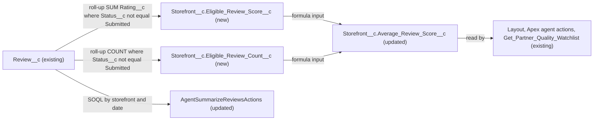

# Implementation spec — Average rating excludes Submitted reviews

> Make the storefront average rating, and the average returned by the review-summary agent action, ignore reviews whose status is still Submitted.

_Based on the requirement, the evidence reported by AskCoworker, and read-only org queries where noted. Assumptions and missing evidence are identified below. Specification only — nothing is implemented or deployed._

---

## 1. The requirement

The average rating must count Published reviews and must not count reviews that are still Submitted. The user decided that the rule is "exclude Submitted": reviews with a blank `Review__c.Status__c` (all 92 existing reviews) keep counting, so no data backfill is part of this spec. The request contained no deploy or data-change instruction.

| # | Responsibility | Trigger | Where it lives |
| --- | --- | --- | --- |
| 1 | The storefront average rating (`Storefront__c.Average_Review_Score__c`) excludes Submitted reviews | Insert, update, delete, or undelete of a `Review__c` record (roll-up recalculation); formula evaluated on read | `Storefront__c.Eligible_Review_Score__c`, `Storefront__c.Eligible_Review_Count__c`, `Storefront__c.Average_Review_Score__c` |
| 2 | The `averageRating` returned by the review-summary agent action excludes Submitted reviews | Invocation of `AgentSummarizeReviewsActions` | `AgentSummarizeReviewsActions` |
| 3 | Reviews with a blank status (legacy) and Published reviews keep counting | Same as rows 1 and 2 | Roll-up filter `Status__c` not equal to `Submitted`; same rule in `AgentSummarizeReviewsActions` |

## 2. Grounding — reuse before building

Target org: `TestWriteSpecDE` (Developer Edition, not a sandbox, org ID `00Dak00001COqNeEAL`). API version: `67.0`.

- **`Review__c.Status__c`** (CustomField, restricted picklist) — values `Submitted` and `Published`, no default, not required. All 92 `Review__c` records have a blank value; 0 are `Submitted` and 0 are `Published`. _verified by org query_
- **`Review__c.Rating__c`** (CustomField, Number(1,0)) — the value being averaged; not required; 0 records have a blank rating. _verified by org query_
- **`Review__c.Storefront__c`** (CustomField, Master-Detail to `Storefront__c`) — makes roll-up summaries on `Storefront__c` possible. _verified by org query_
- **`Storefront__c.Total_Score__c`** (CustomField, roll-up SUM of `Review__c.Rating__c`, no filter) and **`Storefront__c.Total_Reviews__c`** (CustomField, roll-up COUNT of `Review__c`, no filter). Description of `Total_Reviews__c`: "The total number of reviews received by the storefront." Both stay unchanged. _verified by org query_
- **`Storefront__c.Average_Review_Score__c`** (CustomField, Number formula `Total_Score__c / Total_Reviews__c`, `BlankAsZero`, scale 1). The 2 storefronts with 0 reviews return a blank value today. _verified by org query_
- **Readers of `Storefront__c.Average_Review_Score__c`** (`MetadataComponentDependency` plus a search of all 70 unmanaged Apex class bodies): `Storefront__c-Storefront Layout`, `AgentStorefrontActions`, `AgentGetStorefrontsByAccountActions`, `StorefrontPickerController`, `MerchantRiskScoreAction`, and the flow `Get_Partner_Quality_Watchlist`. None needs a change; they receive the new value through the formula. `MerchantRiskScoreAction` skips blank values. _verified by org query_
- **Readers of `Storefront__c.Total_Reviews__c`**: `Storefront__c-Storefront Layout`, `Storefront__c.Average_Review_Score__c`, and `Get_Partner_Quality_Watchlist` (its `minReviews` filter). Readers of `Storefront__c.Total_Score__c`: the layout and `Storefront__c.Average_Review_Score__c`. These readers are the reason the existing roll-ups are not filtered in place. _verified by org query_
- **`AgentSummarizeReviewsActions`** (ApexClass, `with sharing`) — queries up to 20 (max 100) `Review__c` records for a storefront within `daysBack` days (default 30) with no `Status__c` filter, and computes `averageRating = totalRating / reviewCount` (0 when there are no reviews). No component dependency or `GenAiFunctionDefinition` referencing it was found (partial: other invokers could not be checked). No test class references it. _verified by org query_
- **`AgentReviewActions`** (ApexClass) — inserts every new review with `Status__c = 'Submitted'`; no Apex class, trigger, or flow sets `Published`. _verified by org query_
- **Automation on `Review__c` and `Storefront__c`**: 0 Apex triggers, 0 record-triggered flows, 0 validation rules. _verified by org query_
- **Same concept elsewhere**: an org-wide `CustomField` search for `Published`, `Rating`, `Average`, and `Review` found no other average-rating or published-review field. `Storefront__c.Eligible_Review_Score__c` and `Storefront__c.Eligible_Review_Count__c` do not exist. _verified by org query_

Candidates examined and rejected: adding a filter to `Storefront__c.Total_Score__c` and `Storefront__c.Total_Reviews__c` in place — changes the meaning of "Total Reviews" on the shared layout and in `Get_Partner_Quality_Watchlist`; a before-save flow copying the rating into a new field — adds a flow and a field where two filtered roll-ups are enough; `Storefront__c.Review_Summary__c` — free text, not a computed value.

Evidence sources: `sf sobject describe` of both objects; Tooling `CustomField` metadata for the roll-ups, formula, and picklist; record counts by `Status__c`; `MetadataComponentDependency` for the three storefront fields, `Review__c.Status__c`, and `AgentSummarizeReviewsActions`; Apex class bodies; `ApexTrigger`, `FlowDefinitionView`, `ValidationRule`, `FieldPermissions`, `Organization`, `DataStream`, and `GenAiFunctionDefinition` queries; the active version of `Get_Partner_Quality_Watchlist`. AskCoworker returned no citedReferences.

## 3. Architecture

Why the pieces are drawn this way:

1. `Review__c` is the master-detail child of `Storefront__c`, so filtered roll-up summaries are the declarative way to aggregate only eligible reviews. _verified by org query_ (relationship); roll-up filters on a picklist field are standard platform behavior. _assumption (documented platform behavior)_
2. Two new roll-ups are needed because the average needs both a filtered sum and a filtered count. Using the unfiltered `Total_Reviews__c` as the denominator would count Submitted reviews.
3. `Storefront__c.Average_Review_Score__c` keeps its API name, so its six existing readers get the filtered value with no change. _verified by org query_ (reader list)
4. `AgentSummarizeReviewsActions` computes its own average in Apex from a SOQL result; no declarative change can alter that calculation, so this one Apex change is required. The class still returns every review in its window; only the average ignores Submitted reviews.

## 4. Metadata changes

**Data model**

- **Create `Storefront__c.Eligible_Review_Score__c`** — Roll-Up Summary, label "Eligible Review Score", SUM of `Review__c.Rating__c` over `Review__c.Storefront__c`, filter criteria: `Status__c` not equal to `Submitted`. Description: "Sum of ratings of reviews that are not Submitted; used by Average Review Score." Not placed on a layout and not granted to any permission set (see Section 6).
- **Create `Storefront__c.Eligible_Review_Count__c`** — Roll-Up Summary, label "Eligible Review Count", COUNT of `Review__c` over `Review__c.Storefront__c`, same filter criteria as `Storefront__c.Eligible_Review_Score__c`. Description: "Number of reviews that are not Submitted; used by Average Review Score." Not placed on a layout and not granted to any permission set.
- **Update `Storefront__c.Average_Review_Score__c`** — change the formula from `Total_Score__c / Total_Reviews__c` to `IF(Eligible_Review_Count__c > 0, Eligible_Review_Score__c / Eligible_Review_Count__c, NULL)`. Keep type Number, scale 1, and `BlankAsZero`. Results: count 0 (no eligible reviews) returns blank, the same result that zero-review storefronts return today; roll-up inputs are never blank, so blank handling does not change the result. Label, description, layout placement, and field permissions stay unchanged. The formula is about 90 characters, far below the size limits.

**Apex**

- **Update `AgentSummarizeReviewsActions`** — keep the SOQL query, the returned `reviews` list, `reviewCount`, and the star counts unchanged. In the loop, add `r.Rating__c` to `totalRating` and increment a new local counter `eligibleCount` only when `r.Status__c != 'Submitted'` (blank status counts). Set `averageRating = eligibleCount > 0 ? (totalRating / eligibleCount).setScale(2) : 0`. As today, a counted review with a blank rating adds to the counter but not to the total. Update the `averageRating` `@InvocableVariable` description to "Average star rating across the returned reviews, excluding Submitted reviews." Reason for Apex: the average is computed inside this Apex class.

**Tests**

- **Create `AgentSummarizeReviewsActionsTest`** — `@IsTest` class covering `AgentSummarizeReviewsActions` and the roll-up and formula behavior (Section 7). Test data: an `Account`, a `Storefront__c` with `Account__c` set, and `Review__c` records with `Order_Date__c` = today.

## 5. Data 360 (Data Cloud) data involved

Not applicable — this change does not use Data 360. The org has 0 `DataStream` records. _verified by org query_

## 6. Security considerations

- **Execution context.** Roll-up summaries recalculate in system context. The formula evaluates when a reader queries `Storefront__c.Average_Review_Score__c`. `AgentSummarizeReviewsActions` stays `with sharing` and keeps its account-ownership check. _verified by org query_ (class declaration and check)
- **CRUD/FLS.** Read on `Storefront__c.Average_Review_Score__c` is granted today by the permission sets `sfdc_accelerate_dms`, `sfdc_a360_sfcrm_data_extract`, `sfdc_slack`, `Agentforce_Reference_App`, and `Pronto_Deep_Dive_Workshop` (profile grants were not returned by the query; list is partial for profiles). _verified by org query_ These grants do not change.
- **New fields.** `Storefront__c.Eligible_Review_Score__c` and `Storefront__c.Eligible_Review_Count__c` get no permission set grants and no layout placement: they exist only as formula inputs, and a formula field shows its value to a user who can read it even when that user cannot read the fields it references. _assumption (documented platform behavior)_ AskCoworker proposed granting Read on both to the five permission sets above; rejected (Section 8). Administrators can still read them.
- **Data exposure.** The new fields hold a subset of what `Storefront__c.Total_Score__c` and `Storefront__c.Total_Reviews__c` already hold. No new data leaves the org.

## 7. Testing strategy

`AgentSummarizeReviewsActionsTest` (Apex):

1. **Mixed statuses, action.** Published rating 5, blank status rating 3, Submitted rating 1 in the window: `averageRating` = 4.00; `reviewCount` = 3 and the `reviews` list has all 3 records.
2. **All Submitted, action.** Two Submitted reviews: `averageRating` = 0; `reviewCount` = 2.
3. **No reviews, action.** `averageRating` = 0 (unchanged behavior).
4. **Account mismatch (negative/permission).** Wrong `accountId`: `success` = false and no average is returned.
5. **Roll-up and formula.** For the data in case 1, query `Storefront__c`: `Eligible_Review_Count__c` = 2, `Eligible_Review_Score__c` = 8, `Average_Review_Score__c` = 4.0, `Total_Reviews__c` = 3 (unchanged meaning).
6. **Status transitions.** Update the Submitted review to `Published`: average becomes 3.0. Update the Published rating-5 review to `Submitted`: average becomes 2.0. Delete the remaining eligible reviews: average is blank. Undelete one: it counts again.
7. **Bulk.** Insert 200 reviews (100 Published, 100 Submitted) in one DML statement on one storefront: `Eligible_Review_Count__c` = 100 and the average uses only the Published ratings.

Recommended verification (manual, after deployment): on a test storefront, insert a Submitted review and confirm that `Average_Review_Score__c` on the Storefront record page does not change; confirm that storefronts with only blank-status reviews show the same average as before deployment (all 92 current reviews have blank status). No tests have been run.

## 8. Open decisions

### Open

1. **Blank status counts (non-blocking, load-bearing).** The filter `Status__c` not equal to `Submitted` is assumed to include records with a blank `Status__c`, both in the roll-up filter and in Apex (`null != 'Submitted'` is true in Apex). _assumption (documented platform behavior)_ Test cases 1 and 5 check it. If the roll-up filter excluded blanks, all 92 existing reviews would drop out of the average.
2. **Future status values (non-blocking).** The rule excludes only `Submitted`. If a new value (for example "Rejected") is added to `Review__c.Status__c`, it would count until the filter is updated. This follows the user decision; it differs from the literal wording "only count Published".
3. **No publish path (non-blocking).** `AgentReviewActions` inserts every new review as `Submitted` and nothing in the org sets `Published`. _verified by org query_ After this change, new agent-created reviews stay out of the average until someone changes their status. A publishing process is not part of this requirement.
4. **`Get_Partner_Quality_Watchlist` minimum-review filter (non-blocking).** The flow compares `minReviews` with `Storefront__c.Total_Reviews__c`, which still counts Submitted reviews, while its score comes from the filtered average. Recommended default: leave the flow unchanged; changing it to `Storefront__c.Eligible_Review_Count__c` is a separate proposal.
5. **Deployment sequence (non-blocking).** Deploy `Storefront__c.Eligible_Review_Score__c` and `Storefront__c.Eligible_Review_Count__c` before or in the same deployment as `Storefront__c.Average_Review_Score__c`, and deploy `AgentSummarizeReviewsActions` with `AgentSummarizeReviewsActionsTest`. New roll-up values for existing storefronts are calculated by the platform after deployment, which can take a short time. _assumption (documented platform behavior)_ Retrieve the current `Storefront__c.Average_Review_Score__c` and `AgentSummarizeReviewsActions` into source control first; rollback is redeploying those versions and deleting the two new fields.

### Resolved

- **Scope of "exclude" (user decision).** Asked whether blank-status legacy reviews should count; the user answered "Average should exclude Submitted reviews." Decision: filter on `Status__c` not equal to `Submitted`, so blank and Published reviews count and no backfill of the 92 reviews is needed.
- **Which average (assumption).** The user had no preference; both the stored field `Storefront__c.Average_Review_Score__c` and the agent action's `averageRating` are changed, because both present an "average rating" computed from all reviews.
- **Existing roll-ups (assumption).** The user had no preference; `Storefront__c.Total_Score__c` and `Storefront__c.Total_Reviews__c` stay unchanged because the layout and `Get_Partner_Quality_Watchlist` read them as totals; two new roll-ups are created instead.
- **Corrections to AskCoworker proposals.** Replaced the proposed formula fallback of `0` with `NULL` (verified: zero-review storefronts are blank today, and `MerchantRiskScoreAction` skips blank values but would count 0 as a score); replaced the proposed SOQL filter in `AgentSummarizeReviewsActions` with an in-loop filter so the returned review list does not change; rejected the proposed Read grants on the new fields and the claim that the formula returns blank without them _assumption (documented platform behavior)_; rejected the claims that the current formula returns 0 for zero-review storefronts and that roll-ups on bulk DML are deferred; confirmed by query that no test class exists (AskCoworker marked it unknown); dropped an "auto-publish flow" from a prior session that is not in this org's evidence.

## 9. Change set

| # | Action | Type | API name | Module | Why |
| --- | --- | --- | --- | --- | --- |
| 1 | Create | CustomField | `Storefront__c.Eligible_Review_Score__c` | force-app/main/default/objects/Storefront__c/fields | Sum of ratings of non-Submitted reviews for the average |
| 2 | Create | CustomField | `Storefront__c.Eligible_Review_Count__c` | force-app/main/default/objects/Storefront__c/fields | Count of non-Submitted reviews for the average |
| 3 | Update | CustomField | `Storefront__c.Average_Review_Score__c` | force-app/main/default/objects/Storefront__c/fields | Average uses the filtered roll-ups |
| 4 | Update | ApexClass | `AgentSummarizeReviewsActions` | force-app/main/default/classes | Agent action average ignores Submitted reviews |
| 5 | Create | ApexClass | `AgentSummarizeReviewsActionsTest` | force-app/main/default/classes | Tests the action, roll-ups, and formula |

Two filtered roll-ups feed the existing average formula, and the agent action applies the same "not Submitted" rule to its own average.

Total: 5 · Create: 3 · Update: 2 · Delete: 0
