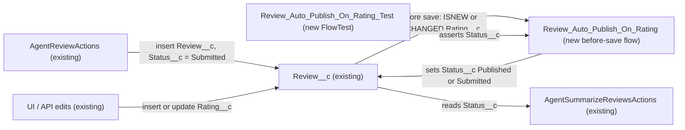

# Implementation spec — Auto-publish 4- and 5-star reviews

> Set `Review__c.Status__c` to `Published` when a review is rated 4 or 5, and to `Submitted` (pending moderation) for any other rating.

_Based on the requirement, the evidence reported by AskCoworker, and read-only org queries where noted. Assumptions and missing evidence are identified below. Specification only — nothing is implemented or deployed._

---

## 1. The requirement

New reviews rated 4 or 5 stars are published automatically; reviews with a lower (or missing) rating are saved as `Submitted` so a moderator can review them. The request contained no deploy or data-change instruction.

| # | Responsibility | Trigger | Where it lives |
| --- | --- | --- | --- |
| 1 | Set `Review__c.Status__c` = `Published` when `Review__c.Rating__c` is 4 or 5 | `Review__c` created, or updated with a changed `Rating__c` | `Review_Auto_Publish_On_Rating` (new before-save flow) |
| 2 | Set `Review__c.Status__c` = `Submitted` for any other rating (1–3, blank, out of range) | `Review__c` created, or updated with a changed `Rating__c` | `Review_Auto_Publish_On_Rating` (new before-save flow) |
| 3 | Leave moderator decisions alone when the rating does not change | `Review__c` updated without a `Rating__c` change | `Review_Auto_Publish_On_Rating` entry condition |

## 2. Grounding — reuse before building

Target org: `TestWriteSpecDE` (Developer Edition, `00Dak00001COqNeEAL`). API version: `67.0`.

- **`Review__c`** (CustomObject) — the review record; child of `Storefront__c` through the master-detail field `Review__c.Storefront__c` (not reparentable). _verified by org query_
- **`Review__c.Rating__c`** (CustomField, Number(1,0), not required, no default; description "typically ranging from 1 (poor) to 5 (excellent)"). _verified by org query_
- **`Review__c.Status__c`** (CustomField, restricted picklist with values `Submitted` and `Published`, no default value). The two values match the requirement's two states, so no new field or value is needed. _verified by org query_
- **`AgentReviewActions`** (ApexClass, `with sharing`, invocable "Leave Review") — the only Apex that inserts `Review__c`. It sets `Status__c = 'Submitted'` unconditionally, inserts one record, and re-queries it. The class comment says "Mirror the Flow default", but no flow that writes `Review__c` was found. _verified by org query (Apex bodies of all 70 unmanaged classes searched for `Review__c`)_
- **`AgentSummarizeReviewsActions`** (ApexClass) — reads `Review__c.Status__c` and returns it; it does not filter on it and does not write it. _verified by org query_
- **Existing automation on `Review__c`**: 0 Apex triggers, 0 record-triggered flows (active or inactive, `FlowDefinitionView` by `TriggerObjectOrEventId`), 0 validation rules. _verified by org query_
- **References to `Review__c.Status__c`**: `AgentReviewActions`, `AgentSummarizeReviewsActions` (`MetadataComponentDependency` plus Apex body search; partial — layouts and reports that are not tracked by `MetadataComponentDependency` were not checked). _verified by org query_
- **Data shape**: 92 reviews; `Status__c` is blank on all 92; `Rating__c` is 4 or higher on 52, below 4 on 40, blank on 0, above 5 on 0. _verified by org query_
- **Field access on `Review__c.Status__c`**: Edit only in `sfdc_accelerate_dms`; Read-only in `Agentforce_Reference_App`, `sfdc_a360_sfcrm_data_extract`, `sfdc_slack`, `Pronto_Deep_Dive_Workshop` (permission sets only; no profile rows returned). _verified by org query_
- **Name checks**: no flow named `Review_Auto%` and no `FlowTest` records exist. _verified by org query_

Candidates examined and rejected: updating `AgentReviewActions` — covers only one insert path (UI, API, and data loads would bypass it), and it needs Apex; an Apex trigger — a before-save flow does the same field assignment declaratively; a validation rule — it can block a save but cannot set the value.

Evidence sources: `sf org display`; `sf sobject list --sobject custom`; `sf sobject describe Review__c`; Tooling `EntityDefinition`, `CustomField` (+ `Metadata` for `Rating__c`, `Status__c`, `Storefront__c`), `ApexTrigger`, `ValidationRule`, `ApexClass` bodies, `MetadataComponentDependency`, `FlowTest`; standard `FlowDefinitionView`, `FieldPermissions`, `COUNT()` queries on `Review__c`. AskCoworker returned no citedReferences.

## 3. Architecture

Why the pieces are drawn this way:

1. `AgentReviewActions` inserts `Review__c` with `Status__c = 'Submitted'` (_verified by org query_). Records can also be created or edited through the UI or API; which callers do so in practice is Not specified.
2. A before-save record-triggered flow runs during the save, after the values supplied by the DML statement are set and before the record is committed, so its assignment replaces the value that `AgentReviewActions` set. Before-save flows do not run on delete or undelete. _assumption (documented platform behavior)_
3. `AgentReviewActions` re-queries the record after `insert`, so its response returns the flow-assigned `Status__c`. _verified by org query (class body)_; the value it will return is _assumption (documented platform behavior)_.
4. `AgentSummarizeReviewsActions` only reads `Status__c`; it is unchanged. _verified by org query_
5. No Apex is added.

## 4. Metadata changes

**Automation**

- **Create `Review_Auto_Publish_On_Rating`** — Record-triggered flow on `Review__c`, "Fast Field Updates" (before save), trigger "A record is created or updated". Entry condition, "Formula evaluates to true": `ISNEW() || ISCHANGED({!$Record.Rating__c})`. One Assignment element sets `{!$Record.Status__c}` to a text formula resource `ReviewStatusForRating` = `IF(AND(NOT(ISBLANK({!$Record.Rating__c})), {!$Record.Rating__c} >= 4, {!$Record.Rating__c} <= 5), "Published", "Submitted")`. Results: 4 or 5 → `Published`; 1, 2, 3, 0, blank, or above 5 → `Submitted`. No Get Records, no DML. Saved Active. Label "Review Auto-Publish On Rating". Transitions on update: a rating change into 4–5 publishes the review; a rating change out of 4–5 returns it to `Submitted`; an update that does not change `Rating__c` (for example a moderator setting `Published` on a 3-star review) does not run the flow.

**Tests**

- **Create `Review_Auto_Publish_On_Rating_Test`** — `FlowTest` for `Review_Auto_Publish_On_Rating`. Create-path tests: `Rating__c` = 5, 4 → `Status__c` = `Published`; 3, 1 → `Submitted`; blank → `Submitted`; 5 with initial `Status__c` = `Submitted` (the `AgentReviewActions` case) → `Published`. Update-path tests: 3 → 5 → `Published`; 5 → 2 → `Submitted`; `Comments__c` change only on a record with `Rating__c` = 3 and `Status__c` = `Published` → entry condition false, `Status__c` stays `Published`.

## 5. Data 360 (Data Cloud) data involved

Not applicable — this change does not use Data 360.

## 6. Security considerations

- **Execution context.** The before-save flow runs in system context, so it sets `Status__c` whether or not the saving user has Edit access to that field. _assumption (documented platform behavior)_ This matters because only `sfdc_accelerate_dms` grants Edit on `Review__c.Status__c`. _verified by org query_
- **`AgentReviewActions`.** `with sharing` controls record sharing only; its plain `insert` does not enforce field-level security, so callers do not need Edit on `Status__c`. _assumption (documented platform behavior)_ AskCoworker reported that callers need Edit on `Status__c` or the insert fails; that claim was rejected (see Section 8).
- **CRUD/FLS and permission sets.** No new fields and no permission set changes. Read access to `Status__c` is unchanged (_verified by org query_ for the permission sets listed in Section 2). Permission sets are not the only grant path; profile access was not returned by the `FieldPermissions` query.
- **Data exposure.** No new data is exposed. Reviews rated 4–5 become `Published`; whether any customer-facing channel shows only `Published` reviews is Not specified (no reader filtering on `Status__c` was found).

## 7. Testing strategy

- `Review_Auto_Publish_On_Rating_Test` covers the create and update behaviors listed in Section 4, including the blank-rating negative case, the transition out of 4–5, and the no-rating-change case. Flow tests do not count toward Apex code coverage; no Apex is added.
- Recommended verification (no planned test): run the "Leave Review" action (`AgentReviewActions`) with ratings 5 and 2 in a sandbox and confirm the response `status` is `Published` and `Submitted`.
- Recommended verification (bulk): insert 200 `Review__c` records with mixed ratings through the API or Data Loader in a sandbox and confirm each `Status__c`. The flow has no queries or DML, so it adds no per-record query or DML use.
- Recommended verification (permission): as a user with `Agentforce_Reference_App` (Read-only on `Status__c`), edit `Rating__c` from 3 to 5 and confirm `Status__c` becomes `Published`.
- Recommended verification (delete/undelete): delete and undelete a review and confirm `Status__c` is unchanged.
- No tests have been run.

## 8. Open decisions

### Open

1. **Existing reviews (non-blocking).** All 92 existing reviews have a blank `Status__c`; 52 of them are rated 4 or higher (_verified by org query_). The flow does not change them until their rating is edited. Recommended default: no backfill in this spec. If the owner wants one, export the records first, then update `Status__c` from `Rating__c` with Data Loader in a sandbox and then production; rollback is re-importing the export.
2. **Out-of-range ratings (non-blocking).** `Rating__c` is Number(1,0) with no validation rule, so 0 or 6–9 can be saved (_verified by org query_; 0 such records today). The flow treats them as `Submitted`. A validation rule limiting ratings to 1–5 is a proposal outside this requirement.
3. **Moderation queue (non-blocking).** The requirement keeps low ratings `Submitted` "for moderation", but no moderation process (queue, notification, list view) was found. This spec does not add one; moderators would find reviews by `Status__c` = `Submitted`. Proposal only.
4. **Deployment (non-blocking).** Deploy `Review_Auto_Publish_On_Rating` before `Review_Auto_Publish_On_Rating_Test`. If the target org requires flow test coverage to deploy active flows, deploy them together. _assumption_

### Resolved

- **Update behavior.** The requirement is silent on edits. Default: re-evaluate only when `Rating__c` changes, so a moderator's manual status choice survives other edits, and a rating lowered below 4 sends the review back to `Submitted`. _assumption (default; does not change the inventory)_ This is load-bearing for Responsibility 3.
- **"4 or 5 stars"** is implemented as `Rating__c` between 4 and 5 inclusive; AskCoworker's proposed `Rating__c >= 4` would have published out-of-range values. Corrected. _assumption_
- **Blank rating** → `Submitted`, because it is not "rated 4 or 5". _assumption_
- **`AgentReviewActions` is not changed.** The flow overrides its hard-coded `Submitted`; its comment "Mirror the Flow default" stays accurate. _assumption (documented platform behavior)_
- **AskCoworker corrections.** Rejected the claim that `with sharing` makes `AgentReviewActions` enforce FLS on `Status__c` (it does not; no FLS grant needed). Rejected the claim that `FlowTest` cannot be deployed as source metadata (it is a Metadata API type). AskCoworker's "prior session" facts (no triggers, no flows, 92 blank statuses, master-detail) were re-checked by org query and confirmed.
- **Dropped AskCoworker proposals:** filtering `Storefront__c` roll-ups and `AgentSummarizeReviewsActions` by `Status__c`; both are outside this requirement.

## 9. Change set

| # | Action | Type | API name | Module | Why |
| --- | --- | --- | --- | --- | --- |
| 1 | Create | Flow | `Review_Auto_Publish_On_Rating` | force-app/main/default/flows | Sets `Status__c` to `Published` for ratings 4–5 and `Submitted` otherwise on create and on rating change |
| 2 | Create | FlowTest | `Review_Auto_Publish_On_Rating_Test` | force-app/main/default/flowtests | Tests the create, update, and blank-rating paths of the flow |

A before-save flow on `Review__c` sets `Status__c` from `Rating__c`, covering every insert path including `AgentReviewActions`.

Total: 2 · Create: 2 · Update: 0 · Delete: 0
