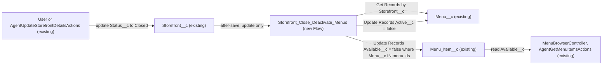

# Implementation spec — Storefront closure deactivates menus and menu items

> When a `Storefront__c` record's `Status__c` changes to Closed, set `Menu__c.Active__c` to false on all its menus and `Menu_Item__c.Available__c` to false on all items of those menus.

_Based on the requirement, the evidence reported by AskCoworker, and read-only org queries where noted. Assumptions and missing evidence are identified below. Specification only — nothing is implemented or deployed._

---

## 1. The requirement

When a storefront is Closed, all of its menus become inactive and all of the menu items on those menus become unavailable. No user questions were needed; the requirement names a picklist value, two checkbox fields, and a parent-child path that all exist in the org. The request contained no deploy or data-change instruction.

| # | Responsibility | Trigger | Where it lives |
| --- | --- | --- | --- |
| 1 | Detect that a storefront became Closed | Update of `Storefront__c` where `Status__c` changes to `Closed` | `Storefront_Close_Deactivate_Menus` (new Flow) |
| 2 | Deactivate all menus of that storefront | Same event | `Storefront_Close_Deactivate_Menus` sets `Menu__c.Active__c` = false |
| 3 | Mark all menu items of those menus unavailable | Same event | `Storefront_Close_Deactivate_Menus` sets `Menu_Item__c.Available__c` = false |
| 4 | Show the result to existing consumers | Next read | `MenuBrowserController`, `AgentGetMenuItemsActions`, `AgentGetActiveMenusActions` (existing, unchanged) |

## 2. Grounding — reuse before building

Target org: `TestWriteSpecDE` (Developer Edition, `00Dak00001COqNeEAL`). API version: `67.0`.

- **`Storefront__c.Status__c`** (Picklist) — values `Active`, `Inactive`, `Pending Activation`, `Suspended`, `Closed`. `Closed` is the trigger value. _verified by org query_
- **`Menu__c.Storefront__c`** (Master-Detail to `Storefront__c`, required, cascade delete) — the path from storefront to menu. _verified by org query_
- **`Menu__c.Active__c`** (Checkbox, default true) — "deactivated" means false. _verified by org query_
- **`Menu_Item__c.Menu__c`** (Lookup to `Menu__c`, nillable) — the path from menu to item. It is not Master-Detail, so no roll-up or cascade reaches items. _verified by org query_
- **`Menu_Item__c.Available__c`** (Checkbox, default true) — "unavailable" means false. _verified by org query_
- **`Menu_Category__c`** — has no link to `Storefront__c` or `Menu__c` (fields `Description__c`, `Display_Order__c` only), so it is not a path from storefront to item. _verified by org query_
- **Existing automation**: 0 Apex triggers on `Storefront__c`, `Menu__c`, `Menu_Item__c`, `Menu_Category__c`; 0 record-triggered flows on `Storefront__c`, `Menu__c`, `Menu_Item__c`; 0 validation rules on those three objects. The requirement is not met today. _verified by org query_
- **`AgentUpdateStorefrontDetailsActions`** (ApexClass, `with sharing`) — writes `Status__c` (`sf.Status__c = req.status; update sf;`). This is an existing path that will fire the new flow. _verified by org query_ (Apex body search over all 70 unnamespaced classes)
- **`AgentUpdateMenuActions`** (single `Menu__c.Active__c` edit) and **`AgentUpdateMenuItemActions`** (single `Menu_Item__c.Available__c` edit) — existing per-record writers; neither reacts to storefront status, so they do not meet the requirement, and they are left unchanged. _verified by org query_ (class bodies); singleton behavior of `AgentUpdateMenuActions` _reported by AskCoworker_
- **Readers of the result**: `MenuBrowserController` filters `Available__c = true`; `AgentGetMenuItemsActions` returns `Available__c`; `AgentGetActiveMenusActions` filters `Menu__c.Active__c = true`. Other classes that reference these fields: `AgentCreateMenuWithItemsActions`, `MenuDescriptionPromptGrounding`. _verified by org query_ (Apex bodies; flows and other metadata types not searched for readers — partial)
- **Data shape**: 21 storefronts, all `Active`; 23 menus, all active, all under Active storefronts; 206 menu items, all available, of which 73 have a null `Menu__c`. _verified by org query_

Candidates examined and rejected: a roll-up or formula (cannot write child records); a second flow on `Menu__c` that cascades item availability (would also change items when one menu is deactivated on its own, which nobody asked for); extending `AgentUpdateStorefrontDetailsActions` (would miss UI and other edits of `Status__c`); an Apex trigger (a flow can do the two bulk updates declaratively).

Evidence sources: `sf sobject describe` of `Storefront__c`, `Menu__c`, `Menu_Item__c`, `Menu_Category__c`; Tooling `ApexTrigger`, `ValidationRule`, `ApexClass` bodies; `FlowDefinitionView` (all flows); `EntityDefinition`; `ObjectPermissions`; `DataStream` count; aggregate counts on the three objects. AskCoworker returned no citedReferences.

## 3. Architecture

Why the pieces are drawn this way:

1. `Storefront__c` is updated by users and by `AgentUpdateStorefrontDetailsActions`. _verified by org query_ A record-triggered flow catches every update path, so no caller changes. _assumption (documented platform behavior)_
2. The flow is after-save because it updates other records; before-save flows can only change the triggering record. _assumption (documented platform behavior)_
3. The flow reads the storefront's menus with Get Records, updates them, and then updates items whose `Menu__c` is in the collected menu Ids. Flow Update Records filters cannot traverse `Menu__r.Storefront__c`, so the Id collection with the `In` operator is used. _assumption (documented platform behavior)_
4. The flow is a declarative feature, so no Apex is added (Rule 4).
5. Readers need no change: they already filter or report on `Active__c` and `Available__c`. _verified by org query_

## 4. Metadata changes

**Automation**

- **Create `Storefront_Close_Deactivate_Menus`** — Record-triggered flow on `Storefront__c`, after save, trigger "A record is updated". Entry condition: `Status__c` Equals `Closed` with "Only when a record is updated to meet the condition requirements" (equivalent formula: `ISPICKVAL({!$Record.Status__c}, 'Closed') && ISCHANGED({!$Record.Status__c})`). Elements in order: (a) Get Records `Menu__c` where `Storefront__c` = `{!$Record.Id}`, all records, Id only, into `menuRecords`; (b) Decision: if `menuRecords` is null or empty, end; (c) Update Records `Menu__c` where `Storefront__c` = `{!$Record.Id}` and `Active__c` = true, set `Active__c` = false; (d) Transform or Loop plus Assignment to build text collection `menuIds` from `menuRecords`; (e) Update Records `Menu_Item__c` where `Menu__c` In `{!menuIds}` and `Available__c` = true, set `Available__c` = false. Runs in system context without sharing (default for record-triggered flows). No scheduled paths. Status Active on deploy is a deployment choice for the release owner.

**Tests**

- **Create `Storefront_Close_Deactivate_Menus.Closed_Status_Starts_Cascade`** — Flow Test for the flow: (1) prior `Status__c` = `Active`, updated `Status__c` = `Closed`, assert the flow path passes the entry condition and reaches the Update Records elements; (2) second test path in the same FlowTest, or a sibling test, with updated `Status__c` = `Suspended`, assert the flow does not start. Child-record outcomes are covered by manual verification in Section 7 because Flow Test assertions evaluate flow resources, not records written by the flow.

## 5. Data 360 (Data Cloud) data involved

Not applicable — this change does not use Data 360. The org has 0 `DataStream` records. _verified by org query_ The permission set `sfdc_a360_sfcrm_data_extract` has Read on all three objects _verified by org query_, so any future data stream would ingest the updated checkbox values without schema changes. _assumption_

## 6. Security considerations

- **Execution context**: the record-triggered flow runs in system context without sharing, so the menu and item updates happen regardless of the closing user's access to `Menu__c` and `Menu_Item__c`. _assumption (documented platform behavior)_ This is intended: closing a storefront must close all of its menus.
- **Who can start the cascade**: any user who can edit `Storefront__c.Status__c`. Non-profile permission sets with Edit on `Storefront__c`: `Agentforce_Reference_App`, `sfdc_accelerate_dms`. Read-only: `Pronto_Deep_Dive_Workshop`, `sfdc_a360_sfcrm_data_extract`, `sfdc_slack`. _verified by org query_ (profile grants not listed — partial). `AgentUpdateStorefrontDetailsActions` runs `with sharing`, so its caller also needs record access to the storefront. _verified by org query_
- **CRUD/FLS**: no new fields; no permission set changes. The flow needs no grants because it runs in system context. _assumption (documented platform behavior)_
- **Data exposure**: none added. The change only lowers availability; `MenuBrowserController` and `AgentGetActiveMenusActions` will show fewer records for a closed storefront. _verified by org query_ (filters in class bodies)

## 7. Testing strategy

Flow Test `Storefront_Close_Deactivate_Menus.Closed_Status_Starts_Cascade` (Section 4) covers:

- Entry condition passes when `Status__c` changes from `Active` to `Closed`.
- Entry condition fails when `Status__c` changes to another value (for example `Suspended`).

Recommended verification (manual, in a sandbox; not planned as automated tests):

1. Close a storefront that has at least 2 menus, each with items: every child `Menu__c.Active__c` becomes false and every `Menu_Item__c.Available__c` on those menus becomes false.
2. Items with a null `Menu__c` (73 exist today) and items on other storefronts' menus stay unchanged.
3. Close a storefront with 0 menus, and one whose menus have 0 items: the flow completes with no error (verifies the empty-collection decision and the `In` filter on an empty or non-empty collection).
4. Edit another field (for example `Description__c`) on an already Closed storefront: no menu or item changes (verifies the "only when updated to meet the condition" setting).
5. Deactivate one menu directly with `AgentUpdateMenuActions` on an Active storefront: its items stay available.
6. Close a storefront through `AgentUpdateStorefrontDetailsActions` as a user who has Edit on `Storefront__c` but not on `Menu__c`: the cascade still happens (verifies system context).
7. Bulk: update 21 storefronts to Closed in one Data Loader or API batch in a sandbox: all menus and items update, no governor-limit errors (verifies flow bulkification of Get Records and Update Records across interviews).
8. Set a Closed storefront back to `Active`: menus and items stay deactivated (documents that reopening is out of scope).

No test is claimed to have run.

## 8. Open decisions

### Open

1. **Reopening a storefront (non-blocking).** Changing `Status__c` from `Closed` to another value does not reactivate menus or items. The requirement does not ask for it, and the flow cannot know which items were unavailable before closure. Recommended default: out of scope; propose a separate requirement if needed.
2. **Records added or moved after closure (non-blocking).** A new `Menu__c` created under a Closed storefront (default `Active__c` = true), or a `Menu_Item__c` later linked to a menu of a Closed storefront, is not deactivated; the flow runs only on the storefront transition. Recommended default: out of scope; a validation rule or a flow on `Menu__c`/`Menu_Item__c` is a possible follow-on proposal.
3. **Items with a null `Menu__c` (non-blocking).** 73 of 206 items have no menu and therefore no storefront; they cannot be reached from a closing storefront. _verified by org query_ Recommended default: leave unchanged; review as a data-quality task.
4. **Storefront created as Closed (non-blocking).** The flow runs on update only. A new storefront has no menus yet, so there is nothing to deactivate. _assumption_
5. **Deployment sequence (non-blocking).** Deploy the flow, then the Flow Test. No data backfill is needed because no storefront is Closed today. _verified by org query_ Check reports and list views for filters on `Active__c` and `Available__c` that may change results (they cannot be read with the allowed commands).
6. **Load-bearing assumptions.** (a) Record-triggered after-save flows run in system context and fire for Apex DML from `AgentUpdateStorefrontDetailsActions`; (b) Flow Update Records supports the `In` operator on a text collection; (c) record-triggered flow Get Records and Update Records elements are bulkified across interviews in one transaction. Each has a verification case in Section 7 (items 6, 1 and 3, and 7).

### Resolved

- **Cross-object filter on items**: AskCoworker's first inventory proposed filtering `Menu_Item__c` on `Menu__c.Storefront__c` inside Update Records. Flow record filters cannot traverse relationships, so the design uses Get Records plus a `menuIds` collection with the `In` operator (AskCoworker's own fallback). _assumption (documented platform behavior)_
- **Bulk cost**: AskCoworker stated that closing N storefronts costs 3N SOQL/DML and suggested Apex above 50. Record-triggered flows bulkify Get Records and Update Records across the interviews in one batch, so the cost is about one query and two DML statements per batch. The Apex alternative is dropped. _assumption (documented platform behavior)_
- **Single flow, not a second flow on `Menu__c`**: chosen so that deactivating one menu on its own does not change its items, which the requirement does not ask for. _assumption_
- **Update only still-active records**: filters `Active__c` = true and `Available__c` = true avoid rewriting records that already hold the target value. _assumption_
- **"Prior session" facts from AskCoworker** (0 data streams, permission set grants, data counts) were re-checked by org query and match. _verified by org query_
- **Flow Test API name and folder**: `Storefront_Close_Deactivate_Menus.Closed_Status_Starts_Cascade` in `force-app/main/default/flowtests` follows the FlowTest source format. _assumption_
- Dropped AskCoworker items: the Process Builder alternative, the concern about FlowTest deployability (FlowTest is a deployable metadata type), and the note that consumers must be checked (their filters were read).

## 9. Change set

| # | Action | Type | API name | Module | Why |
| --- | --- | --- | --- | --- | --- |
| 1 | Create | Flow | `Storefront_Close_Deactivate_Menus` | force-app/main/default/flows | After-save flow on `Storefront__c` that deactivates menus and marks items unavailable when `Status__c` changes to `Closed` |
| 2 | Create | FlowTest | `Storefront_Close_Deactivate_Menus.Closed_Status_Starts_Cascade` | force-app/main/default/flowtests | Tests that the flow starts only when `Status__c` changes to `Closed` |

One after-save record-triggered flow on `Storefront__c` updates the storefront's `Menu__c` records and then their `Menu_Item__c` records; existing readers pick up the new values unchanged.

Total: 2 · Create: 2 · Update: 0 · Delete: 0
