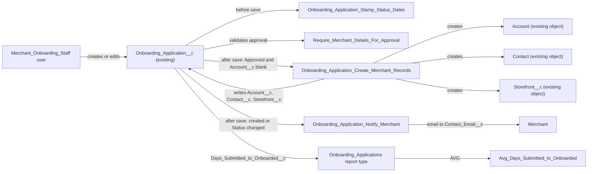

# Implementation spec — Merchant onboarding revamp

> Capture merchant details on `Onboarding_Application__c`, create the `Account`, `Contact`, and `Storefront__c` on approval, email the merchant at each status change, and report the average days from Submitted to Onboarded.

_Based on the requirement, the evidence reported by AskCoworker, and read-only org queries where noted. Assumptions and missing evidence are identified below. Specification only — nothing is implemented or deployed._

---

## 1. The requirement

Extend the existing `Onboarding_Application__c` object so internal staff capture the merchant's business name, address, cuisine, and contact; on approval a flow creates the `Account`, `Contact`, and `Storefront__c`; a flow emails the merchant contact on creation and on every status change; and a report shows the average days from Submitted to Onboarded, based on one timestamp per status (*user decision*). The request contained no deploy or data-change instruction.

| # | Responsibility | Trigger | Where it lives |
| --- | --- | --- | --- |
| 1 | Capture business name, address, cuisine, and contact on the application | User creates or edits `Onboarding_Application__c` | Existing `Onboarding_Application__c.Merchant_Business_Name__c`; new `Business_Address__c`, `Cuisine__c`, `Contact_First_Name__c`, `Contact_Last_Name__c`, `Contact_Email__c`, `Contact_Phone__c`; `CustomTab` `Onboarding_Application__c`; updated layout; `Merchant_Onboarding_Staff` |
| 2 | Create `Account`, `Contact`, and `Storefront__c` when approved, and link them to the application | `Status__c` becomes `Approved` while `Account__c` is blank | Flow `Onboarding_Application_Create_Merchant_Records`; validation rule `Require_Merchant_Details_For_Approval`; existing `Account__c`; new `Contact__c`, `Storefront__c` lookups |
| 3 | Email the merchant at each status change | Record created (status `Submitted`) or `Status__c` changed | Flow `Onboarding_Application_Notify_Merchant` to `Contact_Email__c` |
| 4 | Report the average days from Submitted to Onboarded | Report run | Flow `Onboarding_Application_Stamp_Status_Dates`; existing `Application_Submitted_Date__c`; new status timestamps and `Days_Submitted_to_Onboarded__c`; report type `Onboarding_Applications`; report `Onboarding_Reports/Avg_Days_Submitted_to_Onboarded` |

## 2. Grounding — reuse before building

Target org: `TestWriteSpecDE` (Developer Edition, `00Dak00001COqNeEAL`, not a sandbox). API version: `67.0`.

- **`Onboarding_Application__c`** (CustomObject, unmanaged, DurableId `01Iak00000Dx4JU`) — the onboarding application. Name is an auto number. 0 records. _verified by org query_
- **`Onboarding_Application__c.Status__c`** (restricted picklist: `Submitted` (default), `Under Review`, `Approved`, `Onboarded`) — drives every automation. Field history is not tracked. _verified by org query_
- **`Onboarding_Application__c.Merchant_Business_Name__c`** (Text 100) — reused as the business name. _verified by org query_
- **`Onboarding_Application__c.Account__c`** (Lookup `Account`, SetNull) — reused as the link to the created Account. _verified by org query_
- **`Onboarding_Application__c.Application_Submitted_Date__c`** (DateTime) — reused as the Submitted timestamp. No automation writes it today. _verified by org query_
- Other existing fields, unchanged: `Application_Created_Date__c`, `Business_License_Number__c`, `Onboarding_Specialist__c`, `Operational_Procedures__c`. This is the complete Tooling `CustomField` list for the object (8 fields). `sobject describe` hides all of them except `Status__c` from the running admin, because no profile or permission set other than `sfdc_accelerate_dms`, `sfdc_a360_sfcrm_data_extract`, and `sfdc_slack` has field permissions on them. _verified by org query_
- **`Onboarding_Application__c-Onboarding Application Layout`** (Layout) — the only layout; it references `Account__c`, `Application_Created_Date__c`, `Application_Submitted_Date__c`, `Merchant_Business_Name__c`, and `Status__c`. _verified by org query_
- **`Onboarding_Application_Record_Page`** and **`Onboarding_Application_Record_Page1`** (FlexiPage, RecordPage) — exist; which one is active could not be read. _verified by org query_
- **`Storefront__c`** — has `Account__c` (Lookup `Account`), `Primary_Contact__c` (Lookup `Contact`), `Address__c` (Address), `Cuisine__c` (unrestricted picklist, 102 values), `Status__c` (includes `Pending Activation`). _verified by org query_
- **`Account.Cuisine_Type__c`** (restricted picklist, 38 values; all but `Other` also exist in `Storefront__c.Cuisine__c`). Not written by this design. _verified by org query_
- Object access to `Onboarding_Application__c` (complete list): `sfdc_accelerate_dms` (full CRUD plus View/Modify All), `sfdc_a360_sfcrm_data_extract` and `sfdc_slack` (Read, View All), profiles System Administrator (full) and Analytics Cloud Integration User (Read). _verified by org query_
- State and country picklists are enabled (`Storefront__c.Address__StateCode__s` and `Address__CountryCode__s` exist). _verified by org query_

Candidates examined and rejected: `Account.Cuisine_Type__c` as the cuisine value set — restricted and smaller than the Storefront list; the Storefront is where cuisine is written. AskCoworker's claim that `Merchant_Business_Name__c`, `Account__c`, and `Application_Submitted_Date__c` do not exist — contradicted by the Tooling query (they are hidden from `describe` by FLS).

Evidence sources: `sf sobject list`; `sobject describe` of `Onboarding_Application__c`, `Storefront__c`, `Account`; Tooling `CustomField` (list and `Metadata` by Id), `ApexTrigger`, `ValidationRule`, `Layout`, `FlexiPage`, `MetadataComponentDependency`, `GenAiFunctionDefinition`, `WorkflowAlert`, `GlobalValueSet`, `ApexClass` bodies (70 unmanaged classes searched; none reference the object); standard `FlowDefinitionView`, `ObjectPermissions`, `FieldPermissions`, `FieldDefinition`, `TabDefinition`, `EmailTemplate`, `OrgWideEmailAddress`, `Report`, `Folder`, `PermissionSet`, `BusinessHours`, `Organization`, `DataStream`. AskCoworker returned no citedReferences.

## 3. Architecture

Why the pieces are drawn this way:

1. `Onboarding_Application__c` has no triggers, no record-triggered flows, no validation rules, and no Apex, flow, or agent action that references it (*verified by org query*). New automation does not interact with existing automation.
2. All automation is declarative: a before-save flow for the timestamps (field updates on the same record need no DML), and after-save flows for record creation and email. No Apex is needed.
3. `Onboarding_Application_Create_Merchant_Records` sets `Storefront__c.Account__c` and `Storefront__c.Primary_Contact__c` (existing lookups, *verified by org query*) and `Contact.AccountId`, so the three created records are linked to each other and to the application.
4. The report averages a formula of two timestamps on the application, so no custom summary or Apex is needed.

## 4. Metadata changes

**Data model**

- **Create `Onboarding_Application__c.Business_Address__c`** — Address (compound) field, label "Business Address". Uses the org's state and country picklists (same as `Storefront__c.Address__c`). Not required at field level.
- **Create `Onboarding_Application__c.Cuisine__c`** — Picklist, label "Cuisine", local value set that copies the 102 values of `Storefront__c.Cuisine__c` in the same order, restricted. Not required.
- **Create `Onboarding_Application__c.Contact_First_Name__c`** — Text(40) (matches `Contact.FirstName`), label "Contact First Name".
- **Create `Onboarding_Application__c.Contact_Last_Name__c`** — Text(80) (matches `Contact.LastName`), label "Contact Last Name".
- **Create `Onboarding_Application__c.Contact_Email__c`** — Email, label "Contact Email". Recipient of all status emails.
- **Create `Onboarding_Application__c.Contact_Phone__c`** — Phone, label "Contact Phone".
- **Create `Onboarding_Application__c.Contact__c`** — Lookup(`Contact`), label "Contact", relationship name `Onboarding_Applications`, delete constraint SetNull. Written by the approval flow.
- **Create `Onboarding_Application__c.Storefront__c`** — Lookup(`Storefront__c`), label "Storefront", relationship name `Onboarding_Applications`, delete constraint SetNull. Written by the approval flow.
- **Create `Onboarding_Application__c.Under_Review_Date__c`** — DateTime, label "Under Review Date". Written by the stamping flow.
- **Create `Onboarding_Application__c.Approved_Date__c`** — DateTime, label "Approved Date". Written by the stamping flow.
- **Create `Onboarding_Application__c.Onboarded_Date__c`** — DateTime, label "Onboarded Date". Written by the stamping flow.
- **Create `Onboarding_Application__c.Days_Submitted_to_Onboarded__c`** — Formula (Number, 18,2), label "Days Submitted to Onboarded": `IF(OR(ISBLANK(Onboarded_Date__c), ISBLANK(Application_Submitted_Date__c)), NULL, Onboarded_Date__c - Application_Submitted_Date__c)`. Blank handling `BlankAsBlank`: blank if either timestamp is blank; `0` if both timestamps are equal. Calendar days with fractions (DateTime subtraction returns days). Well under formula size limits.
- **Update `Onboarding_Application__c`** — Conditional: only if Allow Reports (`enableReports`) is not already enabled on the object; set it to `true` so the report type can be used. The current value could not be read.
- **Create `Onboarding_Application__c.Require_Merchant_Details_For_Approval`** — Validation rule: `AND(ISPICKVAL(Status__c, "Approved"), OR(ISNEW(), ISCHANGED(Status__c)), OR(ISBLANK(Merchant_Business_Name__c), ISBLANK(Contact_Last_Name__c)))`. Message: "Enter the Merchant Business Name and Contact Last Name before approving." Prevents the approval flow from failing on the required `Account.Name` and `Contact.LastName`.

**UX**

- **Create `Onboarding_Application__c`** — CustomTab for the object (no tab exists today), so staff can open and create applications.
- **Update `Onboarding_Application__c-Onboarding Application Layout`** — Add section "Business" (`Merchant_Business_Name__c`, `Business_Address__c`, `Cuisine__c`), section "Contact" (`Contact_First_Name__c`, `Contact_Last_Name__c`, `Contact_Email__c`, `Contact_Phone__c`), section "Onboarding" (`Account__c`, `Contact__c`, `Storefront__c`, all read-only), and section "Status Dates" (`Application_Submitted_Date__c`, `Under_Review_Date__c`, `Approved_Date__c`, `Onboarded_Date__c`, `Days_Submitted_to_Onboarded__c`, all read-only). Retrieve the layout before editing. This is the only layout, so the change applies to every user of the object.

**Security**

- **Create `Merchant_Onboarding_Staff`** — PermissionSet. Object: `Onboarding_Application__c` Read, Create, Edit (no Delete, no View All); `Account`, `Contact`, `Storefront__c` Read (to open the linked records). Field Edit: `Merchant_Business_Name__c`, `Business_Address__c`, `Cuisine__c`, `Contact_First_Name__c`, `Contact_Last_Name__c`, `Contact_Email__c`, `Contact_Phone__c`. Field Read only: `Account__c`, `Contact__c`, `Storefront__c`, `Application_Submitted_Date__c`, `Under_Review_Date__c`, `Approved_Date__c`, `Onboarded_Date__c`, `Days_Submitted_to_Onboarded__c`. Tab `Onboarding_Application__c` Visible. `Status__c` is required, so it needs no field permission.

**Automation**

- **Create `Onboarding_Application_Stamp_Status_Dates`** — Record-triggered flow, before save, on create and update of `Onboarding_Application__c`. Decision on `Status__c` when the record is new or `Status__c` changed: `Submitted` sets `Application_Submitted_Date__c`, `Under Review` sets `Under_Review_Date__c`, `Approved` sets `Approved_Date__c`, `Onboarded` sets `Onboarded_Date__c`, each to `{!$Flow.CurrentDateTime}` only when that field is blank (first entry into the status is kept).
- **Create `Onboarding_Application_Create_Merchant_Records`** — Record-triggered flow, after save, on create and update, entry condition `ISPICKVAL({!$Record.Status__c}, "Approved")` AND `{!$Record.Account__c}` is null, "only when a record is updated to meet the condition requirements". Creates `Account` (`Name` = `Merchant_Business_Name__c`; `BillingStreet`, `BillingCity`, `BillingPostalCode`, `BillingStateCode`, `BillingCountryCode` from the `Business_Address__c` components), then `Contact` (`FirstName`, `LastName`, `Email`, `Phone` from the contact fields; `AccountId` = new Account), then `Storefront__c` (`Name` = `Merchant_Business_Name__c`; `Account__c`; `Primary_Contact__c`; `Address__c` components from `Business_Address__c`; `Cuisine__c`; `Status__c` = `Pending Activation`), then updates `$Record` with `Account__c`, `Contact__c`, `Storefront__c`. Fault path: none added; a DML error rolls back the save and shows the error to the user.
- **Create `Onboarding_Application_Notify_Merchant`** — Record-triggered flow, after save, on create and update, entry: record is new or `Status__c` changed, and `Contact_Email__c` is not blank. Send Email core action to `{!$Record.Contact_Email__c}`, subject "Your onboarding application is now {!$Record.Status__c}", plain-text body from a flow text template with `Name`, `Merchant_Business_Name__c`, and `Status__c`. No email template.

**Reporting**

- **Create `Onboarding_Applications`** — ReportType, base object `Onboarding_Application__c`, category Other, deployed. Fields: `Name`, `Merchant_Business_Name__c`, `Status__c`, `Cuisine__c`, `Application_Submitted_Date__c`, `Under_Review_Date__c`, `Approved_Date__c`, `Onboarded_Date__c`, `Days_Submitted_to_Onboarded__c`. Depends on the Allow Reports setting (Conditional Update row).
- **Create `Onboarding_Reports`** — ReportFolder, label "Onboarding Reports", shared with users who hold `Merchant_Onboarding_Staff` (folder sharing is set after deployment).
- **Create `Onboarding_Reports/Avg_Days_Submitted_to_Onboarded`** — Report, summary format on `Onboarding_Applications`, filter `Status__c` equals `Onboarded`, grouped by `CALENDAR_MONTH` of `Onboarded_Date__c`, aggregate Average of `Days_Submitted_to_Onboarded__c` with a grand total.

**Tests**

- **Create `Onboarding_Application_Stamp_Status_Dates_Test`** — FlowTest for the stamping flow: create at `Submitted` stamps `Application_Submitted_Date__c`; update to each other status stamps its field; an existing date is not overwritten; an unrelated field change stamps nothing.
- **Create `Onboarding_Application_Create_Merchant_Records_Test`** — FlowTest for the approval flow: update to `Approved` with `Account__c` blank meets the entry condition and the flow reaches the create and update elements; with `Account__c` set, or another status, the entry condition is not met.

## 5. Data 360 (Data Cloud) data involved

Not applicable — this change does not use Data 360. The org has 0 data streams (*verified by org query*). `sfdc_a360_sfcrm_data_extract` can read `Onboarding_Application__c` today (*verified by org query*) but gets no access to the new fields.

## 6. Security considerations

- **Execution context.** Record-triggered flows run in system context without sharing by default (*assumption (documented platform behavior)*). Staff therefore need no Create access on `Account`, `Contact`, or `Storefront__c`; the approval flow creates them. The trade-off is that anyone who can set `Status__c` to `Approved` causes these records to be created.
- **Who can approve.** Any user with Edit on `Onboarding_Application__c` can set `Status__c` to `Approved`: holders of `Merchant_Onboarding_Staff`, `sfdc_accelerate_dms`, and the System Administrator profile (*verified by org query* for the existing grants). A separate approver role was not requested; see Section 8.
- **CRUD/FLS.** `Merchant_Onboarding_Staff` grants Read, Create, Edit on the application (no Delete) and Read on the three created objects. The timestamps, lookups, and formula are read-only for users. Permission sets are not the only grant path; profiles (System Administrator) also have object access. The System Administrator profile and the existing permission sets `sfdc_accelerate_dms`, `sfdc_slack`, and `sfdc_a360_sfcrm_data_extract` get no field access to the new fields.
- **Data exposure.** The application stores merchant contact PII (name, email, phone). The email reaches only the address on the record. Because there is no org-wide email address (*verified by org query*), emails are sent from the user who saved the record (*assumption (documented platform behavior)*), which exposes that user's address to the merchant.
- **Sharing.** The object's sharing model could not be read. `Merchant_Onboarding_Staff` does not grant View All, so staff see the applications that sharing gives them.

## 7. Testing strategy

- **FlowTest `Onboarding_Application_Stamp_Status_Dates_Test`** — covers responsibility 4: each status stamps its own field on create or change; existing dates are not overwritten; unrelated edits stamp nothing.
- **FlowTest `Onboarding_Application_Create_Merchant_Records_Test`** — covers the entry conditions of responsibility 2 (Approved with blank `Account__c` enters; otherwise not).
- **Recommended verification (manual, sandbox), not covered by a planned test:**
  1. As a `Merchant_Onboarding_Staff` user, create an application with all capture fields; confirm `Application_Submitted_Date__c` is set and one "Submitted" email arrives.
  2. Move to `Under Review`, then `Approved`; confirm one email per change, `Approved_Date__c` set, one `Account`, `Contact`, and `Storefront__c` created with the mapped values and links, and the three lookups written back.
  3. Negative: approve with a blank `Contact_Last_Name__c` or `Merchant_Business_Name__c`; the validation rule blocks the save.
  4. Re-entry: set a different status and back to `Approved`; no second set of records is created (guard on `Account__c`), and the write-back update sends no extra email.
  5. Blank `Contact_Email__c`: the application saves and no email is sent.
  6. Bulk: update 200 applications to `Approved` through the API; confirm 200 sets of records and no governor-limit error (flow Create Records elements are bulkified per batch).
  7. Move to `Onboarded`; confirm `Days_Submitted_to_Onboarded__c` and the report average and month grouping.
  8. Permission: a user without `Merchant_Onboarding_Staff` (and without the other grants) cannot open the tab or create an application.
  9. Delete an application: nothing fires; the created records remain. Undelete fires no record-triggered flow.
- Flow Tests cannot cover the email action in `Onboarding_Application_Notify_Merchant`; verify it manually. No tests have been run.

## 8. Open decisions

### Open

1. **Direct jump to `Onboarded` (non-blocking).** `Status__c` is not ordered by any rule. If a record goes from `Submitted` or `Under Review` straight to `Onboarded`, no `Account`, `Contact`, or `Storefront__c` is created and `Approved_Date__c` stays blank. Recommended default: accept; add a validation rule later if the business wants a strict sequence.
2. **Moving back from `Approved` (non-blocking).** If `Status__c` leaves `Approved`, the created records remain and the dates keep their first values. Recommended default: accept (records are not deleted automatically).
3. **Sender address (non-blocking).** No `OrgWideEmailAddress` exists, and it is not deployable metadata. Emails come from the saving user. Recommended default: after deployment, create and verify an org-wide address (for example an onboarding mailbox) and set it as the sender on the Send Email action.
4. **Email limits in Developer Edition (non-blocking).** Flow Send Email counts against the org's daily single-email limit, which is low in Developer Edition orgs (*assumption (documented platform behavior)*). Recommended default: check the limit before testing at volume.
5. **Allow Reports on `Onboarding_Application__c` (non-blocking).** The Conditional Update of `Onboarding_Application__c` applies only if Allow Reports is off; the setting could not be read (Tooling `CustomObject.Metadata` query failed). The report type and report depend on it.
6. **Active record page (non-blocking).** Two record pages exist (`Onboarding_Application_Record_Page`, `Onboarding_Application_Record_Page1`); activation could not be read. If the active page uses Dynamic Forms instead of the layout's record detail, add the new fields to that page as well. Deployment step: check which page is active.
7. **Existing integration grants (non-blocking).** `sfdc_accelerate_dms`, `sfdc_slack`, and `sfdc_a360_sfcrm_data_extract` read the existing fields today. No responsibility needs them to read the new fields, so they get no access. Decide per integration if needed.
8. **Deployment sequence and setup (blocking for delivery).** Deploy fields, then the validation rule, object setting, tab, layout, permission set, flows, report type, folder, report, and Flow Tests. Activate the three flows. Assign `Merchant_Onboarding_Staff` to onboarding staff and share `Onboarding_Reports` with them; neither is metadata, and responsibilities 1 and 4 fail without them. No data backfill is needed (0 records, *verified by org query*).
9. **Load-bearing assumptions.** Record-triggered flows run in system context and bulkify Create Records per batch; the after-save update of `$Record` re-runs the before-save flow and re-evaluates both after-save flows, but `Status__c` is unchanged and `Account__c` is set, so no re-stamp, no duplicate records, and no duplicate email (*assumption (documented platform behavior)*). The custom `Business_Address__c` components can be read and written by flows, as `Storefront__c.Address__c` components are exposed as fields (*verified by org query* for the Storefront components; flow support is *assumption (documented platform behavior)*).

### Resolved

- **Cuisine value set:** use the `Storefront__c.Cuisine__c` values, because the Storefront is where cuisine is written; `Account.Cuisine_Type__c` is not set. _assumption (user had no preference)_. `Storefront__c.Cuisine__c` is unrestricted and there are no global value sets, so values are copied locally (*verified by org query*); AskCoworker's blocking item on global value sets and restriction is resolved.
- **Persona:** internal staff capture the application in Lightning; no Experience Cloud or web form. _assumption (user had no preference)_
- **One timestamp per status** for the report. _user decision_
- **Timestamps keep the first entry** into each status, so the cycle time measures from the first submission. _assumption_
- **Calendar days**, not business hours: the requirement says "days". _assumption_
- **"Each status change" includes creation**, because a new record starts at `Submitted` (the picklist default, *verified by org query*). _assumption_
- **Always create a new `Account`**, as the requirement states; no duplicate matching. _assumption_
- **Contact captured as fields** on the application, because the Contact is created only on approval. _assumption_
- **AskCoworker corrections:** it said `Merchant_Business_Name__c`, `Account__c`, and `Application_Submitted_Date__c` do not exist and proposed creating them and a new layout; the Tooling `CustomField` and `Layout` queries show they exist, so they are reused and the layout is an Update. It proposed five text address fields; replaced by one Address field matching `Storefront__c.Address__c`. It proposed four email templates and an `OrgWideEmailAddress` row; replaced by a flow text template (a Send Email template needs a recipient record, and no Contact exists before approval), and the sender is Open item 3 because `OrgWideEmailAddress` is not deployable. It said bulk approval hits the DML limit above 37 records; record-triggered flows bulkify DML per element, so this is replaced by manual check 6. It said the before-save flow does not re-run on the write-back update; it does, and the blank-field guards make it harmless. It said blank `Account.Name` or `Contact.LastName` would fail the flow; accepted, and the validation rule was added.
- Dropped AskCoworker proposals: a combined flow, an approval process, and a `Status__c` Data Cloud stream (not requested).

## 9. Change set

| # | Action | Type | API name | Module | Why |
| --- | --- | --- | --- | --- | --- |
| 1 | Create | CustomField | `Onboarding_Application__c.Business_Address__c` | force-app/main/default/objects/Onboarding_Application__c/fields | Capture business address (responsibility 1) |
| 2 | Create | CustomField | `Onboarding_Application__c.Cuisine__c` | force-app/main/default/objects/Onboarding_Application__c/fields | Capture cuisine (responsibility 1) |
| 3 | Create | CustomField | `Onboarding_Application__c.Contact_First_Name__c` | force-app/main/default/objects/Onboarding_Application__c/fields | Capture contact (responsibility 1) |
| 4 | Create | CustomField | `Onboarding_Application__c.Contact_Last_Name__c` | force-app/main/default/objects/Onboarding_Application__c/fields | Capture contact (responsibility 1) |
| 5 | Create | CustomField | `Onboarding_Application__c.Contact_Email__c` | force-app/main/default/objects/Onboarding_Application__c/fields | Capture contact; email recipient (responsibilities 1 and 3) |
| 6 | Create | CustomField | `Onboarding_Application__c.Contact_Phone__c` | force-app/main/default/objects/Onboarding_Application__c/fields | Capture contact (responsibility 1) |
| 7 | Create | CustomField | `Onboarding_Application__c.Contact__c` | force-app/main/default/objects/Onboarding_Application__c/fields | Link to created Contact (responsibility 2) |
| 8 | Create | CustomField | `Onboarding_Application__c.Storefront__c` | force-app/main/default/objects/Onboarding_Application__c/fields | Link to created Storefront (responsibility 2) |
| 9 | Create | CustomField | `Onboarding_Application__c.Under_Review_Date__c` | force-app/main/default/objects/Onboarding_Application__c/fields | Per-status timestamp (responsibility 4) |
| 10 | Create | CustomField | `Onboarding_Application__c.Approved_Date__c` | force-app/main/default/objects/Onboarding_Application__c/fields | Per-status timestamp (responsibility 4) |
| 11 | Create | CustomField | `Onboarding_Application__c.Onboarded_Date__c` | force-app/main/default/objects/Onboarding_Application__c/fields | Per-status timestamp; cycle end (responsibility 4) |
| 12 | Create | CustomField | `Onboarding_Application__c.Days_Submitted_to_Onboarded__c` | force-app/main/default/objects/Onboarding_Application__c/fields | Days from Submitted to Onboarded for the average (responsibility 4) |
| 13 | Update | CustomObject | `Onboarding_Application__c` | force-app/main/default/objects/Onboarding_Application__c | Conditional: enable Allow Reports if off (responsibility 4) |
| 14 | Create | ValidationRule | `Onboarding_Application__c.Require_Merchant_Details_For_Approval` | force-app/main/default/objects/Onboarding_Application__c/validationRules | Required Account and Contact names before approval (responsibility 2) |
| 15 | Create | CustomTab | `Onboarding_Application__c` | force-app/main/default/tabs | Staff navigation to the application (responsibility 1) |
| 16 | Update | Layout | `Onboarding_Application__c-Onboarding Application Layout` | force-app/main/default/layouts | Place capture, link, and date fields (responsibilities 1, 2, 4) |
| 17 | Create | PermissionSet | `Merchant_Onboarding_Staff` | force-app/main/default/permissionsets | Least access for onboarding staff (responsibilities 1, 2, 4) |
| 18 | Create | Flow | `Onboarding_Application_Stamp_Status_Dates` | force-app/main/default/flows | Stamp a timestamp per status (responsibility 4) |
| 19 | Create | Flow | `Onboarding_Application_Create_Merchant_Records` | force-app/main/default/flows | Create Account, Contact, Storefront on approval (responsibility 2) |
| 20 | Create | Flow | `Onboarding_Application_Notify_Merchant` | force-app/main/default/flows | Email merchant at each status change (responsibility 3) |
| 21 | Create | ReportType | `Onboarding_Applications` | force-app/main/default/reportTypes | Report source for the application (responsibility 4) |
| 22 | Create | ReportFolder | `Onboarding_Reports` | force-app/main/default/reports | Shared folder for the report (responsibility 4) |
| 23 | Create | Report | `Onboarding_Reports/Avg_Days_Submitted_to_Onboarded` | force-app/main/default/reports/Onboarding_Reports | Average days Submitted to Onboarded (responsibility 4) |
| 24 | Create | FlowTest | `Onboarding_Application_Stamp_Status_Dates_Test` | force-app/main/default/flowtests | Test the timestamp flow |
| 25 | Create | FlowTest | `Onboarding_Application_Create_Merchant_Records_Test` | force-app/main/default/flowtests | Test the approval flow entry conditions |

The existing `Onboarding_Application__c` gains capture, link, and timestamp fields; three record-triggered flows stamp dates, create the merchant records on approval, and email the merchant; and a report averages the Submitted-to-Onboarded days.

Total: 25 · Create: 23 · Update: 2 · Delete: 0
