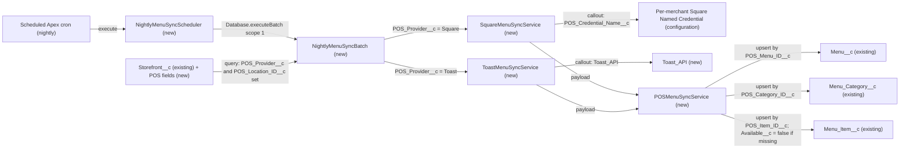

# Implementation spec — Nightly POS menu item sync (Square and Toast)

> Every night, pull each storefront's menu from its Square or Toast POS and upsert it into `Menu__c`, `Menu_Category__c`, and `Menu_Item__c` by POS external ID.

_Based on the requirement, the evidence reported by AskCoworker, and read-only org queries where noted. Assumptions and missing evidence are identified below. Specification only — nothing is implemented or deployed._

---

## 1. The requirement

A scheduled nightly job processes each `Storefront__c` that is linked to a POS, calls that storefront's Square or Toast API, and upserts its menu items into `Menu_Item__c` by a POS external ID (user decision). Items that the POS no longer returns are marked `Available__c = false`, not deleted (recommended default; the user had no preference). The request contained no deploy or data-change instruction.

| # | Responsibility | Trigger | Where it lives |
| --- | --- | --- | --- |
| 1 | Record which POS each storefront uses, its POS location ID, and which Named Credential to call | Admin data entry at merchant onboarding | `Storefront__c.POS_Provider__c`, `Storefront__c.POS_Location_ID__c`, `Storefront__c.POS_Credential_Name__c` |
| 2 | Start the sync every night | Scheduled Apex (cron, nightly) | `NightlyMenuSyncScheduler` |
| 3 | Process storefronts one at a time with callouts | Batch Apex, scope 1 | `NightlyMenuSyncBatch` |
| 4 | Call the Square or Toast API and parse the menu | Per storefront, inside the batch | `SquareMenuSyncService`, `ToastMenuSyncService`, `Toast_API`, per-merchant Square Named Credentials |
| 5 | Upsert menus, categories, and items by POS external ID; mark missing items unavailable | Per storefront, after the callout | `POSMenuSyncService`; `Menu__c.POS_Menu_ID__c`, `Menu_Category__c.POS_Category_ID__c`, `Menu_Item__c.POS_Item_ID__c` |
| 6 | Grant the running user the access the sync needs | Permission set assignment | `POS_Menu_Sync` |

## 2. Grounding — reuse before building

Target org: `TestWriteSpecDE` (Developer Edition, `orgfarm-89b86ec88b-dev-ed.develop.my.salesforce.com`). API version: `67.0`.

- **`Storefront__c`** (CustomObject) — the merchant location that owns the POS link; 21 records, each with `Storefront__c.Account__c` populated; 5 Accounts own more than one storefront. No POS provider, POS location, or credential field exists. _verified by org query_
- **`Menu__c`** (CustomObject) — `Menu__c.Storefront__c` is Master-Detail to `Storefront__c`; fields `Menu__c.Active__c`, `Menu__c.Menu_Display_Name__c`, `Menu__c.Description__c`; `Name` is Auto Number; 23 records; 2 storefronts have more than one menu. No external ID field. _verified by org query_
- **`Menu_Item__c`** (CustomObject) — sync target. `Menu_Item__c.Menu__c` (Lookup), `Menu_Item__c.Menu_Category__c` (Lookup), `Name` Text(80), `Menu_Item__c.Price__c` Currency(16,2), `Menu_Item__c.Available__c` Checkbox, `Menu_Item__c.Description__c` Text Area(255), `Menu_Item__c.Calories__c`, `Menu_Item__c.Image_URL__c`. 206 records, 73 with no `Menu__c`. No external ID field. _verified by org query_
- **`Menu_Category__c`** (CustomObject) — standalone, no lookup to `Menu__c` or `Storefront__c`; 67 records; 10 `Name` values are duplicated. No external ID field. _verified by org query_
- **`Storefront__c.Menu_Count__c`** (Roll-Up Summary, COUNT of `Menu__c`) — will count menus the sync creates. _verified by org query_
- **Automation on the four objects** — no Apex triggers, no record-triggered flows, no validation rules. _verified by org query_ (`ApexTrigger`, `FlowDefinitionView`, `ValidationRule` by `EntityDefinitionId`)
- **Existing Apex that reads or writes `Menu_Item__c`** — `AgentCreateMenuWithItemsActions`, `AgentUpdateMenuItemActions`, `AgentUpdateMenuItemPriceActions`, `AgentGetMenuItemsActions`, `MenuBrowserController`, `MenuDescriptionPromptGrounding` (no namespace). None refers to Square, Toast, or a POS, and none is Schedulable or Batchable for menus. _verified by org query_ (`MetadataComponentDependency`, `ApexClass` body scan); none uses upsert or an external ID. _reported by AskCoworker_
- **Integrations** — Named Credentials `Pronto_Pass_Factory` and `Pronto_Orders_API` only (the only callout class, `ProntoWalletPassService`, uses `callout:Pronto_Pass_Factory`); Remote Site `ApexDevNet` only; no Square or Toast credential exists. _verified by org query_
- **Scheduled work** — the only scheduled flow is `Orch` ("Orchestration flow for Recurrence Scheduler"); no `CronTrigger` relates to menus. _verified by org query_
- **Permission sets** — `Agentforce_Reference_App` grants Read/Create/Edit/Delete on `Menu_Item__c` and `Storefront__c`; `sfdc_a360_sfcrm_data_extract` and `sfdc_slack` (namespace `sfdcInternalInt`) grant Read. No permission set named `POS_Menu_Sync` exists. _verified by org query_
- **New names** — none of the Apex classes, `Toast_API`, or `POS_Menu_Sync` exists yet. _verified by org query_
- **Data 360** — `DataStream` count is 0. _verified by org query_

Evidence sources: `sf org display`; `sobject list`; `FieldDefinition` for the four objects; Tooling `ApexTrigger`, `ValidationRule`, `ApexClass` (body scan), `MetadataComponentDependency`, `RemoteProxy`, `NamedCredential`; `FlowDefinitionView`; `CronTrigger`; `ObjectPermissions`; `PermissionSet`; aggregate counts on the four objects; `DataStream` count. The `ExternalCredential` query was rejected by the API (not verified). AskCoworker returned no citedReferences.

## 3. Architecture

Why the pieces are drawn this way:

1. **Apex, not a flow.** The sync needs HTTP callouts to Square and Toast, JSON parsing, and upsert by external ID across three objects. A scheduled flow can call Apex actions but cannot express this parsing and multi-object upsert declaratively, so Apex is used. _assumption (platform behavior)_
2. **Scheduler starts a batch with scope 1.** Each storefront gets its own transaction with its own callout limits, so one merchant's failure does not roll back another's. AskCoworker proposed chained Queueables; this was reshaped because Developer Edition and trial orgs cap chained Queueable depth at 5 and the org is a Developer Edition with 21 storefronts. _verified by org query_ (org type, count); _assumption_ (documented Salesforce limit)
3. **Two provider classes, one shared upsert engine.** `SquareMenuSyncService` and `ToastMenuSyncService` only fetch and parse; `POSMenuSyncService` owns the upsert and the availability rule so it is written once. _reported by AskCoworker_ (proposal)
4. **Credential per storefront.** Each Square seller authorizes separately, so one Named Credential cannot serve all merchants; `Storefront__c.POS_Credential_Name__c` names the Named Credential to call (`Toast_API` for Toast storefronts). _user decision_ (default accepted); _assumption_ (Square and Toast auth model)
5. **Composite keys.** 5 Accounts own several storefronts, and a Square catalog is shared across a seller's locations, so item, category, and menu keys are prefixed with `POS_Location_ID__c` to keep one storefront's records from overwriting another's. _verified by org query_ (multi-storefront Accounts); _assumption_ (Square catalog scope)
6. No triggers, flows, or validation rules fire on the upserted objects. _verified by org query_

## 4. Metadata changes

**Integration**

- **Create `Toast_External_Credential`** — External Credential for Toast API authentication, with one named principal for the Toast partner client. Conditional: the authentication protocol (Custom header with a bearer token, or OAuth 2.0 client credentials) depends on the Toast integration type the business holds; see Section 8.
- **Create `Toast_API`** — Named Credential backed by `Toast_External_Credential`; endpoint the Toast API host (`https://ws-api.toasttab.com`, reported by AskCoworker). The restaurant is selected per call with the `Toast-Restaurant-External-ID` header set to `Storefront__c.POS_Location_ID__c`.

**Data model**

- **Create `Storefront__c.POS_Provider__c`** — Picklist, restricted, values `Square`, `Toast`. Selects the provider class.
- **Create `Storefront__c.POS_Location_ID__c`** — Text(255), Unique, External ID. Square `location_id` or Toast restaurant GUID. Unique so two storefronts cannot claim the same POS location.
- **Create `Storefront__c.POS_Credential_Name__c`** — Text(80). Developer name of the Named Credential the sync calls for this storefront.
- **Create `Menu__c.POS_Menu_ID__c`** — Text(255), External ID, Unique. Value `{POS_Location_ID__c}:{POS menu ID}` for Toast; `{POS_Location_ID__c}:SQUARE` for Square, which has one menu per storefront.
- **Create `Menu_Category__c.POS_Category_ID__c`** — Text(255), External ID, Unique. Value `{POS_Location_ID__c}:{POS category or menu group ID}`. Existing categories keep a blank value and are not matched.
- **Create `Menu_Item__c.POS_Item_ID__c`** — Text(255), External ID, Unique. Value `{POS_Location_ID__c}:{POS item ID}`. The upsert key for the sync. The 206 existing items keep a blank value and are not touched.

**Apex**

- **Create `POSMenuSyncService`** — `without sharing`. Defines the provider interface (`fetchMenu(Storefront__c)` returning a parsed payload) and the shared upsert engine: upsert `Menu__c` by `Menu__c.POS_Menu_ID__c` (with `Menu__c.Storefront__c` set), then `Menu_Category__c` by `Menu_Category__c.POS_Category_ID__c`, then `Menu_Item__c` by `Menu_Item__c.POS_Item_ID__c` with `Name`, `Price__c`, `Description__c`, `Available__c = true`, `Menu__c`, `Menu_Category__c`. Then sets `Available__c = false` on items of that storefront whose `POS_Item_ID__c` is not blank and was not in the payload. All DML uses all-or-none so a failure rolls back that storefront.
- **Create `SquareMenuSyncService`** — implements the provider interface. Calls the Square Catalog API through `callout:{POS_Credential_Name__c}`, follows pagination cursors, keeps items present at `POS_Location_ID__c`, and maps categories, items, and prices to the payload.
- **Create `ToastMenuSyncService`** — implements the provider interface. Calls the Toast menus API through `callout:Toast_API` with the restaurant header, maps menus, menu groups, and items to the payload.
- **Create `NightlyMenuSyncScheduler`** — implements `Schedulable`; `execute` calls `Database.executeBatch(new NightlyMenuSyncBatch(), 1)`.
- **Create `NightlyMenuSyncBatch`** — `without sharing`; implements `Database.Batchable<SObject>` and `Database.AllowsCallouts`. `start` queries `Storefront__c` where `POS_Provider__c`, `POS_Location_ID__c`, and `POS_Credential_Name__c` are not blank; `execute` selects the provider class by `POS_Provider__c`, fetches, and calls `POSMenuSyncService`. Any callout error, non-2xx status, or parse error throws, so the batch records the failure for that storefront instead of reporting success.

**Tests**

- **Create `POSMenuSyncServiceTest`** — `HttpCalloutMock` for Square and Toast; covers the service, both providers, the batch, and the scheduler (see Section 7).

**Security**

- **Create `POS_Menu_Sync`** — Permission set for the user who schedules the job: Read on `Storefront__c` and its three POS fields; Read/Create/Edit on `Menu__c`, `Menu_Category__c`, `Menu_Item__c` and Read/Edit on the fields the sync writes; no Delete; Apex class access to the new classes; external credential principal access to `Toast_External_Credential`.

## 5. Data 360 (Data Cloud) data involved

Not applicable — this change does not use Data 360. The org has no data streams (_verified by org query_). `sfdc_a360_sfcrm_data_extract` can read `Menu_Item__c` and `Storefront__c` (_verified by org query_), so the new fields become available to any future CRM data stream.

## 6. Security considerations

- **Execution context.** Scheduled and batch Apex run as the user who scheduled the job. `NightlyMenuSyncBatch` and `POSMenuSyncService` are `without sharing` so storefronts owned by other users are not skipped silently; Apex DML in system mode does not enforce CRUD/FLS. _assumption (platform behavior)_ AskCoworker's claim that each Queueable may make only one callout was rejected: the documented limit is 100 callouts per transaction.
- **Least access.** `POS_Menu_Sync` is a new permission set assigned only to the scheduling user; it grants no Delete. Updating `Agentforce_Reference_App` (proposed by AskCoworker) was dropped because the requirement did not ask for a broad grant; see Section 8.
- **Credentials.** Tokens live in External Credentials, not in records. `Storefront__c.POS_Credential_Name__c` holds only a Named Credential name. Each per-merchant Square credential needs principal access added to `POS_Menu_Sync` at onboarding. _assumption_
- **Data exposure.** The sync writes menu names, prices, and descriptions, which are public menu data. `POS_Location_ID__c` is business data readable by anyone with Read on `Storefront__c` and FLS on the field. Existing readers (`MenuBrowserController`, `AgentGetMenuItemsActions`) will show synced items. _verified by org query_ (readers)
- **Other grant paths.** Profiles and other permission sets may already grant access to these objects; this spec does not change them.

## 7. Testing strategy

`POSMenuSyncServiceTest` (planned) covers:

1. Square happy path: mock catalog response creates one `Menu__c`, categories, and items with composite `POS_*_ID__c` values and `Available__c = true`.
2. Toast happy path: same, with menu groups mapped to `Menu_Category__c`.
3. Idempotency: running twice with the same payload creates no duplicates.
4. Item missing from the payload is set `Available__c = false`; an item that returns is set back to `true`.
5. Items with a blank `POS_Item_ID__c` (like the 73 existing items with no menu) are unchanged.
6. Two storefronts under one Account with overlapping POS item IDs keep separate records.
7. Negative: HTTP 401, 429, and 500 responses and malformed JSON throw, and no `Menu__c` or `Menu_Item__c` changes are committed for that storefront.
8. Storefronts missing `POS_Provider__c`, `POS_Location_ID__c`, or `POS_Credential_Name__c` are not processed.
9. Bulk: a payload of several hundred items for one storefront, and a batch over multiple storefronts with `Test.startTest()`/`Test.stopTest()`.
10. Scheduler: `System.schedule` in test enqueues `NightlyMenuSyncBatch`.
11. Permission: a user with only `POS_Menu_Sync` can run the batch.

Recommended verification (no planned test): in a sandbox, connect one real Square seller and one Toast restaurant, run the batch once, compare counts and prices with the POS, then schedule it from Setup > Apex Classes > Schedule Apex and check `AsyncApexJob` the next morning. No tests have been run.

## 8. Open decisions

1. **Scope answers (user decision).** Scheduled job per storefront calling the POS API and upserting `Menu_Item__c` by external ID. Removed items: no preference, default `Available__c = false`. Target menu: no preference, default one `Menu__c` per POS menu keyed by `Menu__c.POS_Menu_ID__c`. Credentials: no preference, default per-storefront Named Credential named in `Storefront__c.POS_Credential_Name__c`.
2. **Toast authentication protocol (non-blocking).** `Toast_External_Credential` is Conditional: the protocol depends on whether the business uses a Toast partner or standard API client. Default: Custom protocol with a bearer-token header; switch to OAuth 2.0 client credentials if the Toast client supports it. _assumption_
3. **Square per-merchant credentials (non-blocking).** No Square Named Credential is in the change set: each Square seller's External Credential and Named Credential are created at onboarding, and its principal access is added to `POS_Menu_Sync`. AskCoworker's T answer marked a shared `Square_API` as blocking; it was rejected because one shared token cannot read several sellers' catalogs. _assumption (Square OAuth model)_
4. **Square API endpoint (conflict).** AskCoworker proposed `GET /v2/locations/{id}/menus`; Square documents a Catalog API, not a menus endpoint, so the Square class uses the Catalog API and one `Menu__c` per storefront. _reported by AskCoworker_ vs documented behavior.
5. **Queueable chain replaced by batch (conflict).** AskCoworker proposed chained Queueables, one callout each. Rejected: Developer Edition caps chain depth at 5, and 100 callouts per transaction are allowed. Batch scope 1 is used instead.
6. **Delete permission (conflict).** AskCoworker said no permission set grants Delete on menu objects; the org query shows `Agentforce_Reference_App` grants Delete on `Menu_Item__c` and `Storefront__c`. The spec does not delete, so this does not change the design.
7. **Inventory corrections.** AskCoworker's I answer had broken row references (row 2 pointed to row 7 for the Square callout class) and said "4 Custom Fields" for 5; the scheduler "one Queueable per storefront" also would hit the 50-enqueue limit at scale. Fixed as above. The T answer's "200-record DML limit per upsert" was rejected (the DML row limit is 10,000); its test "user without the permission set sees 0 storefronts" was dropped because the batch runs `without sharing` in system mode.
8. **Manual edits are overwritten (non-blocking).** The agent actions `AgentUpdateMenuItemActions` and `AgentUpdateMenuItemPriceActions` can edit synced items; the next nightly run overwrites `Name`, `Price__c`, `Description__c`, and `Available__c` with POS values. Default: the POS is the source of truth.
9. **Existing data (non-blocking).** The 206 existing `Menu_Item__c`, 23 `Menu__c`, and 67 `Menu_Category__c` records are not matched to POS records; the first run creates new records beside them. Linking them (backfilling `POS_Item_ID__c`) is a data operation outside this spec; if done, export the records first, and roll back by clearing the backfilled values.
10. **Failure alerts (proposal, not in inventory).** Failed storefronts appear only as batch errors in `AsyncApexJob`. An error log object or email alert was proposed by AskCoworker and left out because the requirement did not ask for it.
11. **Category scope (non-blocking).** `Menu_Category__c` has no parent lookup, so categories are global; composite keys keep storefronts apart. Adding a parent lookup is not required.
12. **Scheduling time (non-blocking).** The run time is Not specified; default 02:00 org time, scheduled from Setup after deployment.

## 9. Change set

| # | Action | Type | API name | Module | Why |
| --- | --- | --- | --- | --- | --- |
| 1 | Create | ExternalCredential | `Toast_External_Credential` | Not specified | Authenticates Toast API callouts |
| 2 | Create | NamedCredential | `Toast_API` | Not specified | Toast endpoint for the Toast provider class |
| 3 | Create | CustomField | `Storefront__c.POS_Provider__c` | Not specified | Routes each storefront to Square or Toast |
| 4 | Create | CustomField | `Storefront__c.POS_Location_ID__c` | Not specified | POS location used in callouts and composite keys |
| 5 | Create | CustomField | `Storefront__c.POS_Credential_Name__c` | Not specified | Names the per-storefront Named Credential |
| 6 | Create | CustomField | `Menu__c.POS_Menu_ID__c` | Not specified | Upsert key for menus |
| 7 | Create | CustomField | `Menu_Category__c.POS_Category_ID__c` | Not specified | Upsert key for categories despite duplicate names |
| 8 | Create | CustomField | `Menu_Item__c.POS_Item_ID__c` | Not specified | Upsert key for menu items (user decision) |
| 9 | Create | ApexClass | `POSMenuSyncService` | Not specified | Shared upsert engine and availability rule |
| 10 | Create | ApexClass | `SquareMenuSyncService` | Not specified | Square Catalog callout and parsing |
| 11 | Create | ApexClass | `ToastMenuSyncService` | Not specified | Toast menus callout and parsing |
| 12 | Create | ApexClass | `NightlyMenuSyncScheduler` | Not specified | Nightly start of the sync |
| 13 | Create | ApexClass | `NightlyMenuSyncBatch` | Not specified | One storefront per transaction with callouts |
| 14 | Create | ApexClass | `POSMenuSyncServiceTest` | Not specified | Tests with HTTP mocks |
| 15 | Create | PermissionSet | `POS_Menu_Sync` | Not specified | Least access for the scheduling user |

A nightly scheduler starts a scope-1 batch that calls each storefront's Square or Toast API and upserts menus, categories, and items by composite POS external IDs.

Total: 15 · Create: 15 · Update: 0 · Delete: 0
