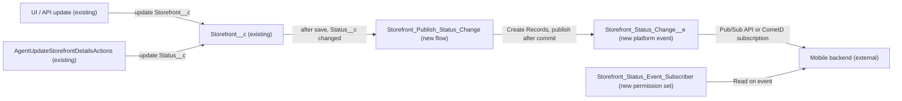

# Implementation spec — Storefront status change platform event

> Publish a platform event that carries the storefront Id, old status, and new status whenever `Storefront__c.Status__c` changes, so the mobile backend can hide closed restaurants without polling.

_Based on the requirement, the evidence reported by AskCoworker, and read-only org queries where noted. Assumptions and missing evidence are identified below. Specification only — nothing is implemented or deployed._

---

## 1. The requirement

When a storefront's `Status__c` changes, Salesforce publishes a custom platform event with the storefront Id, the old status, and the new status; the mobile backend subscribes to it and decides which statuses hide a restaurant (user decision). The request contained no deploy or data-change instruction.

| # | Responsibility | Trigger | Where it lives |
| --- | --- | --- | --- |
| 1 | Define the event and its payload (storefront Id, old status, new status) | Not applicable (definition) | `Storefront_Status_Change__e` with `Storefront_Id__c`, `Old_Status__c`, `New_Status__c` |
| 2 | Publish one event per storefront whose `Status__c` changed, from every write path (UI, API, `AgentUpdateStorefrontDetailsActions`) | Update of `Storefront__c` where `Status__c` is changed | `Storefront_Publish_Status_Change` (record-triggered flow) |
| 3 | Let the mobile backend's integration user subscribe to the event | Subscription by the mobile backend | `Storefront_Status_Event_Subscriber` (permission set); OAuth client and user assignment are outside this inventory (Section 8) |
| 4 | Hide closed restaurants in the mobile app | Receipt of the event | Mobile backend (outside Salesforce; not specified) |

## 2. Grounding — reuse before building

Target org: `TestWriteSpecDE` (Developer Edition, not a sandbox, org ID `00Dak00001COqNeEAL`). API version: `67.0`.

- **`Storefront__c`** (CustomObject, DurableId `01Iak00000Dx4JV`) — the storefront (restaurant) record whose status drives visibility. _verified by org query_
- **`Storefront__c.Status__c`** (Picklist, not restricted, nillable, no default) — values `Active`, `Inactive`, `Pending Activation`, `Suspended`, `Closed`. All 21 current records are `Active`. _verified by org query_
- **No existing event mechanism** — no custom platform event (`__e`) exists in the org, and `PlatformEventChannelMember` returns 0 rows, so no Change Data Capture entity is selected. _verified by org query_ AskCoworker's D1 claim that a platform event named like `Storefront_Status` may exist was contradicted. _verified by org query_
- **No automation on `Storefront__c`** — 0 Apex triggers, 0 flows with `Storefront__c` as trigger object, 0 validation rules. _verified by org query_
- **`AgentUpdateStorefrontDetailsActions`** (ApexClass, `with sharing`) — the only Apex class that writes `Storefront__c.Status__c` (`sf.Status__c = req.status; update sf;`); it does not call `EventBus.publish`. Found by searching all unmanaged Apex class bodies. _verified by org query_
- **Readers of `Storefront__c.Status__c`** — `MetadataComponentDependency` lists `AgentUpdateStorefrontDetailsActions`, `StorefrontPickerController` (read-only), and flow `Get_Partner_Quality_Watchlist` (autolaunched; record lookups only, no updates). None is changed by this spec. _verified by org query_
- **Edit access on `Storefront__c`** — permission sets `Agentforce_Reference_App` (unmanaged) and `sfdc_accelerate_dms` (namespace `sfdcInternalInt`, type Session, not editable), and the System Administrator profile. These are the human and agent write paths the flow must cover. _verified by org query_
- **OAuth clients** — Connected Apps are only standard ones (Dataloader, Workbench, and similar); External Client Apps are `Pronto_MCP_Access` and `Claude_Code_Access`. None is identified as the mobile backend. _verified by org query_
- **Name availability** — no permission set `Storefront_Status_Event_Subscriber` and no flow `Storefront_Publish_Status_Change` exist. _verified by org query_
- **Data 360** — `SELECT COUNT() FROM DataStream` returns 0. _verified by org query_

Evidence sources: Tooling `EntityDefinition`, `CustomObject`, `CustomField`, `ApexTrigger`, `ValidationRule`, `ApexClass` bodies, `MetadataComponentDependency`, `Flow.Metadata`, `PlatformEventChannelMember`, `ExternalClientApplication`, `ConnectedApplication`; standard `FlowDefinitionView`, `ObjectPermissions`, `FieldPermissions`, `PermissionSet`, `Organization`, `DataStream`, and a `GROUP BY` on `Storefront__c.Status__c`; `sf sobject describe Storefront__c`. AskCoworker returned no citedReferences.

## 3. Architecture

Why the pieces are drawn this way:

1. `Storefront__c` is updated from the UI or API by users with Edit (`Agentforce_Reference_App`, System Administrator) and by `AgentUpdateStorefrontDetailsActions`. _verified by org query_
2. A record-triggered after-save flow fires on every DML path, so one publisher covers all writers. Changing `AgentUpdateStorefrontDetailsActions` alone would miss UI and API updates. _assumption (documented platform behavior)_
3. A declarative flow is used instead of Apex. After-save record-triggered flows support `ISCHANGED({!$Record.Status__c})` in the entry formula and `{!$Record__Prior.Status__c}` for the old value, and can publish a platform event with a Create Records element. AskCoworker proposed an Apex trigger on the grounds that flows cannot compare old picklist values; that contradicts documented flow behavior, so the proposal was reshaped (Section 8). _assumption (documented platform behavior)_
4. The event uses Publish After Commit, so a rolled-back transaction delivers no event. _assumption (documented platform behavior)_
5. The mobile backend is external. Its OAuth client and integration user are not identified in the org. _verified by org query_ (absence among Connected Apps and External Client Apps); assignment is an open item in Section 8.

## 4. Metadata changes

**Event**

- **Create `Storefront_Status_Change__e`** — Platform event (CustomObject), label "Storefront Status Change", Event Type High Volume, Publish Behavior "Publish After Commit". Carries only the three payload fields below.
- **Create `Storefront_Status_Change__e.Storefront_Id__c`** — Text(18), required. The `Storefront__c` record Id (`{!$Record.Id}`).
- **Create `Storefront_Status_Change__e.Old_Status__c`** — Text(255), not required. `{!$Record__Prior.Status__c}`; blank when the prior value was blank (`Status__c` is nillable). Text rather than picklist because `Status__c` is not a restricted picklist and may hold values outside the defined list.
- **Create `Storefront_Status_Change__e.New_Status__c`** — Text(255), not required. `{!$Record.Status__c}`; blank when the status is cleared.

**Automation**

- **Create `Storefront_Publish_Status_Change`** — Record-triggered flow on `Storefront__c`, trigger "A record is updated", optimized for "Actions and Related Records" (after save). Entry condition formula `ISCHANGED({!$Record.Status__c})`, run "Every time a record is updated and meets the condition". One Create Records element on `Storefront_Status_Change__e` that sets `Storefront_Id__c`, `Old_Status__c`, and `New_Status__c` as above. No other elements. Runs in system context (default for record-triggered flows).

**Security**

- **Create `Storefront_Status_Event_Subscriber`** — Permission set, no license. Object permission Read on `Storefront_Status_Change__e` (required to subscribe). No other grants. To be assigned to the mobile backend's integration user (Section 8).

## 5. Data 360 (Data Cloud) data involved

Not applicable — this change does not use Data 360. The org has 0 data streams (_verified by org query_).

## 6. Security considerations

- **Execution context.** The flow runs in system context without sharing, so it publishes regardless of the updating user's sharing or event permissions. _assumption (documented platform behavior)_ `AgentUpdateStorefrontDetailsActions` runs `with sharing` (_verified by org query_); that governs its own update, not the flow.
- **CRUD/FLS on `Storefront__c`.** Unchanged. Edit on `Storefront__c` and `Storefront__c.Status__c` stays with `Agentforce_Reference_App`, `sfdc_accelerate_dms`, and the System Administrator profile; Read-only on `Status__c` stays with `Pronto_Deep_Dive_Workshop`, `sfdc_a360_sfcrm_data_extract`, and `sfdc_slack` (complete list from `ObjectPermissions` and `FieldPermissions`). _verified by org query_
- **Event access.** Only `Storefront_Status_Event_Subscriber` grants Read on `Storefront_Status_Change__e`. Users with "View All Data" or "Modify All Data" (for example System Administrator) can also subscribe. _assumption (documented platform behavior)_ No existing permission set is changed, and no grant is added to `sfdc_accelerate_dms` (not editable) or any connector permission set.
- **Data exposure.** The payload holds a record Id and two status strings only; no personal or financial data. Events are retained for 72 hours for replay. _assumption (documented platform behavior)_

## 7. Testing strategy

The inventory has no Apex, so no Apex test class is needed and none is added. All cases below are recommended verification in a non-production org; no tests have run.

1. **Happy path.** Change one storefront from `Active` to `Closed` in the UI. A subscriber receives one event with `Storefront_Id__c` = the record Id, `Old_Status__c` = `Active`, `New_Status__c` = `Closed`.
2. **No change.** Update only `Storefront__c.Phone__c`. No event is received.
3. **Agent path.** Change `Status__c` through `AgentUpdateStorefrontDetailsActions`. One event is received.
4. **Bulk.** Update 200 storefronts in one API call, half with a status change. Exactly the changed records publish one event each. The org has 21 storefronts, so the test creates its own records.
5. **Null transitions.** Clear `Status__c` on a record, then set it again. Events carry a blank `New_Status__c` and then a blank `Old_Status__c`.
6. **Rollback.** Cause an update transaction to fail after the flow runs (for example, a batch of records where one fails with all-or-none). No event is delivered. There is no validation rule on `Storefront__c` (_verified by org query_), so the failure must come from the test setup itself.
7. **Permission.** A user with `Storefront_Status_Event_Subscriber` can subscribe; a user without it and without "View All Data" is denied.
8. **Insert, delete, undelete.** Creating, deleting, or undeleting a storefront publishes no event (Section 8, item 2).

## 8. Open decisions

### Open

1. **Mobile backend OAuth client and integration user (blocking for delivery).** The event cannot reach the mobile backend until an OAuth client (Connected App or External Client App) and an integration user exist and the user has `Storefront_Status_Event_Subscriber`. None of the org's Connected Apps or External Client Apps is identified as the mobile backend (_verified by org query_). The user had no preference, so this spec defers the client, the user, and the permission set assignment to the mobile backend team; the metadata can be deployed without them.
2. **Insert, delete, and undelete do not publish (non-blocking).** The requirement says "status changes", so only updates publish. A new storefront created as `Closed`, or a deleted storefront, sends no event; the mobile backend must get the initial state from a query. Default: no change. Add a before-delete flow later if deletions must hide restaurants.
3. **Which statuses hide a restaurant (non-blocking).** The event publishes every change among `Active`, `Inactive`, `Pending Activation`, `Suspended`, and `Closed`. The mobile backend decides which values hide a restaurant (user decision); this does not change the inventory.
4. **Delivery limits and replay (non-blocking).** Developer Edition orgs have low daily platform event delivery allocations, and events are replayable for 72 hours. _assumption (documented platform behavior)_ Volume is small (21 storefronts, _verified by org query_). The mobile backend should resubscribe with a replay ID after outages.
5. **Deployment sequence (non-blocking).** Deploy `Storefront_Status_Change__e` and its three fields first, then `Storefront_Publish_Status_Change` and `Storefront_Status_Event_Subscriber`, then activate the flow, then assign the permission set to the integration user. No backfill is needed; all 21 records are `Active` (_verified by org query_).

### Resolved

- **Mechanism: custom platform event, not Change Data Capture.** User decision. CDC would publish every field change on `Storefront__c` and would not carry the old status value as a named field; no CDC selections exist today (_verified by org query_).
- **Payload: storefront Id, old status, new status; consumer: mobile backend.** User decision.
- **Subscriber permission: new dedicated permission set.** The user had no preference; recommended default taken. `sfdc_accelerate_dms` is managed and cannot be edited, and `Agentforce_Reference_App` serves agent users (_verified by org query_). _assumption_
- **Apex trigger replaced by a flow.** AskCoworker's Inventory proposed `StorefrontStatusChangeTrigger` and `StorefrontStatusChangeTriggerTest`, arguing that flows cannot compare old picklist values. After-save record-triggered flows support `ISCHANGED` and `$Record__Prior` on picklists, so Rule 4 (declarative first) applies; both Apex rows were removed. _assumption (documented platform behavior)_
- **Event type corrected.** AskCoworker listed the event as type PlatformEventChannel; a platform event is a CustomObject with suffix `__e`. Each payload field is listed as its own CustomField row.
- **Subscribe permission corrected.** AskCoworker named a permission `PermissionsSubscribeToEvents`; subscription to a custom platform event requires Read on the event object. _assumption (documented platform behavior)_
- **`Old_Status__c` not required.** AskCoworker proposed all three fields as required; `Status__c` is nillable (_verified by org query_), so the old and new values can be blank.
- **Existing platform event claim.** AskCoworker D1 reported a possible platform event named like `Storefront_Status`; no `__e` object exists (_verified by org query_).

## 9. Change set

| # | Action | Type | API name | Module | Why |
| --- | --- | --- | --- | --- | --- |
| 1 | Create | CustomObject | `Storefront_Status_Change__e` | force-app/main/default/objects | Platform event that carries the status change to the mobile backend |
| 2 | Create | CustomField | `Storefront_Status_Change__e.Storefront_Id__c` | force-app/main/default/objects | Identifies which storefront changed |
| 3 | Create | CustomField | `Storefront_Status_Change__e.Old_Status__c` | force-app/main/default/objects | Status before the change |
| 4 | Create | CustomField | `Storefront_Status_Change__e.New_Status__c` | force-app/main/default/objects | Status after the change |
| 5 | Create | Flow | `Storefront_Publish_Status_Change` | force-app/main/default/flows | Publishes one event per storefront whose `Status__c` changed, on every write path |
| 6 | Create | PermissionSet | `Storefront_Status_Event_Subscriber` | force-app/main/default/permissionsets | Lets the mobile backend integration user subscribe to the event |

A record-triggered after-save flow on `Storefront__c` publishes `Storefront_Status_Change__e` after commit whenever `Status__c` changes, and a dedicated permission set lets the mobile backend subscribe.

Total: 6 · Create: 6 · Update: 0 · Delete: 0
