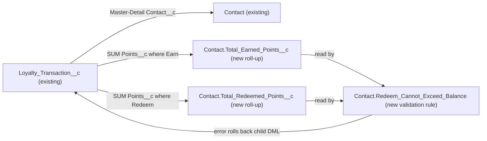

# Implementation spec — Loyalty redeem balance guard

> Block any Redeem loyalty transaction whose points exceed the customer's current net loyalty balance, so the balance never goes below zero.

_Based on the requirement, the evidence reported by AskCoworker, and read-only org queries where noted. Assumptions and missing evidence are identified below. Specification only — nothing is implemented or deployed._

---

## 1. The requirement

A `Loyalty_Transaction__c` with `Transaction_Type__c` = Redeem must be rejected when its `Points__c` exceed the Contact's net balance (sum of Earn points minus sum of Redeem points). The user confirmed that the goal is to block the insert of such a Redeem transaction and that `Points__c` is stored as a positive number for both Earn and Redeem (*user decision*). The request contained no deploy or data-change instruction.

| # | Responsibility | Trigger | Where it lives |
| --- | --- | --- | --- |
| 1 | Keep a per-Contact total of earned points | Insert, update, delete, undelete of `Loyalty_Transaction__c` | `Contact.Total_Earned_Points__c` (new roll-up) |
| 2 | Keep a per-Contact total of redeemed points | Insert, update, delete, undelete of `Loyalty_Transaction__c` | `Contact.Total_Redeemed_Points__c` (new roll-up) |
| 3 | Reject a Redeem that would take the net balance below zero, including several Redeems for one Contact in one DML | Parent `Contact` save caused by roll-up recalculation | `Contact.Redeem_Cannot_Exceed_Balance` (new validation rule) |

## 2. Grounding — reuse before building

Target org: `TestWriteSpecDE` (Developer Edition, `00Dak00001COqNeEAL`, not a sandbox). API version: `67.0`. _verified by org query; API version verified by project file_

- **`Loyalty_Transaction__c`** (CustomObject, no namespace) — the transaction record; sharing is `ControlledByParent`. 0 records exist. _verified by org query_
- **`Loyalty_Transaction__c.Contact__c`** (Master-Detail to `Contact`, not reparentable) — makes roll-up summaries on `Contact` possible. _verified by org query_
- **`Loyalty_Transaction__c.Points__c`** (Number(18,0), not required; description "The number of loyalty points involved in the transaction.") — the value summed. _verified by org query_
- **`Loyalty_Transaction__c.Transaction_Type__c`** (Picklist, values `Earn`, `Redeem`) — the roll-up filter. _verified by org query_ (AskCoworker reported only `Redeem`; see Section 8.)
- **`Contact`** (standard object, sharing `ReadWrite`) — the customer. Its custom fields are `Contact_Status__c`, `Favorite_Cuisine__c`, `Member_Number__c`, `Languages__c`, `Level__c`, `Pronto_App_Account_Id__c`, `Lifetime_Orders__c`, `Lifetime_Value__c`, `Loyalty_Tier__c`; none stores a points balance (complete list from Tooling `CustomField`). _verified by org query_
- **Existing automation**: 0 Apex triggers, 0 record-triggered flows, 0 validation rules on `Loyalty_Transaction__c` or `Contact`. No unmanaged Apex class body (70 classes searched) references `Loyalty_Transaction__c`, `Points__c`, or "redeem". `MetadataComponentDependency` shows only `Loyalty Transaction Layout` and `Contact Layout` referencing the object and its fields. _verified by org query_
- **Create/Edit on `Loyalty_Transaction__c`**: permission sets `Agentforce_Reference_App` and `sfdc_accelerate_dms`, and the System Administrator profile (complete `ObjectPermissions` list). _verified by org query_

Candidates examined and rejected: `Transaction__c` — unrelated object with no points or Contact link (_reported by AskCoworker_); `Contact.Lifetime_Value__c` and `Contact.Lifetime_Orders__c` — order metrics, not points (_verified by org query_ names and types); Salesforce Loyalty Management objects — no loyalty standard objects exist in `sf sobject list --sobject all` (_verified by org query_); a child-side validation rule on `Loyalty_Transaction__c` — misses several Redeems for the same Contact in one DML (see Section 3).

Evidence sources: `sobject describe` of `Loyalty_Transaction__c` and `Contact`; Tooling `CustomField` (org-wide name search and per-object lists, `Metadata` of `Points__c`, `Contact__c`, `Transaction_Type__c`); `ApexTrigger`; `FlowDefinitionView`; Tooling `ValidationRule`; `MetadataComponentDependency`; `ApexClass` bodies; `ObjectPermissions`; `EntityDefinition` sharing; record counts; `Organization`. AskCoworker returned no citedReferences.

## 3. Architecture

Why the pieces are drawn this way:

1. `Loyalty_Transaction__c.Contact__c` is a Master-Detail to `Contact`, so `Contact` can hold roll-up summaries of `Points__c`. _verified by org query_
2. Two filtered SUM roll-ups give earned and redeemed totals. Net balance = `Total_Earned_Points__c - Total_Redeemed_Points__c`, which is valid because both types store positive `Points__c`. _user decision_
3. When a child insert, update, delete, or undelete changes a roll-up, Salesforce recalculates it in the same transaction and saves the parent `Contact`, which runs the parent's validation rules; a validation error on the parent fails the child DML and rolls it back. _assumption (documented platform behavior: order of execution, roll-up summary step)_ **Load-bearing.**
4. The rule sits on `Contact`, not on `Loyalty_Transaction__c`, because the parent rule sees the recalculated totals after all records in the DML batch are counted. A child rule sees the pre-DML roll-up, so two Redeems for one Contact in one batch could each pass while their sum exceeds the balance. _assumption (documented platform behavior)_
5. Only declarative components are used; no Apex is needed. _assumption_

## 4. Metadata changes

**Data model**

- **Create `Contact.Total_Earned_Points__c`** — Roll-Up Summary, label "Total Earned Points". Summarized object `Loyalty_Transaction__c`, operation SUM of `Loyalty_Transaction__c.Points__c`, filter `Transaction_Type__c` equals `Earn`. Returns 0 when no matching child has a value (blank `Points__c` is ignored by SUM). Read-only. No layout placement and no new permission grant (see Section 8).
- **Create `Contact.Total_Redeemed_Points__c`** — Roll-Up Summary, label "Total Redeemed Points". Operation SUM of `Loyalty_Transaction__c.Points__c`, filter `Transaction_Type__c` equals `Redeem`. Returns 0 when no matching child has a value. Read-only. No layout placement and no new permission grant (see Section 8).

**Automation**

- **Create `Contact.Redeem_Cannot_Exceed_Balance`** — Validation rule, active. Error condition formula:
  `AND(Total_Redeemed_Points__c > PRIORVALUE(Total_Redeemed_Points__c), Total_Redeemed_Points__c > Total_Earned_Points__c)`.
  Error message (static text; validation rule messages do not support merge fields): "This redemption exceeds the customer's available loyalty points balance." Error location: top of page. The first condition limits the rule to saves that increase the redeemed total (Redeem insert, Redeem points increase, type change to Redeem, Redeem undelete), so it never blocks unrelated `Contact` edits. On a new Contact (`PRIORVALUE` returns the new value) the first condition is false, which is correct because a new Contact has no transactions. Deploy after the two roll-up fields.

## 5. Data 360 (Data Cloud) data involved

Not applicable — this change does not use Data 360. `sfdc_a360_sfcrm_data_extract` has Read on `Loyalty_Transaction__c` (_verified by org query_), and 0 data streams exist (_reported by AskCoworker_); the new `Contact` fields are not mapped anywhere.

## 6. Security considerations

- **Execution context:** Roll-up summaries and validation rules are evaluated by the platform for every caller, regardless of sharing, FLS, or the caller's permission sets. _assumption (documented platform behavior)_ The rule therefore applies equally to `Agentforce_Reference_App`, `sfdc_accelerate_dms`, System Administrators, and API loads. _verified by org query_ (list of creators)
- **Bypass:** A user cannot bypass the rule by editing the roll-up fields, which are read-only. A caller can avoid it only by recording a Redeem as `Earn` or with a negative `Points__c`; see Section 8.
- **CRUD/FLS:** No permission set or profile changes. The new fields receive no FLS grants in this spec; only profiles that get default FLS on deploy (for example System Administrator) will see them. Permission sets are not the only grant path; profiles also grant access.
- **Data exposure:** The totals are derived from records the user may not be able to see individually; if later exposed, they reveal aggregate points to anyone with Contact access and field FLS. Not exposed by this spec.

## 7. Testing strategy

No test component is in the inventory; all cases below are recommended verification in a sandbox or scratch org (declarative-only changes do not need Apex coverage). _assumption_

1. Earn 1,000 for a Contact: `Total_Earned_Points__c` = 1000, `Total_Redeemed_Points__c` = 0.
2. Redeem 500: succeeds (net 500).
3. Redeem 600: fails with the rule's message; `Total_Redeemed_Points__c` stays 500 and no child record is created.
4. Redeem exactly 500: succeeds (net 0, the boundary).
5. Redeem with blank `Points__c` or 0: succeeds; totals unchanged.
6. Bulk (same Contact): insert 2 Redeems of 300 each in one DML against net 500: the whole batch for that Contact fails. With `allOrNone = false`, every Redeem for that Contact in the batch fails, including rows that would pass alone.
7. Bulk (200 Contacts, each within balance): all succeed; each Contact is evaluated separately.
8. Update: raise a Redeem's `Points__c` above the balance, or change an Earn to Redeem so redeemed exceeds earned: fails.
9. Delete a Redeem, and change a Redeem to Earn: succeed.
10. Undelete a Redeem that would overdraw: fails and the record stays deleted.
11. Edit an unrelated `Contact` field (for example `Email`): succeeds.
12. Permission: repeat case 3 as a user with `Agentforce_Reference_App` and as one with `sfdc_accelerate_dms`: both are blocked.

## 8. Open decisions

### Open

1. **`PRIORVALUE` on roll-up summary fields (non-blocking).** The rule relies on `PRIORVALUE(Total_Redeemed_Points__c)` returning the pre-recalculation value during the roll-up-driven parent save. _assumption (documented platform behavior)_ **Load-bearing.** Confirm with verification cases 3 and 11. Fallback: drop the first condition (`Total_Redeemed_Points__c > Total_Earned_Points__c` only); this also blocks Earn deletions that overdraw and any Contact edit while a balance is negative.
2. **Earn deletions or Earn-to-lower edits (non-blocking).** Deleting an Earn record, or lowering its `Points__c`, can still make the net balance negative; it is not a Redeem and is outside the confirmed scope (*user decision*: block Redeem inserts). Recommended default: accept. Proposal: use the fallback formula in item 1 if the balance must never go negative from any path.
3. **Sign and type misuse (non-blocking).** The design depends on callers storing positive `Points__c` for Redeems (*user decision*). A Redeem with negative `Points__c` would raise the balance and pass. Proposal (not in inventory): a validation rule on `Loyalty_Transaction__c` requiring `Points__c > 0`.
4. **Visibility of the totals (non-blocking).** The requirement does not ask users to see the balance, so no FLS grant, layout, or FlexiPage placement is included. Recommended default if wanted later: a new dedicated permission set with Read on both fields, and a net-balance formula field; do not widen `Agentforce_Reference_App` or `sfdc_accelerate_dms`.
5. **Deployment sequence (non-blocking).** Deploy `Contact.Total_Earned_Points__c` and `Contact.Total_Redeemed_Points__c` before `Contact.Redeem_Cannot_Exceed_Balance`. No backfill is needed: 0 `Loyalty_Transaction__c` records exist today (_verified by org query_); re-run the count before deployment, and if records exist, check for Contacts where redeemed already exceeds earned.
6. **Concurrent redemptions (non-blocking).** Two separate transactions for the same Contact are serialized because Master-Detail child DML locks the parent `Contact`. _assumption (documented platform behavior)_

### Resolved

- AskCoworker reported that `Transaction_Type__c` has only the `Redeem` value; `sobject describe` and Tooling `CustomField.Metadata` show `Earn` and `Redeem`. The org query was used.
- *User decision:* scope is blocking a Redeem whose `Points__c` exceed the current net balance; `Points__c` is positive for both Earn and Redeem.
- *Assumption:* roll-ups plus a parent validation rule instead of a child validation rule or an Apex trigger, because only the parent rule sees the whole DML batch and it needs no code.
- *Assumption:* no net-balance formula field; the rule compares the two roll-ups directly.
- Corrections to AskCoworker proposals: the validation rule message used merge fields, which validation rules do not support (replaced with static text); the rule condition was narrowed with `PRIORVALUE` so Contact edits and Earn changes are not blocked; the claims that bulk roll-up recalculation is deferred asynchronously and that an undelete commits when the parent rule fails were rejected because roll-up summaries on Master-Detail relationships are recalculated in the same transaction and a parent error rolls back the child DML (_assumption (documented platform behavior)_); the proposal that missing FLS on the new fields is blocking was rejected because roll-ups and validation rules evaluate regardless of FLS.
- The R call timed out once and was resent as a runtime-only call; security, CRUD/FLS, and Data 360 were covered with org queries instead.

## 9. Change set

| # | Action | Type | API name | Module | Why |
| --- | --- | --- | --- | --- | --- |
| 1 | Create | CustomField | `Contact.Total_Earned_Points__c` | force-app/main/default/objects/Contact/fields | Roll-up of Earn points; input to the net balance |
| 2 | Create | CustomField | `Contact.Total_Redeemed_Points__c` | force-app/main/default/objects/Contact/fields | Roll-up of Redeem points; input to the net balance |
| 3 | Create | ValidationRule | `Contact.Redeem_Cannot_Exceed_Balance` | force-app/main/default/objects/Contact/validationRules | Rejects a Redeem that takes the net balance below zero, bulk-safe |

Two roll-up summaries on `Contact` feed one parent validation rule that fails any Redeem-driven save leaving earned points below redeemed points.

Total: 3 · Create: 3 · Update: 0 · Delete: 0
