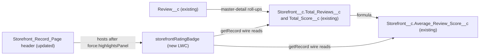

# Implementation spec — Storefront star-rating badge

> Show a star-rating badge with the average review score and the number of reviews near the top of the `Storefront__c` Lightning record page.

_Based on the requirement, the evidence reported by AskCoworker, and read-only org queries where noted. Assumptions and missing evidence are identified below. Specification only — nothing is implemented or deployed._

---

## 1. The requirement

Add a small Lightning web component to the header of the `Storefront_Record_Page` Lightning record page that shows stars, the average score, and the review count, reusing the existing `Storefront__c.Average_Review_Score__c` and `Storefront__c.Total_Reviews__c` fields. The user decided that "storefront page" means the `Storefront__c` Lightning record page and that the badge is a small LWC (user decision). The request contained no instruction to deploy or change data.

| # | Responsibility | Trigger | Where it lives |
| --- | --- | --- | --- |
| 1 | Compute the average score and the review count per storefront | Insert, update, delete, or undelete of `Review__c` (platform roll-up recalculation) | `Storefront__c.Total_Reviews__c`, `Storefront__c.Total_Score__c`, `Storefront__c.Average_Review_Score__c` (existing) |
| 2 | Render stars, the average score, and the review count as a badge; show "No reviews yet" when there are no reviews | Storefront record page load | `storefrontRatingBadge` (new LWC) |
| 3 | Place the badge near the top of the storefront page | Storefront record page load | `Storefront_Record_Page` header region, after `force:highlightsPanel` (updated FlexiPage) |

## 2. Grounding — reuse before building

Target org: `TestWriteSpecDE` (Developer Edition, not a sandbox). API version: `67.0`.

- **`Storefront__c`** (CustomObject) — the record the page shows. Internal OWD is `ReadWrite`, external OWD is `Private`. _verified by org query_
- **`Review__c`** (CustomObject) — one row per review; 92 records. `Review__c.Rating__c` is Number(1,0); no record has a rating below 1, above 5, or null. `Review__c.Status__c` (picklist `Submitted`, `Published`) is null on all 92 records. _verified by org query_
- **`Review__c.Storefront__c`** (Master-Detail to `Storefront__c`) — `reparentableMasterDetail` is false, so reviews cannot be moved to another storefront. _verified by org query_
- **`Storefront__c.Total_Reviews__c`** (Roll-Up Summary, COUNT of `Review__c`, no filter) — the review count to display. _verified by org query_
- **`Storefront__c.Total_Score__c`** (Roll-Up Summary, SUM of `Review__c.Rating__c`, no filter) — the input to the average. _verified by org query_
- **`Storefront__c.Average_Review_Score__c`** (Formula, Number, scale 1) — formula `Total_Score__c / Total_Reviews__c`, `formulaTreatBlanksAs` = `BlankAsZero`. Across 21 storefronts the values range from 1 to 4.6; the 2 storefronts with 0 reviews return null (division by zero). _verified by org query_
- **`Storefront_Record_Page`** (FlexiPage, RecordPage for `Storefront__c`, no namespace, template `flexipage:recordHomeTemplateDesktop`) — the `header` region holds only `force:highlightsPanel`. `Storefront__c.Total_Reviews__c` and `Storefront__c.Average_Review_Score__c` already appear as plain fields in the "Reviews" field section of the Details tab, so the requirement is partly met: the data exists but is not near the top and not shown as stars. _verified by org query_
- **Automation** — no Apex triggers, no record-triggered flows (`FlowDefinitionView`), and no validation rules on `Storefront__c` or `Review__c`. _verified by org query_
- **LWC** — no bundle named `storefrontRatingBadge`, `ratingBadge`, or `starRating` exists. The unmanaged bundles are listed in full; the only storefront-related one is `storefrontSelector`, an agent picker whose controller `StorefrontPickerController` reads `Storefront__c.Average_Review_Score__c`. _verified by org query_ AskCoworker reports that `storefrontSelector` is an agent disambiguation card, not a record page component. _reported by AskCoworker_
- **Other readers** — `StorefrontPickerController` and `AgentGetStorefrontsByAccountActions` reference `Average_Review_Score__c` (Apex body search, partial: only these two classes were searched). _verified by org query_ `AgentReviewActions` writes `Review__c` and `AgentSummarizeReviewsActions` computes its own average. _reported by AskCoworker_ The new component does not change any of them.
- **Field access** — Read FLS on `Storefront__c.Average_Review_Score__c` and `Storefront__c.Total_Reviews__c` exists in `Agentforce_Reference_App`, `Pronto_Deep_Dive_Workshop`, `sfdc_accelerate_dms`, `sfdc_a360_sfcrm_data_extract`, and `sfdc_slack` (complete list of `FieldPermissions` rows for these fields). _verified by org query_
- **Experience Cloud** — the org has three `Network` sites (`Customer Support`, `Merchant Support`, `ESW_Merchant_Service_Agent_1737676393072`), all `UnderConstruction`; none is named for storefronts. _verified by org query_
- **Compact layout** — no custom `CompactLayout` exists for `Storefront__c`. _verified by org query_
- **Unit tests** — the project runs `@salesforce/sfdx-lwc-jest` through `npm run test:unit` (`package.json`). _verified by project file read_

Evidence sources: `sf org display`; `sf sobject describe` of `Storefront__c` and `Review__c`; Tooling queries on `EntityDefinition`, `CustomField` (with `Metadata` for the two roll-ups, the formula, and the master-detail field), `ApexTrigger`, `ValidationRule`, `LightningComponentBundle`, `FlexiPage` (with `Metadata` for `Storefront_Record_Page`), `CompactLayout`, and `ApexClass` bodies; standard queries on `FlowDefinitionView`, `FieldPermissions`, `Network`, `Organization`, and aggregates on `Storefront__c` and `Review__c`. AskCoworker returned no citedReferences.

## 3. Architecture

Why the pieces are drawn this way:

1. `Review__c` feeds `Storefront__c.Total_Reviews__c` (COUNT) and `Storefront__c.Total_Score__c` (SUM) through the master-detail roll-ups, and `Storefront__c.Average_Review_Score__c` divides one by the other. All three exist and are reused unchanged. _verified by org query_
2. `storefrontRatingBadge` reads the two display fields with the Lightning Data Service `getRecord` wire adapter using the page's `recordId`. No Apex controller is needed because the values already exist on the record. _assumption (documented platform behavior)_ for the wire adapter; the design choice is from AskCoworker's proposal and the user decision.
3. Code (an LWC) is used instead of a declarative option because a standard record page cannot render a star graphic with a count as one badge: moving the existing fields into the header shows plain numbers only, and a text formula of star characters would show no count styling. The user asked for a small LWC. _user decision_
4. `Storefront_Record_Page` is updated to place the component in its `header` region directly after `force:highlightsPanel`, which is the top of the page. _verified by org query_ (current header content)

## 4. Metadata changes

**UI**

- **Create `storefrontRatingBadge`** — LightningComponentBundle exposed for `lightning__RecordPage` on `Storefront__c`, with `@api recordId`. It wires `getRecord` for `Storefront__c.Average_Review_Score__c` and `Storefront__c.Total_Reviews__c`. It renders five star icons (filled up to the average rounded to the nearest whole star), the average with one decimal (for example "4.3"), and the count ("1 review" or "N reviews"). When `Storefront__c.Total_Reviews__c` is 0 or null, or `Storefront__c.Average_Review_Score__c` is null, it renders "No reviews yet" and no stars. On a wire error it renders nothing. The bundle includes the Jest test `__tests__/storefrontRatingBadge.test.js`. No Apex.
- **Update `Storefront_Record_Page`** — add `c:storefrontRatingBadge` to the `header` region directly after `force:highlightsPanel`. No other region or component changes. Leave the existing "Reviews" field section in the Details tab as it is.

## 5. Data 360 (Data Cloud) data involved

Not applicable — this change does not use Data 360. It adds no fields, data streams, or grants; the existing `sfdc_a360_sfcrm_data_extract` field access is unchanged. _verified by org query_ (FieldPermissions)

## 6. Security considerations

- **Execution context:** the component has no Apex. `getRecord` runs as the viewing user and enforces that user's record sharing, object access, and FLS. _assumption (documented platform behavior)_
- **Sharing:** `Storefront__c` internal OWD is `ReadWrite`, so internal users who can open the page can read the record. _verified by org query_
- **CRUD/FLS:** Read FLS on both display fields exists in `Agentforce_Reference_App`, `Pronto_Deep_Dive_Workshop`, `sfdc_accelerate_dms`, `sfdc_a360_sfcrm_data_extract`, and `sfdc_slack`. _verified by org query_ Profiles and permission set groups can also grant access; profile FLS was not listed separately. A user who can open the record but lacks FLS on a field listed in `fields` gets a wire error, and the component renders nothing. _assumption (documented platform behavior)_
- **Permission sets:** no changes. The requirement does not ask for new access.
- **Data exposure:** the badge shows only two aggregate values that already appear on the same page in the Details tab. It shows no reviewer identity, comments, or individual ratings. _verified by org query_ (current page content)

## 7. Testing strategy

Jest tests in `storefrontRatingBadge/__tests__/storefrontRatingBadge.test.js`, run with `npm run test:unit`, using the `getRecord` wire test adapter:

1. Average 4.3 and 21 reviews: renders 4 filled stars, "4.3", and "21 reviews".
2. Rounding: average 3.5 renders 4 filled stars; average 3.4 renders 3 filled stars.
3. Maximum: average 5.0 renders 5 filled stars.
4. Singular: 1 review renders "1 review".
5. No reviews: `Total_Reviews__c` = 0 and `Average_Review_Score__c` = null renders "No reviews yet" and no stars (matches the 2 storefronts with 0 reviews in the org).
6. Null count: `Total_Reviews__c` = null renders "No reviews yet" without an exception.
7. Wire error: an emitted error renders nothing and throws no exception.
8. No data yet: before the wire emits, the component renders nothing and throws no exception.

Bulk: not applicable to the component, which reads one record. Roll-up recalculation on bulk `Review__c` changes is platform behavior and is not tested here. Reparenting cannot occur (`reparentableMasterDetail` is false). _verified by org query_

Recommended verification (manual, no planned automated test):

1. Open a `Storefront__c` record with reviews: the badge appears directly under the highlights panel and matches the "Reviews" section values.
2. Open one of the 2 storefronts with 0 reviews: the badge shows "No reviews yet".
3. Add and then delete a review, reloading the page each time: the count and average change accordingly, and the badge returns to the prior values after an undelete.
4. Open the page as a user whose access comes only from `Pronto_Deep_Dive_Workshop`: the badge renders.

## 8. Open decisions

### Open

1. **Star rounding and half stars (non-blocking).** The requirement does not say how to draw partial scores. AskCoworker proposed half stars rounded to the nearest 0.5 and marked it blocking; it does not change the inventory. Default: whole stars rounded to the nearest integer (`Math.round`), because the exact average is shown as a number next to the stars. _assumption_
2. **Star icon (non-blocking).** Default: `lightning-icon` with `utility:favorite`, filled and empty variants styled by CSS in the bundle. _assumption_
3. **Missing FLS behavior (non-blocking).** Default: request both fields in `fields`, so a user without FLS sees no badge rather than a false "No reviews yet". Using `optionalFields` instead would show "No reviews yet" to such users. _assumption_
4. **Refresh after a new review in the same session (non-blocking).** The badge reflects Lightning Data Service cached values; after a review is added from another component it may update only on reload. The requirement does not ask for live refresh, so none is added. _assumption (documented platform behavior)_
5. **Page activation (non-blocking).** FlexiPage activation assignments (org default, app, record type, profile) cannot be read with the allowed commands. The spec assumes `Storefront_Record_Page` is the page users see for `Storefront__c`; if another page or assignment is active, add the component there instead. _assumption_
6. **Deployment sequence (non-blocking).** Deploy `storefrontRatingBadge` before or with `Storefront_Record_Page`, because the page references the component. Retrieve the current `Storefront_Record_Page` before editing so the only difference is the new header item.

### Resolved

- **Which page and what form (user decision).** "Storefront page" is the `Storefront__c` Lightning record page, and the badge is a small LWC showing stars, the average, and the count. Experience Cloud pages are out of scope; none of the three `Network` sites is a storefront site. _user decision_; _verified by org query_ (Network)
- **Permission set row dropped.** AskCoworker's inventory included a Conditional Update of `Agentforce_Reference_App` to grant Read FLS on the two fields. `FieldPermissions` shows the grant already exists, so the row was removed. _verified by org query_
- **Null average cause corrected.** AskCoworker attributed the null average to "blanks as zero". The formula divides by `Total_Reviews__c`, which is 0 for those records, so the null comes from division by zero; `Total_Score__c` and `Total_Reviews__c` are 0, not blank. _verified by org query_
- **Reparenting.** AskCoworker said master-detail reparenting is not supported by the platform. It is supported when enabled; here `reparentableMasterDetail` is false, so it cannot occur. _verified by org query_
- **Zero average with reviews.** AskCoworker proposed a test for an average of 0 with reviews. No `Review__c.Rating__c` is below 1 or null, so the average is at least 1 whenever there are reviews; the test was dropped. _verified by org query_
- **Rounding test inconsistency.** AskCoworker's T4 said 3.8 "rounds to 4.0" but expected 3 full stars and a half star. Replaced by the rounding tests in Section 7 under the default in Open item 1.
- **Unrequested behavior not added.** A validation rule for the 1 to 5 rating range, live refresh, and reuse of `storefrontSelector` were proposed or mentioned by AskCoworker but are not required; they are not in the inventory.

## 9. Change set

| # | Action | Type | API name | Module | Why |
| --- | --- | --- | --- | --- | --- |
| 1 | Create | LightningComponentBundle | `storefrontRatingBadge` | force-app/main/default/lwc/storefrontRatingBadge | Renders stars, the average score, and the review count from existing `Storefront__c` fields |
| 2 | Update | FlexiPage | `Storefront_Record_Page` | force-app/main/default/flexipages | Places the badge in the header region after the highlights panel, near the top of the page |

A new LWC reads the existing roll-up and formula fields through Lightning Data Service and sits in the header of the existing storefront record page.

Total: 2 · Create: 1 · Update: 1 · Delete: 0
