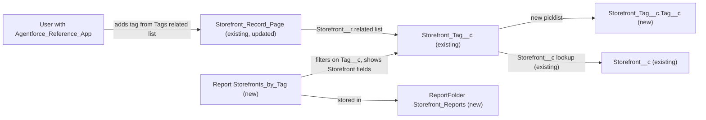

# Implementation spec — Storefront tag picklist and filter storefronts by tag

> Give `Storefront_Tag__c` a controlled tag value (Vegan, Late Night, Family Friendly, Halal, Kosher) and let users list the storefronts that carry a given tag.

_Based on the requirement, the evidence reported by AskCoworker, and read-only org queries where noted. Assumptions and missing evidence are identified below. Specification only — nothing is implemented or deployed._

---

## 1. The requirement

The original request was "storefront tags - make them useful". The user clarified it: add a Tag picklist with the values Vegan, Late Night, Family Friendly, Halal, and Kosher on Storefront Tag, and let users filter storefronts by tag (_user decision_). The request contained no deploy or data-change instruction.

| # | Responsibility | Trigger | Where it lives |
| --- | --- | --- | --- |
| 1 | Record each tag as one of five controlled values | User creates or edits a Storefront Tag | `Storefront_Tag__c.Tag__c`, `Storefront_Tag__c-Storefront Tag Layout` |
| 2 | Show each storefront's tag values on the storefront page | User opens a Storefront record | `Storefront_Record_Page` (Tags related list) |
| 3 | Filter storefronts by tag | User runs the report and sets the Tag filter | `Storefront_Reports/Storefronts_by_Tag` |
| 4 | Give tag users access to the new field | Permission set assignment | `Agentforce_Reference_App` |

## 2. Grounding — reuse before building

Target org: `TestWriteSpecDE` (Developer Edition, `00Dak00001COqNeEAL`, not a sandbox). API version: `67.0`.

- **`Storefront_Tag__c`** (CustomObject) — the existing tag object. Its only custom field is `Storefront__c`. `Name` is Text(80), labeled "Tag", not Auto Number. It holds 0 records. _verified by org query_
- **`Storefront_Tag__c.Storefront__c`** (CustomField) — Lookup to `Storefront__c`, nillable, relationship name `Storefront__r`, no cascade delete. _verified by org query_
- **`Storefront__c`** (CustomObject) — the filtered entity. It has no tag field. It has 21 records (_reported by AskCoworker_). _verified by org query (fields)_
- **`Storefront__c.Cuisine__c`** (CustomField) — a single-select picklist whose values include Vegan and Halal. _verified by org query_
- **`Storefront_Record_Page`** (FlexiPage) — the Storefront record page. It uses Dynamic Forms field sections and already has a dynamic related list labeled "Tags" on `Storefront__r` with no columns set. _verified by org query_
- **`Storefront_Tag__c-Storefront Tag Layout`** (Layout) — shows `Name` and `OwnerId` only. No FlexiPage exists for `Storefront_Tag__c`, so this layout drives the tag record page. _verified by org query_
- **`Agentforce_Reference_App`** (PermissionSet, custom, Regular, 1 assignment) — the only editable permission set that grants CRUD on `Storefront_Tag__c`. _verified by org query_
- **Automation:** no Apex triggers, record-triggered flows, or validation rules on `Storefront_Tag__c` or `Storefront__c`. No unmanaged Apex class body (70 classes) mentions `Storefront_Tag__c`. `MetadataComponentDependency` returns no references to the object. _verified by org query_
- **Reporting:** no report with "Storefront" in its name exists, and no existing report folder is about storefronts. _verified by org query_

Candidates examined and rejected:
- `Storefront__c.Cuisine__c`: it holds one cuisine per storefront and cannot hold several attributes such as Late Night and Family Friendly.
- `Storefront_Tag__c.Name`: free text, and a Name field cannot be a picklist.
- `sc_ext__Tag__c`, `sc_ext__Tag_Assignment__c`, the `shield_ext` copies, and `DAL_Tag`/`DAL_TagAssignment`: these are managed security-package components in the `sc_ext` and `shield_ext` namespaces, not storefront tags.
- No global value set exists to reuse.

Evidence sources: `sf sobject list`; `sf sobject describe` on both objects; Tooling `CustomField`, `EntityDefinition`, `ApexTrigger`, `ValidationRule`, `Layout.Metadata`, `FlexiPage.Metadata`, `LightningComponentBundle`, `MetadataComponentDependency`, `ApexClass` bodies; standard `FlowDefinitionView`, `ObjectPermissions`, `FieldPermissions`, `PermissionSet`, `PermissionSetAssignment`, `TabDefinition`, `ListView`, `Report`, `Folder`, `DataStream`. AskCoworker returned no citedReferences.

## 3. Architecture

Why the pieces are drawn this way:

1. `Storefront_Tag__c` already links tags to storefronts through `Storefront__c`, so a new picklist on it gives the controlled value without a new object. _verified by org query_
2. The Tags related list already exists on `Storefront_Record_Page`. Adding the `Tag__c` column makes tag values visible where users create tags. _verified by org query_
3. A list view on `Storefront__c` cannot filter on child records, and `Storefront_Tag__c` has no tab. A report on the standard `Storefront_Tag__c` report type can filter on `Tag__c` and show the lookup parent's fields. _assumption (documented platform behavior)_
4. The design is fully declarative. It adds no Apex and no flows.

## 4. Metadata changes

**Data model**

- **Create `Storefront_Tag__c.Tag__c`** — Picklist, label "Tag Value", restricted to the value set: `Vegan`, `Late Night`, `Family Friendly`, `Halal`, `Kosher`. Not universally required, so access is granted through permission sets. No default value. 0 existing records, so no backfill is needed.

**UX**

- **Update `Storefront_Tag__c-Storefront Tag Layout`** — Add `Tag__c` to the Information section as Required, above `OwnerId`. Keep `Name`, because it is required and cannot be removed.
- **Update `Storefront_Record_Page`** — On the existing "Tags" dynamic related list (`Storefront__r`), set the columns (`relatedListFieldAliases`) to `Name` and `Tag__c`.

**Reporting**

- **Create `Storefront_Reports`** — ReportFolder. Label "Storefront Reports". Share it read-only with the users who hold `Agentforce_Reference_App`. The exact share target is a deployment choice; see Section 8.
- **Create `Storefront_Reports/Storefronts_by_Tag`** — Conditional: Allow Reports is enabled on `Storefront_Tag__c`. Tabular report on the standard `Storefront_Tag__c` report type (`CustomEntity$Storefront_Tag__c`). Columns: `Tag__c`, `Storefront__c` (name), `Storefront__c.Cuisine__c`, `Storefront__c.Status__c`, `Storefront__c.Type__c`. Filter: `Tag__c` equals `Vegan` (default); users change the filter value when running the report. Scope: all records the user can see.

**Security**

- **Update `Agentforce_Reference_App`** — Add field permissions for `Storefront_Tag__c.Tag__c`: Read and Edit. The object permissions do not change.

## 5. Data 360 (Data Cloud) data involved

Not applicable — this change does not use Data 360. The org has 0 `DataStream` records (_verified by org query_).

## 6. Security considerations

- **Execution context:** there is no automation. All reads and writes run as the user, and the platform enforces sharing, CRUD, and FLS. Reports run with the running user's sharing and FLS. _assumption (documented platform behavior)_
- **CRUD:** unchanged. `Agentforce_Reference_App`, `sfdc_accelerate_dms`, and the System Administrator profile have CRUD on `Storefront_Tag__c`. `sfdc_slack`, `sfdc_a360_sfcrm_data_extract`, and the Analytics Cloud Integration User profile have Read. `Pronto_Deep_Dive_Workshop` has Read on `Storefront__c` only. _verified by org query (complete list of ObjectPermissions rows)_
- **FLS for `Tag__c`:** Read and Edit go to `Agentforce_Reference_App` only.
  - The `sfdcInternalInt` session permission sets (`sfdc_accelerate_dms`, `sfdc_slack`, `sfdc_a360_sfcrm_data_extract`) are namespaced and cannot be edited, and no responsibility needs them. _verified by org query_
  - Profiles, including System Administrator, get no grant. A metadata deploy gives a new field no profile FLS unless the profile is included. _assumption (documented platform behavior)_ See Section 8.
  - A permission set is not the only grant path; profiles and other permission sets can also grant the field.
- **Data exposure:** tag values are low-sensitivity descriptive attributes. The report shows tags and the `Storefront__c` fields that the running user can already see. The folder share controls who can open it.
- AskCoworker said `Agentforce_Reference_App` "runs with sharing" and that System Administrators bypass FLS. Both claims are wrong: a permission set has no sharing mode, and profile FLS still applies. See Section 8.

## 7. Testing strategy

The inventory is declarative, so there are no Apex tests or Flow Tests. The checks below are recommended verification to run after deployment.

1. **Controlled values:** as an `Agentforce_Reference_App` user, create a Storefront Tag from a Storefront's Tags related list. Only the five values are offered. Saving through the UI without a value fails, because the field is required on the layout.
2. **Restricted picklist (load-bearing):** an API insert with `Tag__c = 'Gluten Free'` fails with a bad-value error.
3. **API blank value:** an API insert with a blank `Tag__c` succeeds, because the field is not universally required. Record this as expected behavior.
4. **Related list:** the Tags related list on `Storefront_Record_Page` shows the `Name` and `Tag__c` columns.
5. **Filter (load-bearing):** create tags Vegan and Halal on two different storefronts and a Vegan tag on a third. Run `Storefronts_by_Tag` with the filter Vegan: exactly two storefronts appear. Change the filter to Halal: one appears.
6. **Report type availability (load-bearing):** confirm that the `Storefront_Tag__c` report type appears in the report builder and includes the Storefront lookup fields. This confirms the Allow Reports condition.
7. **Permission negative:** a user without `Agentforce_Reference_App` and without profile FLS cannot see `Tag__c` on the page or in the report.
8. **Bulk:** a Data Loader insert of 200 tags with valid values succeeds. There is no automation to limit it.
9. **Parent delete:** delete a Storefront that has tags. The tags remain with a blank `Storefront__c`, because the lookup has no cascade delete, and they appear in the report without a storefront.

## 8. Open decisions

### Open

1. **Allow Reports on `Storefront_Tag__c` (blocking).** Row 5 is Conditional on it. `CustomObject.Metadata` could not be queried (the Tooling query rejected the `Metadata` column). Retrieve the object before deploying. If `enableReports` is false, add an Update of the `Storefront_Tag__c` CustomObject that sets it to true. Recommended default: check and enable it.
2. **Report folder sharing (non-blocking).** Folder shares cannot target a permission set. Recommended default: share with a public group or role that contains the `Agentforce_Reference_App` holders; the owner chooses the group.
3. **Profile FLS (non-blocking).** System Administrator and other profile users get no FLS on `Tag__c`. Recommended default: admins who need it are assigned `Agentforce_Reference_App`. Other permission sets are not widened.
4. **Integrations (non-blocking).** `sfdc_accelerate_dms`, `sfdc_slack`, `sfdc_a360_sfcrm_data_extract`, and the Analytics Cloud Integration User profile will not see `Tag__c`. No responsibility needs them to. The session sets cannot be edited, so granting them would need a separate permission set. This spec does not add one.
5. **`Name` is redundant free text labeled "Tag" (non-blocking, proposal).** With 0 records, `Name` could be converted to Auto Number, or relabeled to "Tag Name", to avoid confusion. This is not in the inventory because it was not requested.
6. **Duplicate tags per storefront (non-blocking, proposal).** Nothing prevents two "Vegan" tags on one storefront. Duplicates do not break filtering. Prevention would need a flow or a unique key field; it is not in the inventory.
7. **Deployment sequence and setup (non-blocking).** Deploy row 1 first, then rows 2, 3, and 6 together, then rows 4 and 5. The target users must hold `Agentforce_Reference_App`; it has 1 assignment today. `Storefront_Record_Page` activation cannot be read; confirm it is the active Storefront page. Check reports and list views for the new field after deployment.

### Resolved

- **Scope (user decision):** the user gave the picklist values and chose "filter storefronts by tag" as the purpose.
- **Filter mechanism (assumption):** a report on the tag object, because `Storefront__c` list views cannot filter on child records and no `Storefront_Tag__c` tab exists. Rejected alternatives: an LWC (code), a multi-select field on `Storefront__c` (duplicates the tag object), and one report per value.
- **Restricted picklist (assumption):** the requirement asks for a controlled list. AskCoworker proposed an unrestricted list; that proposal was rejected.
- **Label "Tag Value" (assumption):** avoids a duplicate "Tag" label, since `Name` is already labeled "Tag".
- **Not universally required (assumption):** keeps FLS least-privilege through the permission set. The layout makes the field required for UI entry.
- **AskCoworker corrections:**
  - It stated in T that `Name` is Auto Number; describe shows Text(80), not Auto Number.
  - It marked the standard report type as `[Verified: prior session]`; this is not verifiable and became the Conditional in Open item 1.
  - It said report filters are "parameterised at run time"; the report has a default filter that users edit.
  - It said the permission set "runs with sharing" and that admins bypass FLS; both are wrong.
  - It proposed adding FLS to the non-editable `sfdcInternalInt` sets (dropped, Open item 4).
  - It proposed a VLOOKUP duplicate rule, which is not valid for this case (dropped).

## 9. Change set

| # | Action | Type | API name | Module | Why |
| --- | --- | --- | --- | --- | --- |
| 1 | Create | CustomField | `Storefront_Tag__c.Tag__c` | force-app/main/default/objects/Storefront_Tag__c/fields | Controlled tag values (responsibility 1) |
| 2 | Update | Layout | `Storefront_Tag__c-Storefront Tag Layout` | force-app/main/default/layouts | Let users set the tag value (responsibility 1) |
| 3 | Update | FlexiPage | `Storefront_Record_Page` | force-app/main/default/flexipages | Show tag values on the storefront page (responsibility 2) |
| 4 | Create | ReportFolder | `Storefront_Reports` | force-app/main/default/reports/Storefront_Reports | Shared home for the report |
| 5 | Create | Report | `Storefront_Reports/Storefronts_by_Tag` | force-app/main/default/reports/Storefront_Reports | Filter storefronts by tag (responsibility 3) |
| 6 | Update | PermissionSet | `Agentforce_Reference_App` | force-app/main/default/permissionsets | Read and Edit FLS on `Tag__c` (responsibility 4) |

A restricted picklist on the existing tag object, shown on the existing Tags related list and filtered through one report.

Total: 6 · Create: 3 · Update: 3 · Delete: 0
