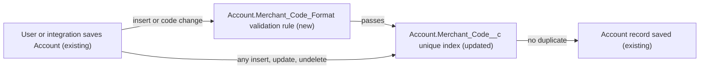

# Implementation spec — Unique 8-character Merchant Code on Account

> Make `Account.Merchant_Code__c` unique across accounts and, when it is filled in, exactly 8 letters or digits.

_Based on the requirement, the evidence reported by AskCoworker, and read-only org queries where noted. Assumptions and missing evidence are identified below. Specification only — nothing is implemented or deployed._

---

## 1. The requirement

The existing `Account.Merchant_Code__c` field must hold unique values, and a code must be exactly 8 characters. The user decided that the field stays optional and that the 8 characters are letters or digits only (`A-Z`, `a-z`, `0-9`) (_user decision_). The request contained no deploy or data-change instruction.

| # | Responsibility | Trigger | Where it lives |
| --- | --- | --- | --- |
| 1 | No two accounts share a Merchant Code | Account insert, update, and undelete through any channel | `Account.Merchant_Code__c` (unique attribute) |
| 2 | A Merchant Code, when present, is exactly 8 letters or digits | Account insert, or update that changes the code | `Account.Merchant_Code_Format` (validation rule) |
| 3 | Accounts without a code still save | Any Account save | `Account.Merchant_Code_Format` (skips blank values); field stays not required |

## 2. Grounding — reuse before building

Target org: `TestWriteSpecDE` (Developer Edition, not a sandbox, org ID `00Dak00001COqNeEAL`). API version: `67.0`. _verified by org query and verified by project file (`sfdx-project.json`, `.sf/config.json`)_

- **`Account.Merchant_Code__c`** (CustomField) — the field the requirement names. Label "Merchant Code", description "Merchant identity code", Text(10), `unique` false, `required` false, `externalId` false. _verified by org query_ (describe and Tooling `CustomField.Metadata`, Id `00Nak00004nK0SqEAK`)
- **Current data** — 200 Accounts; 10 have a Merchant Code; all 10 values are distinct and all are 10 characters long, so none meets the 8-character rule today. The 10 values are lowercase letters and digits, so they are also distinct when case is ignored. _verified by org query_ (GROUP BY on `Merchant_Code__c`)
- **Automation on `Account`** — no validation rules, no Apex triggers, and no record-triggered flows. _verified by org query_ (Tooling `ValidationRule`, Tooling `ApexTrigger`, `FlowDefinitionView`)
- **Readers and writers of `Account.Merchant_Code__c`** — no `MetadataComponentDependency` rows reference the field, no unmanaged Apex class body (70 classes searched) mentions it, and no file under `force-app` mentions it. Managed-package Apex bodies are hidden and could not be searched. _verified by org query; verified by project file_
- **Field-level access (complete list of `FieldPermissions` rows)** — Edit: `sfdc_accelerate_dms`. Read only: `sfdc_a360_sfcrm_data_extract`, `sfdc_slack`, `Agentforce_Reference_App`, `Pronto_Deep_Dive_Workshop`. No profile has a `FieldPermissions` row for the field. _verified by org query_
- **Data 360** — `SELECT COUNT() FROM DataStream` returns 0. _verified by org query_

Candidates examined and rejected: `Account.AccountNumber` and `Account.External_Id__c` — generic identifiers, not the merchant code (_verified by org query_: Text(40) and Text(255)); `Onboarding_Application__c.Merchant_Business_Name__c` and `Lead.Merchant_Comments__c` — different concepts; `ssot` Data 360 fields such as `MerchantCategoryCode` — data model object fields, not the Account merchant code; `AccountRule` Apex classes — they belong to the managed packages `sc_ext` and `shield_ext` (_verified by org query_), not to merchant codes; a Duplicate Rule — the unique attribute already blocks exact duplicates on every channel.

Evidence sources: `sf org display`; Account describe; Tooling `CustomField` (name search across all objects, and `Metadata` by Id); `FieldDefinition` by label; `sf sobject list --sobject custom`; Tooling `ValidationRule`, `ApexTrigger`, `ApexClass` (bodies), `MetadataComponentDependency`; `FlowDefinitionView`; `FieldPermissions`; `Organization`; `DataStream`; aggregate queries on `Account`. AskCoworker (D1, D2, I, R, T) returned no citedReferences.

## 3. Architecture

Why the pieces are drawn this way:

1. Both constraints are declarative; no Apex is needed. The unique attribute blocks duplicates at the database level for UI, API, Apex, and bulk loads, which a validation rule cannot do because it cannot see other records. _assumption (documented platform behavior)_
2. The validation rule checks format and length. It runs on insert and on updates that change the code, so the 10 existing 10-character codes do not block unrelated edits. _user decision_ (format, optional field); _assumption_ (grandfathering, user had no preference)
3. Validation rules run before the database commit, and the unique check runs at commit, so a record with a bad format fails on the validation rule first. _assumption (documented platform behavior)_
4. Validation rules run for all callers regardless of profile or permission set. _assumption (documented platform behavior)_

## 4. Metadata changes

**Data model**

- **Update `Account.Merchant_Code__c`** — set `unique` to true with `caseSensitive` false (so `ABC12345` and `abc12345` are duplicates). Keep type Text, length 10, `required` false, `externalId` false, label and description unchanged. Length stays 10 so the 10 existing 10-character values are not truncated. Blank values remain allowed and do not count as duplicates.

**Data quality**

- **Create `Account.Merchant_Code_Format`** — active validation rule. Error condition formula: `AND(NOT(ISBLANK(Merchant_Code__c)), OR(ISNEW(), ISCHANGED(Merchant_Code__c)), NOT(REGEX(Merchant_Code__c, "[A-Za-z0-9]{8}")))`. `REGEX` must match the whole value, so the pattern means exactly 8 ASCII letters or digits. Error location: field `Merchant_Code__c`. Error message: "Merchant Code must be exactly 8 letters or digits (A-Z, a-z, 0-9)." Blank handling: a blank code makes the condition false, so the rule does not fire. The formula is far below the 3,900-character limit.

## 5. Data 360 (Data Cloud) data involved

Not applicable — this change does not use Data 360. The org has 0 data streams (_verified by org query_).

## 6. Security considerations

- Execution context: the validation rule and the unique check apply to every save, in user and system context, including Apex, flows, the API, and bulk loads. _assumption (documented platform behavior)_
- CRUD/FLS: no change. Only `sfdc_accelerate_dms` has field Edit on `Account.Merchant_Code__c`; four permission sets have Read only; no profile has a field permission row (_verified by org query_). Permission sets are not the only grant path: Apex running in system mode can write the field regardless of FLS, and the constraints still apply to it. _assumption (documented platform behavior)_
- Permission sets: none created or changed. The requirement asks for no new access.
- Data exposure: unchanged. No field becomes visible to anyone new. The duplicate error message can reveal that another account already uses a code, even to a user who cannot see that account. _assumption (documented platform behavior)_ This is acceptable for an identity code and is listed in Section 8.

## 7. Testing strategy

The inventory has no Apex and no flow, so no test component is in the inventory. Recommended verification after deployment (manual, in the target org; no tests have run):

1. Unique: create an Account with `ABC12345`, then a second with `ABC12345` — the second is blocked with a duplicate-value error. A third with `abc12345` is also blocked (case-insensitive).
2. Length and format: `ABC1234` (7), `ABC123456` (9), `ABC-1234`, `ABC 1234`, and `ÀBC12345` are each blocked with the rule's message; `12345678` and `ABCDEFGH` save.
3. Optional: an Account with a blank code saves; clearing an existing code saves.
4. Grandfathering: on one of the 10 accounts with a 10-character code, edit only `Name` — it saves. Change its code to another 10-character value — it is blocked. Change it to `NEWCODE1` — it saves.
5. Bulk (load-bearing platform behavior): load 200 Accounts with distinct valid codes — all save; load a batch where two rows share a code — the duplicate rows fail and, with partial success allowed, the others save.
6. Undelete: delete an Account with code `X`, give code `X` to another Account, then undelete the first — the undelete fails with a duplicate-value error.
7. Permission: as a user with `sfdc_accelerate_dms`, confirm that an invalid code is blocked the same way as for an administrator.
8. Pre-deploy check: run `SELECT Merchant_Code__c, COUNT(Id) FROM Account WHERE Merchant_Code__c != null GROUP BY Merchant_Code__c HAVING COUNT(Id) > 1` right before deployment; it must return no rows.

## 8. Open decisions

### Open

1. **Existing 10-character codes (non-blocking).** All 10 current codes are 10 characters (_verified by org query_), so they do not meet the requirement. The design grandfathers them until the code is edited (_assumption_, user had no preference). Recommended default: the data owner assigns 8-character replacement codes to these 10 accounts as a separate data step. The step must first export `Id` and `Merchant_Code__c` for the 10 records as a backup; rollback is restoring the exported values (possible because the field stays Text(10)). Until then, "exactly 8 characters" is enforced only for new and changed codes.
2. **Deployment sequence and pre-deploy duplicate check (blocking for delivery).** Deploy the `Account.Merchant_Code__c` update and `Account.Merchant_Code_Format` together; they do not depend on each other. Enabling `unique` fails if duplicates exist at deploy time. Today there are none (_verified by org query_); rerun the Section 7 item 8 query immediately before deployment. Backup and rollback: retrieve `Account.Merchant_Code__c` into source control before deploying; rollback is redeploying it with `unique` false and deleting the validation rule.
3. **Case-insensitive uniqueness (non-blocking).** The design treats codes that differ only by case as duplicates (_assumption_). Recommended default: keep case-insensitive. If case must distinguish codes, set `caseSensitive` true.
4. **Unsearchable readers (non-blocking).** Managed-package Apex bodies, reports, list views, and external integrations cannot be read with the allowed commands. An integration that writes codes of another length or duplicate codes will start receiving errors. Recommended default: tell the owners of `sfdc_accelerate_dms` users (the only field Edit grant) before deployment, and check reports and list views for the field.
5. **Duplicate error reveals existence (non-blocking).** The platform's duplicate-value error can reveal that a code is in use on an account the user cannot see (_assumption (documented platform behavior)_). Recommended default: accept.

Load-bearing assumptions: `REGEX` matches the whole field value; the unique attribute rejects duplicates within the same bulk batch and on undelete; validation rules and unique checks apply to all callers. Each has a verification case in Section 7.

### Resolved

- The field stays optional, and the 8 characters are letters or digits only (_user decision_).
- Grandfathering the 10 existing 10-character codes through `OR(ISNEW(), ISCHANGED(Merchant_Code__c))` (_assumption_; the user had no preference, and without the guard those 10 accounts could not be saved at all until cleaned up).
- Field length stays 10 instead of 8: reducing the length would truncate the 10 existing values (_assumption_).
- Unique attribute chosen over a Duplicate Rule or an Apex trigger: it is declarative and applies to every channel (_assumption_).
- Corrections to AskCoworker: it listed `sfdc_a360` as able to write the code, but `sfdc_a360` has no `FieldPermissions` row for the field (_verified by org query_); it said field visibility was "presumably" granted to existing permission sets, which the `FieldPermissions` query replaced with the exact list; it said users without field Edit have the value "silently stripped" on insert, which was dropped because API behavior differs by channel and nothing in the design depends on it; `AccountRule` (reported as possibly enforcing the rule) is managed-package code from `sc_ext` and `shield_ext` and was dropped as unrelated (_verified by org query_).
- Dropped AskCoworker proposals: using the code as a future Data 360 match key and notifying Data 360 owners (no data stream exists and the requirement does not ask for it).

## 9. Change set

| # | Action | Type | API name | Module | Why |
| --- | --- | --- | --- | --- | --- |
| 1 | Update | CustomField | `Account.Merchant_Code__c` | force-app/main/default/objects/Account/fields | Enforce unique, case-insensitive Merchant Codes |
| 2 | Create | ValidationRule | `Account.Merchant_Code_Format` | force-app/main/default/objects/Account/validationRules | Enforce exactly 8 letters or digits on new and changed codes |

A unique attribute on the existing field blocks duplicates, and one validation rule enforces the 8-character alphanumeric format on new and changed codes.

Total: 2 · Create: 1 · Update: 1 · Delete: 0
