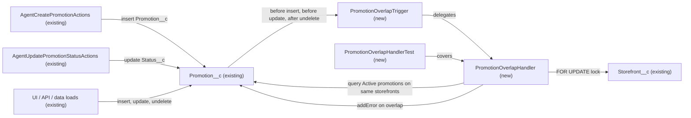

# Implementation spec — One active promotion per storefront at a time

> Block saving an Active `Promotion__c` whose date range overlaps another Active `Promotion__c` on the same `Storefront__c`.

_Based on the requirement, the evidence reported by AskCoworker, and read-only org queries where noted. Assumptions and missing evidence are identified below. Specification only — nothing is implemented or deployed._

---

## 1. The requirement

A storefront must never have two Active promotions whose date ranges overlap; the user decided that the save is blocked with an error (the older promotion is not auto-expired) and that non-overlapping, future-dated Active promotions are allowed (*user decision*). The request contained no deploy or data-change instruction.

| # | Responsibility | Trigger | Where it lives |
| --- | --- | --- | --- |
| 1 | Reject an insert of an Active `Promotion__c` that overlaps an existing Active `Promotion__c` on the same `Storefront__c` | Before insert | `PromotionOverlapTrigger` → `PromotionOverlapHandler` |
| 2 | Reject an update that makes a `Promotion__c` Active, moves it to another storefront, or changes its dates so that it overlaps another Active promotion | Before update | `PromotionOverlapTrigger` → `PromotionOverlapHandler` |
| 3 | Reject overlapping Active promotions inside the same DML batch and across concurrent saves | Before insert, before update | `PromotionOverlapHandler` (in-batch comparison and `FOR UPDATE` lock on `Storefront__c`) |
| 4 | Reject an undelete that would restore an overlapping Active promotion | After undelete | `PromotionOverlapTrigger` → `PromotionOverlapHandler` |
| 5 | Return the error to Agentforce callers as a failed action | On the blocked DML | `AgentCreatePromotionActions`, `AgentUpdatePromotionStatusActions` (existing, unchanged) |

## 2. Grounding — reuse before building

Target org: `TestWriteSpecDE` (Developer Edition, ID `00Dak00001COqNeEAL`). API version: `67.0`.

- **`Promotion__c`** (CustomObject) — the record being constrained. Custom fields are exactly `Description__c`, `Discount_Percentage__c`, `End_Date__c`, `Promotion_Code__c`, `Start_Date__c`, `Status__c`, `Storefront__c`. _verified by org query_ (Tooling `CustomField` by `TableEnumOrId`)
- **`Promotion__c.Status__c`** (Picklist) — values `Active`, `Expired`, `Canceled`; not restricted, so other strings (for example `Draft`) can be saved. "Active promotion" means `Status__c = 'Active'`. _verified by org query_ (describe)
- **`Promotion__c.Storefront__c`** (Lookup to `Storefront__c`, nillable, child relationship `Promotions__r`) — the grouping key. Because it is a lookup, a roll-up summary on `Storefront__c` is not possible. _verified by org query_ (describe)
- **`Promotion__c.Start_Date__c`, `Promotion__c.End_Date__c`** (Date, both nillable) — define the overlap window. _verified by org query_
- **Automation on `Promotion__c` and `Storefront__c`** — no Apex triggers, no record-triggered flows (`FlowDefinitionView`), and no validation rules on `Promotion__c`. Nothing enforces the rule today. _verified by org query_
- **`AgentCreatePromotionActions`** (ApexClass, `with sharing`, invocable) — inserts `Promotion__c`; accepts any status string and defaults to `Draft`; catches every exception and returns `e.getMessage()` with `success = false`. Reused unchanged: the trigger error surfaces through it. _verified by org query_ (class body)
- **`AgentUpdatePromotionStatusActions`** (ApexClass, `with sharing`, invocable) — updates `Promotion__c.Status__c`; same exception handling. Reused unchanged. _verified by org query_ (class body)
- **Other references to `Promotion__c`** — `MetadataComponentDependency` lists only the two classes above, `MerchantRiskScoreAction` (reads `Start_Date__c`, no DML on `Promotion__c`), `Promotion__c-Promotion Layout`, `Storefront__c-Storefront Layout`, and the FlexiPage `Storefront_Record_Page`. A search of all 70 unmanaged Apex class bodies found no other writer. _verified by org query_
- **Sharing** — `Promotion__c` OWD is internal `ReadWrite`, external `Private`. _verified by org query_
- **Data shape** — 1 `Promotion__c` record exists, `Status__c = 'Active'`, on one storefront; no existing conflicts. _verified by org query_ (aggregate by `Storefront__c`, `Status__c`)
- **Names** — no `ApexTrigger` named `PromotionOverlapTrigger` and no `ApexClass` named `PromotionOverlap%` exist. _verified by org query_
- Permission sets with Create/Edit on `Promotion__c`: `Agentforce_Reference_App`, `sfdc_accelerate_dms`. _reported by AskCoworker_ (not needed by this design).

Candidates examined and rejected: roll-up summary count on `Storefront__c` — impossible on a lookup; validation rule — cannot see sibling records; duplicate rule — matches field equality, not date overlap; before-save record-triggered flow with Get Records and Custom Error — cannot see other records in the same DML batch and cannot lock the parent, so overlapping records could both save; unique "active storefront key" field — rejected after the user allowed non-overlapping Active promotions on the same storefront, which a single unique key cannot express; adding the check inside the two agent classes — would leave UI, API, and data-load paths unguarded and duplicate the rule.

Evidence sources: `sf org display`; `sf sobject list`; describe of `Promotion__c` and `Storefront__c`; Tooling `ApexTrigger`, `ValidationRule`, `CustomField`, `EntityDefinition`, `MetadataComponentDependency`, `ApexClass` bodies; `FlowDefinitionView`; aggregate on `Promotion__c`; `DataStream` count. AskCoworker returned no citedReferences.

## 3. Architecture

Why the pieces are drawn this way:

1. All writers of `Promotion__c` (the two agent classes, and any UI, API, or data-load path) go through the record's DML, so one trigger enforces the rule once for every caller (*verified by org query* that no other Apex writes `Promotion__c`; the UI and API paths are platform behavior).
2. **Why Apex rather than a flow** (*assumption (documented platform behavior)*): a before-save flow's Get Records does not see other uncommitted records in the same DML batch and cannot take a row lock, so two overlapping Active promotions saved together or concurrently would both pass. The trigger compares incoming records with each other and locks the parent `Storefront__c` rows with `FOR UPDATE`, which serializes concurrent saves for the same storefront.
3. `PromotionOverlapTrigger` holds no logic and delegates to `PromotionOverlapHandler`.
4. The handler's logic:
   1. Select the records in `Trigger.new` with `Status__c == 'Active'` (Apex string `==` is case-insensitive, so `active` also matches) and a non-null `Storefront__c`. On update, every such record is checked, so status, storefront (reparenting), and date changes are all covered. If none, return.
   2. `SELECT Id FROM Storefront__c WHERE Id IN :storefrontIds FOR UPDATE`.
   3. One query: `SELECT Id, Storefront__c, Start_Date__c, End_Date__c FROM Promotion__c WHERE Storefront__c IN :storefrontIds AND Status__c = 'Active' AND Id NOT IN :incomingIds` (incoming IDs are empty on insert).
   4. Two ranges overlap when `startA <= endB` and `startB <= endA`, with a null start treated as `Date.newInstance(1900, 1, 1)` and a null end as `Date.newInstance(9999, 12, 31)`. Each incoming record is compared with the existing Active promotions on its storefront and with the other incoming records in the batch; every record in a conflicting pair gets `addError('Another Active promotion on this storefront overlaps these dates. Change the dates or set the other promotion to Expired or Canceled first.')`.
   5. The handler is `without sharing`, so it sees every Active promotion regardless of the caller's visibility; the message does not name the other record, so nothing hidden is exposed.
5. Both agent classes catch the resulting `DmlException` and return `success = false` with the message (*verified by org query*, class bodies), so the agent reports the conflict instead of a false success.

## 4. Metadata changes

**Automation**

- **Create `PromotionOverlapTrigger`** — ApexTrigger on `Promotion__c`, events `before insert`, `before update`, `after undelete`; delegates every event to `PromotionOverlapHandler`.
- **Create `PromotionOverlapHandler`** — ApexClass, `without sharing`; implements the check in Section 3, item 4, with two SOQL queries per transaction regardless of batch size; `addError` on each conflicting record (on `after undelete` this fails the undelete for that record).
- **Create `PromotionOverlapHandlerTest`** — ApexClass, `@isTest`, `SeeAllData=false`, with `@TestSetup` data; covers the cases in Section 7 and provides coverage for the trigger and handler.

## 5. Data 360 (Data Cloud) data involved

Not applicable — this change does not use Data 360. The org has 0 data streams (*verified by org query*).

## 6. Security considerations

- **Execution context:** the trigger runs in system context. `PromotionOverlapHandler` is declared `without sharing` so the overlap query sees every Active promotion; otherwise an external user (external OWD `Private`, *verified by org query*) could create a conflict with a promotion they cannot see. The two agent classes stay `with sharing` and unchanged.
- **CRUD/FLS:** the handler only reads `Promotion__c` and locks `Storefront__c`; it performs no DML. The caller's own Create/Edit permission and FLS on `Promotion__c` still apply to the save itself.
- **Permission sets:** no changes. Apex triggers need no grant. Permission sets are not the only grant path (profiles also grant access); the rule applies to all of them equally.
- **Data exposure:** the error message is generic and does not reveal the name, ID, or dates of the conflicting promotion.
- **Bypass:** every DML path (UI, API, Apex, data loads) fires the trigger, so no caller can skip the check except by first setting the other promotion to a non-Active status, which is the intended way to replace a promotion.

## 7. Testing strategy

`PromotionOverlapHandlerTest` (all data created in `@TestSetup`, `SeeAllData=false`, running as the test context user; no permission set grants needed):

| Behavior | Expected |
| --- | --- |
| Insert Active, no other Active on the storefront | Saves |
| Insert Active overlapping an existing Active on the same storefront | Blocked with the overlap message |
| Insert Active with dates entirely after an existing Active (future-dated, no overlap) | Saves |
| Insert Active on a different storefront with the same dates | Saves |
| Ranges touching on the same day (end of one = start of the other) | Blocked (inclusive dates) |
| Insert Active with null `Start_Date__c`, null `End_Date__c`, or both, overlapping an existing Active | Blocked |
| Existing Active with null dates; insert Active with any dates | Blocked |
| Insert `Expired`, `Canceled`, or `Draft` overlapping an existing Active | Saves (not checked) |
| Insert Active with null `Storefront__c` | Saves (not checked) |
| Update `Expired` → `Active` into an overlap | Blocked |
| Update `Active` → `Expired` | Saves |
| Update `End_Date__c` of an Active promotion into an overlap | Blocked |
| Update `Storefront__c` of an Active promotion to a storefront with an overlapping Active (reparenting) | Blocked |
| Update a non-date field on a non-conflicting Active promotion | Saves (record does not conflict with itself) |
| Bulk: 200 Active promotions on 200 storefronts | All save; assert SOQL count stays at 2 queries from the handler |
| Bulk: two overlapping Active promotions on one storefront in one `insert` (`Database.insert(list, false)`) | Both fail |
| Bulk: two non-overlapping Active promotions on one storefront in one `insert` | Both save |
| Undelete an Active promotion that now overlaps another Active | Undelete fails with the overlap message |
| Undelete a non-conflicting Active promotion | Succeeds |
| `AgentCreatePromotionActions.invoke` with `status = 'Active'` into an overlap | `success = false`, message contains the overlap text |
| `AgentUpdatePromotionStatusActions.invoke` setting `Active` into an overlap | `success = false`, message contains the overlap text |

Recommended verification (no planned test): two users saving overlapping Active promotions for the same storefront at the same moment — the second save must wait for the lock and then fail; creating and activating a promotion through the Agentforce agent in the org and confirming the agent relays the error.

## 8. Open decisions

### Open

1. **Deployment sequence (non-blocking).** Deploy `PromotionOverlapHandler` and `PromotionOverlapHandlerTest` with `PromotionOverlapTrigger` in one deployment (tests must run for Apex in production). No data backfill is needed: the only existing promotion is Active with no conflict (*verified by org query*). Re-run the aggregate query on `Promotion__c` by `Storefront__c` and `Status__c` just before deploying to a target that has more data; pre-existing overlaps would block any later edit of those records until one is set to `Expired` or `Canceled`.
2. **Inclusive date boundaries (non-blocking, load-bearing).** A promotion ending on 10 May and one starting on 10 May are treated as overlapping. *Assumption* — a date field names whole days, so both are live on 10 May. Change the comparison to strict if back-to-back same-day handover is wanted.
3. **Null dates mean open-ended (non-blocking, load-bearing).** A null `Start_Date__c` means "since always" and a null `End_Date__c` means "no end". *Assumption* — an Active promotion without an end date is live indefinitely. As a result an undated Active promotion blocks every other Active promotion on its storefront.
4. **Inverted ranges (non-blocking).** Nothing prevents `Start_Date__c` later than `End_Date__c` today; such a record overlaps nothing under the formula. A validation rule for it is a proposal outside this requirement and is not in the inventory.
5. **Storefront lock contention (non-blocking).** `FOR UPDATE` on `Storefront__c` makes concurrent saves that touch the same storefront wait up to the platform lock timeout (about 10 seconds). Expected volume is low (1 promotion today, *verified by org query*).

### Resolved

- **Blocking versus auto-expire** — *user decision*: block with an error; the older promotion is not changed.
- **Meaning of "at a time"** — *user decision*: only Active promotions with overlapping date ranges conflict; non-overlapping future-dated Active promotions are allowed.
- **Meaning of "active"** — `Status__c = 'Active'` (*assumption*; the picklist's own value, *verified by org query*). Dates alone do not make a promotion active.
- **Promotions without a storefront** are not checked (*assumption*; the rule is per storefront).
- **In-batch conflicts** fail every record in the conflicting pair (*assumption*; there is no basis to prefer one).
- **Sharing of the handler** — AskCoworker proposed `with sharing` to match the agent classes; changed to `without sharing` because external OWD is `Private` and a conflict check must see every record (*verified by org query*).
- **Query per storefront** — AskCoworker's first inventory ran one overlap query per storefront (100-query limit risk) and did not compare records within the batch; corrected to one query for the batch plus in-memory comparison.
- **Undelete** — AskCoworker's inventory had only `before insert` and `before update`; `after undelete` added because restoring a deleted Active promotion can create an overlap.
- **"Draft is not a valid picklist value"** — AskCoworker claimed saves with `Draft`, `Paused`, or `Ended` would fail; the org shows `Status__c` is not restricted (*verified by org query*), so they save. Those values are outside this requirement and are not checked by the trigger.
- **Case sensitivity** — AskCoworker flagged exact matching of `Active`; Apex string `==` is case-insensitive (*assumption (documented platform behavior)*), so no change is needed.
- **"No child relationship from `Storefront__c`"** — AskCoworker said none was exposed; describe shows `Promotions__r` (*verified by org query*). It does not change the design.
- **Dropped AskCoworker proposals:** error message naming the conflicting promotion (would expose hidden records), inverted-date validation rule (not requested; see Open 4), a low-privilege user test (the handler has no permission dependency), and the reported "21 storefronts" count (not verified, not needed).

## 9. Change set

| # | Action | Type | API name | Module | Why |
| --- | --- | --- | --- | --- | --- |
| 1 | Create | ApexTrigger | `PromotionOverlapTrigger` | force-app/main/default/triggers | Fires the overlap check on insert, update, and undelete of `Promotion__c` |
| 2 | Create | ApexClass | `PromotionOverlapHandler` | force-app/main/default/classes | Detects overlapping Active promotions per storefront, including within a batch and under concurrency |
| 3 | Create | ApexClass | `PromotionOverlapHandlerTest` | force-app/main/default/classes | Covers the rule's positive, negative, bulk, undelete, and agent-caller cases |

One `Promotion__c` trigger and handler reject any Active promotion whose dates overlap another Active promotion on the same storefront, for every caller.

Total: 3 · Create: 3 · Update: 0 · Delete: 0
