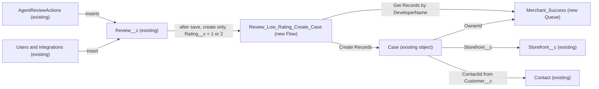

# Implementation spec — Open a Merchant Success case for 1- and 2-star reviews

> When a `Review__c` record is created with a rating of 1 or 2, a record-triggered flow creates a `Case` for the storefront and the reviewing contact, owned by a new Merchant Success queue.

_Based on the requirement, the evidence reported by AskCoworker, and read-only org queries where noted. Assumptions and missing evidence are identified below. Specification only — nothing is implemented or deployed._

---

## 1. The requirement

New reviews with `Review__c.Rating__c` equal to 1 or 2 automatically create a `Case` owned by the merchant success team. By user decision, the team is a new `Merchant_Success` queue, the case links to the storefront and the reviewing contact, its subject includes the storefront name, and the automation runs only when a review is created, not when it is edited. The request contained no deploy or data-change instructions.

| # | Responsibility | Trigger | Where it lives |
| --- | --- | --- | --- |
| 1 | Detect a new review with rating 1 or 2 | `Review__c` insert | `Review_Low_Rating_Create_Case` (Flow, new) |
| 2 | Create a `Case` linked to the storefront and the reviewing contact, with the storefront name in the subject | Same insert, after save | `Review_Low_Rating_Create_Case` (Flow, new) |
| 3 | Route the case to the merchant success team | Case creation | `Merchant_Success` (Queue, new), set as `Case.OwnerId` |
| 4 | Do not create cases when an existing review is edited | `Review__c` update | Flow trigger type "A record is created" only |

## 2. Grounding — reuse before building

Target org: `TestWriteSpecDE` (Developer Edition, not a sandbox). API version: `67.0`. _verified by org query; verified by project file_

- **`Review__c`** (CustomObject) — the trigger object. 92 records exist. _verified by org query_
- **`Review__c.Rating__c`** (CustomField, Number/double, not required, help text "1 (poor) to 5 (excellent)") — the rating the entry condition tests. 29 existing reviews have a rating of 1 or 2 (the same 29 match `<= 2`, so none are fractional or below 1); 63 are above 2. _verified by org query_
- **`Review__c.Storefront__c`** (CustomField, master-detail to `Storefront__c`, required) — source for `Case.Storefront__c` and the storefront name. _verified by org query_
- **`Review__c.Customer__c`** (CustomField, lookup to `Contact`, optional) — source for `Case.ContactId`. 13 of 92 reviews have no customer. _verified by org query_
- **`Review__c.Comments__c`** (CustomField, long text area) — source for `Case.Description`. _verified by org query_
- **`Case.Storefront__c`** (CustomField, lookup to `Storefront__c`) — already exists, so no new field is needed to link the case to the storefront. _verified by org query_
- **`Case.Type`** (standard picklist) — the active value `Feedback & Reviews` already exists. `Case.Status` defaults to `New`; `Case.Priority` defaults to `Medium`. `Case.Origin` values are `Email`, `Phone`, `Web`, `Agentforce` only. The only record type is Master. _verified by org query_
- **`AgentReviewActions`** (ApexClass, `with sharing`, no namespace) — the only Apex that inserts `Review__c` records (invocable agent action). It does not check the rating or create cases. _verified by org query (class body and `MetadataComponentDependency` on `Review__c`, which lists only `AgentReviewActions` and `AgentSummarizeReviewsActions`)_
- **Existing automation (absence):** no Apex triggers on `Review__c` or `Case`, no record-triggered flows on `Review__c` or `Case` (`FlowDefinitionView`), and no validation rules on either object. _verified by org query_
- **Case assignment rule `Standard`** (AssignmentRule, active, `Case`) — exists; its entries cannot be read with the allowed commands. _verified by org query_
- **Case org-wide default** is Public Read/Write/Transfer (`Organization.DefaultCaseAccess = ReadEditTransfer`). _verified by org query_

Candidates examined and rejected:
- `Merchant_Messaging_Queue` (Queue) — its only `QueueSobject` is `MessagingSession`; using it for cases would change a queue that serves messaging routing, and its name does not describe the merchant success team. _verified by org query_
- `Merchant_Support` and `ESW_Merchant_Service_Agent_1737676393072` (Group) — type `GuestUserGroup`, cannot own cases. _verified by org query_
- No queue, regular public group, or role named like "Merchant Success" exists (`Group`, `QueueSobject`, `UserRole` queries). _verified by org query_
- `AgentCaseCreateActions` (ApexClass) — general-purpose invocable case creator for agents; it has no reference to `Review__c`. A flow Create Records element is simpler than calling Apex for a fixed field mapping. _reported by AskCoworker_
- Existing autolaunched case flows (`CreateCase`, `Create_Case`, `CreateCaseEnhancedData`) — standard or agent-action flows, not record-triggered; not reused because a Create Records element needs no subflow. _verified by org query (names and process types only)_
- `sc_ext.CaseRule` and `shield_ext.CaseRule` (ApexClass, managed, bodies hidden) — managed classes in the security packages; no trigger on `Case` or `Review__c` exists to call them. _verified by org query_

Evidence sources: `sf org display`; custom object list; `sobject describe` of `Review__c`, `Case`, `Storefront__c`; Tooling `ApexTrigger`, `ApexClass`, `ValidationRule`, `CustomField`, `MetadataComponentDependency`; `FlowDefinitionView`; `Group`, `QueueSobject`, `UserRole`, `AssignmentRule`, `Organization`, `ObjectPermissions`; record counts on `Review__c`. AskCoworker returned no citedReferences.

## 3. Architecture

Why the pieces are drawn this way:

1. `AgentReviewActions` and any other caller insert `Review__c` records. _verified by org query_ The flow fires on every insert regardless of the caller. _assumption (documented platform behavior)_
2. `Review_Low_Rating_Create_Case` is a record-triggered flow on `Review__c`, trigger "A record is created", run "after the record is saved" (Actions and Related Records), because creating a record on another object is not possible in a before-save flow. _assumption (documented platform behavior)_ A flow is used instead of Apex because the logic is a fixed condition and a field mapping (Rule 4, declarative first).
3. Entry condition: `Rating__c` Equals 1 OR `Rating__c` Equals 2 (condition logic `1 OR 2`). This matches the wording "a rating of 1 or 2" and excludes blank, 0, and fractional values. _assumption (implementation choice)_
4. A Get Records element reads `Group` where `DeveloperName = 'Merchant_Success'` and `Type = 'Queue'` (first record), so no org-specific queue ID is stored in the flow. _assumption (implementation choice; corrects an AskCoworker proposal to hard-code the ID)_
5. A Create Records element creates one `Case` with:
   - `OwnerId` = the queue ID from step 4;
   - `Storefront__c` = `{!$Record.Storefront__c}`;
   - `ContactId` = `{!$Record.Customer__c}` (blank when the review has no customer);
   - `Subject` = formula `"Low rating (" & TEXT({!$Record.Rating__c}) & ") review for " & {!$Record.Storefront__r.Name}`;
   - `Description` = `{!$Record.Comments__c}`;
   - `Type` = `Feedback & Reviews`;
   - `Status` and `Priority` left to their defaults (`New`, `Medium`); `Origin` left blank because no existing value describes an automatic review case.
6. The flow sets `OwnerId` directly. A flow Create Records element does not run case assignment rules, so the active `Standard` rule does not reassign these cases. _assumption (documented platform behavior), load-bearing_
7. No path runs on update, so an edit that lowers or raises a rating never creates or closes a case (user decision).

## 4. Metadata changes

**Access**

- **Create `Merchant_Success`** — Queue, label "Merchant Success", DeveloperName `Merchant_Success`, supported object `Case` (`queueSobject`). Queue members are named in Section 8 item 1 (placeholder `MERCHANT_SUCCESS_MEMBERS`). Queue email left blank.

**Automation**

- **Create `Review_Low_Rating_Create_Case`** — Flow (`AutoLaunchedFlow`, record-triggered, object `Review__c`, `RecordTriggerType = Create`, `TriggerType = RecordAfterSave`), entry condition `Rating__c` = 1 OR `Rating__c` = 2; Get Records on `Group` (`DeveloperName = 'Merchant_Success'`, `Type = 'Queue'`); Create Records on `Case` with the mapping in Section 3 item 5. Status Active. Depends on the `Merchant_Success` queue existing at run time.

**Tests**

- **Create `Review_Low_Rating_Create_Case_Test`** — FlowTest for `Review_Low_Rating_Create_Case`: trigger "created", initial `$Record` with `Rating__c = 1`, `Storefront__c` set to an existing storefront ID in the target org, and `Customer__c` set; asserts that the entry condition is met and that the queue lookup returns a record.

## 5. Data 360 (Data Cloud) data involved

Not applicable — this change does not use Data 360.

## 6. Security considerations

- **Execution context.** A record-triggered flow runs in system context without sharing, so the case is created even when the user or agent who inserts the review has no Create permission on `Case`, and the queue lookup on `Group` sees the queue regardless of the running user. _assumption (documented platform behavior)_
- **Who creates reviews.** `AgentReviewActions` runs `with sharing`; that sharing mode applies to its own insert, not to the flow. _verified by org query (class body)_; _assumption (documented platform behavior)_ for the flow context.
- **CRUD/FLS.** The flow needs no new grants. Queue members need Read and Edit on `Case` and field access to `Case.Storefront__c` to work the cases; 80 permission sets and profiles already grant Read on `Case` (partial list; not all rows name their parent). _verified by org query_ No new permission set is created: which users form the team, and whether they already hold Case access, is open (Section 8 item 1).
- **Sharing and exposure.** Case OWD is Public Read/Write/Transfer, so every internal user with Read on `Case` can see these cases, including the review text copied into `Case.Description` and the reviewer contact. Queue ownership routes the work; it does not restrict access. _verified by org query_ Permission sets that already read `Case.Description` (AskCoworker names `sfdc_slack` and `sfdc_a360_sfcrm_data_extract`) will also see review comments. _reported by AskCoworker_
- **Assignment rule.** The `Standard` Case assignment rule cannot be read; it is not used and should not fire on flow-created cases (Section 3 item 6).

## 7. Testing strategy

Planned test (inventory):

- `Review_Low_Rating_Create_Case_Test` (FlowTest) — rating 1 on create meets the entry condition and finds the `Merchant_Success` queue.

Recommended verification (manual, in a sandbox or the target org after deployment; no tests have run):

1. Create a review with `Rating__c = 1` and a customer: one `Case` exists with `OwnerId` = `Merchant_Success`, `Storefront__c` = the review's storefront, `ContactId` = the customer, `Subject` containing the storefront name, `Description` = the comments, `Type` = `Feedback & Reviews`, `Status` = `New`.
2. Create a review with `Rating__c = 2` and no customer: a case is created with blank `ContactId`.
3. Negative: create reviews with `Rating__c` 3, 5, blank, and 0: no case is created.
4. Update: change an existing review's rating from 4 to 1, and from 1 to 5: no case is created or changed.
5. Bulk: insert 200 reviews in one transaction (Data Loader or Bulk API), half with rating 1 or 2: exactly 100 cases are created and no governor limit error occurs.
6. Agent path: create a review through the `AgentReviewActions` invocable action with rating 1: a case is created although the agent user's Case access is not relied on.
7. Assignment rule (load-bearing assumption): confirm that the cases from steps 1, 2, and 5 remain owned by `Merchant_Success` and were not reassigned by the `Standard` rule.
8. Queue members: log in as a queue member and confirm the case appears in the "Merchant Success" queue list view and can be edited.
9. Delete and undelete a review with rating 1: no additional case is created (flows do not run on undelete). _assumption (documented platform behavior)_

## 8. Open decisions

### Open

1. **Queue members (blocking for delivery).** No users, public groups, or roles for the merchant success team exist (`Group`, `UserRole` queries; active standard users are one System Administrator, one Einstein Agent user, and two Analytics Cloud users). Placeholder `MERCHANT_SUCCESS_MEMBERS` must be replaced with the team's users or a group before cases can be worked, and those users need Read and Edit on `Case`. Recommended default: add the members to the queue in the Queue metadata or in Setup after deployment.
2. **Deployment sequence (blocking for delivery).** Deploy the `Merchant_Success` queue before or with the flow, then the FlowTest. If the queue is missing at run time, the Get Records element returns nothing and the case owner falls back to the running user. Recommended default: deploy all three in one package.
3. **FlowTest storefront ID (non-blocking).** The FlowTest needs an existing `Storefront__c` ID from the target org for the master-detail field; replace the placeholder `TEST_STOREFRONT_ID` per org.
4. **Existing low-rated reviews (non-blocking).** 29 existing reviews have rating 1 or 2 and no case. The user had no preference; the flow runs on create only, so no backfill is planned. _assumption_ If a backfill is wanted later, it is a separate data operation with its own export and rollback.
5. **Link from case to review (non-blocking, proposal).** No lookup from `Case` to `Review__c` exists. A `Case.Review__c` lookup would let the team open the triggering review. Not included because the requirement does not ask for it.
6. **Report and list view check (non-blocking).** Reports and list views cannot be read; confirm that no existing Case list view or report filtered on `Type = Feedback & Reviews` would now mix in these cases unexpectedly.

### Resolved

- **Owner of the case (user decision).** A new `Merchant_Success` queue owns the case; no existing queue or group fits (Section 2).
- **Trigger events (user decision).** Create only; edits never create cases.
- **Case links and subject (user decision).** Link `Storefront__c` and the reviewing contact; subject includes the storefront name.
- **Entry condition (assumption).** `Rating__c` = 1 OR 2 rather than `<= 2`, to match the requirement's wording and exclude 0 or fractional values; for current data the two are equivalent (29 records each). _verified by org query_
- **No `Review__c.Status__c` filter (assumption).** The requirement states no status condition, and all 92 reviews have a blank status, so a "Published" filter would never fire. _verified by org query_
- **Correction to AskCoworker: `Case.Origin = 'Review'`.** That value does not exist (`Email`, `Phone`, `Web`, `Agentforce` only); `Origin` is left blank. _verified by org query_
- **Correction to AskCoworker: hard-coded queue ID.** Replaced with a Get Records lookup by `DeveloperName`.
- **Correction to AskCoworker: FlowTest.** AskCoworker said record-triggered flow tests cannot be deployed; `FlowTest` is a deployable metadata type, so it stays in the inventory. _assumption (documented platform behavior)_
- **Correction to AskCoworker: bulk SOQL risk.** AskCoworker said the Get Records element runs one query per record and can exceed 100 queries. Record-triggered flow interviews in one transaction are bulkified, so the element runs once per batch. _assumption (documented platform behavior), load-bearing_; covered by Section 7 step 5.
- **Correction to AskCoworker: record count.** AskCoworker stated 0 existing reviews; there are 92. _verified by org query_
- **Dropped AskCoworker proposals.** Apex test class, fault-path logging, rating validation rule, duplicate-case check, and Case priority mapping — not requested by the requirement.

## 9. Change set

| # | Action | Type | API name | Module | Why |
| --- | --- | --- | --- | --- | --- |
| 1 | Create | Queue | `Merchant_Success` | force-app/main/default/queues | Owner for low-rating review cases; no merchant success queue exists |
| 2 | Create | Flow | `Review_Low_Rating_Create_Case` | force-app/main/default/flows | Creates the case when a review is created with rating 1 or 2 |
| 3 | Create | FlowTest | `Review_Low_Rating_Create_Case_Test` | force-app/main/default/flowtests | Tests the flow entry condition and queue lookup |

A record-triggered after-save flow on `Review__c` creates a `Case` owned by a new `Merchant_Success` queue for new reviews rated 1 or 2.

Total: 3 · Create: 3 · Update: 0 · Delete: 0
