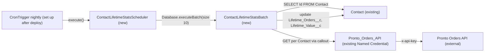

# Implementation spec — Nightly recompute of Contact lifetime orders and lifetime value

> Recompute `Contact.Lifetime_Orders__c` and `Contact.Lifetime_Value__c` every night from the external Pronto Orders API so the values stop going stale.

_Based on the requirement, the evidence reported by AskCoworker, and read-only org queries where noted. Assumptions and missing evidence are identified below. Specification only — nothing is implemented or deployed._

---

## 1. The requirement

The two Contact fields are not stale so much as never written by anything in Salesforce: all 198 Contacts have both fields blank, the fields are plain Number fields, and the order data lives outside Salesforce; the user decided the fields should be recomputed nightly from the order data (*user decision*), and the source was mapped to the Pronto Orders API (*assumption*, see Section 8). No deploy, data change, or job scheduling was performed.

| # | Responsibility | Trigger | Where it lives |
| --- | --- | --- | --- |
| 1 | Fetch each Contact's lifetime order count and lifetime order value from the order system | Nightly schedule | `ContactLifetimeStatsBatch` calling `Pronto_Orders_API` |
| 2 | Write the fetched values to `Contact.Lifetime_Orders__c` and `Contact.Lifetime_Value__c` | Each batch chunk | `ContactLifetimeStatsBatch` |
| 3 | Run the recompute every night | Scheduled Apex (`CronTrigger`, set up after deploy) | `ContactLifetimeStatsScheduler` |
| 4 | Make failures visible and leave previous values in place when the order system fails | Callout or parse failure | `ContactLifetimeStatsBatch` (failed chunk shows on `AsyncApexJob`) |

## 2. Grounding — reuse before building

Target org: `TestWriteSpecDE` (Developer Edition, not a sandbox, org ID `00Dak00001COqNe`). API version: `67.0`.

- **`Contact.Lifetime_Orders__c`** (CustomField, Number(18,0)) — target field. Description: "Total number of orders this customer has placed lifetime (app-side aggregation)." Plain Number, not a roll-up or formula. _verified by org query_
- **`Contact.Lifetime_Value__c`** (CustomField, Number(14,2)) — target field. Description: "Total customer lifetime value (LTV) aggregated from app-side orders." _verified by org query_
- **Data state** — 198 Contacts; 0 have `Lifetime_Orders__c` set and 0 have `Lifetime_Value__c` set. _verified by org query_
- **Writers and readers of the two fields** — `MetadataComponentDependency` returns no references for either field (18- and 15-character IDs); no unmanaged Apex class body (70 classes searched) mentions either field; no Apex trigger exists on `Contact`, `Order`, `Transaction__c`, `Loyalty_Transaction__c`, or `Account`; no record-triggered flow exists on `Contact`. Nothing in Salesforce writes the fields. _verified by org query_
- **Field access** (complete list from `FieldPermissions`, both fields): Edit on `Agentforce_Reference_App` and `sfdc_accelerate_dms` ("DMS Internal Only"); Read only on `sfdc_a360_sfcrm_data_extract`, `sfdc_slack`, `Pronto_Deep_Dive_Workshop`. No profile rows. `sfdc_accelerate_dms` and `Agentforce_Reference_App` are assigned to "Platform Integration User" and "OrgFarm EPIC" (System Administrator). _verified by org query_ `sfdc_accelerate_dms` being the former app-side writer is _reported by AskCoworker_ and matches the user's statement that "the app used to write these fields via integration and stopped" (*user decision* context).
- **Order data in Salesforce** — `Order`: 0 records; `Transaction__c`: 0 records and no custom fields; `Loyalty_Transaction__c`: 0 records, master-detail to Contact, but it holds `Points__c` (`Transaction_Type__c` = Earn/Redeem, `Transaction_Source__c` = Order/Promotion/Manual Adjustment), not order amounts. No object in the org carries order amounts linked to Contact, so a roll-up summary is not possible. _verified by org query_
- **`Pronto_Orders_API`** (NamedCredential) — exists, uses External Credential `Pronto_Orders_API_Key` (Custom protocol, `x-api-key` auth header, named principal `ProntoPrinciple`). _verified by org query_
- **`OrderStatusCardAction`**, **`OrderPickerController`** (ApexClass) — their comments say "orders live in the external Heroku Orders API surfaced via External Services / Named Credentials, not in a Salesforce Order object"; both return sample data and make no callout. They show the order source, but provide no reusable callout code. _verified by org query_
- **Principal access to `Pronto_Orders_API_Key`** (`SetupEntityAccess`, complete list): `Pronto_ECP_Access` (assigned to "Automated Process"), `Agentforce_Reference_App`, `Agentforce_Action_Access`, `Pronto_Deep_Dive_Workshop`. _verified by org query_
- **External Services** — no `ExternalServiceRegistration` exists, so there is no registered OpenAPI contract for the Orders API. _verified by org query_
- **Scheduled work** — the only `CronTrigger` jobs are platform jobs (program milestone and status, Metalytics loader, retention usage, privacy audit); the only active scheduled flow is `Orch`. None relates to these fields (no metadata dependency on the fields). _verified by org query_
- **Same concept elsewhere** — Tooling `CustomField` search for Lifetime, Order, LTV, Value, Spend, Revenue finds `Account.Total_Orders__c` and `Lead.Average_Order_Volume__c`, which are on other objects and not Contact-level lifetime totals. _verified by org query_
- **Project source** — `force-app/main/default/classes` is empty, so the new classes do not collide with local source. _verified by project file_

Candidates examined and rejected: roll-up summary on Contact — no child object with order amounts; `Loyalty_Transaction__c` — loyalty points, not orders; standard `Order` — no records and only lookups to Contact; scheduled flow with External Services action — no OpenAPI registration, and per-record callouts mixed with bulk DML in one flow transaction are not reliable (see Section 3); repairing only the external app — rejected by the user's choice of a Salesforce-side nightly recompute.

Evidence sources: `sf sobject list`, `sf sobject describe` (`Loyalty_Transaction__c`, `Transaction__c`, `Refund__c`), SOQL counts, Tooling `CustomField`, `ApexTrigger`, `ApexClass` bodies, `MetadataComponentDependency`, `NamedCredential`, `ExternalCredential`, `ExternalCredentialParameter`, `ExternalServiceRegistration`; standard `FlowDefinitionView`, `FieldPermissions`, `SetupEntityAccess`, `PermissionSetAssignment`, `CronTrigger`, `DataStream`, `Organization`. AskCoworker returned no citedReferences.

## 3. Architecture

Why the pieces are drawn this way:

1. The scheduled job starts `ContactLifetimeStatsScheduler`, which starts the batch. A `CronTrigger` is not deployable metadata, so the schedule is a post-deploy setup step (*assumption (documented platform behavior)*).
2. `ContactLifetimeStatsBatch` queries all Contacts, because every Contact can have orders and all are blank today (*verified by org query*). No scope filter is added (the requirement states none).
3. For each Contact in a chunk it makes one callout through the existing `Pronto_Orders_API` Named Credential (*verified by org query*), then does one `update` of the chunk. All callouts run before the DML, because a callout after uncommitted DML in the same transaction fails (*assumption (documented platform behavior)*).
4. Batch size 10 with a 10-second request timeout keeps each transaction within the 100-callout and 120-second cumulative callout-time limits (10 × 10 s = 100 s) (*assumption (documented platform behavior)*).
5. **Why Apex, not a flow:** the order data is external and there is no External Service registration (*verified by org query*). A schedule-triggered flow batches many record interviews into one transaction, so a later interview's callout would follow an earlier interview's update and fail with uncommitted work pending (*assumption (documented platform behavior)*). Batch Apex with `Database.AllowsCallouts` controls the order of callouts and DML per chunk.
6. Nothing else fires on the Contact update: no Contact trigger or record-triggered flow exists (*verified by org query*).

## 4. Metadata changes

**Sync**

- **Create `ContactLifetimeStatsBatch`** — Conditional: the Pronto Orders API contract (endpoint path, request key, response fields, and the response for a Contact with no orders) must be confirmed; see Section 8, item 1. `public without sharing class ContactLifetimeStatsBatch implements Database.Batchable<SObject>, Database.AllowsCallouts`. `start()`: `Database.getQueryLocator('SELECT Id FROM Contact')`. `execute()`: for each Contact, `HttpRequest` to `callout:Pronto_Orders_API/{path}` with timeout 10000 ms; parse the response into a typed inner class (order count as Integer, lifetime value as Decimal); after all callouts, one `update` of the chunk (all-or-none). Any non-2xx status, callout exception, or parse failure throws a custom exception naming the Contact Id and HTTP status, so the chunk rolls back, previous values stay, and the failure is recorded on the `AsyncApexJob`. No values are defaulted to zero on error. `finish()`: no action.
- **Create `ContactLifetimeStatsScheduler`** — Conditional: depends on row 1. `public class ContactLifetimeStatsScheduler implements Schedulable`; `execute()` calls `Database.executeBatch(new ContactLifetimeStatsBatch(), 10)`.

**Tests**

- **Create `ContactLifetimeStatsBatchTest`** — Conditional: depends on row 1. `@isTest` class with an inner `HttpCalloutMock`; the methods are listed in Section 7.

## 5. Data 360 (Data Cloud) data involved

Not applicable — this change does not use Data 360. The org has 0 `DataStream` records (*verified by org query*). `sfdc_a360_sfcrm_data_extract` has Read on both fields (*verified by org query*), so a future Contact data stream would pick up the recomputed values without a change here.

## 6. Security considerations

- **Execution context:** scheduled Apex runs as the user who scheduled the job, not as the Automated Process user (*assumption (documented platform behavior)*). The batch class is `without sharing`, so it reads and updates all Contacts regardless of that user's sharing. Apex DML in default mode does not enforce FLS, so no field grant is needed for the job to write the two fields (*assumption (documented platform behavior)*).
- **Callout credential:** the scheduling user needs principal access to External Credential `Pronto_Orders_API_Key`. It is granted today by `Pronto_ECP_Access`, `Agentforce_Reference_App`, `Agentforce_Action_Access`, and `Pronto_Deep_Dive_Workshop` (*verified by org query*). Assign the existing `Pronto_ECP_Access` to the scheduling user (setup step, not metadata; Section 8, item 2). No permission set is changed or widened.
- **CRUD/FLS for readers:** unchanged. The same five permission sets listed in Section 2 keep their current Read or Edit access (*verified by org query*).
- **Data exposure:** values move from the external order system into two existing fields only. The response is not stored elsewhere. Error messages contain the Contact Id and HTTP status only, not the response body (*assumption*).
- **Second writer:** `sfdc_accelerate_dms` and `Agentforce_Reference_App` keep Edit on both fields (*verified by org query*). If the external integration resumes, it could overwrite the nightly values (Section 8, item 4).

## 7. Testing strategy

`ContactLifetimeStatsBatchTest` (Apex, `HttpCalloutMock`, test data only, no `SeeAllData`):

- `testSingleContactUpdated` — mock returns a valid response; assert both fields hold the mocked count and value (responsibilities 1 and 2).
- `testChunkOfTenUpdated` — insert 10 Contacts (one batch chunk; a test runs only one `execute()`), mock valid responses; assert all 10 updated and callouts do not exceed limits (bulk).
- `testHttpErrorKeepsPreviousValues` — Contacts start with known values; mock returns HTTP 500; assert the values are unchanged and the job records an error (responsibility 4, negative).
- `testMalformedResponseKeepsPreviousValues` — mock returns a 200 with an unparseable or wrong-typed body; assert values unchanged (negative).
- `testSchedulerEnqueuesBatch` — call `ContactLifetimeStatsScheduler.execute(null)` inside `Test.startTest()`/`Test.stopTest()`; assert an `AsyncApexJob` for `ContactLifetimeStatsBatch` exists (responsibility 3).
- `testZeroOrdersContact` — once the API contract is known (Section 8, item 1), assert the documented "no orders" response writes 0 and 0.00.

Recommended verification (manual, after deploy):

- Assign `Pronto_ECP_Access` to the scheduling user, run `Database.executeBatch(new ContactLifetimeStatsBatch(), 10)` once, and check that the Contacts are populated and match the order system for a sample of Contacts. This first run is the backfill for the 198 blank Contacts.
- Check that a user without principal access to `Pronto_Orders_API_Key` gets a failed job, not blank or zero values (verifies the running-user assumption).
- Check `CronTrigger.NextFireTime` after scheduling, and check the first nightly `AsyncApexJob` for errors.
- Confirm that no chunk exceeds the 120-second callout time with the real API (verifies the batch-size assumption).

Merge, delete, and undelete need no special test: deleted Contacts leave the query, and surviving or restored Contacts are recomputed on the next run (*assumption (documented platform behavior)*). New Contacts stay blank until the next nightly run.

## 8. Open decisions

### Open

1. **Pronto Orders API contract (blocking).** Rows 1–3 are `Conditional:` on it. The endpoint path, whether it is keyed by the Salesforce Contact Id or an external customer Id, the response field names, and the response for a Contact with no orders (404 versus zero totals) are not in the org: no External Service registration exists and the existing classes use sample data (*verified by org query*). The class comments say the Contact Id can scope orders (*verified by org query*), so the recommended default is a per-Contact request keyed by Contact Id. If an external key is required, add a Contact key field to the inventory. A "no orders" response writes 0 only if the contract says so; otherwise it is treated as a failure.
2. **Scheduling user and credential access (blocking for delivery).** The job must be scheduled after deploy (Setup > Apex Classes > Schedule Apex, daily, or `System.schedule`) by a user who has `Pronto_ECP_Access` or another permission set with principal access to `Pronto_Orders_API_Key`. Recommended default: a dedicated integration user with `Pronto_ECP_Access` assigned; run at 02:00 in the org time zone (*assumption*). This is *load-bearing*: if the running user lacks principal access, every callout fails.
3. **Deployment sequence (blocking for delivery).** Confirm item 1; deploy rows 1–3 together; assign `Pronto_ECP_Access` to the scheduling user; run the batch once as the backfill; schedule `ContactLifetimeStatsScheduler` nightly. Rollback: abort the scheduled job and delete the three classes; field values written remain and can be restored from the order system.
4. **Other writers (non-blocking).** `sfdc_accelerate_dms` (Platform Integration User) and `Agentforce_Reference_App` keep Edit on both fields (*verified by org query*). If the external app's integration resumes, both would write the fields. Recommended default: leave the grants unchanged in this spec, and have the integration owner stop the app-side writes, or remove Edit from `sfdc_accelerate_dms` in a separate change after confirming with its owner.
5. **Load-bearing platform assumptions (non-blocking).** Scheduled Apex runs as the scheduling user; callouts after uncommitted DML fail; 100 callouts and 120 seconds of callout time per transaction. Each has a verification case in Section 7.

### Resolved

- **Source and schedule (user decision and assumption).** Question asked: where should the values come from (Salesforce pulls from the Pronto Orders API; the external app's integration resumes writing; or orders are loaded into standard `Order`) and how fresh must they be (nightly, hourly, or per order)? Answer: "Recompute them nightly from the order data. I'm not sure where the order data lives; the app used to write these fields via integration and it stopped." Nightly is a *user decision*. The answer picks no source, so it was mapped to a Salesforce-side pull from the Pronto Orders API, the only order data source the org shows (*assumption*).
- **Premise partly false.** The fields are not stale values; they are blank on all 198 Contacts and nothing in Salesforce writes them (*verified by org query*).
- **Batch size and failure handling (assumption).** AskCoworker proposed batch size 1, then 50, and per-record catch-and-continue with `System.debug` logging. Changed to batch size 10 with a 10-second timeout (callout-time limit) and all-or-none chunks that throw on failure, so errors are visible on `AsyncApexJob` and are never written as soft successes.
- **Permission set change dropped.** AskCoworker proposed adding Edit on both fields to `Pronto_ECP_Access`. Dropped: Apex DML does not need FLS, and a shared permission set is not widened. Credential access comes from assigning the existing `Pronto_ECP_Access`.
- **Running user corrected.** AskCoworker stated scheduled jobs run as the Automated Process user. Corrected to the scheduling user (*assumption (documented platform behavior)*); the `Pronto_ECP_Access` assignment to Automated Process therefore does not cover the job.
- **Prior-session claims.** AskCoworker labelled some facts "prior session"; each one used here was re-checked by org query (counts, field access, class bodies, Named Credential).
- **Dropped AskCoworker content.** A test case about a `Remaining_Value__c` field (unrelated to this requirement), a `System.debug` failure log, and a bulk test of 200 Contacts in one test (a test runs only one batch chunk).

## 9. Change set

| # | Action | Type | API name | Module | Why |
| --- | --- | --- | --- | --- | --- |
| 1 | Create | ApexClass | `ContactLifetimeStatsBatch` | force-app/main/default/classes | Fetches lifetime order count and value per Contact from `Pronto_Orders_API` and writes both fields |
| 2 | Create | ApexClass | `ContactLifetimeStatsScheduler` | force-app/main/default/classes | Starts the batch every night |
| 3 | Create | ApexClass | `ContactLifetimeStatsBatchTest` | force-app/main/default/classes | Tests success, failure, and scheduling paths with a callout mock |

A nightly scheduled batch pulls each Contact's order totals from the existing `Pronto_Orders_API` Named Credential and writes the two existing Contact fields.

Total: 3 · Create: 3 · Update: 0 · Delete: 0
