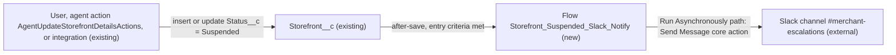

# Implementation spec — Slack notification when a storefront is suspended

> Post a message with the storefront name and account name to the Slack channel `#merchant-escalations` whenever `Storefront__c.Status__c` becomes `Suspended`.

_Based on the requirement, the evidence reported by AskCoworker, and read-only org queries where noted. Assumptions and missing evidence are identified below. Specification only — nothing is implemented or deployed._

---

## 1. The requirement

When a storefront's status becomes `Suspended`, send one Slack message to `#merchant-escalations`; the user clarified that the message contains the storefront name and the account name (*user decision*). The request contained no deploy or data-change instruction.

| # | Responsibility | Trigger | Where it lives |
| --- | --- | --- | --- |
| 1 | Detect that a storefront became suspended | `Storefront__c` created with, or updated to, `Status__c` = `Suspended` | New flow `Storefront_Suspended_Slack_Notify` (entry criteria) |
| 2 | Post the storefront name and account name to `#merchant-escalations` | Same event, after commit | New flow `Storefront_Suspended_Slack_Notify` (Slack "Send Message" core action on the Run Asynchronously path) |

## 2. Grounding — reuse before building

Target org: `TestWriteSpecDE` (Developer Edition, not a sandbox, org ID `00Dak00001COqNeEAL`). API version: `67.0`.

- **`Storefront__c`** (CustomObject) — the storefront record. _verified by org query_
- **`Storefront__c.Status__c`** (Picklist) — values `Active`, `Inactive`, `Pending Activation`, `Suspended`, `Closed`. `Suspended` is the state the requirement names. Current data: 21 records, all `Active`. _verified by org query_
- **`Storefront__c.Account__c`** (Lookup to `Account`) — source of the account name in the message. 0 of 21 records have it blank. _verified by org query_
- **`Storefront__c.Name`** (Text 80) — storefront name in the message. _verified by org query_
- **Automation on `Storefront__c`** — 0 Apex triggers (Tooling `ApexTrigger`) and 0 flows of any trigger type (`FlowDefinitionView WHERE TriggerObjectOrEventId = 'Storefront__c'`). Nothing to extend. _verified by org query_
- **`AgentUpdateStorefrontDetailsActions`** (ApexClass, `with sharing`) — the only Apex class whose body writes `Status__c` (`sf.Status__c = req.status; update sf;`). It sends no notification. The new flow fires on its updates without any change to the class. _verified by org query_ (Apex body search across all 1,496 classes for `slack`, `status__c`, `suspend`).
- **Slack integration evidence** — permission sets `sfdc_slack` ("Slack Integration User", namespace `sfdcInternalInt`, Read on `Storefront__c`), `SlackElevateUser` and `SlackServiceUser` (namespace `force`) exist. _verified by org query_. Whether a Slack workspace is connected to this org cannot be read with the allowed commands. _assumption_
- **No existing Slack sender** — no Apex class body contains `slack`; named credentials are only `Pronto_Orders_API` and `Pronto_Pass_Factory`; external credentials only `Pronto_Orders_API_Key` and `Pronto_Pass_Factory_Key`; no custom field named like `Slack`, `Suspen*`, or `Escalat*` outside Data 360 data model objects. _verified by org query_
- **Record edit access to `Storefront__c`** (who can suspend) — `Agentforce_Reference_App`, `sfdc_accelerate_dms`, and one admin profile have Edit; `Pronto_Deep_Dive_Workshop`, `sfdc_a360_sfcrm_data_extract`, `sfdc_slack`, and one other profile have Read only. _verified by org query_ (`ObjectPermissions WHERE SobjectType = 'Storefront__c'`).

Candidates examined and rejected: `SendCustomNotification` / `ISendCustomNotification` (Apex, body hidden) — reported by AskCoworker as an in-app notification framework, not Slack; `Account.Contract_Status__c` — account contract state, not storefront suspension (reported by AskCoworker); an HTTP callout to a Slack incoming webhook through a new named credential — rejected because the org already carries the Salesforce Slack integration permission sets and the standard Slack flow action needs no credential or code.

Evidence sources: `sf org display`; `sf sobject list --sobject custom`; `sf sobject describe Storefront__c`; Tooling queries on `ApexTrigger`, `ApexClass` (bodies), `NamedCredential`, `ExternalCredential`, `CustomField`, `InstalledSubscriberPackage`, `EntityDefinition`; standard queries on `FlowDefinitionView`, `PermissionSet`, `ObjectPermissions`, `Storefront__c` (aggregates), `Organization`, `DataStream`. AskCoworker returned no citedReferences.

## 3. Architecture

Why the pieces are drawn this way:

1. `Storefront__c` writers: UI users with Edit, `AgentUpdateStorefrontDetailsActions`, and `sfdc_accelerate_dms` API callers (*verified by org query*). A record-triggered flow fires for every DML path, so no writer needs to change (*assumption (documented platform behavior)*).
2. A record-triggered after-save flow is the standard declarative mechanism for "when a record changes, do something"; no trigger or flow exists on the object to extend (*verified by org query*). No Apex is needed.
3. The Slack "Send Message" core action performs a callout. In a record-triggered flow, callouts are allowed only on an asynchronous or scheduled path, so the action sits on the Run Asynchronously path, which runs after the triggering transaction commits (*assumption (documented platform behavior)*). A Slack failure therefore never blocks or rolls back the storefront save, which matches the requirement (Rule 4).
4. The action authenticates through the Slack app connection configured in Setup, not a named credential (*assumption (documented platform behavior)*). That connection cannot be verified with the allowed commands, so the flow row is `Conditional:`.

## 4. Metadata changes

**Notification**

- **Create `Storefront_Suspended_Slack_Notify`** — Type `Flow`. Conditional: a Slack workspace is connected to org `TestWriteSpecDE` through a Salesforce-for-Slack app, and that app is a member of `#merchant-escalations` (Section 8, item 1). Record-triggered flow, after save (Actions and Related Records), object `Storefront__c`, trigger "A record is created or updated". Entry condition: `Status__c` Equals `Suspended`, with "Only when a record is updated to meet the condition requirements" (fires on create when the new record is `Suspended`, and on update only when the record moves from another value into `Suspended`). Synchronous path: no elements. Run Asynchronously path: one Slack "Send Message" core action with inputs Slack app = the connected Salesforce-for-Slack app, Workspace ID = `{SLACK_WORKSPACE_ID}`, Conversation (channel) ID = `{MERCHANT_ESCALATIONS_CHANNEL_ID}`, Message = a text template `Storefront suspended: {!$Record.Name} (Account: {!$Record.Account__r.Name})`. No fault path. Status on deploy: Active only after the placeholders are filled; otherwise deploy as Draft.

## 5. Data 360 (Data Cloud) data involved

Not applicable — this change does not use Data 360. The org has 0 `DataStream` records (*verified by org query*), and the flow reads only `Storefront__c` and its parent `Account` name.

## 6. Security considerations

- **Execution context.** Record-triggered flows run in system context without sharing, so the flow reads `Storefront__c.Name` and `Account.Name` regardless of the saving user's sharing or FLS (*assumption (documented platform behavior)*). `AgentUpdateStorefrontDetailsActions` still enforces the caller's sharing for the update itself (`with sharing`, *verified by org query*).
- **CRUD/FLS and permission sets.** No new object or field access is needed, and no permission set or profile changes. The flow creates no fields and writes no records. The existing `sfdc_slack` permission set already has Read on `Storefront__c` (*verified by org query*); it is not widened.
- **Slack identity.** The message is posted by the connected Slack app, not by the saving user (*assumption (documented platform behavior)*).
- **Data exposure.** Every member of `#merchant-escalations` sees the storefront name and account name of each suspended storefront. No contact, phone, or address data is sent. Channel membership is controlled in Slack, outside Salesforce (*assumption*).

## 7. Testing strategy

No test components are in the inventory. The only action sits on the Run Asynchronously path, which Flow Tests (`FlowTest`) cannot cover, and an Apex DML test cannot assert a Slack post. All cases below are recommended manual verification in a sandbox or this org after the Slack connection is in place. No tests have been run.

| # | Case | Expected result |
| --- | --- | --- |
| MV1 | Update one storefront `Status__c` from `Active` to `Suspended` in the UI | One message in `#merchant-escalations` with the storefront name and account name |
| MV2 | Create a storefront with `Status__c` = `Suspended` | One message posted (verifies the create half of the entry condition, load-bearing) |
| MV3 | Edit `Description__c` on a storefront that is already `Suspended` | No message (no re-fire while it stays matching) |
| MV4 | Change `Status__c` from `Suspended` to `Active`, then back to `Suspended` | No message on the first change; one message on the second |
| MV5 | Set `Status__c` = `Suspended` through the agent action `AgentUpdateStorefrontDetailsActions` | One message posted (non-UI writer path) |
| MV6 | Bulk update 5 storefronts to `Suspended` in one Data Loader or API call | Five messages, one per storefront |
| MV7 | Temporarily remove the Slack app from `#merchant-escalations` and suspend a storefront | The storefront save succeeds; the asynchronous path fails and the flow error appears in the flow error email or Setup, not to the user (verifies the non-blocking assumption, load-bearing) |
| MV8 | Delete and then undelete a `Suspended` storefront | No message (after-save flows do not run on delete or undelete) |

## 8. Open decisions

### Open

1. **Slack connection exists (blocking, load-bearing).** The flow row is `Conditional:` on a Slack workspace being connected to `TestWriteSpecDE` through a Salesforce-for-Slack app, with that app added to `#merchant-escalations`. Only the permission sets `sfdc_slack`, `SlackElevateUser`, and `SlackServiceUser` are evidenced (*verified by org query*); the connection itself cannot be read with the allowed commands. Recommended: confirm in Setup (Slack setup / Slack Apps) before building. If no connection exists, set it up first; the fallback is an HTTP callout to a Slack incoming webhook through a new named credential, which would change the inventory.
2. **Workspace ID and channel ID (blocking for delivery).** The action needs `{SLACK_WORKSPACE_ID}` and the conversation ID for `#merchant-escalations` (`{MERCHANT_ESCALATIONS_CHANNEL_ID}`), not the channel name. Obtain both from the Slack admin. Deployment sequence: connect Slack (item 1), add the app to the channel, fill the IDs, deploy the flow, activate it, run Section 7.
3. **No fault path (non-blocking).** A failed post is not retried and is visible only through flow error notifications. Recommended default: accept; the requirement asks for no failure handling.
4. **Transitions not covered (non-blocking).** No message on leaving `Suspended`, on deletion, on undelete, or when `Account__c` changes while suspended. The requirement names only the suspension event.
5. **Blank account (non-blocking).** If `Account__c` is blank the message reads `(Account: )`. Today 0 of 21 storefronts have a blank account (*verified by org query*). Recommended default: accept.
6. **Unreadable validation rules (non-blocking).** Validation rules on `Storefront__c` were not read. They can only block a save, not the notification of a successful save.

### Resolved

- **Message content and trigger** — storefront name and account name, sent when status becomes `Suspended` (*user decision*).
- **Slack mechanism** — standard Slack "Send Message" core action in a flow, not Apex or a webhook named credential (*assumption*; user had no preference; reason: existing Slack integration permission sets, no code, no stored secret).
- **Fires on create as well as update** — "gets suspended" includes a storefront created as `Suspended` (*assumption*, from the requirement wording).
- **Correction to AskCoworker (runtime).** AskCoworker stated that "Only when a record is updated to meet the condition requirements" never fires on create. For a create-and-update trigger it fires on create when the new record meets the criteria (*assumption (documented platform behavior)*); the design relies on this and MV2 verifies it.
- **Correction to AskCoworker (inventory).** The first inventory proposed a channel name input (`#merchant-escalations`) and the action on the synchronous path; corrected to a channel ID input and the Run Asynchronously path, because the action is a callout (*assumption (documented platform behavior)*).
- **Dropped AskCoworker proposals** — five `FlowTest` components (cannot cover an asynchronous path), `Suspended_Date__c` / `Suspension_Reason__c` fields, a fault-path Task or platform event, a `$Record__Prior` guard (replaced by the entry-condition option), and a record link in the message: none is required by the requirement.
- **Facts labelled "prior session" by AskCoworker** (permission set grants, no scheduled jobs, 0 data streams) — permission set grants and data streams re-checked and confirmed by org query; scheduled jobs are irrelevant to the design.

## 9. Change set

| # | Action | Type | API name | Module | Why |
| --- | --- | --- | --- | --- | --- |
| 1 | Create | Flow | `Storefront_Suspended_Slack_Notify` | force-app/main/default/flows | Conditional on the Slack connection: after-save flow on `Storefront__c` that posts storefront and account name to `#merchant-escalations` asynchronously when `Status__c` becomes `Suspended` |

One new record-triggered flow on `Storefront__c` posts to Slack on its asynchronous path; no existing component changes.

Total: 1 · Create: 1 · Update: 0 · Delete: 0
