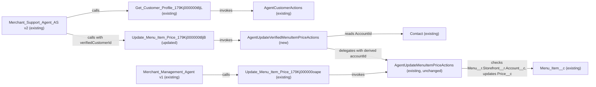

# Implementation spec — Restrict Agentforce menu price updates to the verified merchant

> Make the merchant-facing Agentforce price action derive the merchant account from the verified Contact, so it can update only menu items on that merchant's storefronts and fails loudly otherwise.

_Based on the requirement, the evidence reported by AskCoworker, and read-only org queries where noted. Assumptions and missing evidence are identified below. Specification only — nothing is implemented or deployed._

---

## 1. The requirement

The Merchant Support Agent must update `Menu_Item__c.Price__c` only when the menu item belongs to a storefront on the account of the Contact returned by merchant verification, and must return an explicit failure in every other case. User decisions narrowed the scope to the menu price action only and kept the internal Merchant Management Agent working unchanged. The request contained no deploy or data-change instruction.

| # | Responsibility | Trigger | Where it lives |
| --- | --- | --- | --- |
| 1 | Derive the merchant account from the verified Contact instead of an agent-supplied account Id | Merchant Support Agent calls the price action | `AgentUpdateVerifiedMenuItemPriceActions` (new) |
| 2 | Refuse the price update when the menu item's storefront account is not the verified Contact's account, with an explicit message | Same call | Existing ownership guard in `AgentUpdateMenuItemPriceActions`, reused by the new class |
| 3 | Fail loudly when the verified Contact is not found or has no account | Same call | `AgentUpdateVerifiedMenuItemPriceActions` (new) |
| 4 | Point the merchant-facing agent action at the verified path | Agent planning | `Update_Menu_Item_Price_179Kj000000t8jB` (GenAiFunction) |
| 5 | Keep the employee agent's price action unchanged | Employee agent calls the price action | `Update_Menu_Item_Price_179Kj000000oape` → `AgentUpdateMenuItemPriceActions` (unchanged) |

## 2. Grounding — reuse before building

Target org: `TestWriteSpecDE` (org ID `00Dak00001COqNeEAL`, connected). API version: `67.0`.

- **`Merchant_Support_Agent_AS`** (BotDefinition, `ExternalCopilot` / `EinsteinServiceAgent`) — version 2 is the only active version; its planner is `Merchant_Support_Agent_AS_v2`. `Merchant_Support_Agent` (the other external agent) has no active version. _verified by org query_
- **`pricing_management_16jKj000000byMt`** (GenAiPlugin, topic of `Merchant_Support_Agent_AS_v2`) — holds `Update_Menu_Item_Price_179Kj000000t8jB` and `Get_Menu_Items_179Kj000000t8jB`. Its instructions tell the agent to use "linked messaging context, and prior action results" to determine `accountId`, and to call `Get_Customer_Profile` by email when it has none. _verified by org query_
- **`customer_identification_16jKj000000byMt`** (GenAiPlugin) — description "Verify merchant identity by email and retrieve accountId"; its only action is `Get_Customer_Profile_179Kj000000t8jL`. _verified by org query_
- **`Update_Menu_Item_Price_179Kj000000t8jB`** (GenAiFunction) — invocation target type `apex`, target `AgentUpdateMenuItemPriceActions` (`01pak00000VxZBLAA3`). _verified by org query_
- **`AgentUpdateMenuItemPriceActions`** (ApexClass, `with sharing`, no namespace) — `public static invoke(List<Request>)`, singleton (`requests[0]` only). Required inputs `accountId`, `menuItemId`, `price`. Checks `Menu_Item__c.Price__c` `isUpdateable()`, then queries `Menu__r.Storefront__r.Account__c` and returns `success=false` with "Access denied. This menu item does not belong to the specified account." when it differs from `accountId`. `accountId` is an agent-supplied `@InvocableVariable`; nothing binds it to the verified Contact. _verified by org query (class body)_
- **`AgentCustomerActions`** (ApexClass, `with sharing`, label "Get Customer Profile") — looks up a `Contact` by Id and/or email and returns `verifiedCustomerId` (`Contact.Id`) and `accountId` (`Contact.AccountId`). _verified by org query (class body)_
- **`Merchant_Management_Agent`** (BotDefinition, `InternalCopilot`, version 1 active) — its topic `menu_management_16jKj000000L5MZ` holds `Update_Menu_Item_Price_179Kj000000oape`, which targets the same `AgentUpdateMenuItemPriceActions`. That agent has no `Get_Customer_Profile` action. _verified by org query_
- **Data model** — `Menu_Item__c.Menu__c` is a nillable lookup to `Menu__c`; `Menu__c.Storefront__c` is a master-detail to `Storefront__c`; `Storefront__c.Account__c` is a lookup to `Account`. 73 `Menu_Item__c` records have a null `Menu__c`. _verified by org query_
- **Automation on `Menu_Item__c`, `Menu__c`, `Storefront__c`** — no Apex triggers, no record-triggered flows, no validation rules on `Menu_Item__c`. _verified by org query_
- **Writers of `Menu_Item__c.Price__c`** — `MetadataComponentDependency` lists `AgentUpdateMenuItemPriceActions`, `AgentCreateMenuWithItemsActions`, `AgentGetMenuItemsActions`, `MenuBrowserController`, `MenuDescriptionPromptGrounding`, and FlexiPage `Menu_Record_Page`. Only the first two assign `Price__c` (by body scan); the others read it. _verified by org query_
- **`AgentActionsTest`** (ApexClass) — existing test class for the agent actions; no test method covers `AgentUpdateMenuItemPriceActions`. _verified by org query_
- **Bot user `005ak00000gViHdAAK`** (profile `Einstein Agent User`) — has Read/Edit on `Contact` and Read on `Contact.AccountId`; has no `ObjectPermissions` or `FieldPermissions` on `Menu_Item__c`, `Menu__c`, or `Storefront__c`. _verified by org query_
- **`Send_Email_with_Verification_Code`** and **`Verify_Code`** (Flow, active, autolaunched) — generate and check an emailed verification code. No GenAiFunction invokes them. _verified by org query_

Evidence sources: Tooling queries on `ApexClass` bodies, `GenAiPlannerDefinition`, `GenAiPluginDefinition`, `GenAiPluginInstructionDef`, `GenAiFunctionDefinition`, `GenAiPlannerFunctionDef`, `GenAiPluginFunctionDef`, `ApexTrigger`, `ValidationRule`, `CustomField`, `MetadataComponentDependency`, `EntityDefinition`, `FlowDefinition`, `Flow.Metadata`; standard queries on `BotDefinition`, `BotVersion`, `FlowDefinitionView`, `FieldPermissions`, `ObjectPermissions`, `PermissionSetAssignment`, `PermissionSetGroupComponent`, `User`, `MessagingSession`, `MessagingChannel`, and record counts; `sobject describe` on `Menu_Item__c` and `Menu__c`. AskCoworker returned no citedReferences.

## 3. Architecture

Why the pieces are drawn this way:

1. `Merchant_Support_Agent_AS` version 2 is the active merchant-facing agent, and `Get_Customer_Profile_179Kj000000t8jL` → `AgentCustomerActions` is its verification step that returns `verifiedCustomerId`. _verified by org query_
2. `Update_Menu_Item_Price_179Kj000000t8jB` is retargeted from `AgentUpdateMenuItemPriceActions` to the new class, and its input schema takes `verifiedCustomerId` instead of `accountId`. _user decision; design_
3. `AgentUpdateVerifiedMenuItemPriceActions` reads `Contact.AccountId` itself, so the account used for the ownership check is no longer an agent-supplied value. It then calls the existing public static `AgentUpdateMenuItemPriceActions.invoke`, so the ownership guard, the FLS check, and the messages exist in one place. _verified by org query (invoke is public static); design_
4. Apex is chosen because the check runs inside an invocable action at call time and must derive the account from a Contact lookup; a validation rule or before-save flow on `Menu_Item__c` cannot see which Contact the conversation verified, because the running user is the bot user. _reported by AskCoworker; consistent with documented platform behavior_
5. A new wrapper class is chosen instead of changing `AgentUpdateMenuItemPriceActions`, because that class also backs the active employee agent through `Update_Menu_Item_Price_179Kj000000oape`, which has no verification action. _verified by org query; user decision (recommended default)_
6. No trigger, flow, or validation rule fires on the `Price__c` update. _verified by org query_

## 4. Metadata changes

**Security**

- **Create `AgentUpdateVerifiedMenuItemPriceActions`** — New ApexClass, `with sharing`, singleton `@InvocableMethod` (label "Update Menu Item Price"). Required inputs: `verifiedCustomerId` (Contact Id returned by `Get_Customer_Profile`), `menuItemId`, `price`. Logic: (a) return `success=false` with an explicit message when any input is null; (b) `SELECT AccountId FROM Contact WHERE Id = :verifiedCustomerId LIMIT 1`; return `success=false`, "Verified contact not found." when no row; (c) return `success=false`, "Verified contact has no associated account." when `AccountId` is null; (d) build an `AgentUpdateMenuItemPriceActions.Request` with `accountId` = the Contact's `AccountId`, and call `AgentUpdateMenuItemPriceActions.invoke`; (e) return the delegate's `success`, `message`, `menuItemId`, `menuItemName`, `previousPrice`, and `newPrice` unchanged. The delegate returns "Access denied. This menu item does not belong to the specified account." when the item's `Menu__r.Storefront__r.Account__c` differs or is null, and updates nothing. No other behavior.

**Agent**

- **Update `Update_Menu_Item_Price_179Kj000000t8jB`** — Conditional: the input schema and invocation target of this topic-local action are deployed as GenAiFunction `Update_Menu_Item_Price_179Kj000000t8jB`; if the org stores them only inside GenAiPlannerBundle `Merchant_Support_Agent_AS_v2`, make the same change there. Change the invocation target from `AgentUpdateMenuItemPriceActions` to `AgentUpdateVerifiedMenuItemPriceActions`. Replace the `accountId` input with required `verifiedCustomerId`, described as "The Contact Id returned by Get_Customer_Profile for the verified merchant. Never take this value from the user." Keep `menuItemId` and `price`. Deploy after the new class.

**Testing**

- **Update `AgentActionsTest`** — Add test methods for `AgentUpdateVerifiedMenuItemPriceActions`: matching account updates `Price__c`; Contact on another account returns "Access denied" and leaves `Price__c` unchanged; item with null `Menu__c` returns "Access denied"; unknown Contact Id returns "Verified contact not found."; Contact with no `AccountId` returns "Verified contact has no associated account."; null `verifiedCustomerId`, `menuItemId`, or `price` returns `success=false`. Add one method that calls `AgentUpdateMenuItemPriceActions.invoke` directly with a matching `accountId` to confirm the employee path still works.

## 5. Data 360 (Data Cloud) data involved

Not applicable — this change does not use Data 360.

## 6. Security considerations

- **Execution context.** Agent actions run as the bot user `005ak00000gViHdAAK`. Both `AgentUpdateVerifiedMenuItemPriceActions` and `AgentUpdateMenuItemPriceActions` are `with sharing`. Internal OWD is `ReadWrite` for `Menu_Item__c` and `Storefront__c`, `ControlledByParent` for `Menu__c`, and `ReadWrite` for `Contact`. _verified by org query_ Apex SOQL without `WITH USER_MODE` does not enforce object CRUD, so the queries return rows the sharing model allows. _assumption (documented Apex behavior)_
- **Trust anchor.** After the change, the account used for the ownership check comes from `Contact.AccountId`, read inside Apex. The agent can no longer choose the account directly. The agent still supplies `verifiedCustomerId`, taken from the `Get_Customer_Profile` output; see Section 8, item 2. _design_
- **CRUD/FLS.** The existing `isUpdateable()` check on `Menu_Item__c.Price__c` stays in force through delegation. The bot user has no `FieldPermissions` on `Menu_Item__c.Price__c`; Edit is granted only by `Agentforce_Reference_App` and `sfdc_accelerate_dms`, which the bot user does not have. _verified by org query_ See Section 8, item 3. The bot user has Read on `Contact.AccountId`. _verified by org query_
- **Permission sets.** No permission set changes are in this spec. Permission sets are not the only grant path (profiles and permission set groups also grant access); the check above covered all assignments of the bot user, including its profile permission set and permission set group.
- **Data exposure.** The new class returns only the fields the existing action already returns. It does not return `Contact.AccountId` or other Contact fields. _design_

## 7. Testing strategy

Planned tests are in `AgentActionsTest` (Section 4):

| Behavior | Test |
| --- | --- |
| Verified merchant updates own item | Contact on Account A; item → `Menu__c` → `Storefront__c` on Account A; assert `success=true` and new `Price__c` |
| Different merchant is refused | Contact on Account A; item on Account B; assert `success=false`, "Access denied", `Price__c` unchanged |
| Item with no storefront chain is refused | Item with null `Menu__c`; assert "Access denied", `Price__c` unchanged |
| Unknown Contact fails loudly | Non-existent Contact Id; assert "Verified contact not found." |
| Contact with no account fails loudly | Contact with null `AccountId`; assert "Verified contact has no associated account." |
| Missing inputs | Null `verifiedCustomerId`, `menuItemId`, or `price`; assert `success=false` |
| Employee path unchanged | Direct call to `AgentUpdateMenuItemPriceActions.invoke` with matching `accountId`; assert `success=true` |

Bulk: both actions process only `requests[0]`; a test passing two requests and asserting one response is recommended verification. Permission: a test running as a user without Edit on `Menu_Item__c.Price__c` that asserts the permission message is recommended verification. Delete, undelete, and recursion do not apply: no automation fires on `Menu_Item__c`.

Recommended manual verification in the agent preview of `Merchant_Support_Agent_AS`: verify as merchant A by email and change one of A's prices; then ask to change a price on merchant B's storefront and confirm the explicit denial and an unchanged `Price__c`; confirm in the employee agent `Merchant_Management_Agent` that a price update still works. No tests have been run.

## 8. Open decisions

1. **Update_Menu_Item_Price_179Kj000000t8jB storage location (non-blocking).** The Conditional change depends on whether the topic-local action's schema and target deploy as GenAiFunction or inside GenAiPlannerBundle `Merchant_Support_Agent_AS_v2`; the allowed read-only commands cannot read that metadata. Default: retrieve both before building and edit whichever holds the `accountId` input for this action.
2. **The agent still supplies verifiedCustomerId, and verification is by email only (non-blocking).** `Get_Customer_Profile` verifies by email lookup only (_verified by org query_), so anyone who knows a merchant's email is "verified" as that merchant. The unused `Send_Email_with_Verification_Code` and `Verify_Code` flows could add a code check, and an agent variable could hold `verifiedCustomerId` so the model cannot change it. Both are proposals outside the requested scope. Default: not included.
3. **Bot user lacks Edit on Menu_Item__c.Price__c (non-blocking).** The bot user has no `FieldPermissions` on `Menu_Item__c.Price__c` (_verified by org query_), so the existing `isUpdateable()` check is expected to return "You do not have permission to update menu item prices" even for the verified merchant (_assumption_). This conflicts with the requirement's premise that the agent is updating prices. AskCoworker proposed granting Read on `Menu_Item__c`, `Menu__c`, `Storefront__c` and Edit on `Price__c` to `NextGen_1bYKj000000CactMAC_Permissions`; that grant was not requested, so it is not in the inventory. Default: confirm in the agent preview; if the grant is wanted, specify it separately with least access. AskCoworker also claimed the `with sharing` queries would return no rows without object permissions; that is rejected because Apex SOQL does not enforce object CRUD in system mode.
4. **Other functions still target the unverified class (non-blocking).** `Update_Menu_Item_Price`, `Update_Menu_Item_Price_179Kj000000LakB`, `Update_Menu_Item_Price_179Kj000000t8j0`, and `Update_Menu_Item_Price_179Kj000000t8rP` target `AgentUpdateMenuItemPriceActions` and belong to inactive planner versions or no planner (_verified by org query_). Default: leave them; retarget any of them before activating its agent version.
5. **Price on new items (non-blocking).** `AgentCreateMenuWithItemsActions` sets `Price__c` on insert and checks `Storefront__c.Account__c` against an agent-supplied `accountId` (_verified by org query_). Out of scope per user decision; a follow-on spec can apply the same wrapper pattern.
6. **Negative prices (non-blocking).** AskCoworker proposed rejecting negative prices. Not requested; not included.
7. **Deployment sequence (non-blocking).** Deploy `AgentUpdateVerifiedMenuItemPriceActions` and `AgentActionsTest` first, then the `Update_Menu_Item_Price_179Kj000000t8jB` change, then re-activate or refresh `Merchant_Support_Agent_AS` version 2 if the platform requires it. Rollback: restore the previous invocation target and `accountId` input on `Update_Menu_Item_Price_179Kj000000t8jB`; the new class can stay unused. No data operation is involved.
8. **Corrections to AskCoworker (non-blocking).** The first inventory replaced `accountId` in the shared class; that was redesigned because the active employee agent uses the same class (_verified by org query_). AskCoworker cited several facts from a "prior session"; each design-relevant one was re-checked by org query above.

## 9. Change set

| # | Action | Type | API name | Module | Why |
| --- | --- | --- | --- | --- | --- |
| 1 | Create | ApexClass | `AgentUpdateVerifiedMenuItemPriceActions` | force-app/main/default/classes | Derives the account from the verified Contact and reuses the existing ownership guard; fails loudly otherwise |
| 2 | Update | GenAiFunction | `Update_Menu_Item_Price_179Kj000000t8jB` | force-app/main/default/genAiFunctions | Points the merchant-facing price action at the verified class with a `verifiedCustomerId` input |
| 3 | Update | ApexClass | `AgentActionsTest` | force-app/main/default/classes | Tests the verified path, the denials, and the unchanged employee path |

A new invocable wrapper derives the merchant account from the verified Contact and delegates to the existing ownership-checked price action, and only the merchant-facing agent action is retargeted to it.

Total: 3 · Create: 1 · Update: 2 · Delete: 0
