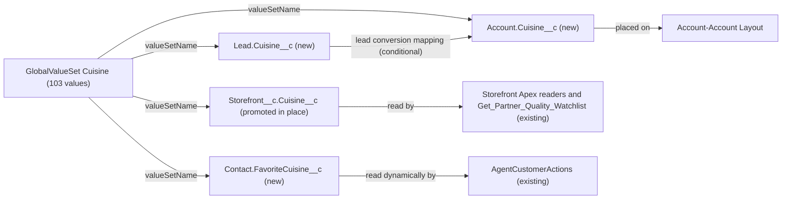

# Implementation spec — Consolidate the cuisine picklists into one global value set

> Put `Storefront__c.Cuisine__c`, the Account and Lead "Cuisine Type" fields, and the Contact "Favorite Cuisine" field on one global value set named `Cuisine` that holds the union of today's values.

_Based on the requirement, the evidence reported by AskCoworker, and read-only org queries where noted. Assumptions and missing evidence are identified below. Specification only — nothing is implemented or deployed._

---

## 1. The requirement

Replace the four separate local cuisine picklists on `Storefront__c`, `Account`, `Lead`, and `Contact` with fields that all use one global value set, `Cuisine`, whose values are the union of the current definitions (103 values). The user chose the name `Cuisine`, the union of values, and the four fields that must use the set (*user decision*). The request contained no deploy or data-change instruction.

| # | Responsibility | Trigger | Where it lives |
| --- | --- | --- | --- |
| 1 | One global value set holds the union of all current cuisine values (103 values) | Not applicable (metadata) | `Cuisine` (GlobalValueSet) |
| 2 | Storefront Cuisine uses the global value set, with its API name and readers unchanged | Not applicable (metadata) | `Storefront__c.Cuisine__c` |
| 3 | Account Cuisine Type, Lead Cuisine Type, and Contact Favorite Cuisine use the global value set | Not applicable (metadata) | `Account.Cuisine__c`, `Lead.Cuisine__c`, `Contact.FavoriteCuisine__c` |
| 4 | Existing values and access carry over to the replacement fields, and the old local fields are removed | Data copy, then destructive deployment | Data step; `Account-Account Layout`, `Agentforce_Reference_App`, `Pronto_Deep_Dive_Workshop`, `LeadConvertSettings` |

## 2. Grounding — reuse before building

Target org: `TestWriteSpecDE` (Developer Edition, not a sandbox; `00Dak00001COqNeEAL`). API version: `67.0`. _verified by org query; API version verified by project file_

- **`Storefront__c.Cuisine__c`** (CustomField, picklist) — local value set, unrestricted, 102 active values, no default, description "If the location is a restaurant, they can categorize themselves by the type of cuisine." _verified by org query_
- **`Account.Cuisine_Type__c`** (CustomField, picklist, label "Cuisine Type") — local value set, restricted, 38 active values: 37 that also appear on `Storefront__c.Cuisine__c`, plus `Other`. _verified by org query_
- **`Lead.Cuisine_Type__c`** (CustomField, picklist, label "Cuisine Type") — local value set, unrestricted, the same 38 values as `Account.Cuisine_Type__c`. _verified by org query_
- **`Contact.Favorite_Cuisine__c`** (CustomField, picklist, label "Favorite Cuisine") — local value set, restricted, the same 102 values, in the same order, as `Storefront__c.Cuisine__c`. _verified by org query_
- **Union of the four definitions** — 103 distinct values (the 102 Storefront values plus `Other`). The 102-value list already contains near-duplicates such as `BBQ` and `Barbecue`, and `Boba Tea` and `Bubble Tea`; they are kept as they are. No field is required, dependent, or history-tracked, and no value has a label different from its API value. _verified by org query_
- **No global value set exists** in the org (Tooling `GlobalValueSet` returned 0 rows), and no other custom field has "Cuisine" in its name. _verified by org query_
- **Data shape.** `Storefront__c`: 21 records, all with a value; 15 of them hold values that are in no definition (`Various` 11, `Fine Dining`, `Farm-to-Table`, `Marketplace`, `Fusion` 1 each). `Account`: 200 records, 10 with a value, all in the definition. `Lead`: 5 records, none with a value. `Contact`: 198 records, 187 with a value, all 18 distinct values in the definition. _verified by org query_
- **Readers of `Storefront__c.Cuisine__c`** — Apex classes `AgentStorefrontActions`, `AgentGetStorefrontsByAccountActions`, `StorefrontPickerController`, `MenuDescriptionPromptGrounding`, `AgentActionsTest`, and flow `Get_Partner_Quality_Watchlist` (Get Records on `Storefront__c` with a filter on `Cuisine__c`). `StorefrontPickerAction` carries the value in its `cuisine` variable. _verified by org query (MetadataComponentDependency and Apex bodies)_
- **Readers of the other three fields** — `Account.Cuisine_Type__c` is referenced only by layout `Account-Account Layout`; `Lead.Cuisine_Type__c` and `Contact.Favorite_Cuisine__c` have no dependency rows. `AgentCustomerActions` reads the Contact field dynamically: it takes the first existing field from `Favourite_Cuisine__c`, `Favorite_Cuisine__c`, `FavouriteCuisine__c`, `FavoriteCuisine__c`, and queries in system mode (`Database.query`). This list is complete for dependencies, Apex classes, and triggers (none reference the fields); reports, list views, lead field mapping, and external systems could not be checked. _verified by org query_
- **No automation on the four objects** that could interfere: no Apex triggers reference cuisine, and no validation rules exist on `Account`, `Lead`, `Contact`, or `Storefront__c`. _verified by org query_
- **Field access (complete list of FieldPermissions rows for the four fields).** `Agentforce_Reference_App`: Storefront Read/Edit, Account Read, Lead Read/Edit, Contact Read. `Pronto_Deep_Dive_Workshop`: Storefront Read, Account Read, Contact Read. `sfdc_accelerate_dms`: Read/Edit on all four. `sfdc_a360_sfcrm_data_extract` and `sfdc_slack`: Read on all four. No profile rows. The three `sfdc_*` permission sets have namespace `sfdcInternalInt` and cannot be edited. _verified by org query_
- **Record types.** `Account` has `Customer Account` and `Partner Account`; `Contact` has `Business Contact` and `Customer Contact`; `Lead` and `Storefront__c` have only Master. All current values are available on every record type. _verified by org query_
- **Data 360.** `SELECT COUNT() FROM DataStream` returned 0. _verified by org query_

Candidates examined and rejected: `Storefront_Tag__c.Tag__c` — reported by AskCoworker as a restricted picklist of tags (Vegan, Late Night, Halal, …); it describes attributes, not cuisine, and the requirement does not name it. Keeping the three local fields and copying the values into them — rejected because it does not create one value set.

Evidence sources: `sf sobject describe` of the four objects; Tooling `CustomField` (with `Metadata` per field), `GlobalValueSet`, `EntityDefinition`, `MetadataComponentDependency`, `ValidationRule`, `ApexClass` and `ApexTrigger` bodies, `Flow.Metadata`; standard `FieldPermissions`, `PermissionSet`, `FlowDefinitionView`, `DataStream`, `Organization`, and GROUP BY counts on the four fields. AskCoworker returned no citedReferences.

## 3. Architecture

Why the pieces are drawn this way:

1. **Promote `Storefront__c.Cuisine__c`, do not replace it.** The platform converts an existing local picklist to a global value set only through "Promote to Global Value Set" in Setup, and each promotion creates a new global value set from one field. An existing local picklist cannot be switched to an existing global value set, in Setup or by changing `valueSetName` in a deployment. _assumption (documented platform behavior), load-bearing_. Promoting the Storefront field keeps its API name and field ID, so its six readers (five Apex classes and one flow) need no change. It also already holds 102 of the 103 values. _verified by org query_
2. **Replace the other three fields.** Because of item 1, `Account.Cuisine_Type__c`, `Lead.Cuisine_Type__c`, and `Contact.Favorite_Cuisine__c` cannot join the set in place. Each gets a new picklist field bound to `Cuisine`, with the old label. The old API names cannot be reused: a deleted custom field keeps its name until it is erased, and a field cannot be renamed by deployment. _assumption (documented platform behavior)_
3. **`Contact.FavoriteCuisine__c` is named to fit `AgentCustomerActions`.** That name is already in the class's candidate list, so the class picks it up with no code change once `Contact.Favorite_Cuisine__c` is deleted. Before the delete, it reads the old field, which holds the same copied data. _verified by org query_ (candidate list and order).
4. **`Account.Cuisine__c` goes on `Account-Account Layout`** in place of `Account.Cuisine_Type__c`, because the old field is on that layout. The Lead and Contact fields go on no layout because the fields they replace are on none. _verified by org query_
5. **Lead conversion mapping is conditional.** The current mapping of `Lead.Cuisine_Type__c` cannot be read. If it exists, it is recreated for `Lead.Cuisine__c` to `Account.Cuisine__c`. _assumption_
6. No Apex, flow, or trigger is added. The design uses only declarative metadata and a data step.

## 4. Metadata changes

**Data model**

- **Create `Cuisine`** — GlobalValueSet, label "Cuisine", 103 values, not sorted. It is created by running "Promote to Global Value Set" on `Storefront__c.Cuisine__c` in Setup (this copies the 102 values in their current order). Then add `Other` as the last value. Retrieve the set into source control. The list keeps the current near-duplicates (`BBQ`/`Barbecue`, `Boba Tea`/`Bubble Tea`) because the user asked for the union.
- **Update `Storefront__c.Cuisine__c`** — the promotion changes the field's value set to `<valueSetName>Cuisine</valueSetName>`. The field keeps its API name, ID, label, description, and permission grants. It becomes restricted, because fields that use a global value set are always restricted (see Section 8 on the 15 records with off-list values).
- **Create `Account.Cuisine__c`** — Picklist, label "Cuisine Type", `valueSet.valueSetName` = `Cuisine`, not required, no default, all values available on the `Customer Account`, `Partner Account`, and Master record types.
- **Create `Lead.Cuisine__c`** — Picklist, label "Cuisine Type", `valueSet.valueSetName` = `Cuisine`, not required, no default.
- **Create `Contact.FavoriteCuisine__c`** — Picklist, label "Favorite Cuisine", `valueSet.valueSetName` = `Cuisine`, not required, no default, all values available on the `Business Contact`, `Customer Contact`, and Master record types.
- **Delete `Account.Cuisine_Type__c`** — Impact: removes the old local field and its grants. Prerequisites: `Account.Cuisine__c` deployed, the 10 values copied, the field removed from `Account-Account Layout`, and the integration check in Section 8 passed. Backup: retrieve the field into source control and export `Id, Cuisine_Type__c` for the 10 records. Rollback: undelete the field from Deleted Fields within 15 days, or redeploy it and reload the export.
- **Delete `Lead.Cuisine_Type__c`** — Impact: removes the old local field (no records hold a value) and any lead conversion mapping from it. Prerequisites: `Lead.Cuisine__c` deployed and the mapping check in Section 8 done. Backup: retrieve the field and the `LeadConvertSettings` into source control. Rollback: undelete within 15 days, or redeploy.
- **Delete `Contact.Favorite_Cuisine__c`** — Impact: removes the old local field; `AgentCustomerActions` then reads `Contact.FavoriteCuisine__c`. Prerequisites: `Contact.FavoriteCuisine__c` deployed, the 187 values copied, and the integration check in Section 8 passed. Backup: retrieve the field and export `Id, Favorite_Cuisine__c` for the 187 records. Rollback: undelete within 15 days, or redeploy it and reload the export.

**UX**

- **Update `Account-Account Layout`** — replace `Account.Cuisine_Type__c` with `Account.Cuisine__c` in the same position. Retrieve the layout before editing. This layout is shared, so all users assigned to it see the change; the label stays "Cuisine Type".

**Security**

- **Update `Agentforce_Reference_App`** — add field permissions that mirror the old fields: `Account.Cuisine__c` Read, `Lead.Cuisine__c` Read and Edit, `Contact.FavoriteCuisine__c` Read. Remove the grants on the three deleted fields in the same release as the deletes.
- **Update `Pronto_Deep_Dive_Workshop`** — add `Account.Cuisine__c` Read and `Contact.FavoriteCuisine__c` Read, mirroring the old fields. No Lead grant, because the old Lead field has none. Remove the grants on the deleted fields in the same release as the deletes.

**Other**

- **Update `LeadConvertSettings`** — Conditional: only if `Lead.Cuisine_Type__c` is mapped today (the mapping cannot be read with the allowed queries). Replace that mapping with `Lead.Cuisine__c` to `Account.Cuisine__c` (or to `Contact.FavoriteCuisine__c` if the current target is the Contact field). Retrieve the settings before editing, because a deploy replaces the whole mapping list.

## 5. Data 360 (Data Cloud) data involved

Not applicable — this change does not use Data 360. No data streams exist (`DataStream` count 0, _verified by org query_). `sfdc_a360_sfcrm_data_extract` has Read on the old fields but cannot be edited; see Section 8, item 2.

## 6. Security considerations

- **Execution context.** The Storefront readers are unchanged. `AgentCustomerActions` queries with `Database.query` in system mode, so field-level security does not filter the new Contact field for it. AskCoworker reported that `with sharing` enforces FLS on dynamic SOQL; that is wrong (`with sharing` controls record sharing only). _verified by org query (class body); assumption (documented platform behavior)_
- **CRUD/FLS for the new fields.** New custom fields have no field permissions until granted. The design grants exactly the access the old fields have in the two editable permission sets: `Agentforce_Reference_App` (Account Read, Lead Read/Edit, Contact Read) and `Pronto_Deep_Dive_Workshop` (Account Read, Contact Read). No profile gets access, because no profile has a field permission row on the old fields. `Storefront__c.Cuisine__c` keeps its existing grants because the promotion keeps the field. _verified by org query; assumption (documented platform behavior) for the promotion_
- **Permission sets that cannot be changed.** `sfdc_accelerate_dms` (Read/Edit), `sfdc_a360_sfcrm_data_extract` (Read), and `sfdc_slack` (Read) have namespace `sfdcInternalInt`. The design cannot grant them access to the three new fields. Whether the platform grants these sets access to new fields on its own is Not specified. Permission sets are not the only grant path; profiles and permission set groups can also grant access. _verified by org query_
- **Data exposure.** No new data and no new audience: the same values on the same objects for the same editable permission sets. The global value set adds values to Account and Lead (from 38 to 103), which changes the choices users see, not who sees data.

## 7. Testing strategy

The inventory has no Apex, flow, or trigger, so it contains no test components. Existing Apex tests are rerun; all other checks are recommended verification after deployment in a sandbox. No tests have run.

- **Existing Apex tests.** Run `AgentActionsTest` and the full local test suite. It covers the Storefront readers, which must pass unchanged because `Storefront__c.Cuisine__c` keeps its API name.
- **Recommended verification — promotion (load-bearing assumption 1).** In a sandbox, confirm that "Promote to Global Value Set" is offered on `Storefront__c.Cuisine__c`, that the field keeps its ID and API name, and that a validate-only deploy that sets `valueSetName` on `Account.Cuisine_Type__c` is rejected. If the deploy is accepted, the replacement fields are not needed (see Section 8, item 1).
- **Recommended verification — values.** After adding `Other`, confirm that `Cuisine` has 103 values and that `Storefront__c.Cuisine__c`, `Account.Cuisine__c`, `Lead.Cuisine__c`, and `Contact.FavoriteCuisine__c` all show them, on every Account and Contact record type.
- **Recommended verification — negative.** An API update that sets any of the four fields to a value outside `Cuisine` fails with a restricted-picklist error. Editing one of the 15 Storefront records with an off-list value, without changing the cuisine, shows whether the save is blocked (Section 8, item 3).
- **Recommended verification — data copy (bulk).** After the copy, GROUP BY counts on `Account.Cuisine__c` (10 non-null) and `Contact.FavoriteCuisine__c` (187 non-null, 18 values) match the old fields value for value, with no failed rows.
- **Recommended verification — readers.** Run `Get_Partner_Quality_Watchlist` with and without a cuisine scope. Call `AgentCustomerActions` for a Contact with a cuisine value, before and after the delete of `Contact.Favorite_Cuisine__c`; both calls return the same value.
- **Recommended verification — permissions.** A user with only `Pronto_Deep_Dive_Workshop` can read `Account.Cuisine__c` and `Contact.FavoriteCuisine__c` and cannot edit them. A user with `Agentforce_Reference_App` can edit `Lead.Cuisine__c`. Check what the `sfdc_accelerate_dms` integration user can see and edit on the new fields.
- **Recommended verification — lead conversion.** If a mapping was added, convert a Lead with `Lead.Cuisine__c` set and confirm the value on the new Account.

## 8. Open decisions

### Open

1. **Promotion and replacement rest on platform behavior (non-blocking, load-bearing).** The design assumes only one existing field can be promoted, and that no existing local picklist can be switched to an existing global value set. If a sandbox test (Section 7) shows otherwise, drop the three Creates, the three Deletes, the layout, permission set, and settings rows, and update the three fields in place instead.
2. **Access for the namespaced integration permission sets (blocking for delivery).** `sfdc_accelerate_dms` (Read/Edit), `sfdc_a360_sfcrm_data_extract`, and `sfdc_slack` (Read) have access to the old fields and cannot be edited. Before the Deletes, confirm with the owners of the DMS, Data 360 connector, and Slack integrations whether they use these fields, whether they get access to the new fields, and that they move to the new API names. Recommended default: do not run the Deletes until each owner confirms.
3. **15 Storefront records hold values outside every definition (non-blocking).** `Various` (11), `Fine Dining`, `Farm-to-Table`, `Marketplace`, and `Fusion` are not in the union. After promotion the field is restricted, so these values cannot be set again, and edits to these records may be rejected. Data step: the Storefront owner maps each record to a `Cuisine` value or clears it, before the promotion. Recommended default: leave the records unchanged until the owner decides; the values are not added to the set because the user asked for the union of the definitions.
4. **Lead conversion mapping (non-blocking).** `LeadConvertSettings` cannot be read. The `LeadConvertSettings` row is `Conditional:` on a current mapping of `Lead.Cuisine_Type__c`. Check Setup > Lead > Map Lead Fields before the Deletes.
5. **Record type picklist values (non-blocking).** Record type value assignments cannot be read. After deploying `Account.Cuisine__c` and `Contact.FavoriteCuisine__c`, confirm that all 103 values are available on each record type; if not, add them to the record types.
6. **Reports, list views, and external references (non-blocking).** Reports and list views cannot be read. Check them for `Account.Cuisine_Type__c`, `Lead.Cuisine_Type__c`, and `Contact.Favorite_Cuisine__c` and repoint them to the new fields before the Deletes.
7. **Deployment sequence (blocking for delivery).** (a) Data step for item 3 if the owner decides to remap. (b) In Setup, promote `Storefront__c.Cuisine__c` to the global value set `Cuisine`, add `Other`, and retrieve both. (c) Deploy `Account.Cuisine__c`, `Lead.Cuisine__c`, `Contact.FavoriteCuisine__c`, `Account-Account Layout`, `Agentforce_Reference_App`, `Pronto_Deep_Dive_Workshop`, and, if item 4 applies, `LeadConvertSettings`. (d) Data step: back up, then copy `Account.Cuisine_Type__c` to `Account.Cuisine__c` (10 records) and `Contact.Favorite_Cuisine__c` to `Contact.FavoriteCuisine__c` (187 records); Lead has no values. Without this copy, responsibility 4 fails. Rollback: clear the new fields. (e) After items 2, 4, and 6 are done, retrieve and delete the three old fields and remove their permission set grants. The promotion cannot be undone.

### Resolved

- **Global value set name and values (user decision).** Name `Cuisine`; values are the union of the four definitions (103 values), with near-duplicates kept.
- **Fields that use the set (user decision, mapped).** The user said the set is "used by Storefront Cuisine, Account Cuisine Type, Lead Cuisine Type, Contact Favorite Cuisine". This was mapped to the recommended option: promote the Storefront field and replace the other three with fields of the same labels (*assumption*: mapping of the answer to an option).
- **Contact is in scope (assumption).** AskCoworker suggested that `Contact.Favorite_Cuisine__c` has a different meaning (customer preference); the requirement names Contact and its values are identical to Storefront's, so it is included.
- **Which field to promote (assumption).** `Storefront__c.Cuisine__c`, because it has all readers (six) and 102 of 103 values. Promoting another field would force changes to five Apex classes and a flow.
- **New API names (assumption).** `Account.Cuisine__c` and `Lead.Cuisine__c` match the Storefront field name; `Contact.FavoriteCuisine__c` is in the `AgentCustomerActions` candidate list, so no Apex change is needed. AskCoworker said that name is not in the list and that the class must be updated; the class body contradicts it.
- **Restriction (correction).** AskCoworker proposed setting the global value set or some fields to unrestricted. Fields that use a global value set are always restricted, so `Storefront__c.Cuisine__c` and `Lead.Cuisine__c` become restricted. _assumption (documented platform behavior)_
- **Same API names through rename (correction).** AskCoworker proposed recreating the fields with their old API names or renaming them later. A deleted field keeps its name until erased, and a rename is not a deployable change, so new names are used.
- **AskCoworker data claims corrected by org queries.** Account and Lead have 38 values including `Other` (not 37); Storefront has both `BBQ` and `Barbecue`; Contact's values are identical to Storefront's; 15 Storefront records hold off-list values (AskCoworker said all values exist in the set). Other AskCoworker proposals (a new Apex update, a validation rule on Lead, a test class) were dropped as not needed.

## 9. Change set

| # | Action | Type | API name | Module | Why |
| --- | --- | --- | --- | --- | --- |
| 1 | Create | GlobalValueSet | `Cuisine` | force-app/main/default/globalValueSets | One value set with the union of all cuisine values (via promotion of the Storefront field) |
| 2 | Update | CustomField | `Storefront__c.Cuisine__c` | force-app/main/default/objects/Storefront__c/fields | Storefront Cuisine uses the global value set; API name and readers unchanged |
| 3 | Create | CustomField | `Account.Cuisine__c` | force-app/main/default/objects/Account/fields | Account Cuisine Type bound to the global value set |
| 4 | Create | CustomField | `Lead.Cuisine__c` | force-app/main/default/objects/Lead/fields | Lead Cuisine Type bound to the global value set |
| 5 | Create | CustomField | `Contact.FavoriteCuisine__c` | force-app/main/default/objects/Contact/fields | Contact Favorite Cuisine bound to the global value set; name read by `AgentCustomerActions` |
| 6 | Update | Layout | `Account-Account Layout` | force-app/main/default/layouts | Show the new Account field where the old one was |
| 7 | Update | PermissionSet | `Agentforce_Reference_App` | force-app/main/default/permissionsets | Mirror the old field access on the new fields |
| 8 | Update | PermissionSet | `Pronto_Deep_Dive_Workshop` | force-app/main/default/permissionsets | Mirror the old field access on the new fields |
| 9 | Update | LeadConvertSettings | `LeadConvertSettings` | force-app/main/default/settings | Conditional: keep lead conversion mapping of cuisine, if one exists today |
| 10 | Delete | CustomField | `Account.Cuisine_Type__c` | force-app/main/default/objects/Account/fields | Remove the old local picklist after the data copy |
| 11 | Delete | CustomField | `Lead.Cuisine_Type__c` | force-app/main/default/objects/Lead/fields | Remove the old local picklist |
| 12 | Delete | CustomField | `Contact.Favorite_Cuisine__c` | force-app/main/default/objects/Contact/fields | Remove the old local picklist after the data copy |

The Storefront field is promoted into the global value set `Cuisine`, and the Account, Lead, and Contact fields are replaced by new fields bound to it, with data copied and access mirrored before the old fields are deleted.

Total: 12 · Create: 4 · Update: 5 · Delete: 3
